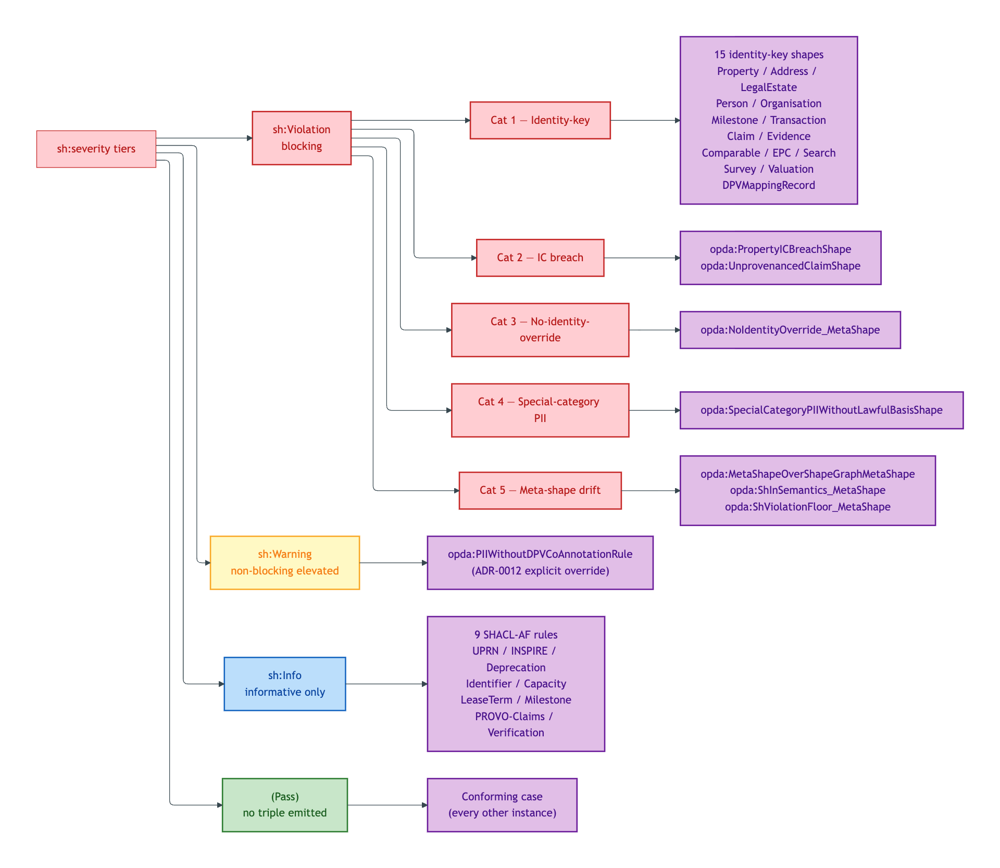
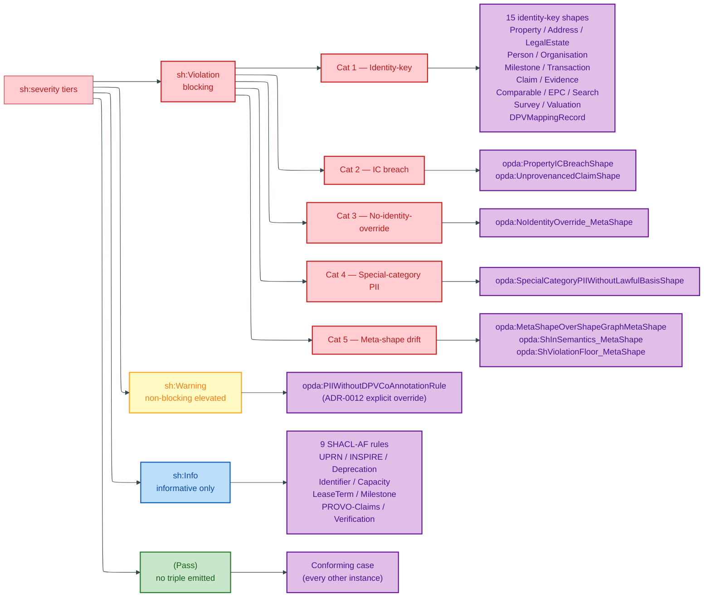

# Severity tiers

Per [ODR-0013 §Q1](../../ontology/odr/ODR-0013-shacl-validation-and-severity.md), every emitted SHACL shape carries an explicit `sh:severity`. The framework has four tiers; `sh:Violation` is further partitioned into 5 named subcategories.

## Severity-tier landscape

Mermaid Source

## 4-tier framework

| Tier | `sh:severity` IRI | Semantics | Typical use |
|---|---|---|---|
| Violation | `sh:Violation` | Blocking; instance is non-conformant | Identity-key violations, IC breaches, anti-pattern detection, special-category PII without lawful basis |
| Warning | `sh:Warning` | Non-blocking but elevated | PII-without-DPV-co-annotation, deprecation-without-successor |
| Info | `sh:Info` | Informative materialisation only | SHACL-AF succession rules (UPRN / INSPIRE / lease-term / verification chains) |
| (Pass) | — | Shape did not fire | The conforming case; no triple emitted in the report |

## 5 `sh:Violation` subcategories

Per ODR-0013 §Q1, every `sh:Violation` shape sits in exactly one of five named categories:

| Category | Pattern | Examples |
|---|---|---|
| **Cat 1 — Identity-key missing / wrong-type** | `sh:datatype` + `sh:maxCount 1` on the identity-key path | `PropertyIdentityKeyShape`, `AddressIdentityKeyShape`, `PersonIdentityKeyShape` |
| **Cat 2 — IC breach (anti-pattern detection)** | `sh:nodeKind` on co-reference predicates; `sh:minCount` on `prov:wasDerivedFrom` | `PropertyICBreachShape` (no `owl:sameAs`), `UnprovenancedClaimShape` |
| **Cat 3 — No-identity-override meta-shape** | SPARQL select detecting overlay-shape attempts to suppress identity property | `NoIdentityOverride_MetaShape` |
| **Cat 4 — Special-category PII without lawful basis** | SPARQL select for `hasSpecialCategoryData true` lacking `dpv:hasLegalBasis` | `SpecialCategoryPIIWithoutLawfulBasisShape` |
| **Cat 5 — Meta-shape-over-shape-graph drift** | SPARQL select for meta-shape on `sh:NodeShape` lacking `opda:metaShapeJustification` | `MetaShapeOverShapeGraphMetaShape`, `ShInSemantics_MetaShape`, `ShViolationFloor_MetaShape` |

## Shapes grouped by severity

### Cat 1 — Identity-key shapes (Violation)

| Shape | Module | Target |
|---|---|---|
| `opda:AddressIdentityKeyShape` | property | `opda:Address` |
| `opda:LegalEstateIdentityKeyShape` | property | `opda:LegalEstate` |
| `opda:PropertyIdentityKeyShape` | property | `opda:Property` |
| `opda:PersonIdentityKeyShape` | agent | `opda:Person` |
| `opda:OrganisationIdentityKeyShape` | agent | `opda:Organisation` |
| `opda:MilestoneIdentityKeyShape` | transaction | `opda:Milestone` |
| `opda:TransactionIdentityKeyShape` | transaction | `opda:Transaction` |
| `opda:ClaimIdentityKeyShape` | claim | `opda:Claim` |
| `opda:EvidenceIdentityKeyShape` | claim | `opda:Evidence` |
| `opda:ComparableIdentityKeyShape` | descriptive | `opda:Comparable` |
| `opda:EPCCertificateIdentityKeyShape` | descriptive | `opda:EPCCertificate` |
| `opda:SearchIdentityKeyShape` | descriptive | `opda:Search` |
| `opda:SurveyIdentityKeyShape` | descriptive | `opda:Survey` |
| `opda:ValuationIdentityKeyShape` | descriptive | `opda:Valuation` |
| `opda:DPVMappingRecordIdentityKeyShape` | governance | `opda:DPVMappingRecord` |

### Cat 2 — IC-breach shapes (Violation)

| Shape | Module | Target |
|---|---|---|
| `opda:PropertyICBreachShape` | property | `opda:Property` |
| `opda:UnprovenancedClaimShape` | claim | `opda:Claim` |

### Cat 3 — No-identity-override meta-shape (Violation)

| Shape | Target |
|---|---|
| `opda:NoIdentityOverride_MetaShape` | `sh:NodeShape` (SPARQL constraint) |

### Cat 4 — Special-category PII shape (Violation)

| Shape | Module | Target |
|---|---|---|
| `opda:SpecialCategoryPIIWithoutLawfulBasisShape` | agent | `opda:Person` (SPARQL constraint on `opda:hasSpecialCategoryData true`) |

### Cat 5 — Meta-shape-over-shape-graph (Violation)

| Shape | Justification |
|---|---|
| `opda:MetaShapeOverShapeGraphMetaShape` | "ODR-0013 §Q1 Category 5 + ODR-0017 §2a: meta-shapes targeting sh:NodeShape using sh:Violation severity must justify their elevation above the ODR-0017 sh:Info default." |
| `opda:ShInSemantics_MetaShape` | "ODR-0010 three-rule interface contract Rule 1: overlay sh:in MUST be a subset of base sh:in (which itself unions into the SKOS scheme members per ODR-0011)." |
| `opda:ShViolationFloor_MetaShape` | "ODR-0010 three-rule interface contract Rule 2: no overlay shape may set sh:severity to sh:Warning or sh:Info on a property where the base shape declared sh:Violation." |

### Warning-tier shapes

| Shape | Module | Why Warning vs Violation |
|---|---|---|
| `opda:PIIWithoutDPVCoAnnotationRule` | foundation (cross-cutting) | Silent PII leakage is high-impact even though the rule is SHACL-AF-pattern-shaped (ADR-0012 explicit override) |

### Info-tier shapes (all SHACL-AF rules)

| Shape | Module | Materialises |
|---|---|---|
| `opda:DeprecationChainRule` | foundation | `opda:hasDeprecationStatus`, `opda:hasSuccessor` |
| `opda:UPRNSuccessionRule` | property | `opda:hasUPRNSuccessionStatus` |
| `opda:INSPIRESuccessionRule` | property | `opda:hasINSPIRESuccessionStatus` |
| `opda:IdentifierSuccessionRule` | agent | `opda:hasIdentifierSuccessionEvent` |
| `opda:CapacityAuthorityMatchRule` | agent | `opda:hasCapacityAuthorityMatchStatus` |
| `opda:LeaseTermSuccessionRule` | transaction | `opda:hasLeaseTermSuccessionStatus` |
| `opda:MilestoneVarianceRule` | transaction | `opda:hasVarianceStatus`, `opda:hasVarianceDays` |
| `opda:PROVOClaimsRule` | claim | `opda:hasProvenanceChainStatus` |
| `opda:VerificationActivitySuccessionRule` | claim | `opda:hasVerificationSuccessionStatus` |

## BASPI5 overlay shapes (Violation)

The BASPI5 profile shapes inherit the Violation floor per the three-rule interface contract (overlay cannot weaken base severity). Every `Baspi5_*Shape` carries `sh:severity sh:Violation`. See [`profiles/baspi5.md`](./profiles/baspi5.md).

## Source ADR + ODR

- [ODR-0013 §Q1 — SHACL validation and severity (4-tier framework + 5 Violation categories)](../../ontology/odr/ODR-0013-shacl-validation-and-severity.md)
- [ODR-0017 — SHACL-AF quality rules pattern (`sh:Info` default)](../../ontology/odr/ODR-0017-shacl-af-quality-rules-pattern.md)
- [ADR-0012 — SHACL + DPV annotation emission](../../adr/ADR-0012-shacl-and-dpv-annotation-emission.md)
