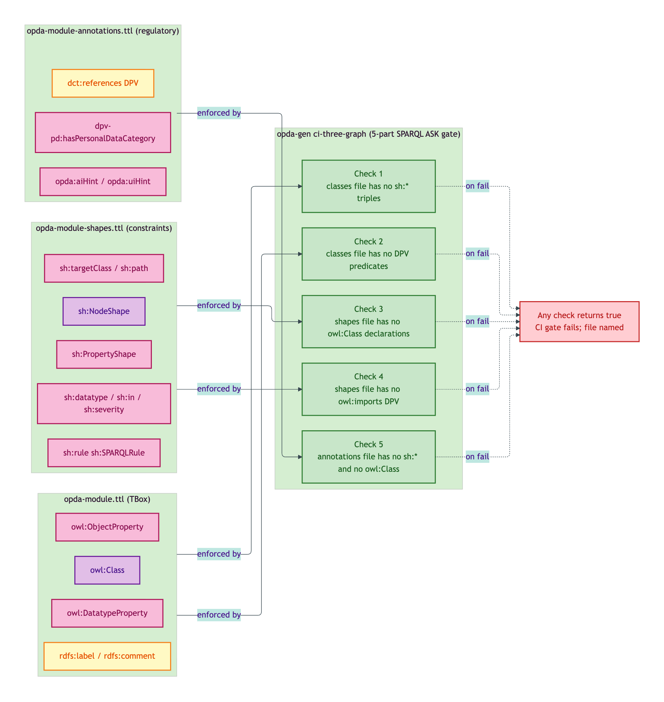
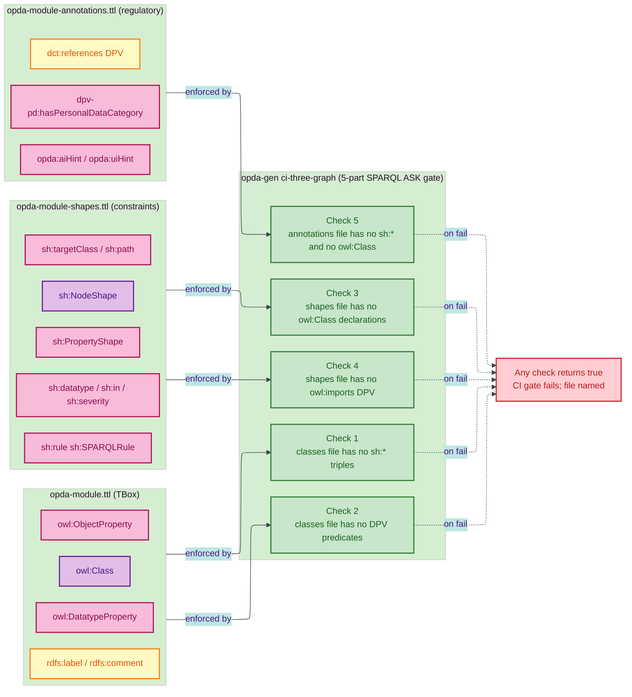

# Three-graph separation

Per [ODR-0004 §3a](/modelling/odr/odr-0004): every module emits **three files** (classes / shapes / annotations) with strict isolation between class declarations, SHACL shapes, and advisory annotations.

This is not a stylistic preference — it is a model-theoretic discipline. Mixing the three graphs collapses Tarski-grade extensional semantics into the implementation soup that PDTF v3 (untyped JSON) cannot avoid.

## Three-graph separation overview



<details>
<summary>Mermaid Source</summary>



</details>

## The discipline

| File | MUST contain | MUST NOT contain |
|---|---|---|
| `opda-<module>.ttl` | `owl:Class`, `owl:DatatypeProperty`, `owl:ObjectProperty`, `rdfs:label`, `rdfs:comment`, `skos:scopeNote`, `dct:source` | `sh:*` triples, DPV `dpv-pd:hasPersonalDataCategory` annotations, advisory `opda:aiHint`/`opda:uiHint` |
| `opda-<module>-shapes.ttl` | `sh:NodeShape`, `sh:PropertyShape`, `sh:targetClass`, `sh:path`, `sh:datatype`, `sh:minCount`, `sh:maxCount`, `sh:in`, `sh:severity`, `sh:rule` (SHACL-AF SPARQL bodies) | `owl:Class`, `owl:imports` to DPV, `dpv-pd:*` co-annotations |
| `opda-<module>-annotations.ttl` | `dpv-pd:hasPersonalDataCategory`, `opda:aiHint`, `opda:uiHint`, generator-author notes, `dct:references` to DPV | `sh:*` triples, `owl:Class` triples |

### Why

- **Classes file** is the **TBox** — the ontological commitment, free of validation or downstream concerns. Reasoners reasoning over the TBox alone get clean OWL semantics.
- **Shapes file** is the **constraint graph** — pyshacl / TopBraid / ShEx engines consume only this to validate ABox data. Loading the TBox is optional (some constraints reference only paths).
- **Annotations file** is the **regulatory overlay** — DPV co-annotations, advisory hints. Loading DPV's vocabulary is *referenced* (per ODR-0018 §Rule 3) but not *imported*; this preserves Tarski-grade semantics for the TBox + shapes while still surfacing the regulatory mapping.

The three-graph separation is what makes the ontology **composable**: BASPI5's overlay profile (`profiles/baspi5.ttl`) inherits the shapes graph cleanly without re-asserting class declarations; downstream regulators can add their own annotations files without disturbing the TBox.

## CI test (5-part)

Per ODR-0004 §3a, CI runs `opda-gen ci-three-graph` which performs five checks per module:

1. **Classes graph contains no `sh:*` predicates** — `ASK { GRAPH ?cls { ?s sh:?p ?o } }` returns false for every classes-file graph
2. **Classes graph contains no DPV predicates** — `ASK { GRAPH ?cls { ?s dpv-pd:hasPersonalDataCategory ?o } }` returns false
3. **Shapes graph contains no `owl:Class` declarations** — `ASK { GRAPH ?shp { ?s a owl:Class } }` returns false
4. **Shapes graph contains no `owl:imports` to DPV** — `ASK { GRAPH ?shp { ?s owl:imports <https://w3id.org/dpv/pd> } }` returns false
5. **Annotations graph contains no `sh:*` predicates and no `owl:Class` declarations** — combined check returns false for every annotations-file graph

If any check returns `true`, the CI gate fails and the offending file is named in the failure message.

## Source ADR + ODR

- [ODR-0004 §3a — PDTF ontology foundation (three-graph separation)](/modelling/odr/odr-0004)
- [ADR-0011 — Module TBox emission](/modelling/adr/adr-0011)
- [ADR-0012 — SHACL + DPV annotation emission](/modelling/adr/adr-0012)
- [ODR-0018 — DPV co-annotation pattern (reference-not-import)](/modelling/odr/odr-0018)

## Headers

Every emitted file carries a header banner reminding content authors of the discipline. Examples:

`opda-<module>-shapes.ttl`:

```
# MUST NOT contain owl:Class or owl:imports triples
# (ODR-0004 §3a three-graph separation).
```

`opda-<module>-annotations.ttl`:

```
# MUST NOT contain sh:* or owl:Class triples
# (ODR-0004 §3a three-graph separation).
# Reference-not-import for DPV per ODR-0018 §Rule 3: DPV terms
# cited via dct:references + URIRef triples; no owl:imports.
```

The banners are mechanical reminders; the CI test is the enforcement gate.
