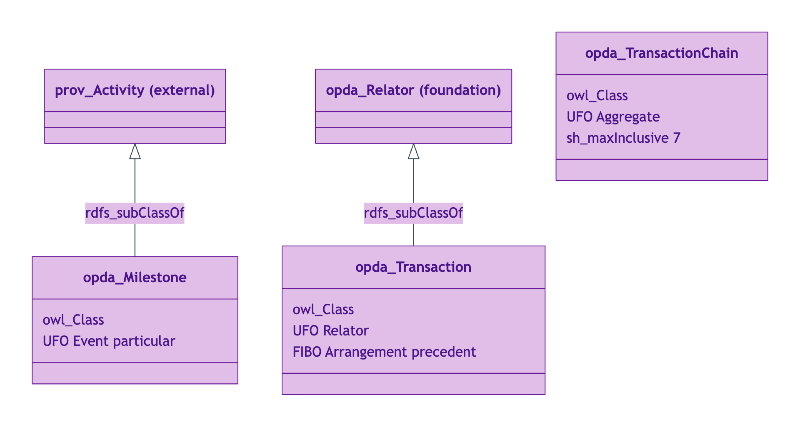
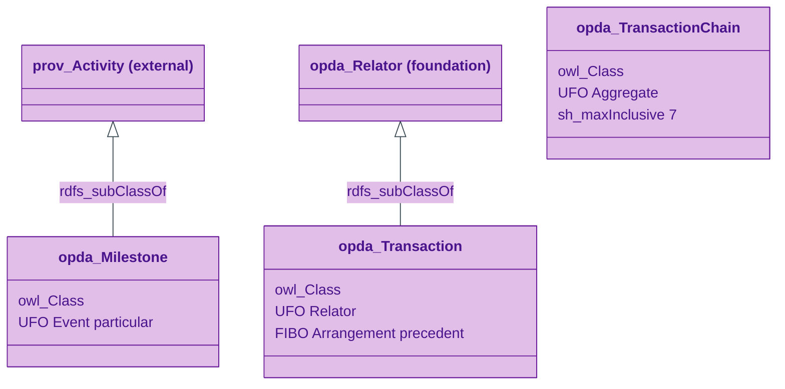
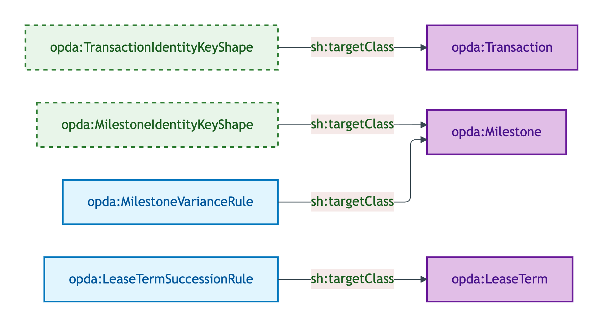
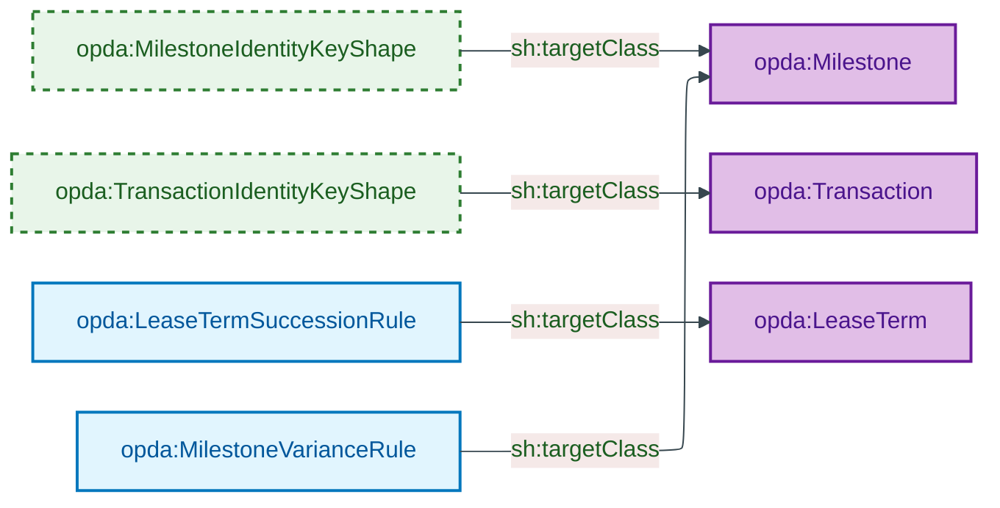
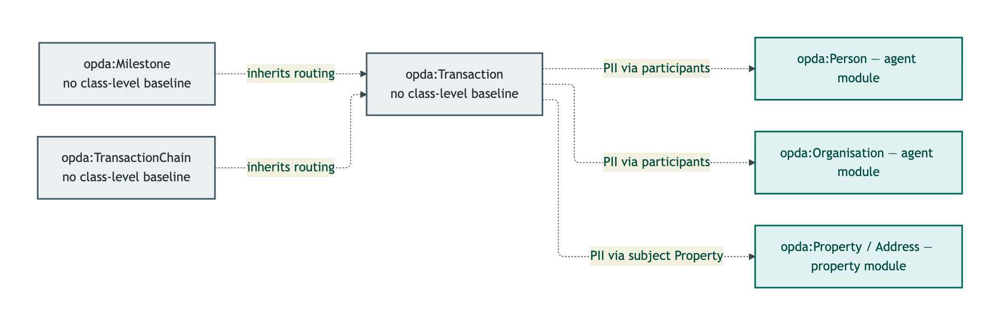
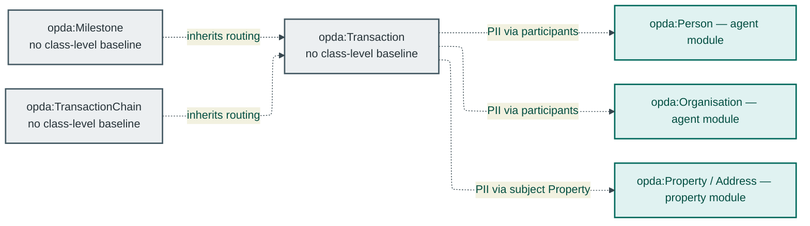

# Transaction module

The Transaction module emits 3 OWL classes: 1 Relator (Transaction), 1 Event particular (Milestone), and 1 Aggregate (TransactionChain).

## Files

| File | Role | Source |
|---|---|---|
| `opda-transaction.ttl` | 3 OWL classes + 2 DatatypeProperties + 1 ObjectProperty | [opda-transaction.ttl](../../../../source/03-standards/ontology/opda-transaction.ttl) |
| `opda-transaction-shapes.ttl` | 2 identity-key + 2 SHACL-AF rules | [opda-transaction-shapes.ttl](../../../../source/03-standards/ontology/opda-transaction-shapes.ttl) |
| `opda-transaction-annotations.ttl` | Header-only (no class-level baseline) | [opda-transaction-annotations.ttl](../../../../source/03-standards/ontology/opda-transaction-annotations.ttl) |

## Ontology header

```turtle
<https://w3id.org/opda/transaction/>
    rdf:type owl:Ontology ;
    dct:title "OPDA Transaction Module"@en ;
    owl:imports <https://w3id.org/opda/1.0.0/>, <https://w3id.org/opda/vocabularies/> ;
    owl:versionIRI <https://w3id.org/opda/transaction/1.0.0/> .
```

## Import chain

- `<https://w3id.org/opda/1.0.0/>` — foundation (Relator meta-class)
- `<https://w3id.org/opda/vocabularies/>` — SKOS schemes (MilestoneKind, TransactionStatus)

External vocabularies referenced (not imported):
- `prov:Activity` — superclass of `opda:Milestone`; pattern for `opda:Transaction` lifecycle

## Classes (3)

| Class | UFO category | Cardinality cap |
|---|---|---|
| `opda:Milestone` | Event particular (PROV-O Activity) | Hybrid instant/interval (S007 Q2) |
| `opda:Transaction` | Relator (FIBO Arrangement precedent) | 5-tuple IC |
| `opda:TransactionChain` | Aggregate | chain-length cap: `sh:maxInclusive 7` (CLC data) |

See [`classes.md`](./classes.md) for per-class blocks.

## Module class hierarchy



<details>
<summary>Mermaid Source</summary>



</details>

## Module shape-target graph



<details>
<summary>Mermaid Source</summary>



</details>

## Module DPV co-annotation graph



<details>
<summary>Mermaid Source</summary>



</details>

## SHACL shapes (4 + 2 rules)

| Shape | Severity | Category |
|---|---|---|
| `opda:MilestoneIdentityKeyShape` | Violation | Cat 1 |
| `opda:TransactionIdentityKeyShape` | Violation | Cat 1 |
| `opda:LeaseTermSuccessionRule` | Info | SHACL-AF |
| `opda:MilestoneVarianceRule` | Info | SHACL-AF (with dynamic variance status) |

See [`shapes.md`](./shapes.md) for per-shape blocks.

## DPV annotations

Header-only. Transactions, Milestones, and TransactionChains are UFO Relators and event particulars — they are not personal data themselves. PII flows through participating Person / Organisation roles (see [`agent/annotations.md`](../agent/annotations.md)) and through the Property side (see [`property/annotations.md`](../property/annotations.md)).

See [`annotations.md`](./annotations.md).

## Source ODR + ADR

- [ODR-0007 — Transactions and lifecycle](../../../ontology/odr/ODR-0007-transactions-and-lifecycle.md)
- [ODR-0017 — SHACL-AF quality rules pattern](../../../ontology/odr/ODR-0017-shacl-af-quality-rules-pattern.md)
- [ADR-0011 — Module TBox emission](../../../adr/ADR-0011-module-tbox-emission.md)
- [ADR-0012 — SHACL + DPV annotation emission](../../../adr/ADR-0012-shacl-and-dpv-annotation-emission.md)
