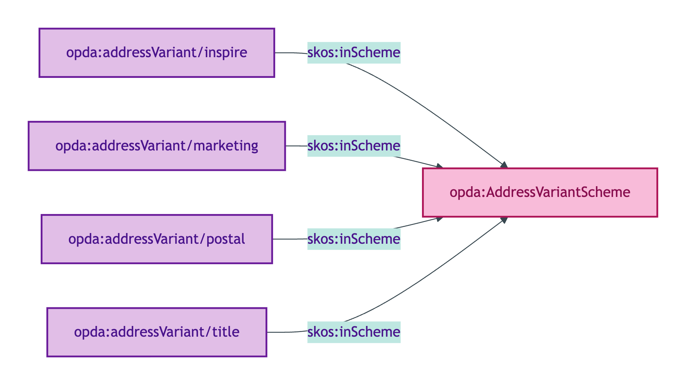
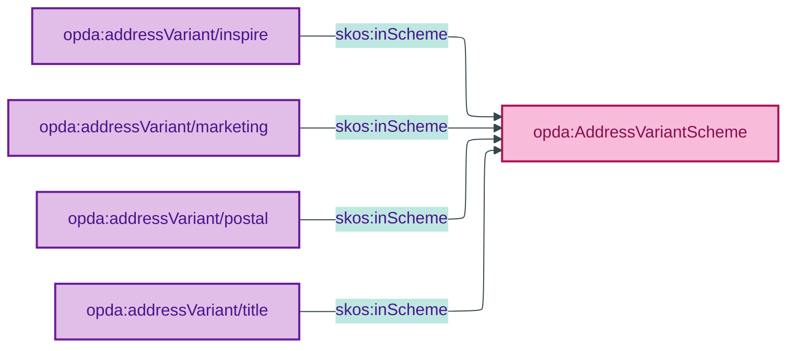

# opda:AddressVariantScheme

## Summary

Quality Values for the variant under which an Address is presented (marketing, title, inspire, postal). Each variant particularises an underlying Address Substance Kind per ODR-0015 §Q1. See also: [Concept tier](../../concept/property/address.md) | [Logical tier](../../logical/property/address.md).

## Scheme header

```turtle
opda:AddressVariantScheme
    rdf:type skos:ConceptScheme ;
    skos:prefLabel "Address Variant"@en ;
    skos:definition "Quality Values for the variant under which an Address is presented (marketing, title, inspire, postal). Each variant particularises an underlying Address Substance Kind per ODR-0015 §Q1."@en ;
    dct:source <https://w3id.org/opda/odr/ODR-0015#section-2a-address-variant> ;
    dct:title "Address variant Quality Value"@en ;
    skos:scopeNote "UFO: Quality Value (Masolo D18 §4.3 — DOLCE Quality Region). Members particularise an Address Substance Kind per ODR-0015 §Q1. Ratified by the Council at session-015."@en ;
    opda:hasSteward "Guizzardi (S015 Q1)"@en ;
    opda:ufoCategory "Quality Value" .
```

## Members

| URI | prefLabel | notation | definition | source |
|---|---|---|---|---|
| `opda:addressVariant/inspire` | "inspire" | inspire | INSPIRE Directive variant | ODR-0015 §2a |
| `opda:addressVariant/marketing` | "marketing" | marketing | Marketing-presentation (estate-agent) variant | ODR-0015 §2a |
| `opda:addressVariant/postal` | "postal" | postal | Royal Mail PAF-formatted variant | ODR-0015 §2a |
| `opda:addressVariant/title` | "title" | title | HMLR registered-title variant | ODR-0015 §2a |

### Member Turtle

```turtle
<https://w3id.org/opda/#addressVariant/inspire>
    rdf:type skos:Concept ;
    skos:prefLabel "inspire"@en ;
    skos:definition "INSPIRE Directive variant of an Address — the regulated postal address structure published by INSPIRE-aligned registers (administrative boundary alignment)."@en ;
    dct:source <https://w3id.org/opda/odr/ODR-0015#section-2a-address-variant> ;
    skos:inScheme opda:AddressVariantScheme ;
    skos:notation "inspire" .

<https://w3id.org/opda/#addressVariant/marketing>
    rdf:type skos:Concept ;
    skos:prefLabel "marketing"@en ;
    skos:definition "Marketing-presentation variant of an Address (estate-agent advertising format; typically de-formalised street name + town). Used in advertising and marketing contexts."@en ;
    dct:source <https://w3id.org/opda/odr/ODR-0015#section-2a-address-variant> ;
    skos:inScheme opda:AddressVariantScheme ;
    skos:notation "marketing" .

<https://w3id.org/opda/#addressVariant/postal>
    rdf:type skos:Concept ;
    skos:prefLabel "postal"@en ;
    skos:definition "Royal Mail PAF-formatted variant of an Address (the address as recognised by Royal Mail's Postcode Address File)."@en ;
    dct:source <https://w3id.org/opda/odr/ODR-0015#section-2a-address-variant> ;
    skos:inScheme opda:AddressVariantScheme ;
    skos:notation "postal" .

<https://w3id.org/opda/#addressVariant/title>
    rdf:type skos:Concept ;
    skos:prefLabel "title"@en ;
    skos:definition "HM Land Registry registered-title variant of an Address; the address as recorded against the title at HMLR."@en ;
    dct:source <https://w3id.org/opda/odr/ODR-0015#section-2a-address-variant> ;
    skos:inScheme opda:AddressVariantScheme ;
    skos:notation "title" .
```

## Scheme membership graph



<details>
<summary>Mermaid Source</summary>



</details>

## Referenced by

- [`opda:AddressIdentityKeyShape`](../property/shapes.md#opdaaddressidentitykeyshape) — `opda:addressVariant` predicate constrained per ODR-0015 §Rule 6
- [`opda:INSPIRESuccessionRule`](../property/shapes.md#opdainspiresuccessionrule) — filters on `opda:addressVariant "inspire"`
- BASPI5 Address shape (overlay; profile-specific `sh:in` subset)

## Source ODR + ADR

- [ODR-0015 §2a — Address and geography](../../../ontology/odr/ODR-0015-address-and-geography.md)
- [ADR-0010 — SKOS vocabulary emission](../../../adr/ADR-0010-skos-vocabulary-emission.md)
- [ODR-0011 — Enumeration vocabularies](../../../ontology/odr/ODR-0011-enumeration-vocabularies.md)
