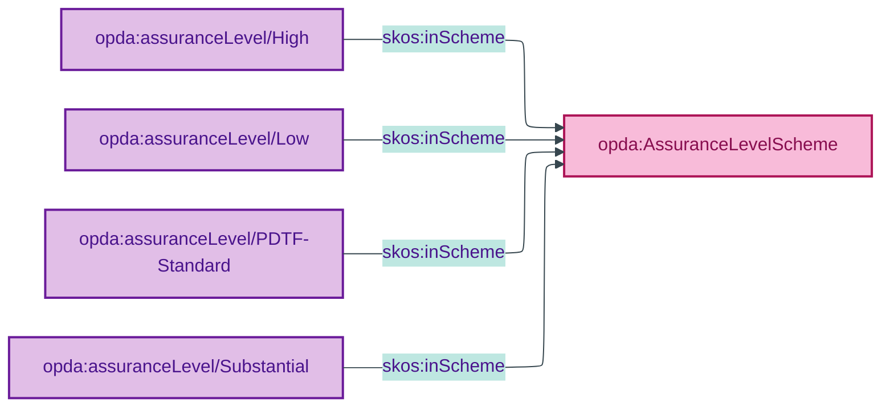

# opda:AssuranceLevelScheme

## Summary

Quality Values for the eIDAS Levels of Assurance (Low, Substantial, High) plus the OPDA-specific PDTF-Standard intermediate level per ODR-0009 §Q3. Applied to identity-verification claims. See also: [Concept tier](../../concept/claim/assurance-level.md) | [Logical tier](../../logical/claim/assurance-level.md).

## Scheme header

```turtle
opda:AssuranceLevelScheme
    rdf:type skos:ConceptScheme ;
    skos:prefLabel "Assurance Level"@en ;
    skos:definition "Quality Values for the eIDAS Levels of Assurance (Low, Substantial, High) plus the OPDA-specific PDTF-Standard intermediate level per ODR-0009 §Q3, applied to identity-verification claims."@en ;
    dct:source <https://eur-lex.europa.eu/legal-content/EN/TXT/?uri=CELEX:32014R0910> ;
    dct:title "Identity assurance level (eIDAS + PDTF)"@en ;
    skos:scopeNote "UFO: Quality Value (Masolo D18 §4.3 — DOLCE Quality Region). Low/Substantial/High inherit verbatim from Regulation (EU) No 910/2014 (eIDAS) Article 8 per ODR-0011 §4a regulator-citation discipline. PDTF-Standard ratified by ODR-0009 §Q3 as an OPDA-specific intermediate level."@en ;
    opda:hasSteward "Moreau (S009 Q3)"@en ;
    opda:ufoCategory "Quality Value" .
```

## Members

| URI | prefLabel | notation | source |
|---|---|---|---|
| `opda:assuranceLevel/High` | "High" | High | eIDAS Article 8(2)(c) |
| `opda:assuranceLevel/Low` | "Low" | Low | eIDAS Article 8(2)(a) |
| `opda:assuranceLevel/PDTF-Standard` | "PDTF-Standard" | PDTF-Standard | ODR-0009 §Q3 |
| `opda:assuranceLevel/Substantial` | "Substantial" | Substantial | eIDAS Article 8(2)(b) |

### Member Turtle

```turtle
<https://opda.org.uk/pdtf/scheme/assuranceLevel/High>
    rdf:type skos:Concept ;
    skos:prefLabel "High"@en ;
    skos:definition "High degree of confidence in the claimed or asserted identity of a person (eIDAS Article 8(2)(c) High)."@en ;
    dct:source <https://eur-lex.europa.eu/legal-content/EN/TXT/?uri=CELEX:32014R0910> ;
    skos:inScheme opda:AssuranceLevelScheme ;
    skos:notation "High" .

<https://opda.org.uk/pdtf/scheme/assuranceLevel/Low>
    rdf:type skos:Concept ;
    skos:prefLabel "Low"@en ;
    skos:definition "Limited degree of confidence in the claimed or asserted identity of a person (eIDAS Article 8(2)(a) Low)."@en ;
    dct:source <https://eur-lex.europa.eu/legal-content/EN/TXT/?uri=CELEX:32014R0910> ;
    skos:inScheme opda:AssuranceLevelScheme ;
    skos:notation "Low" .

<https://opda.org.uk/pdtf/scheme/assuranceLevel/PDTF-Standard>
    rdf:type skos:Concept ;
    skos:prefLabel "PDTF-Standard"@en ;
    skos:definition "OPDA-specific intermediate assurance level per ODR-0009 §Q3, applicable to PDTF transactions where eIDAS LoA mapping is not directly available."@en ;
    dct:source <https://opda.org.uk/pdtf/harness/odr/ODR-0009/section-Q3> ;
    skos:inScheme opda:AssuranceLevelScheme ;
    skos:notation "PDTF-Standard" .

<https://opda.org.uk/pdtf/scheme/assuranceLevel/Substantial>
    rdf:type skos:Concept ;
    skos:prefLabel "Substantial"@en ;
    skos:definition "Substantial degree of confidence in the claimed or asserted identity of a person (eIDAS Article 8(2)(b) Substantial)."@en ;
    dct:source <https://eur-lex.europa.eu/legal-content/EN/TXT/?uri=CELEX:32014R0910> ;
    skos:inScheme opda:AssuranceLevelScheme ;
    skos:notation "Substantial" .
```

## Scheme membership graph


<details>
<summary>Mermaid Source</summary>



</details>

## Referenced by

- Per-overlay profile bindings (BASPI5 does not surface assurance level — claims tier is not in MVP)

## Source ODR + ADR

- [ODR-0009 §Q3 — Claims, evidence and provenance](/modelling/odr/odr-0009)
- [ADR-0010](/modelling/adr/adr-0010)
- [ODR-0011 §4a — regulator-citation discipline](/modelling/odr/odr-0011)
