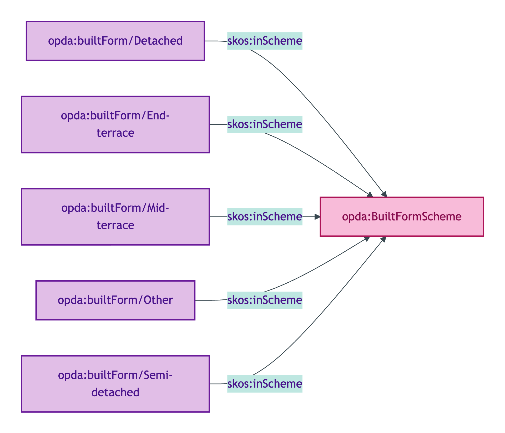
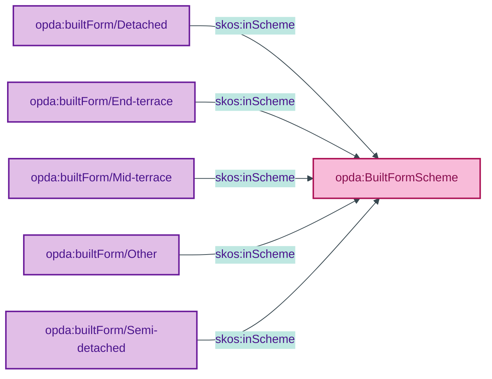

# opda:BuiltFormScheme

## Summary

Classification of a Property's structural built-form (detached, semi-detached, terraced, etc.). UFO Quale-in-Region. See also: [Concept tier](../../concept/property/property.md) | [Logical tier](../../logical/property/property.md).

## Scheme header

```turtle
opda:BuiltFormScheme
    rdf:type skos:ConceptScheme ;
    skos:prefLabel "Built Form"@en ;
    skos:definition "Classification of a Property's structural built-form (detached, semi-detached, terraced, etc.)."@en ;
    dct:source <https://w3id.org/opda/odr/ODR-0011#section-8a-ufo-meta-category> ;
    dct:title "Property built-form classification"@en ;
    skos:scopeNote "UFO: Quale-in-Region (Guizzardi 2005 Ch. 4). DOLCE: Quality-Region (Masolo D18 §4.3)."@en ;
    opda:hasSteward "Allemang (property-qualities sub-module steward per S008 Q2)"@en ;
    opda:ufoCategory "Quale-in-Region" .
```

## Members

| URI | prefLabel | notation |
|---|---|---|
| `opda:builtForm/Detached` | "Detached" | Detached |
| `opda:builtForm/End-terrace` | "End-terrace" | End-terrace |
| `opda:builtForm/Mid-terrace` | "Mid-terrace" | Mid-terrace |
| `opda:builtForm/Other` | "Other" | Other |
| `opda:builtForm/Semi-detached` | "Semi-detached" | Semi-detached |

### Member Turtle

```turtle
<https://w3id.org/opda/#builtForm/Detached>
    rdf:type skos:Concept ;
    skos:prefLabel "Detached"@en ;
    skos:definition "Free-standing dwelling sharing no walls with neighbouring properties."@en ;
    dct:source <https://w3id.org/opda/data-dictionary#propertyPack.buildInformation.building.builtForm.Detached> ;
    skos:inScheme opda:BuiltFormScheme ;
    skos:notation "Detached" .

<https://w3id.org/opda/#builtForm/End-terrace>
    rdf:type skos:Concept ;
    skos:prefLabel "End-terrace"@en ;
    skos:definition "Dwelling at the end of a terrace, sharing one wall with a neighbouring property."@en ;
    dct:source <https://w3id.org/opda/data-dictionary#propertyPack.buildInformation.building.builtForm.End-terrace> ;
    skos:inScheme opda:BuiltFormScheme ;
    skos:notation "End-terrace" .

<https://w3id.org/opda/#builtForm/Mid-terrace>
    rdf:type skos:Concept ;
    skos:prefLabel "Mid-terrace"@en ;
    skos:definition "Dwelling within a terrace, sharing walls with neighbouring properties on both sides."@en ;
    dct:source <https://w3id.org/opda/data-dictionary#propertyPack.buildInformation.building.builtForm.Mid-terrace> ;
    skos:inScheme opda:BuiltFormScheme ;
    skos:notation "Mid-terrace" .

<https://w3id.org/opda/#builtForm/Other>
    rdf:type skos:Concept ;
    skos:prefLabel "Other"@en ;
    skos:definition "Built form falling outside the standard categories; relies on a free-text note for context."@en ;
    dct:source <https://w3id.org/opda/data-dictionary#propertyPack.buildInformation.building.builtForm.Other> ;
    skos:inScheme opda:BuiltFormScheme ;
    skos:notation "Other" .

<https://w3id.org/opda/#builtForm/Semi-detached>
    rdf:type skos:Concept ;
    skos:prefLabel "Semi-detached"@en ;
    skos:definition "Dwelling sharing one wall with a single neighbouring property."@en ;
    dct:source <https://w3id.org/opda/data-dictionary#propertyPack.buildInformation.building.builtForm.Semi-detached> ;
    skos:inScheme opda:BuiltFormScheme ;
    skos:notation "Semi-detached" .
```

## Scheme membership graph



<details>
<summary>Mermaid Source</summary>



</details>

## Referenced by

- `opda:Baspi5_PropertyShape` (overlay; `sh:in` subset Detached / Semi-detached / Mid-terrace / End-terrace / Other)

## Source ODR + ADR

- [ODR-0011 §8a — Enumeration vocabularies](../../../ontology/odr/ODR-0011-enumeration-vocabularies.md)
- [ADR-0010](../../../adr/ADR-0010-skos-vocabulary-emission.md)
