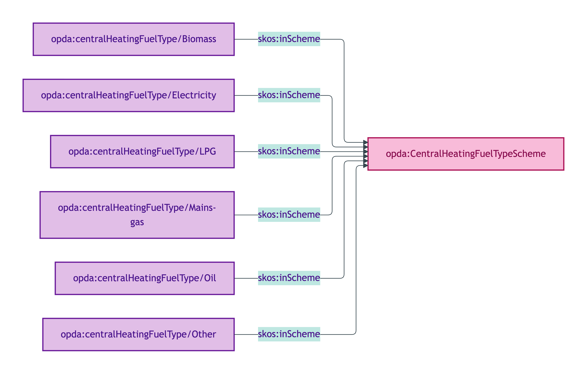
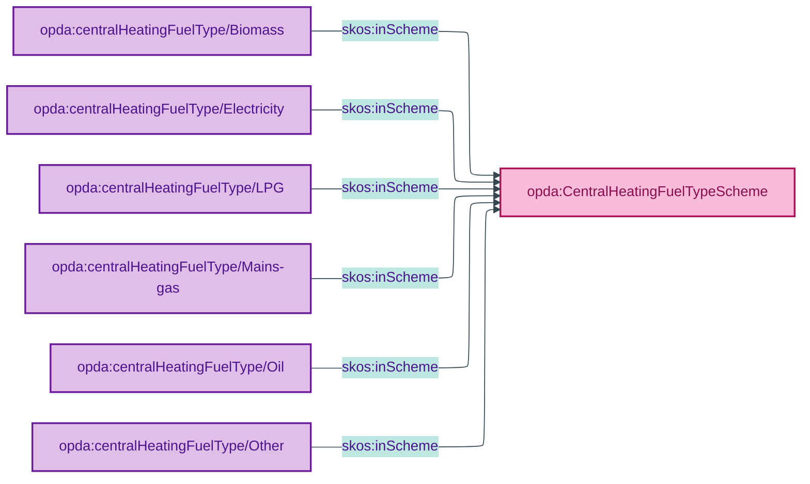

# opda:CentralHeatingFuelTypeScheme

## Summary

Classification of the fuel used by a Property's central heating system. UFO Quale-in-Region. See also: [Concept tier](../../concept/property/property.md) | [Logical tier](../../logical/property/property.md).

## Scheme header

```turtle
opda:CentralHeatingFuelTypeScheme
    rdf:type skos:ConceptScheme ;
    skos:prefLabel "Central Heating Fuel Type"@en ;
    skos:definition "Classification of the fuel used by a Property's central heating system."@en ;
    dct:source <https://w3id.org/opda/odr/ODR-0011#section-8a-ufo-meta-category> ;
    dct:title "Property central-heating fuel type"@en ;
    skos:scopeNote "UFO: Quale-in-Region (Guizzardi 2005 Ch. 4). DOLCE: Quality-Region (Masolo D18 §4.3)."@en ;
    opda:hasSteward "Allemang (property-qualities sub-module steward per S008 Q2)"@en ;
    opda:ufoCategory "Quale-in-Region" .
```

## Members

| URI | prefLabel | notation |
|---|---|---|
| `opda:centralHeatingFuelType/Biomass` | "Biomass" | Biomass |
| `opda:centralHeatingFuelType/Electricity` | "Electricity" | Electricity |
| `opda:centralHeatingFuelType/LPG` | "LPG" | LPG |
| `opda:centralHeatingFuelType/Mains-gas` | "Mains gas" | Mains gas |
| `opda:centralHeatingFuelType/Oil` | "Oil" | Oil |
| `opda:centralHeatingFuelType/Other` | "Other" | Other |

### Member Turtle

```turtle
<https://w3id.org/opda/#centralHeatingFuelType/Biomass>
    rdf:type skos:Concept ;
    skos:prefLabel "Biomass"@en ;
    skos:definition "Combustible biological material (e.g. wood pellets)."@en ;
    dct:source <https://w3id.org/opda/data-dictionary#propertyPack.heating.heatingSystem.centralHeatingDetails.centralHeatingFuel.centralHeatingFuelType.Biomass> ;
    skos:inScheme opda:CentralHeatingFuelTypeScheme ;
    skos:notation "Biomass" .

<https://w3id.org/opda/#centralHeatingFuelType/Electricity>
    rdf:type skos:Concept ;
    skos:prefLabel "Electricity"@en ;
    skos:definition "Electrical heating supplied via the mains electricity network."@en ;
    dct:source <https://w3id.org/opda/data-dictionary#propertyPack.heating.heatingSystem.centralHeatingDetails.centralHeatingFuel.centralHeatingFuelType.Electricity> ;
    skos:inScheme opda:CentralHeatingFuelTypeScheme ;
    skos:notation "Electricity" .

<https://w3id.org/opda/#centralHeatingFuelType/LPG>
    rdf:type skos:Concept ;
    skos:prefLabel "LPG"@en ;
    skos:definition "Liquefied Petroleum Gas stored on-site for combustion."@en ;
    dct:source <https://w3id.org/opda/data-dictionary#propertyPack.heating.heatingSystem.centralHeatingDetails.centralHeatingFuel.centralHeatingFuelType.LPG> ;
    skos:inScheme opda:CentralHeatingFuelTypeScheme ;
    skos:notation "LPG" .

<https://w3id.org/opda/#centralHeatingFuelType/Mains-gas>
    rdf:type skos:Concept ;
    skos:prefLabel "Mains gas"@en ;
    skos:definition "Natural gas supplied via the mains gas network."@en ;
    dct:source <https://w3id.org/opda/data-dictionary#propertyPack.heating.heatingSystem.centralHeatingDetails.centralHeatingFuel.centralHeatingFuelType.Mains%20gas> ;
    skos:inScheme opda:CentralHeatingFuelTypeScheme ;
    skos:notation "Mains gas" .

<https://w3id.org/opda/#centralHeatingFuelType/Oil>
    rdf:type skos:Concept ;
    skos:prefLabel "Oil"@en ;
    skos:definition "Heating oil stored on-site for combustion."@en ;
    dct:source <https://w3id.org/opda/data-dictionary#propertyPack.heating.heatingSystem.centralHeatingDetails.centralHeatingFuel.centralHeatingFuelType.Oil> ;
    skos:inScheme opda:CentralHeatingFuelTypeScheme ;
    skos:notation "Oil" .

<https://w3id.org/opda/#centralHeatingFuelType/Other>
    rdf:type skos:Concept ;
    skos:prefLabel "Other"@en ;
    skos:definition "Fuel type falling outside the standard categories."@en ;
    dct:source <https://w3id.org/opda/data-dictionary#propertyPack.heating.heatingSystem.centralHeatingDetails.centralHeatingFuel.centralHeatingFuelType.Other> ;
    skos:inScheme opda:CentralHeatingFuelTypeScheme ;
    skos:notation "Other" .
```

## Scheme membership graph



<details>
<summary>Mermaid Source</summary>



</details>

## Referenced by

- `opda:Baspi5_PropertyShape` (overlay via `_:bd798d7258a49` — full scheme list)

## Source ODR + ADR

- [ODR-0011 §8a](../../../ontology/odr/ODR-0011-enumeration-vocabularies.md)
- [ADR-0010](../../../adr/ADR-0010-skos-vocabulary-emission.md)
