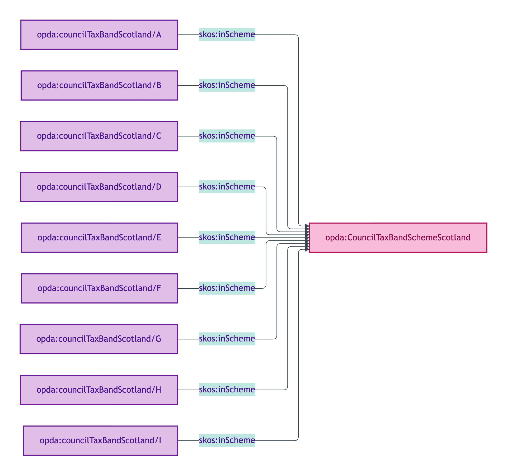
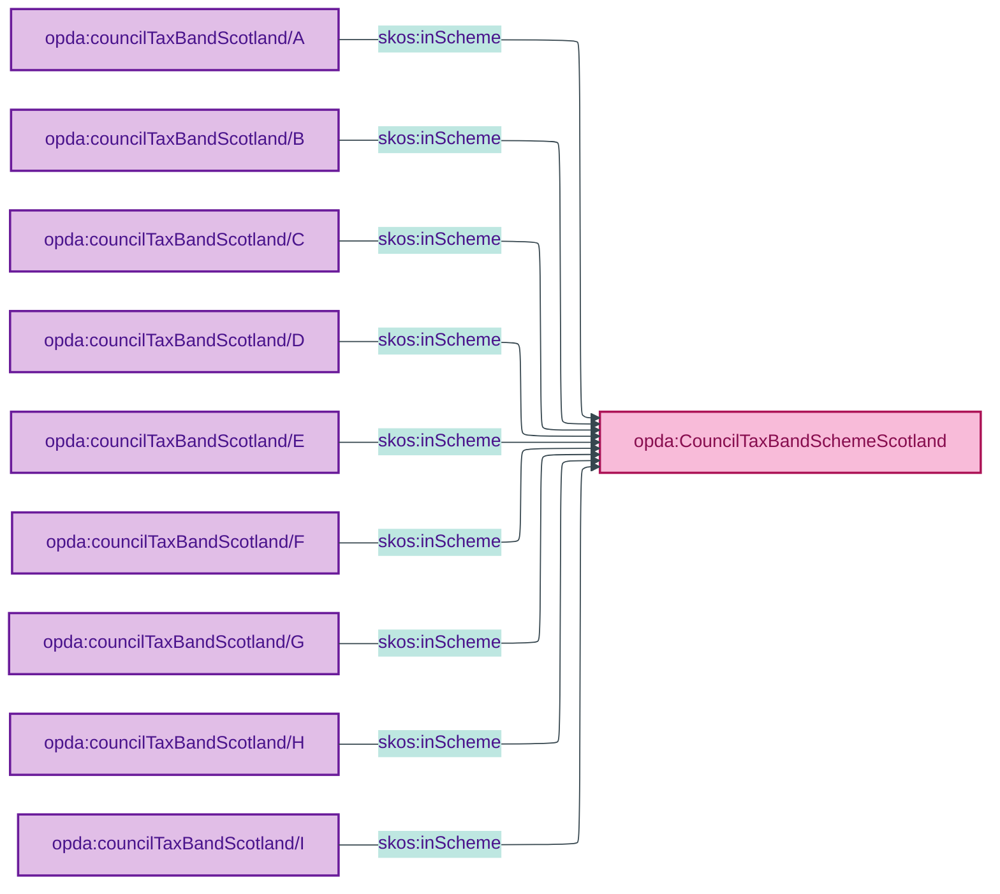

# opda:CouncilTaxBandSchemeScotland

## Summary

Scottish Assessors Association banding for Scotland (Bands A–I) assigned to each domestic property for council tax calculation. Band I is Scotland-specific.

## Scheme header

```turtle
opda:CouncilTaxBandSchemeScotland
    rdf:type skos:ConceptScheme ;
    skos:prefLabel "Council Tax Band (Scotland)"@en ;
    skos:definition "Scottish Assessors Association banding for Scotland (Bands A–I) assigned to each domestic property for council tax calculation. Band I is Scotland-specific."@en ;
    dct:source <https://www.saa.gov.uk/council-tax/council-tax-bands/> ;
    dct:title "Council Tax Band — Scottish Assessors Association banding"@en ;
    skos:scopeNote "UFO: Quale-in-Region (Guizzardi 2005 Ch. 4). DOLCE: Quality-Region (Masolo D18 §4.3). Verbatim source: SAA council-tax bands published at https://www.saa.gov.uk/council-tax/council-tax-bands/."@en ;
    opda:hasSteward "Baker (regulator-cited per ODR-0011 §4a; SAA-governed)"@en ;
    opda:ufoCategory "Quale-in-Region" .
```

## Members

| URI | prefLabel | notation |
|---|---|---|
| `opda:councilTaxBandScotland/A` | "A" | A |
| `opda:councilTaxBandScotland/B` | "B" | B |
| `opda:councilTaxBandScotland/C` | "C" | C |
| `opda:councilTaxBandScotland/D` | "D" | D |
| `opda:councilTaxBandScotland/E` | "E" | E |
| `opda:councilTaxBandScotland/F` | "F" | F |
| `opda:councilTaxBandScotland/G` | "G" | G |
| `opda:councilTaxBandScotland/H` | "H" | H |
| `opda:councilTaxBandScotland/I` | "I" | I (Scotland-specific) |

### Member Turtle (9 bands; identical structure — sample)

```turtle
<https://w3id.org/opda/#councilTaxBandScotland/I>
    rdf:type skos:Concept ;
    skos:prefLabel "I"@en ;
    skos:definition "Council tax band I as defined by the Scottish Assessors Association for properties in Scotland."@en ;
    dct:source <https://www.saa.gov.uk/council-tax/council-tax-bands/> ;
    skos:inScheme opda:CouncilTaxBandSchemeScotland ;
    skos:notation "I" .

# Bands A-H follow the same pattern.
# See source: opda-vocabularies.ttl lines 465-535.
```

Full per-member Turtle: [`opda-vocabularies.ttl` lines 465–535](../../../../source/03-standards/ontology/opda-vocabularies.ttl).

## Scheme membership graph



<details>
<summary>Mermaid Source</summary>



</details>

## Referenced by

- Per-overlay profile bindings (BASPI5 does not surface council tax band in MVP; future GovTech / lender overlays)

## Source ODR + ADR

- [ODR-0011 §4a — regulator-citation discipline](../../../ontology/odr/ODR-0011-enumeration-vocabularies.md)
- [ADR-0010](../../../adr/ADR-0010-skos-vocabulary-emission.md)
