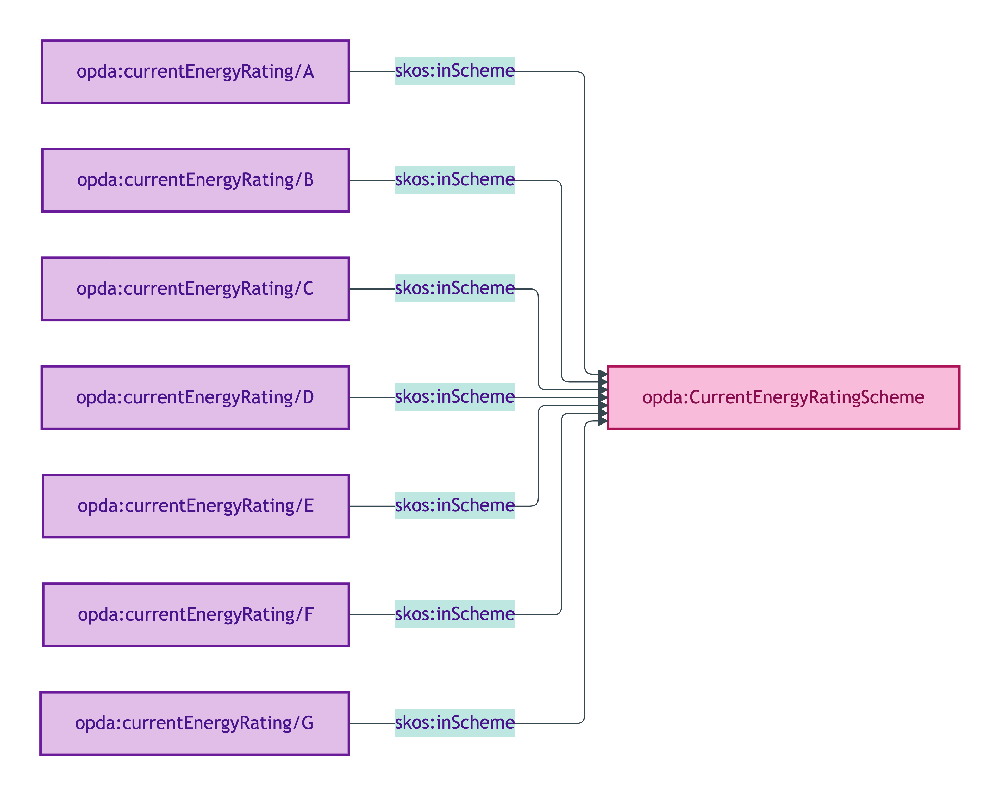
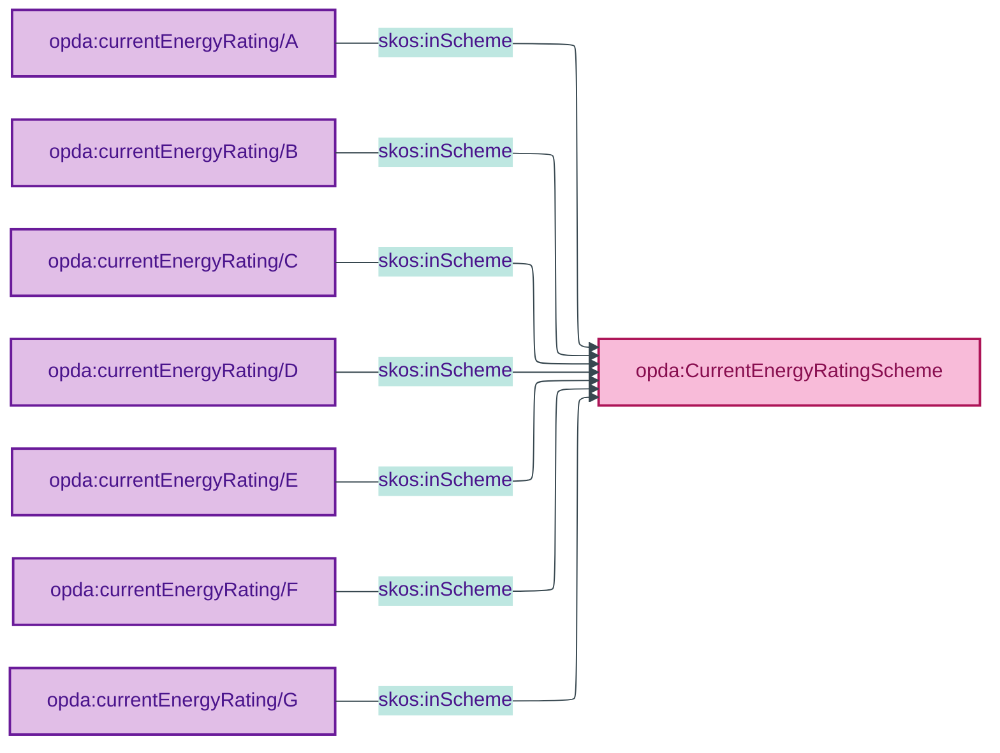

# opda:CurrentEnergyRatingScheme

## Summary

EPC current energy rating banding (A–G) published by DESNZ (Department for Energy Security and Net Zero) for residential properties in England & Wales.

## Scheme header

```turtle
opda:CurrentEnergyRatingScheme
    rdf:type skos:ConceptScheme ;
    skos:prefLabel "Current Energy Rating"@en ;
    skos:definition "EPC current energy rating banding (A–G) published by DESNZ (Department for Energy Security and Net Zero) for residential properties in England & Wales."@en ;
    dct:source <https://www.gov.uk/government/publications/guide-to-energy-performance-certificates-for-the-construction-sale-and-let-of-dwellings> ;
    dct:title "Energy Performance Certificate (EPC) current energy rating"@en ;
    skos:scopeNote "UFO: Quale-in-Region (Guizzardi 2005 Ch. 4). DOLCE: Quality-Region (Masolo D18 §4.3). Verbatim source: DESNZ Energy Performance Certificate guidance."@en ;
    opda:hasSteward "Baker (regulator-cited per ODR-0011 §4a; DESNZ-governed)"@en ;
    opda:ufoCategory "Quale-in-Region" .
```

## Members

| URI | prefLabel | notation |
|---|---|---|
| `opda:currentEnergyRating/A` | "A" | A |
| `opda:currentEnergyRating/B` | "B" | B |
| `opda:currentEnergyRating/C` | "C" | C |
| `opda:currentEnergyRating/D` | "D" | D |
| `opda:currentEnergyRating/E` | "E" | E |
| `opda:currentEnergyRating/F` | "F" | F |
| `opda:currentEnergyRating/G` | "G" | G |

### Member Turtle (sample)

```turtle
<https://opda.org.uk/pdtf/scheme/currentEnergyRating/A>
    rdf:type skos:Concept ;
    skos:prefLabel "A"@en ;
    skos:definition "EPC current energy rating band A as defined by DESNZ."@en ;
    dct:source <https://www.gov.uk/government/publications/guide-to-energy-performance-certificates-for-the-construction-sale-and-let-of-dwellings> ;
    skos:inScheme opda:CurrentEnergyRatingScheme ;
    skos:notation "A" .

# Bands B-G follow the same pattern (definition substitutes the letter).
# See source: opda-vocabularies.ttl lines 537-591.
```

Full per-member Turtle: [`opda-vocabularies.ttl` lines 537–591](../../../../source/03-standards/ontology/opda-vocabularies.ttl).

## Scheme membership graph



<details>
<summary>Mermaid Source</summary>



</details>

## Referenced by

- [`opda:Baspi5_EPCCertificateShape`](../profiles/baspi5.md) — full scheme `sh:in` constraint (A-G required for BASPI5 v5.0.3)
- `opda:Baspi5_PropertyShape` — same scheme via `_:b1eb770128af6` + `_:ba0edada6d73c` (BASPI5 question A1.8.3.1.1)

## Source ODR + ADR

- [ODR-0011 §4a — regulator-citation discipline](../../../ontology/odr/ODR-0011-enumeration-vocabularies.md)
- [ADR-0010](../../../adr/ADR-0010-skos-vocabulary-emission.md)
