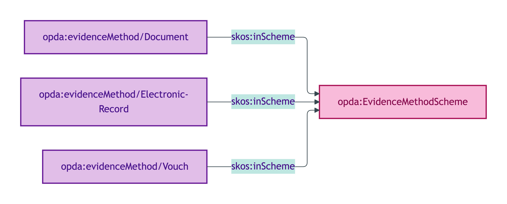
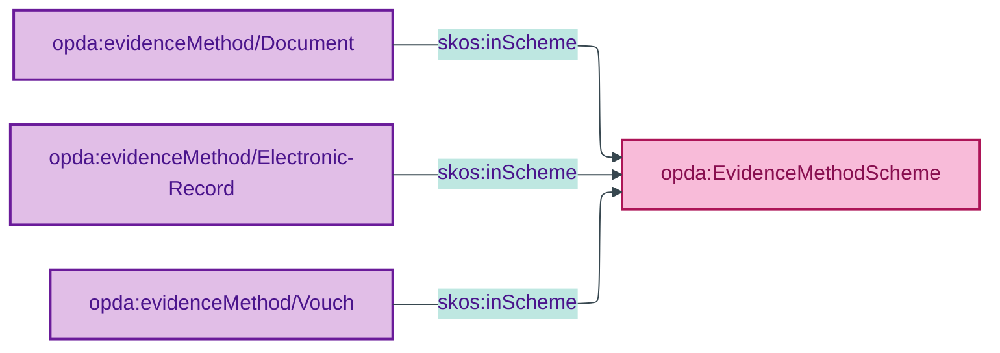

# opda:EvidenceMethodScheme

## Summary

Quality Values for the method by which identity evidence was obtained, per the OIDC4IDA `evidence` taxonomy. See also: [Concept tier](../../concept/claim/evidence.md) | [Logical tier](../../logical/claim/evidence.md).

## Scheme header

```turtle
opda:EvidenceMethodScheme
    rdf:type skos:ConceptScheme ;
    skos:prefLabel "Evidence Method"@en ;
    skos:definition "Quality Values for the method by which identity evidence was obtained, per the OIDC4IDA `evidence` taxonomy."@en ;
    dct:source <https://openid.net/specs/openid-connect-4-identity-assurance-1_0.html> ;
    dct:title "Identity-evidence method (OIDC4IDA)"@en ;
    skos:scopeNote "UFO: Quality Value (Masolo D18 §4.3 — DOLCE Quality Region). Members inherited verbatim from OpenID Connect for Identity Assurance 1.0 `evidence` type per ODR-0011 §4a regulator-citation discipline."@en ;
    opda:hasSteward "Moreau (S009 Q3)"@en ;
    opda:ufoCategory "Quality Value" .
```

## Members

| URI | prefLabel | notation |
|---|---|---|
| `opda:evidenceMethod/Document` | "Document" | Document |
| `opda:evidenceMethod/Electronic-Record` | "Electronic-Record" | Electronic-Record |
| `opda:evidenceMethod/Vouch` | "Vouch" | Vouch |

### Member Turtle

```turtle
<https://w3id.org/opda/#evidenceMethod/Document>
    rdf:type skos:Concept ;
    skos:prefLabel "Document"@en ;
    skos:definition "OIDC4IDA Document evidence: identity evidence obtained by inspecting a physical or digital identity document (passport, driving licence, identity card, etc.)."@en ;
    dct:source <https://openid.net/specs/openid-connect-4-identity-assurance-1_0.html> ;
    skos:inScheme opda:EvidenceMethodScheme ;
    skos:notation "Document" .

<https://w3id.org/opda/#evidenceMethod/Electronic-Record>
    rdf:type skos:Concept ;
    skos:prefLabel "Electronic-Record"@en ;
    skos:definition "OIDC4IDA ElectronicRecord evidence: identity evidence obtained from a verified electronic record held by an authoritative source."@en ;
    dct:source <https://openid.net/specs/openid-connect-4-identity-assurance-1_0.html> ;
    skos:inScheme opda:EvidenceMethodScheme ;
    skos:notation "Electronic-Record" .

<https://w3id.org/opda/#evidenceMethod/Vouch>
    rdf:type skos:Concept ;
    skos:prefLabel "Vouch"@en ;
    skos:definition "OIDC4IDA Vouch evidence: identity evidence obtained through attestation by a trusted third party."@en ;
    dct:source <https://openid.net/specs/openid-connect-4-identity-assurance-1_0.html> ;
    skos:inScheme opda:EvidenceMethodScheme ;
    skos:notation "Vouch" .
```

## Scheme membership graph



<details>
<summary>Mermaid Source</summary>



</details>

## Referenced by

- Per-overlay profile bindings (BASPI5 does not surface evidence method in MVP — claims tier deferred)

## Source ODR + ADR

- [ODR-0009 §Q3 — Claims, evidence and provenance](../../../ontology/odr/ODR-0009-claims-evidence-and-provenance.md)
- [ODR-0011 §4a](../../../ontology/odr/ODR-0011-enumeration-vocabularies.md)
- [ADR-0010](../../../adr/ADR-0010-skos-vocabulary-emission.md)
