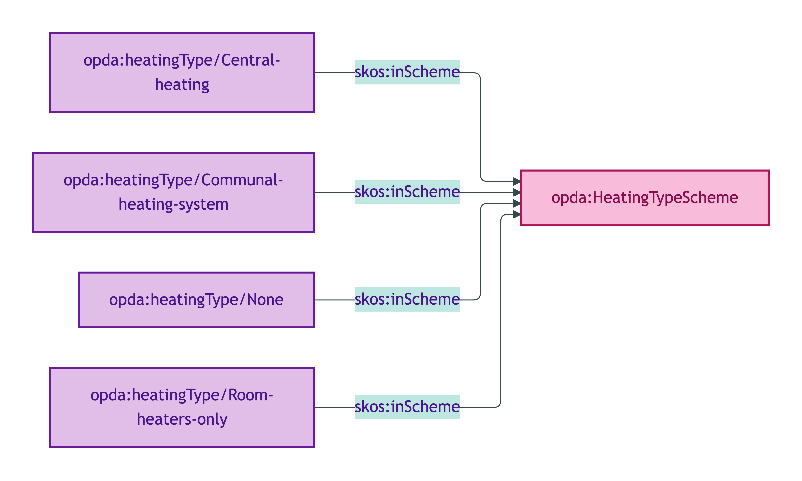
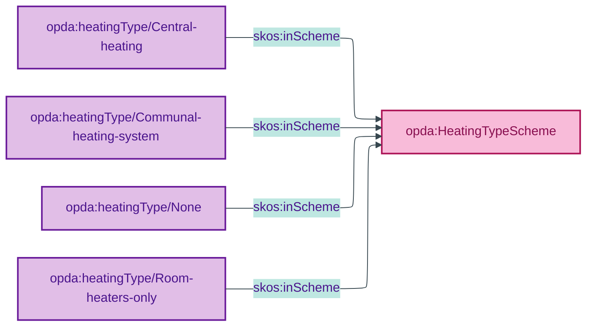

# opda:HeatingTypeScheme

## Summary

Classification of a Property's overall heating-system arrangement (central, communal, room-only, or none).

## Scheme header

```turtle
opda:HeatingTypeScheme
    rdf:type skos:ConceptScheme ;
    skos:prefLabel "Heating Type"@en ;
    skos:definition "Classification of a Property's overall heating-system arrangement (central, communal, room-only, or none)."@en ;
    dct:source <https://w3id.org/opda/odr/ODR-0011#section-8a-ufo-meta-category> ;
    dct:title "Property heating-system type"@en ;
    skos:scopeNote "UFO: Quale-in-Region (Guizzardi 2005 Ch. 4). DOLCE: Quality-Region (Masolo D18 §4.3)."@en ;
    opda:hasSteward "Allemang (property-qualities sub-module steward per S008 Q2)"@en ;
    opda:ufoCategory "Quale-in-Region" .
```

## Members

| URI | prefLabel | notation |
|---|---|---|
| `opda:heatingType/Central-heating` | "Central heating" | Central heating |
| `opda:heatingType/Communal-heating-system` | "Communal heating system" | Communal heating system |
| `opda:heatingType/None` | "None" | None |
| `opda:heatingType/Room-heaters-only` | "Room heaters only" | Room heaters only |

### Member Turtle

```turtle
<https://w3id.org/opda/#heatingType/Central-heating>
    rdf:type skos:Concept ;
    skos:prefLabel "Central heating"@en ;
    skos:definition "Whole-property heating distributed from a single central source."@en ;
    dct:source <https://w3id.org/opda/data-dictionary#propertyPack.heating.heatingSystem.heatingType.Central%20heating> ;
    skos:inScheme opda:HeatingTypeScheme ;
    skos:notation "Central heating" .

<https://w3id.org/opda/#heatingType/Communal-heating-system>
    rdf:type skos:Concept ;
    skos:prefLabel "Communal heating system"@en ;
    skos:definition "Heating shared between multiple dwellings (e.g. district heating)."@en ;
    dct:source <https://w3id.org/opda/data-dictionary#propertyPack.heating.heatingSystem.heatingType.Communal%20heating%20system> ;
    skos:inScheme opda:HeatingTypeScheme ;
    skos:notation "Communal heating system" .

<https://w3id.org/opda/#heatingType/None>
    rdf:type skos:Concept ;
    skos:prefLabel "None"@en ;
    skos:definition "No installed heating system."@en ;
    dct:source <https://w3id.org/opda/data-dictionary#propertyPack.heating.heatingSystem.heatingType.None> ;
    skos:inScheme opda:HeatingTypeScheme ;
    skos:notation "None" .

<https://w3id.org/opda/#heatingType/Room-heaters-only>
    rdf:type skos:Concept ;
    skos:prefLabel "Room heaters only"@en ;
    skos:definition "Heating provided by per-room appliances rather than a central system."@en ;
    dct:source <https://w3id.org/opda/data-dictionary#propertyPack.heating.heatingSystem.heatingType.Room%20heaters%20only> ;
    skos:inScheme opda:HeatingTypeScheme ;
    skos:notation "Room heaters only" .
```

## Scheme membership graph



<details>
<summary>Mermaid Source</summary>



</details>

## Referenced by

- `opda:Baspi5_PropertyShape` (overlay via `_:bfbe3637dfbe6` — full scheme)

## Source ODR + ADR

- [ODR-0011 §8a](../../../ontology/odr/ODR-0011-enumeration-vocabularies.md)
- [ADR-0010](../../../adr/ADR-0010-skos-vocabulary-emission.md)
