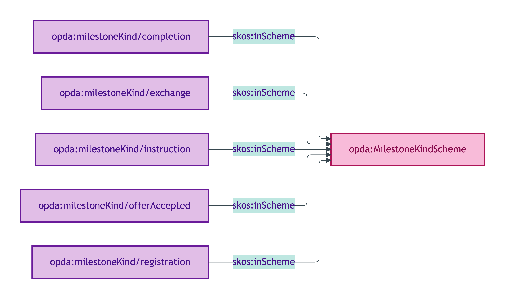
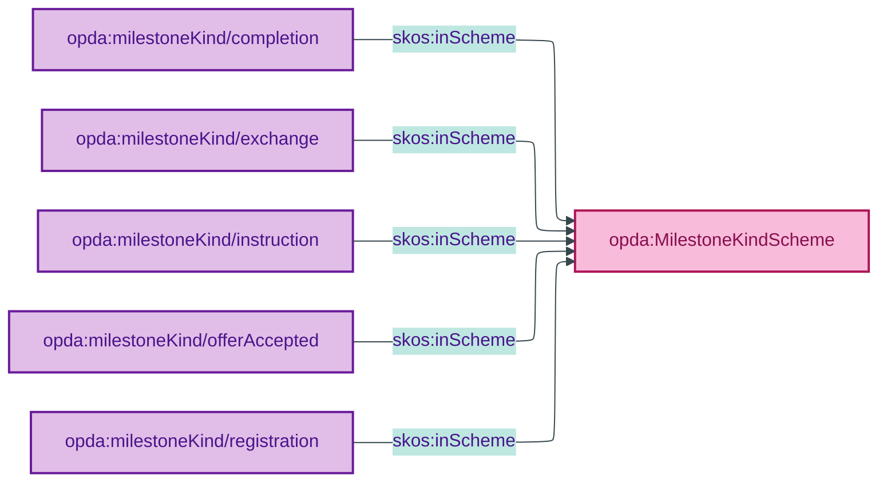

# opda:MilestoneKindScheme

## Summary

Method/plan codes for the procedural milestones authorising stages of a Transaction Activity (instruction → offerAccepted → exchange → completion → registration). See also: [Concept tier](../../concept/transaction/milestone.md) | [Logical tier](../../logical/transaction/milestone.md).

## Scheme header

```turtle
opda:MilestoneKindScheme
    rdf:type skos:ConceptScheme ;
    skos:prefLabel "Milestone Kind"@en ;
    skos:definition "Method/plan codes for the procedural milestones authorising stages of a Transaction Activity (instruction → offerAccepted → exchange → completion → registration)."@en ;
    dct:source <https://opda.org.uk/pdtf/harness/odr/ODR-0007/section-Q2> ;
    dct:title "Transaction milestone kind code"@en ;
    skos:scopeNote "UFO: Method/plan code (Guizzardi 2005 Ch. 4 + Guizzardi & Wagner 2010 action-modelling). Codes are ratified by ODR-0007 §Q2 transaction-lifecycle pattern; each milestone corresponds to a stage transition in the PDTF process."@en ;
    opda:hasSteward "Guizzardi (S007 Q2)"@en ;
    opda:ufoCategory "Method/plan code" .
```

## Members

| URI | prefLabel | notation | definition |
|---|---|---|---|
| `opda:milestoneKind/completion` | "completion" | completion | Legal title transfers; keys handed over |
| `opda:milestoneKind/exchange` | "exchange" | exchange | Contracts exchanged; binding on both parties |
| `opda:milestoneKind/instruction` | "instruction" | instruction | Property instructed to market; lifecycle begins |
| `opda:milestoneKind/offerAccepted` | "offerAccepted" | offerAccepted | Offer accepted; transaction enters Under Offer |
| `opda:milestoneKind/registration` | "registration" | registration | Registration completed at HM Land Registry |

### Member Turtle

```turtle
<https://opda.org.uk/pdtf/scheme/milestoneKind/completion>
    rdf:type skos:Concept ;
    skos:prefLabel "completion"@en ;
    skos:definition "Completion; legal title transfers; keys handed over."@en ;
    dct:source <https://opda.org.uk/pdtf/harness/odr/ODR-0007/section-Q2> ;
    skos:inScheme opda:MilestoneKindScheme ;
    skos:notation "completion" .

<https://opda.org.uk/pdtf/scheme/milestoneKind/exchange>
    rdf:type skos:Concept ;
    skos:prefLabel "exchange"@en ;
    skos:definition "Contracts exchanged; transaction binding on both parties."@en ;
    dct:source <https://opda.org.uk/pdtf/harness/odr/ODR-0007/section-Q2> ;
    skos:inScheme opda:MilestoneKindScheme ;
    skos:notation "exchange" .

<https://opda.org.uk/pdtf/scheme/milestoneKind/instruction>
    rdf:type skos:Concept ;
    skos:prefLabel "instruction"@en ;
    skos:definition "Property instructed to market by Seller; transaction lifecycle begins."@en ;
    dct:source <https://opda.org.uk/pdtf/harness/odr/ODR-0007/section-Q2> ;
    skos:inScheme opda:MilestoneKindScheme ;
    skos:notation "instruction" .

<https://opda.org.uk/pdtf/scheme/milestoneKind/offerAccepted>
    rdf:type skos:Concept ;
    skos:prefLabel "offerAccepted"@en ;
    skos:definition "Offer accepted by Seller; transaction enters Under Offer phase."@en ;
    dct:source <https://opda.org.uk/pdtf/harness/odr/ODR-0007/section-Q2> ;
    skos:inScheme opda:MilestoneKindScheme ;
    skos:notation "offerAccepted" .

<https://opda.org.uk/pdtf/scheme/milestoneKind/registration>
    rdf:type skos:Concept ;
    skos:prefLabel "registration"@en ;
    skos:definition "Registration completed at HM Land Registry."@en ;
    dct:source <https://opda.org.uk/pdtf/harness/odr/ODR-0007/section-Q2> ;
    skos:inScheme opda:MilestoneKindScheme ;
    skos:notation "registration" .
```

## Scheme membership graph



<details>
<summary>Mermaid Source</summary>



</details>

## Referenced by

- Exemplar [`simple-transaction-with-milestones`](../exemplars/simple-transaction-with-milestones.md) instantiates all 5 milestones

## Source ODR + ADR

- [ODR-0007 §Q2 — Transactions and lifecycle](/modelling/odr/odr-0007)
- [ADR-0010](/modelling/adr/adr-0010)
