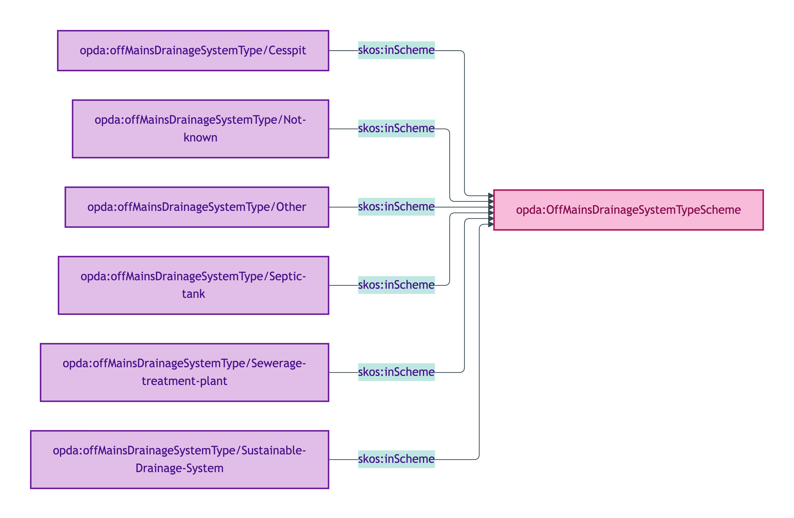
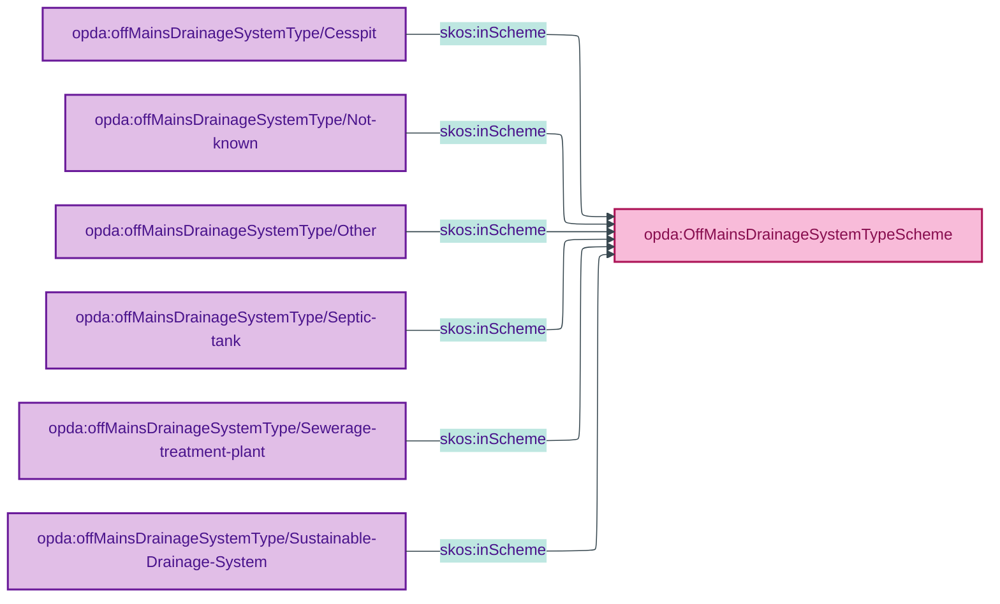

# opda:OffMainsDrainageSystemTypeScheme

## Summary

Classification of a Property's off-mains drainage system (SuDS / Septic tank / Cesspit / Sewerage treatment plant / Other / Not known).

## Scheme header

```turtle
opda:OffMainsDrainageSystemTypeScheme
    rdf:type skos:ConceptScheme ;
    skos:prefLabel "Off-Mains Drainage System Type"@en ;
    skos:definition "Classification of a Property's off-mains drainage system (SuDS / Septic tank / Cesspit / Sewerage treatment plant / Other / Not known)."@en ;
    dct:source <https://w3id.org/opda/odr/ODR-0011#section-8a-ufo-meta-category> ;
    dct:title "Off-mains drainage system type"@en ;
    skos:scopeNote "UFO: Quale-in-Region (Guizzardi 2005 Ch. 4). DOLCE: Quality-Region (Masolo D18 §4.3). Applies only when the Property is not connected to the mains sewerage system."@en ;
    opda:hasSteward "Allemang (property-qualities sub-module steward per S008 Q2)"@en ;
    opda:ufoCategory "Quale-in-Region" .
```

## Members

| URI | prefLabel | notation |
|---|---|---|
| `opda:offMainsDrainageSystemType/Cesspit` | "Cesspit" | Cesspit |
| `opda:offMainsDrainageSystemType/Not-known` | "Not known" | Not known |
| `opda:offMainsDrainageSystemType/Other` | "Other" | Other |
| `opda:offMainsDrainageSystemType/Septic-tank` | "Septic tank" | Septic tank |
| `opda:offMainsDrainageSystemType/Sewerage-treatment-plant` | "Sewerage treatment plant" | Sewerage treatment plant |
| `opda:offMainsDrainageSystemType/Sustainable-Drainage-System` | "Sustainable Drainage System" | Sustainable Drainage System |

### Member Turtle (sample)

```turtle
<https://w3id.org/opda/#offMainsDrainageSystemType/Sustainable-Drainage-System>
    rdf:type skos:Concept ;
    skos:prefLabel "Sustainable Drainage System"@en ;
    skos:definition "Drainage routed to a SuDS (Sustainable Drainage System) designed to manage surface water close to source."@en ;
    dct:source <https://w3id.org/opda/data-dictionary#propertyPack.waterAndDrainage.drainage.offMainsDrainageSystemType.Sustainable%20Drainage%20System> ;
    skos:inScheme opda:OffMainsDrainageSystemTypeScheme ;
    skos:notation "Sustainable Drainage System" .

# Cesspit, Septic tank, Sewerage treatment plant, Other, Not known follow the same pattern.
# See source: opda-vocabularies.ttl lines 689-735.
```

Full per-member Turtle: [`opda-vocabularies.ttl` lines 689–735](../../../../source/03-standards/ontology/opda-vocabularies.ttl).

## Scheme membership graph



<details>
<summary>Mermaid Source</summary>



</details>

## Referenced by

- `opda:Baspi5_PropertyShape` (overlay via `_:ba4d62e82b074` — subset including SuDS, Septic tank, Cesspit, Sewerage treatment plant, Other, Not known)

## Source ODR + ADR

- [ODR-0011 §8a](../../../ontology/odr/ODR-0011-enumeration-vocabularies.md)
- [ADR-0010](../../../adr/ADR-0010-skos-vocabulary-emission.md)
