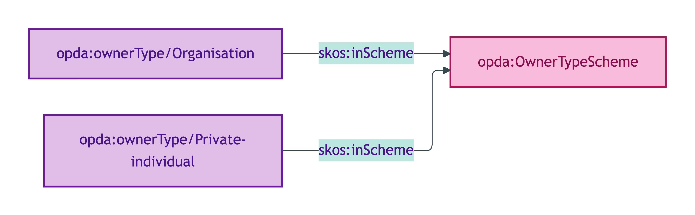
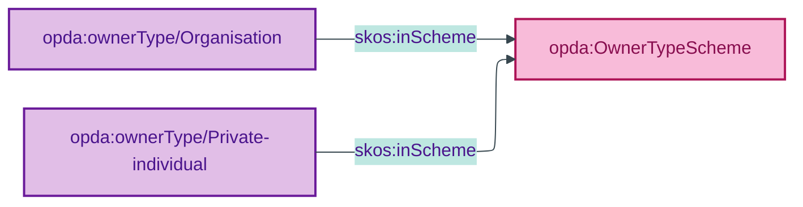

# opda:OwnerTypeScheme

## Summary

Substance Kind labels discriminating Private individual (`opda:Person`) from Organisation (`opda:Organisation`) as legal owner. Distinct from `opda:RoleScheme` (transactional role) and `opda:TenureKindScheme` (sub-Kind of LegalEstate). See also: [Concept tier](../../concept/agent/proprietor.md).

## Scheme header

```turtle
opda:OwnerTypeScheme
    rdf:type skos:ConceptScheme ;
    skos:prefLabel "Owner Type"@en ;
    skos:definition "Substance Kind labels discriminating Private individual (opda:Person) from Organisation (opda:Organisation) as legal owner. Distinct from RoleScheme (transactional role) and TenureKindScheme (sub-Kind of LegalEstate)."@en ;
    dct:source <https://opda.org.uk/pdtf/harness/odr/ODR-0011/section-8a-ufo-meta-category> ;
    dct:title "Legal owner Substance Kind discriminator"@en ;
    skos:scopeNote "UFO: Substance Kind label (Guizzardi 2005 Ch. 4). Each member binds to the corresponding UFO Substance Kind via skos:exactMatch (Private individual → opda:Person; Organisation → opda:Organisation). NEVER owl:sameAs per ODR-0005 Anti-pattern §5."@en ;
    opda:hasSteward "Guizzardi (S006 Q1)"@en ;
    opda:ufoCategory "Substance Kind label" .
```

## Members

| URI | prefLabel | notation | binds to |
|---|---|---|---|
| `opda:ownerType/Organisation` | "Organisation" | Organisation | `opda:Organisation` (via `skos:exactMatch`) |
| `opda:ownerType/Private-individual` | "Private individual" | Private individual | `opda:Person` (via `skos:exactMatch`) |

### Member Turtle

```turtle
<https://opda.org.uk/pdtf/scheme/ownerType/Organisation>
    rdf:type skos:Concept ;
    skos:prefLabel "Organisation"@en ;
    skos:definition "Legal owner is an organisation (opda:Organisation Substance Kind, e.g. company, trust, charity)."@en ;
    dct:source <https://opda.org.uk/pdtf/harness/data-dictionary/propertyPack.legalOwners[].ownerType.Organisation> ;
    skos:inScheme opda:OwnerTypeScheme ;
    skos:notation "Organisation" .

<https://opda.org.uk/pdtf/scheme/ownerType/Private-individual>
    rdf:type skos:Concept ;
    skos:prefLabel "Private individual"@en ;
    skos:definition "Legal owner is a natural person (opda:Person Substance Kind)."@en ;
    dct:source <https://opda.org.uk/pdtf/harness/data-dictionary/propertyPack.legalOwners[].ownerType.Private%20individual> ;
    skos:inScheme opda:OwnerTypeScheme ;
    skos:notation "Private individual" .
```

## Scheme membership graph



<details>
<summary>Mermaid Source</summary>



</details>

## Referenced by

- Per-overlay bindings on the Proprietor side (`opda:ownerType` predicate on `opda:Proprietor`)

## Source ODR + ADR

- [ODR-0011 §8a](/modelling/odr/odr-0011)
- [ODR-0005 Anti-pattern §5](/modelling/odr/odr-0005)
- [ADR-0010](/modelling/adr/adr-0010)
