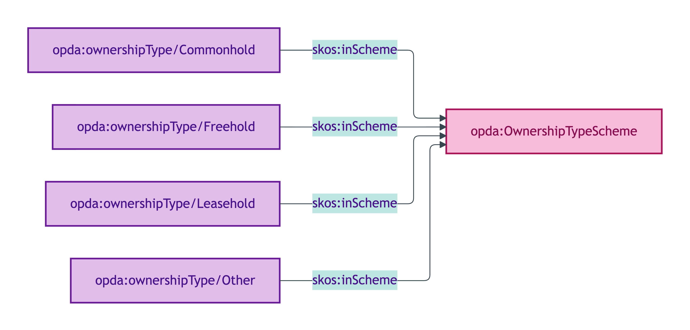
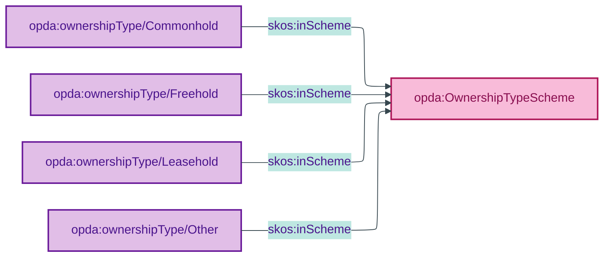

# opda:OwnershipTypeScheme

## Summary

Classification of a legal estate's ownership structure (Freehold, Leasehold, Commonhold, Other). See also: [Concept tier](../../concept/property/legal-estate.md).

## Scheme header

```turtle
opda:OwnershipTypeScheme
    rdf:type skos:ConceptScheme ;
    skos:prefLabel "Ownership Type"@en ;
    skos:definition "Classification of a legal estate's ownership structure (Freehold, Leasehold, Commonhold, Other)."@en ;
    dct:source <https://w3id.org/opda/odr/ODR-0011#section-8a-ufo-meta-category> ;
    dct:title "Legal-estate ownership type"@en ;
    skos:scopeNote "UFO: Quale-in-Region (Guizzardi 2005 Ch. 4). DOLCE: Quality-Region (Masolo D18 §4.3). NTS2 four-value canonical set used as authority (per data dictionary)."@en ;
    opda:hasSteward "Kendall (LegalEstate steward per S008 Q2)"@en ;
    opda:ufoCategory "Quale-in-Region" .
```

## Members

| URI | prefLabel | notation |
|---|---|---|
| `opda:ownershipType/Commonhold` | "Commonhold" | Commonhold |
| `opda:ownershipType/Freehold` | "Freehold" | Freehold |
| `opda:ownershipType/Leasehold` | "Leasehold" | Leasehold |
| `opda:ownershipType/Other` | "Other" | Other |

### Member Turtle

```turtle
<https://w3id.org/opda/#ownershipType/Commonhold>
    rdf:type skos:Concept ;
    skos:prefLabel "Commonhold"@en ;
    skos:definition "Freehold ownership of a unit within a commonhold development, with shared ownership of common parts."@en ;
    dct:source <https://w3id.org/opda/data-dictionary#propertyPack.ownership.ownershipsToBeTransferred[].ownershipType.Commonhold> ;
    skos:inScheme opda:OwnershipTypeScheme ;
    skos:notation "Commonhold" .

<https://w3id.org/opda/#ownershipType/Freehold>
    rdf:type skos:Concept ;
    skos:prefLabel "Freehold"@en ;
    skos:definition "Outright ownership of the property and the land it sits on."@en ;
    dct:source <https://w3id.org/opda/data-dictionary#propertyPack.ownership.ownershipsToBeTransferred[].ownershipType.Freehold> ;
    skos:inScheme opda:OwnershipTypeScheme ;
    skos:notation "Freehold" .

<https://w3id.org/opda/#ownershipType/Leasehold>
    rdf:type skos:Concept ;
    skos:prefLabel "Leasehold"@en ;
    skos:definition "Ownership of the property for a fixed period under a lease from the freeholder."@en ;
    dct:source <https://w3id.org/opda/data-dictionary#propertyPack.ownership.ownershipsToBeTransferred[].ownershipType.Leasehold> ;
    skos:inScheme opda:OwnershipTypeScheme ;
    skos:notation "Leasehold" .

<https://w3id.org/opda/#ownershipType/Other>
    rdf:type skos:Concept ;
    skos:prefLabel "Other"@en ;
    skos:definition "Ownership type falling outside the standard categories."@en ;
    dct:source <https://w3id.org/opda/data-dictionary#propertyPack.ownership.ownershipsToBeTransferred[].ownershipType.Other> ;
    skos:inScheme opda:OwnershipTypeScheme ;
    skos:notation "Other" .
```

## Scheme membership graph



<details>
<summary>Mermaid Source</summary>



</details>

## Referenced by

- `opda:Baspi5_LegalEstateShape` (overlay via `_:b76a31b3e9782` — full scheme; required cardinality)

## Source ODR + ADR

- [ODR-0011 §8a](../../../ontology/odr/ODR-0011-enumeration-vocabularies.md)
- [ADR-0010](../../../adr/ADR-0010-skos-vocabulary-emission.md)
