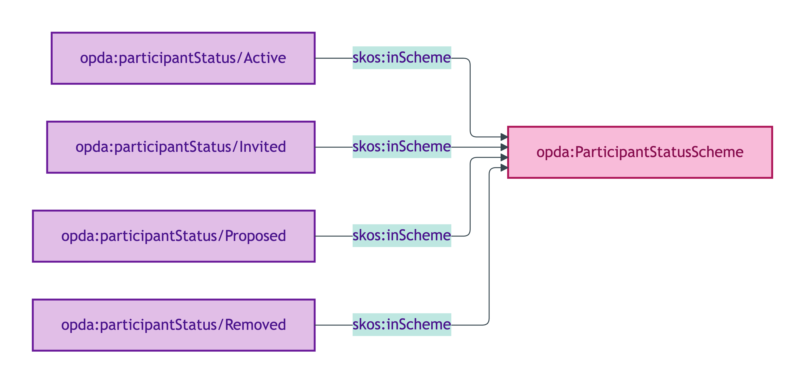
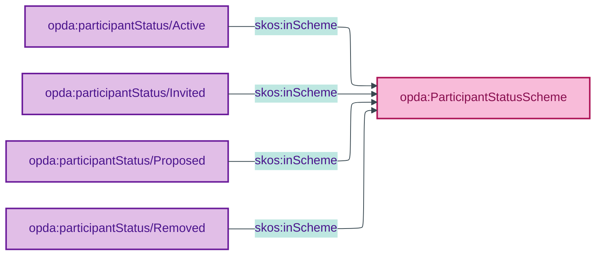

# opda:ParticipantStatusScheme

## Summary

Phase labels for the lifecycle of a Participant Substance Kind.

## Scheme header

```turtle
opda:ParticipantStatusScheme
    rdf:type skos:ConceptScheme ;
    skos:prefLabel "Participant Status"@en ;
    skos:definition "Phase labels for the lifecycle of a Participant Substance Kind."@en ;
    dct:source <https://opda.org.uk/pdtf/harness/odr/ODR-0011/section-8a-ufo-meta-category> ;
    dct:title "Transaction participant phase label"@en ;
    skos:scopeNote "UFO: Phase label (Guizzardi 2005 Ch. 4 — intra-Kind phase). DOLCE: Stage of an Endurant (Masolo D18 §4)."@en ;
    opda:hasSteward "Guizzardi (S006 Q7)"@en ;
    opda:ufoCategory "Phase label" .
```

## Members

| URI | prefLabel | notation |
|---|---|---|
| `opda:participantStatus/Active` | "Active" | Active |
| `opda:participantStatus/Invited` | "Invited" | Invited |
| `opda:participantStatus/Proposed` | "Proposed" | Proposed |
| `opda:participantStatus/Removed` | "Removed" | Removed |

### Member Turtle

```turtle
<https://opda.org.uk/pdtf/scheme/participantStatus/Active>
    rdf:type skos:Concept ;
    skos:prefLabel "Active"@en ;
    skos:definition "Participant is actively engaged in the transaction."@en ;
    dct:source <https://opda.org.uk/pdtf/harness/data-dictionary/participants[].participantStatus.Active> ;
    skos:inScheme opda:ParticipantStatusScheme ;
    skos:notation "Active" .

<https://opda.org.uk/pdtf/scheme/participantStatus/Invited>
    rdf:type skos:Concept ;
    skos:prefLabel "Invited"@en ;
    skos:definition "Participant has been invited to join the transaction."@en ;
    dct:source <https://opda.org.uk/pdtf/harness/data-dictionary/participants[].participantStatus.Invited> ;
    skos:inScheme opda:ParticipantStatusScheme ;
    skos:notation "Invited" .

<https://opda.org.uk/pdtf/scheme/participantStatus/Proposed>
    rdf:type skos:Concept ;
    skos:prefLabel "Proposed"@en ;
    skos:definition "Participant has been proposed but not yet invited."@en ;
    dct:source <https://opda.org.uk/pdtf/harness/data-dictionary/participants[].participantStatus.Proposed> ;
    skos:inScheme opda:ParticipantStatusScheme ;
    skos:notation "Proposed" .

<https://opda.org.uk/pdtf/scheme/participantStatus/Removed>
    rdf:type skos:Concept ;
    skos:prefLabel "Removed"@en ;
    skos:definition "Participant has been removed from the transaction."@en ;
    dct:source <https://opda.org.uk/pdtf/harness/data-dictionary/participants[].participantStatus.Removed> ;
    skos:inScheme opda:ParticipantStatusScheme ;
    skos:notation "Removed" .
```

## Scheme membership graph



<details>
<summary>Mermaid Source</summary>



</details>

## Referenced by

- Per-overlay bindings on the Participant Substance Kind (BASPI5 surfaces a subset for active workflow)

## Source ODR + ADR

- [ODR-0006 §Q7 — Agents and roles](/modelling/odr/odr-0006)
- [ODR-0011 §8a](/modelling/odr/odr-0011)
- [ADR-0010](/modelling/adr/adr-0010)
