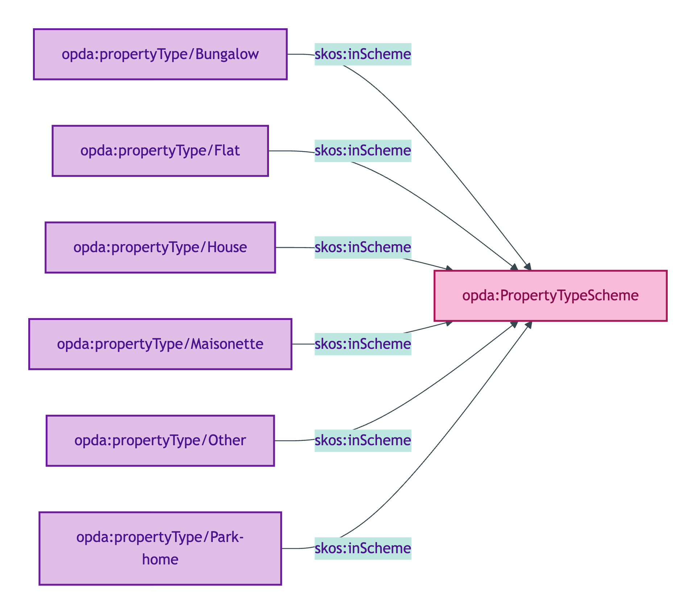
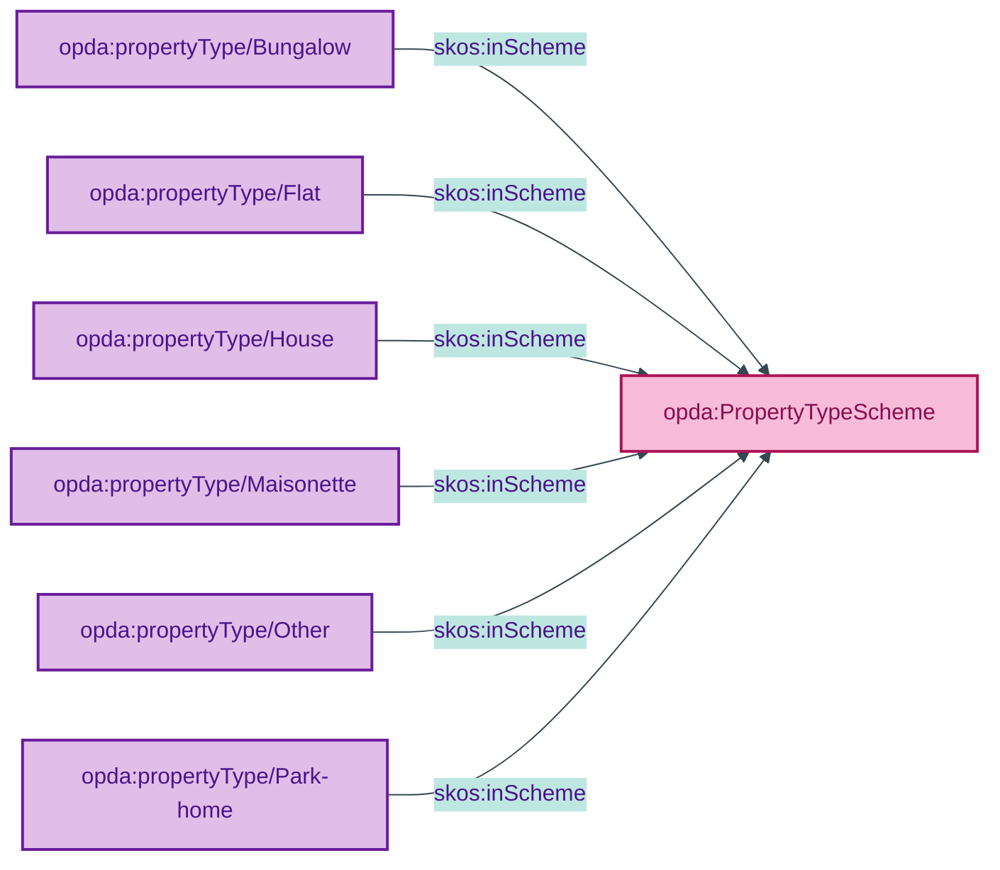

# opda:PropertyTypeScheme

## Summary

Substance Kind labels for the physical-form kind of a Property (House / Bungalow / Park home / Flat / Maisonette / Other). Distinct from `opda:BuiltFormScheme` which carries the structural Quale (Detached / Semi-detached / Terrace). See also: [Concept tier](../../concept/property/property.md).

## Scheme header

```turtle
opda:PropertyTypeScheme
    rdf:type skos:ConceptScheme ;
    skos:prefLabel "Property Type"@en ;
    skos:definition "Substance Kind labels for the physical-form kind of a Property (House / Bungalow / Park home / Flat / Maisonette / Other). Distinct from BuiltFormScheme which carries the structural Quale (Detached / Semi-detached / Terrace)."@en ;
    dct:source <https://w3id.org/opda/odr/ODR-0011#section-8a-ufo-meta-category> ;
    dct:title "Property type Substance Kind label"@en ;
    skos:scopeNote "UFO: Substance Kind label (Guizzardi 2005 Ch. 4). Members may bind to OWL sub-classes of opda:Property via skos:exactMatch when conditional Building/Room class promotions trigger (per ODR-0008 §Q4a held-as-live). Distinct from BuiltFormScheme (Quale-in-Region)."@en ;
    opda:hasSteward "Allemang (property-qualities sub-module steward per S008 Q2)"@en ;
    opda:ufoCategory "Substance Kind label" .
```

## Members

| URI | prefLabel | notation |
|---|---|---|
| `opda:propertyType/Bungalow` | "Bungalow" | Bungalow |
| `opda:propertyType/Flat` | "Flat" | Flat |
| `opda:propertyType/House` | "House" | House |
| `opda:propertyType/Maisonette` | "Maisonette" | Maisonette |
| `opda:propertyType/Other` | "Other" | Other |
| `opda:propertyType/Park-home` | "Park home" | Park home |

### Member Turtle

```turtle
<https://w3id.org/opda/#propertyType/Bungalow>
    rdf:type skos:Concept ;
    skos:prefLabel "Bungalow"@en ;
    skos:definition "A single-storey detached dwelling."@en ;
    dct:source <https://w3id.org/opda/data-dictionary#propertyPack.buildInformation.building.propertyType.Bungalow> ;
    skos:inScheme opda:PropertyTypeScheme ;
    skos:notation "Bungalow" .

<https://w3id.org/opda/#propertyType/Flat>
    rdf:type skos:Concept ;
    skos:prefLabel "Flat"@en ;
    skos:definition "A self-contained dwelling forming part of a larger building."@en ;
    dct:source <https://w3id.org/opda/data-dictionary#propertyPack.buildInformation.building.propertyType.Flat> ;
    skos:inScheme opda:PropertyTypeScheme ;
    skos:notation "Flat" .

<https://w3id.org/opda/#propertyType/House>
    rdf:type skos:Concept ;
    skos:prefLabel "House"@en ;
    skos:definition "A self-contained dwelling occupying a complete structure."@en ;
    dct:source <https://w3id.org/opda/data-dictionary#propertyPack.buildInformation.building.propertyType.House> ;
    skos:inScheme opda:PropertyTypeScheme ;
    skos:notation "House" .

<https://w3id.org/opda/#propertyType/Maisonette>
    rdf:type skos:Concept ;
    skos:prefLabel "Maisonette"@en ;
    skos:definition "A self-contained dwelling within a larger building, typically with its own external entrance."@en ;
    dct:source <https://w3id.org/opda/data-dictionary#propertyPack.buildInformation.building.propertyType.Maisonette> ;
    skos:inScheme opda:PropertyTypeScheme ;
    skos:notation "Maisonette" .

<https://w3id.org/opda/#propertyType/Other>
    rdf:type skos:Concept ;
    skos:prefLabel "Other"@en ;
    skos:definition "Property type falling outside the standard categories."@en ;
    dct:source <https://w3id.org/opda/data-dictionary#propertyPack.buildInformation.building.propertyType.Other> ;
    skos:inScheme opda:PropertyTypeScheme ;
    skos:notation "Other" .

<https://w3id.org/opda/#propertyType/Park-home>
    rdf:type skos:Concept ;
    skos:prefLabel "Park home"@en ;
    skos:definition "A detached single-storey dwelling sited within a residential park."@en ;
    dct:source <https://w3id.org/opda/data-dictionary#propertyPack.buildInformation.building.propertyType.Park%20home> ;
    skos:inScheme opda:PropertyTypeScheme ;
    skos:notation "Park home" .
```

## Scheme membership graph



<details>
<summary>Mermaid Source</summary>



</details>

## Referenced by

- `opda:Baspi5_PropertyShape` (overlay via `_:bd793d8bc592e` — full scheme; required cardinality)

## Source ODR + ADR

- [ODR-0011 §8a](../../../ontology/odr/ODR-0011-enumeration-vocabularies.md)
- [ADR-0010](../../../adr/ADR-0010-skos-vocabulary-emission.md)
