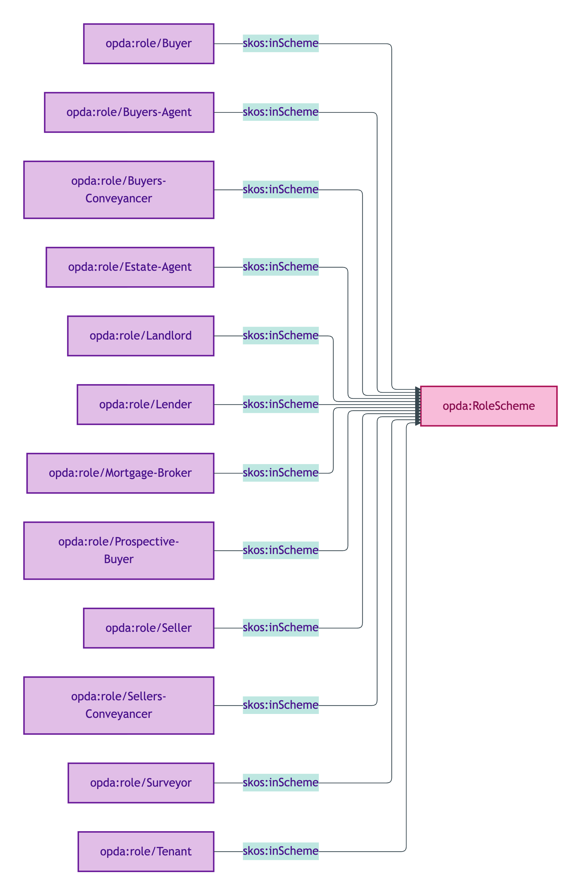
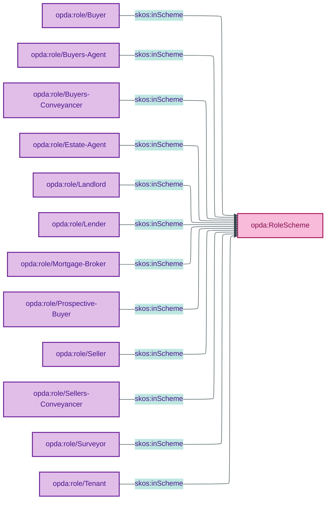

# opda:RoleScheme

## Summary

Role labels for the anti-rigid Roles a Person/Organisation plays as a Participant in a Transaction Relator. See also: [Concept tier](../../concept/agent/seller.md) | [Concept tier — buyer](../../concept/agent/buyer.md).

## Scheme header

```turtle
opda:RoleScheme
    rdf:type skos:ConceptScheme ;
    skos:prefLabel "Participant Role"@en ;
    skos:definition "Role labels for the anti-rigid Roles a Person/Organisation plays as a Participant in a Transaction Relator."@en ;
    dct:source <https://w3id.org/opda/odr/ODR-0011#section-8a-ufo-meta-category> ;
    dct:title "Transaction participant role label"@en ;
    skos:scopeNote "UFO: Role label (Guizzardi 2005 Ch. 4 — anti-rigid Roles in a Relator). DOLCE: Endurant-played-role (Masolo D18 §4)."@en ;
    opda:hasSteward "Guizzardi (RoleMixin steward per S006 Q2)"@en ;
    opda:ufoCategory "Role label" .
```

## Members (12)

| URI | prefLabel | notation |
|---|---|---|
| `opda:role/Buyer` | "Buyer" | Buyer |
| `opda:role/Buyers-Agent` | "Buyer's Agent" | Buyer's Agent |
| `opda:role/Buyers-Conveyancer` | "Buyer's Conveyancer" | Buyer's Conveyancer |
| `opda:role/Estate-Agent` | "Estate Agent" | Estate Agent |
| `opda:role/Landlord` | "Landlord" | Landlord |
| `opda:role/Lender` | "Lender" | Lender |
| `opda:role/Mortgage-Broker` | "Mortgage Broker" | Mortgage Broker |
| `opda:role/Prospective-Buyer` | "Prospective Buyer" | Prospective Buyer |
| `opda:role/Seller` | "Seller" | Seller |
| `opda:role/Sellers-Conveyancer` | "Seller's Conveyancer" | Seller's Conveyancer |
| `opda:role/Surveyor` | "Surveyor" | Surveyor |
| `opda:role/Tenant` | "Tenant" | Tenant |

### Member Turtle (sample)

```turtle
<https://w3id.org/opda/#role/Buyer>
    rdf:type skos:Concept ;
    skos:prefLabel "Buyer"@en ;
    skos:definition "Party acquiring legal title."@en ;
    dct:source <https://w3id.org/opda/data-dictionary#participants[].role.Buyer> ;
    skos:inScheme opda:RoleScheme ;
    skos:notation "Buyer" .

<https://w3id.org/opda/#role/Seller>
    rdf:type skos:Concept ;
    skos:prefLabel "Seller"@en ;
    skos:definition "Party transferring legal title."@en ;
    dct:source <https://w3id.org/opda/data-dictionary#participants[].role.Seller> ;
    skos:inScheme opda:RoleScheme ;
    skos:notation "Seller" .

# Remaining 10 roles (Buyer's Agent, Buyer's Conveyancer, Estate Agent, Landlord, Lender,
# Mortgage Broker, Prospective Buyer, Seller's Conveyancer, Surveyor, Tenant) follow the same pattern.
# See source: opda-vocabularies.ttl lines 865-959.
```

Full per-member Turtle: [`opda-vocabularies.ttl` lines 865–959](../../../../source/03-standards/ontology/opda-vocabularies.ttl).

## Scheme membership graph



<details>
<summary>Mermaid Source</summary>



</details>

## Referenced by

- `opda:Baspi5_BuyerShape` (overlay via `_:b78bd3625e376` + `_:b0654af6bc0f5` — subset: Buyer, Buyer's Conveyancer, Prospective Buyer, Buyer's Agent, Surveyor, Mortgage Broker, Lender, Landlord, Tenant, Estate Agent, Seller's Conveyancer)
- `opda:Baspi5_SellerShape` (overlay via `_:bd693afd83922` + `_:b145accbf4a97` — subset: Seller only)

## Source ODR + ADR

- [ODR-0006 §Q2 — Agents and roles (Role/RoleMixin distinction)](../../../ontology/odr/ODR-0006-agents-and-roles.md)
- [ODR-0011 §8a](../../../ontology/odr/ODR-0011-enumeration-vocabularies.md)
- [ADR-0010](../../../adr/ADR-0010-skos-vocabulary-emission.md)
