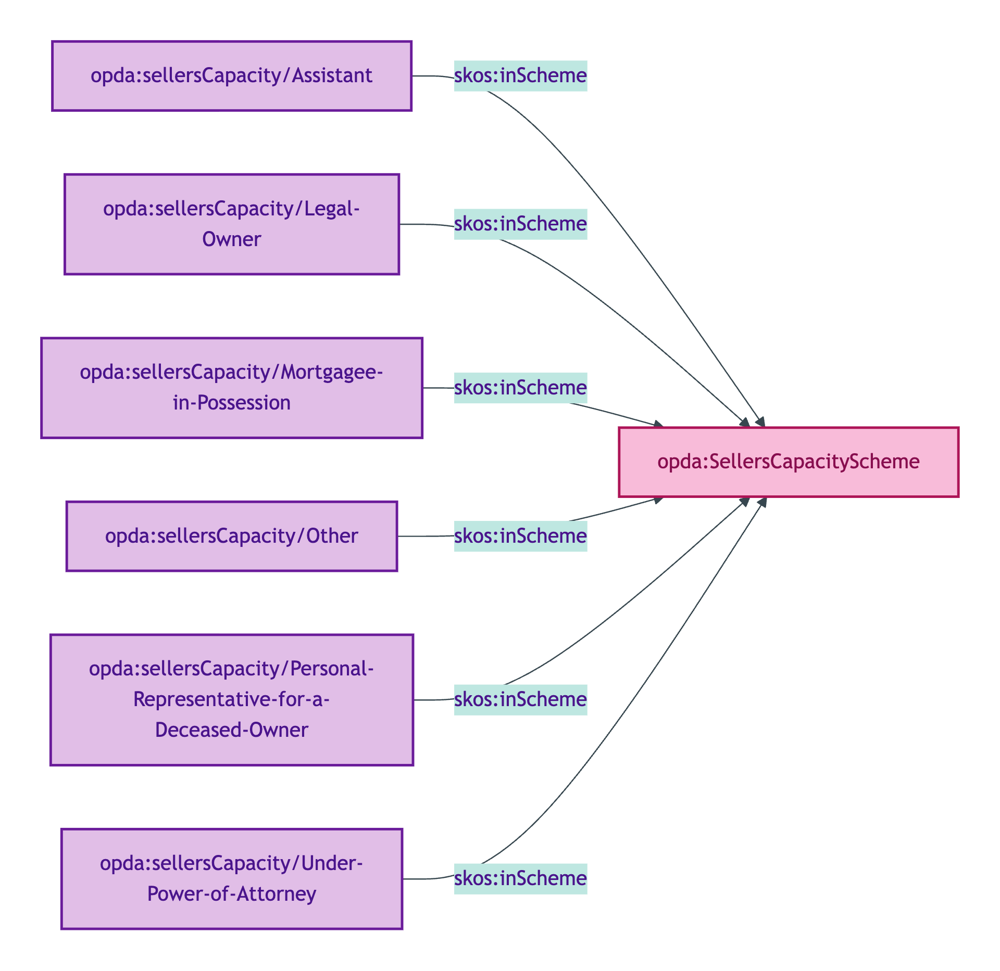
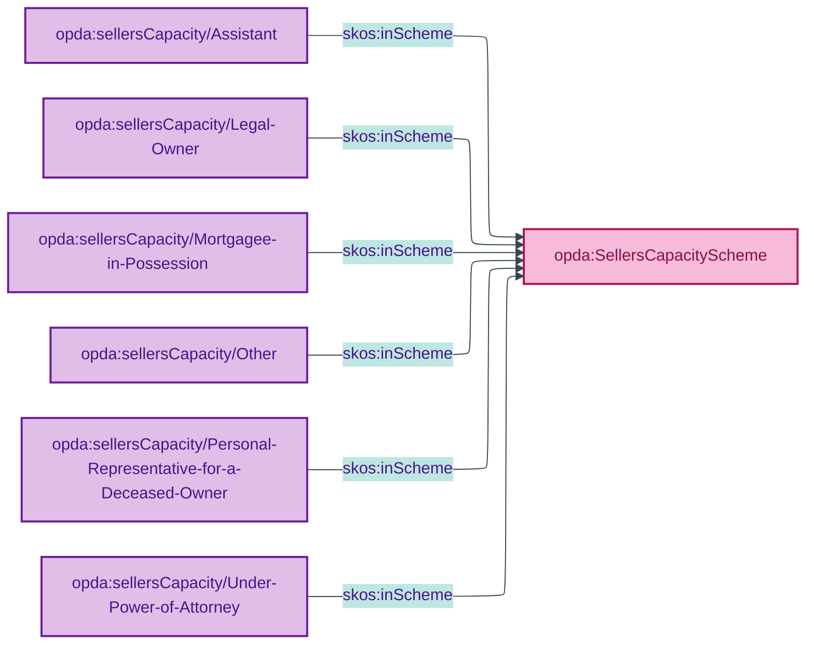

# opda:SellersCapacityScheme

## Summary

Method/plan codes for the capacity under which a Seller is authorised to act in a sale. See also: [Concept tier — seller](../../concept/agent/seller.md).

## Scheme header

```turtle
opda:SellersCapacityScheme
    rdf:type skos:ConceptScheme ;
    skos:prefLabel "Seller's Capacity"@en ;
    skos:definition "Method/plan codes for the capacity under which a Seller is authorised to act in a sale."@en ;
    dct:source <https://opda.org.uk/pdtf/harness/odr/ODR-0011/section-8a-ufo-meta-category> ;
    dct:title "Seller capacity Method/plan code"@en ;
    skos:scopeNote "UFO: Method/plan code (Guizzardi 2005 Ch. 4 + Guizzardi & Wagner 2010). Codes authorise the Seller's Activity (the act of selling) under a defined legal arrangement."@en ;
    opda:hasSteward "Guizzardi (S006 Q4)"@en ;
    opda:ufoCategory "Method/plan code" .
```

## Members

| URI | prefLabel | notation |
|---|---|---|
| `opda:sellersCapacity/Assistant` | "Assistant" | Assistant |
| `opda:sellersCapacity/Legal-Owner` | "Legal Owner" | Legal Owner |
| `opda:sellersCapacity/Mortgagee-in-Possession` | "Mortgagee in Possession" | Mortgagee in Possession |
| `opda:sellersCapacity/Other` | "Other" | Other |
| `opda:sellersCapacity/Personal-Representative-for-a-Deceased-Owner` | "Personal Representative for a Deceased Owner" | Personal Representative for a Deceased Owner |
| `opda:sellersCapacity/Under-Power-of-Attorney` | "Under Power of Attorney" | Under Power of Attorney |

### Member Turtle

```turtle
<https://opda.org.uk/pdtf/scheme/sellersCapacity/Assistant>
    rdf:type skos:Concept ;
    skos:prefLabel "Assistant"@en ;
    skos:definition "Seller acts in an assisting capacity (e.g. legal assistant)."@en ;
    dct:source <https://opda.org.uk/pdtf/harness/data-dictionary/participants[].sellersCapacity.capacity.Assistant> ;
    skos:inScheme opda:SellersCapacityScheme ;
    skos:notation "Assistant" .

<https://opda.org.uk/pdtf/scheme/sellersCapacity/Legal-Owner>
    rdf:type skos:Concept ;
    skos:prefLabel "Legal Owner"@en ;
    skos:definition "Seller is the legal owner of the property."@en ;
    dct:source <https://opda.org.uk/pdtf/harness/data-dictionary/participants[].sellersCapacity.capacity.Legal%20Owner> ;
    skos:inScheme opda:SellersCapacityScheme ;
    skos:notation "Legal Owner" .

<https://opda.org.uk/pdtf/scheme/sellersCapacity/Mortgagee-in-Possession>
    rdf:type skos:Concept ;
    skos:prefLabel "Mortgagee in Possession"@en ;
    skos:definition "Seller is a mortgagee that has taken possession of the property."@en ;
    dct:source <https://opda.org.uk/pdtf/harness/data-dictionary/participants[].sellersCapacity.capacity.Mortgagee%20in%20Possession> ;
    skos:inScheme opda:SellersCapacityScheme ;
    skos:notation "Mortgagee in Possession" .

<https://opda.org.uk/pdtf/scheme/sellersCapacity/Other>
    rdf:type skos:Concept ;
    skos:prefLabel "Other"@en ;
    skos:definition "Capacity falling outside the standard categories."@en ;
    dct:source <https://opda.org.uk/pdtf/harness/data-dictionary/participants[].sellersCapacity.capacity.Other> ;
    skos:inScheme opda:SellersCapacityScheme ;
    skos:notation "Other" .

<https://opda.org.uk/pdtf/scheme/sellersCapacity/Personal-Representative-for-a-Deceased-Owner>
    rdf:type skos:Concept ;
    skos:prefLabel "Personal Representative for a Deceased Owner"@en ;
    skos:definition "Seller acts as personal representative for a deceased owner."@en ;
    dct:source <https://opda.org.uk/pdtf/harness/data-dictionary/participants[].sellersCapacity.capacity.Personal%20Representative%20for%20a%20Deceased%20Owner> ;
    skos:inScheme opda:SellersCapacityScheme ;
    skos:notation "Personal Representative for a Deceased Owner" .

<https://opda.org.uk/pdtf/scheme/sellersCapacity/Under-Power-of-Attorney>
    rdf:type skos:Concept ;
    skos:prefLabel "Under Power of Attorney"@en ;
    skos:definition "Seller acts under a power of attorney on behalf of the legal owner."@en ;
    dct:source <https://opda.org.uk/pdtf/harness/data-dictionary/participants[].sellersCapacity.capacity.Under%20Power%20of%20Attorney> ;
    skos:inScheme opda:SellersCapacityScheme ;
    skos:notation "Under Power of Attorney" .
```

## Scheme membership graph



<details>
<summary>Mermaid Source</summary>



</details>

## Referenced by

- `opda:Baspi5_SellersCapacityShape` (overlay via `sh:xone` discriminating "Legal Owner" / "Mortgagee in Possession" simple cases from "Personal Representative" / "Power of Attorney" / "Assistant" / "Other" cases that require `opda:hasEvidencedAuthority`)

## Source ODR + ADR

- [ODR-0006 §Q4 — Capacity/Authority split](../../../ontology/odr/ODR-0006-agents-and-roles.md)
- [ODR-0011 §8a](../../../ontology/odr/ODR-0011-enumeration-vocabularies.md)
- [ADR-0010](../../../adr/ADR-0010-skos-vocabulary-emission.md)
