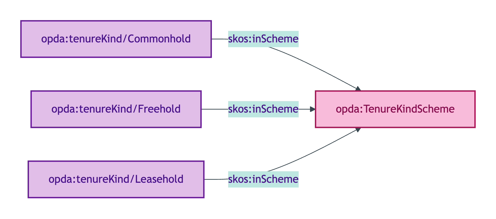
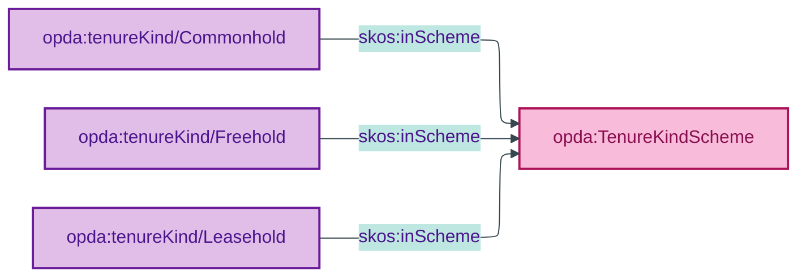

# opda:TenureKindScheme

## Summary

Substance Kind labels for tenure (Freehold, Leasehold, Commonhold). Each member binds to its corresponding OWL sub-class via `skos:exactMatch` per ODR-0011 §8a Substance Kind label cross-scheme consistency check (NEVER `owl:sameAs`). See also: [Concept tier](../../concept/property/legal-estate.md).

## Scheme header

```turtle
opda:TenureKindScheme
    rdf:type skos:ConceptScheme ;
    skos:prefLabel "Tenure Kind"@en ;
    skos:definition "Substance Kind labels for tenure (Freehold, Leasehold, Commonhold). Each member binds to its corresponding OWL sub-class via `skos:exactMatch` per ODR-0011 §8a Substance Kind label cross-scheme consistency check (NEVER `owl:sameAs`)."@en ;
    dct:source <https://opda.org.uk/pdtf/harness/odr/ODR-0011/section-8a-ufo-meta-category> ;
    dct:title "UFO Substance Kind label for tenure"@en ;
    skos:scopeNote "UFO: Substance Kind label (Guizzardi 2005 Ch. 4). Members bind to OWL sub-classes via `skos:exactMatch`; OPDA pattern per ODR-0005 Anti-pattern §5."@en ;
    opda:hasSteward "Kendall (LegalEstate steward per S008 Q2)"@en ;
    opda:ufoCategory "Substance Kind label" .
```

## Members

| URI | prefLabel | notation | binds to |
|---|---|---|---|
| `opda:tenureKind/Commonhold` | "Commonhold" | Commonhold | (future commonhold sub-class) |
| `opda:tenureKind/Freehold` | "Freehold" | Freehold | (future freehold sub-class) |
| `opda:tenureKind/Leasehold` | "Leasehold" | Leasehold | (future leasehold sub-class) |

### Member Turtle

```turtle
<https://opda.org.uk/pdtf/scheme/tenureKind/Commonhold>
    rdf:type skos:Concept ;
    skos:prefLabel "Commonhold"@en ;
    skos:definition "Substance Kind: commonhold tenure."@en ;
    dct:source <https://opda.org.uk/pdtf/harness/data-dictionary/propertyPack.marketingTenure.Commonhold> ;
    skos:inScheme opda:TenureKindScheme ;
    skos:notation "Commonhold" .

<https://opda.org.uk/pdtf/scheme/tenureKind/Freehold>
    rdf:type skos:Concept ;
    skos:prefLabel "Freehold"@en ;
    skos:definition "Substance Kind: freehold tenure."@en ;
    dct:source <https://opda.org.uk/pdtf/harness/data-dictionary/propertyPack.marketingTenure.Freehold> ;
    skos:inScheme opda:TenureKindScheme ;
    skos:notation "Freehold" .

<https://opda.org.uk/pdtf/scheme/tenureKind/Leasehold>
    rdf:type skos:Concept ;
    skos:prefLabel "Leasehold"@en ;
    skos:definition "Substance Kind: leasehold tenure."@en ;
    dct:source <https://opda.org.uk/pdtf/harness/data-dictionary/propertyPack.marketingTenure.Leasehold> ;
    skos:inScheme opda:TenureKindScheme ;
    skos:notation "Leasehold" .
```

## Scheme membership graph



<details>
<summary>Mermaid Source</summary>



</details>

## Referenced by

- [`opda:LegalEstateIdentityKeyShape`](../property/shapes.md#opdalegalestateidentitykeyshape) — `opda:tenureKind` property
- `opda:Baspi5_LegalEstateShape` (overlay via `_:bda5177528e12` — subset: Freehold, Leasehold, Commonhold)

## Source ODR + ADR

- [ODR-0011 §8a — Substance Kind label cross-scheme consistency](../../../ontology/odr/ODR-0011-enumeration-vocabularies.md)
- [ODR-0005 §3b + Anti-pattern §5](../../../ontology/odr/ODR-0005-property-and-land-identity-crux.md)
- [ADR-0010](../../../adr/ADR-0010-skos-vocabulary-emission.md)
