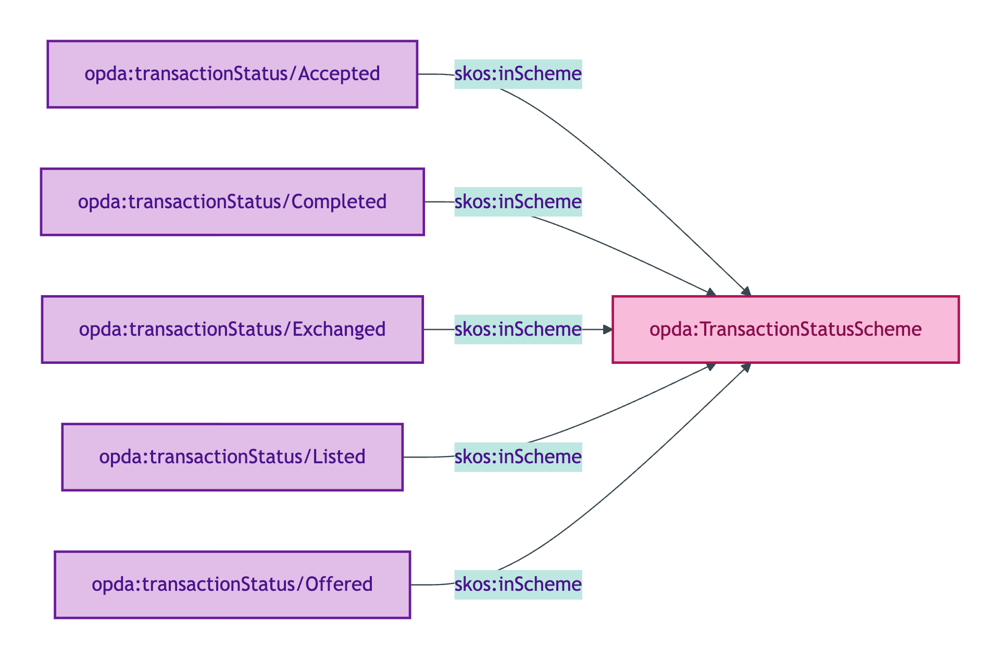
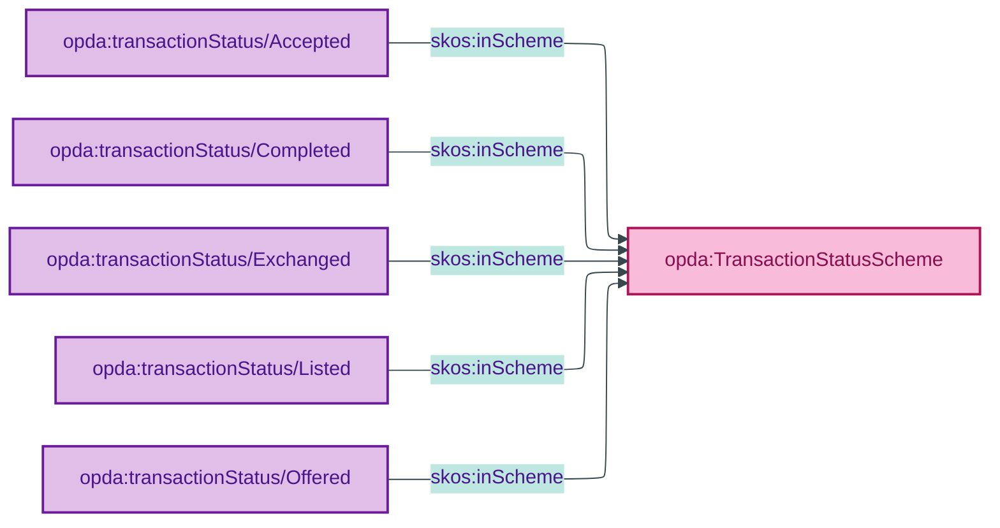

# opda:TransactionStatusScheme

## Summary

Phase labels for the lifecycle of a Transaction Substance Kind, tracking the five canonical phases ADR-0010 names (Listed → Offered → Accepted → Exchanged → Completed). See also: [Concept tier](../../concept/transaction/transaction.md).

## Scheme header

```turtle
opda:TransactionStatusScheme
    rdf:type skos:ConceptScheme ;
    skos:prefLabel "Transaction Status"@en ;
    skos:definition "Phase labels for the lifecycle of a Transaction Substance Kind, tracking the five canonical phases ADR-0010 names (Listed → Offered → Accepted → Exchanged → Completed)."@en ;
    dct:source <https://opda.org.uk/pdtf/harness/odr/ODR-0011/section-8a-ufo-meta-category> ;
    dct:title "Transaction lifecycle phase label"@en ;
    skos:scopeNote "UFO: Phase label (Guizzardi 2005 Ch. 4 — intra-Kind phase). Data dictionary leaf `status` carries a broader 9-value enum (including marketing-side and let-side phases); the ADR-named five-phase canonical set is emitted here as the UFO phase set for the sale lifecycle. Per-member dct:source cites ODR-0011 §8a (Council ratifying anchor); per-member prov:wasDerivedFrom links each canonical label to the underlying data-dictionary enum value it sources from (G10 closure per ADR-0013)."@en ;
    opda:hasSteward "Guizzardi (S007 Q3)"@en ;
    opda:ufoCategory "Phase label" .
```

## Members

| URI | prefLabel | notation | derived from |
|---|---|---|---|
| `opda:transactionStatus/Accepted` | "Accepted" | Accepted | data-dictionary `status.Sold subject to contract` |
| `opda:transactionStatus/Completed` | "Completed" | Completed | data-dictionary `status.Completed` |
| `opda:transactionStatus/Exchanged` | "Exchanged" | Exchanged | data-dictionary `status.Contracts exchanged` |
| `opda:transactionStatus/Listed` | "Listed" | Listed | data-dictionary `status.For sale` |
| `opda:transactionStatus/Offered` | "Offered" | Offered | data-dictionary `status.Under offer` |

### Member Turtle

```turtle
<https://opda.org.uk/pdtf/scheme/transactionStatus/Accepted>
    rdf:type skos:Concept ;
    skos:prefLabel "Accepted"@en ;
    skos:definition "An offer has been accepted, transaction is in progress."@en ;
    dct:source <https://opda.org.uk/pdtf/harness/odr/ODR-0011/section-8a-ufo-meta-category> ;
    skos:inScheme opda:TransactionStatusScheme ;
    skos:notation "Accepted" ;
    prov:wasDerivedFrom <https://opda.org.uk/pdtf/harness/data-dictionary/status.Sold%20subject%20to%20contract> .

<https://opda.org.uk/pdtf/scheme/transactionStatus/Completed>
    rdf:type skos:Concept ;
    skos:prefLabel "Completed"@en ;
    skos:definition "Transaction has completed; legal title has transferred."@en ;
    dct:source <https://opda.org.uk/pdtf/harness/odr/ODR-0011/section-8a-ufo-meta-category> ;
    skos:inScheme opda:TransactionStatusScheme ;
    skos:notation "Completed" ;
    prov:wasDerivedFrom <https://opda.org.uk/pdtf/harness/data-dictionary/status.Completed> .

<https://opda.org.uk/pdtf/scheme/transactionStatus/Exchanged>
    rdf:type skos:Concept ;
    skos:prefLabel "Exchanged"@en ;
    skos:definition "Contracts have been exchanged."@en ;
    dct:source <https://opda.org.uk/pdtf/harness/odr/ODR-0011/section-8a-ufo-meta-category> ;
    skos:inScheme opda:TransactionStatusScheme ;
    skos:notation "Exchanged" ;
    prov:wasDerivedFrom <https://opda.org.uk/pdtf/harness/data-dictionary/status.Contracts%20exchanged> .

<https://opda.org.uk/pdtf/scheme/transactionStatus/Listed>
    rdf:type skos:Concept ;
    skos:prefLabel "Listed"@en ;
    skos:definition "Property is listed for sale."@en ;
    dct:source <https://opda.org.uk/pdtf/harness/odr/ODR-0011/section-8a-ufo-meta-category> ;
    skos:inScheme opda:TransactionStatusScheme ;
    skos:notation "Listed" ;
    prov:wasDerivedFrom <https://opda.org.uk/pdtf/harness/data-dictionary/status.For%20sale> .

<https://opda.org.uk/pdtf/scheme/transactionStatus/Offered>
    rdf:type skos:Concept ;
    skos:prefLabel "Offered"@en ;
    skos:definition "An offer has been made on the property."@en ;
    dct:source <https://opda.org.uk/pdtf/harness/odr/ODR-0011/section-8a-ufo-meta-category> ;
    skos:inScheme opda:TransactionStatusScheme ;
    skos:notation "Offered" ;
    prov:wasDerivedFrom <https://opda.org.uk/pdtf/harness/data-dictionary/status.Under%20offer> .
```

## Scheme membership graph



<details>
<summary>Mermaid Source</summary>



</details>

## Referenced by

- Per-overlay profile bindings (consumer dashboards / lender pipelines)

## Source ODR + ADR

- [ODR-0007 §Q3 — Transactions and lifecycle (5-phase canonical set)](../../../ontology/odr/ODR-0007-transactions-and-lifecycle.md)
- [ODR-0011 §8a](../../../ontology/odr/ODR-0011-enumeration-vocabularies.md)
- [ADR-0010](../../../adr/ADR-0010-skos-vocabulary-emission.md)
- [ADR-0013 G10 closure — per-member `prov:wasDerivedFrom`](../../../adr/ADR-0013-overlay-profile-emission.md)
