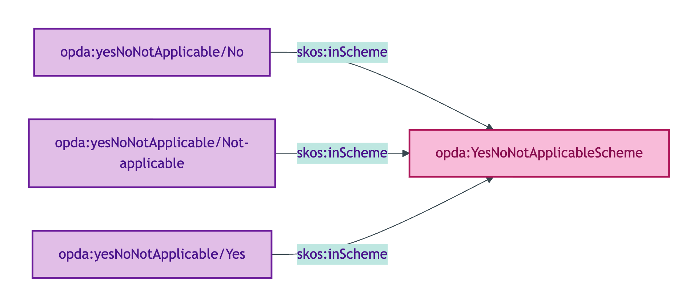
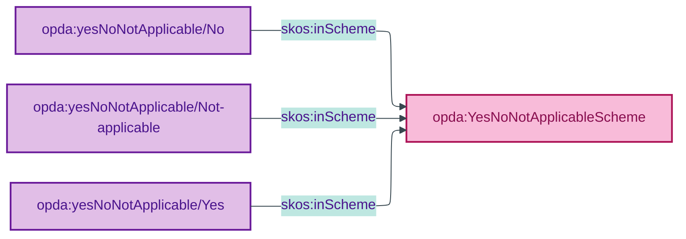

# opda:YesNoNotApplicableScheme

## Summary

Mode label register for BASPI5 questions admitting non-applicable as a third option (Yes / No / Not applicable).

## Scheme header

```turtle
opda:YesNoNotApplicableScheme
    rdf:type skos:ConceptScheme ;
    skos:prefLabel "Yes/No/Not applicable"@en ;
    skos:definition "Mode label register for BASPI5 questions admitting non-applicable as a third option (Yes / No / Not applicable)."@en ;
    dct:source <https://opda.org.uk/pdtf/harness/odr/ODR-0011/section-1a-scheme-steward> ;
    dct:title "Yes/No/Not applicable mode label register"@en ;
    skos:scopeNote "UFO: Quale-in-Region (Guizzardi 2005 Ch. 4). Mode register for BASPI5 form questions; the 'Not applicable' member captures absence-of-context rather than negative answer."@en ;
    opda:hasSteward "Allemang (property-qualities sub-module steward per S008 Q2)"@en ;
    opda:ufoCategory "Quale-in-Region" .
```

## Members

| URI | prefLabel | notation |
|---|---|---|
| `opda:yesNoNotApplicable/No` | "No" | No |
| `opda:yesNoNotApplicable/Not-applicable` | "Not applicable" | Not applicable |
| `opda:yesNoNotApplicable/Yes` | "Yes" | Yes |

### Member Turtle

```turtle
<https://opda.org.uk/pdtf/scheme/yesNoNotApplicable/No>
    rdf:type skos:Concept ;
    skos:prefLabel "No"@en ;
    skos:definition "Negative answer."@en ;
    dct:source <https://opda.org.uk/pdtf/harness/odr/ODR-0011/section-1a-scheme-steward> ;
    skos:inScheme opda:YesNoNotApplicableScheme ;
    skos:notation "No" .

<https://opda.org.uk/pdtf/scheme/yesNoNotApplicable/Not-applicable>
    rdf:type skos:Concept ;
    skos:prefLabel "Not applicable"@en ;
    skos:definition "Question does not apply in this context."@en ;
    dct:source <https://opda.org.uk/pdtf/harness/odr/ODR-0011/section-1a-scheme-steward> ;
    skos:inScheme opda:YesNoNotApplicableScheme ;
    skos:notation "Not applicable" .

<https://opda.org.uk/pdtf/scheme/yesNoNotApplicable/Yes>
    rdf:type skos:Concept ;
    skos:prefLabel "Yes"@en ;
    skos:definition "Affirmative answer."@en ;
    dct:source <https://opda.org.uk/pdtf/harness/odr/ODR-0011/section-1a-scheme-steward> ;
    skos:inScheme opda:YesNoNotApplicableScheme ;
    skos:notation "Yes" .
```

## Scheme membership graph



<details>
<summary>Mermaid Source</summary>



</details>

## Referenced by

- Per-overlay profile bindings for context-conditional BASPI5 questions

## Source ODR + ADR

- [ODR-0011 §1a](/modelling/odr/odr-0011)
- [ADR-0010](/modelling/adr/adr-0010)
