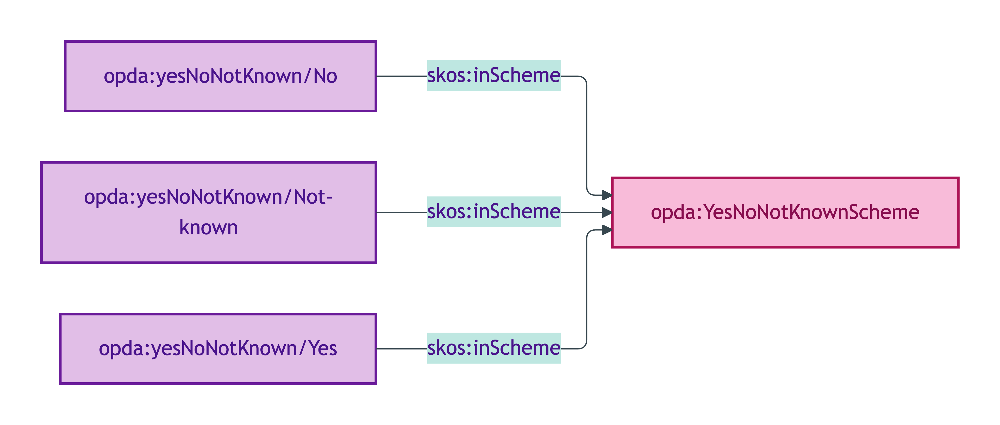
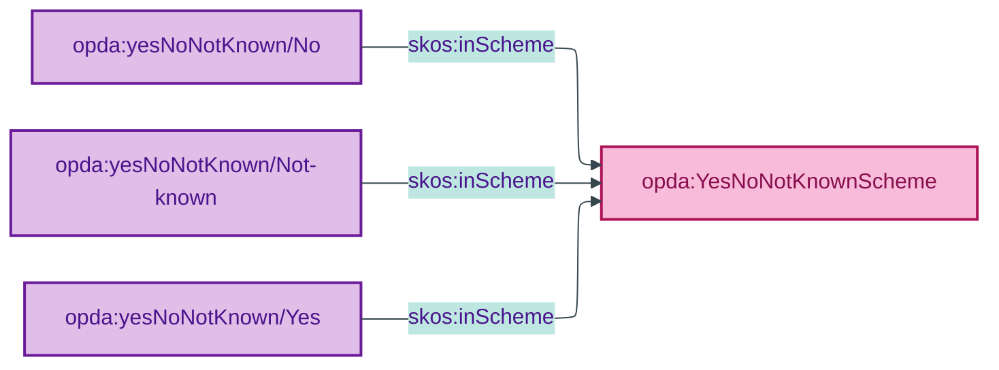

# opda:YesNoNotKnownScheme

## Summary

Mode label register for BASPI5 questions admitting unknown-to-Seller as a third option (Yes / No / Not known).

## Scheme header

```turtle
opda:YesNoNotKnownScheme
    rdf:type skos:ConceptScheme ;
    skos:prefLabel "Yes/No/Not known"@en ;
    skos:definition "Mode label register for BASPI5 questions admitting unknown-to-Seller as a third option (Yes / No / Not known)."@en ;
    dct:source <https://opda.org.uk/pdtf/harness/odr/ODR-0011/section-1a-scheme-steward> ;
    dct:title "Yes/No/Not known mode label register"@en ;
    skos:scopeNote "UFO: Quale-in-Region (Guizzardi 2005 Ch. 4). Mode register for BASPI5 form questions where the Seller may legitimately not know the answer."@en ;
    opda:hasSteward "Allemang (property-qualities sub-module steward per S008 Q2)"@en ;
    opda:ufoCategory "Quale-in-Region" .
```

## Members

| URI | prefLabel | notation |
|---|---|---|
| `opda:yesNoNotKnown/No` | "No" | No |
| `opda:yesNoNotKnown/Not-known` | "Not known" | Not known |
| `opda:yesNoNotKnown/Yes` | "Yes" | Yes |

### Member Turtle

```turtle
<https://opda.org.uk/pdtf/scheme/yesNoNotKnown/No>
    rdf:type skos:Concept ;
    skos:prefLabel "No"@en ;
    skos:definition "Negative answer."@en ;
    dct:source <https://opda.org.uk/pdtf/harness/odr/ODR-0011/section-1a-scheme-steward> ;
    skos:inScheme opda:YesNoNotKnownScheme ;
    skos:notation "No" .

<https://opda.org.uk/pdtf/scheme/yesNoNotKnown/Not-known>
    rdf:type skos:Concept ;
    skos:prefLabel "Not known"@en ;
    skos:definition "Answer is not known to the Seller."@en ;
    dct:source <https://opda.org.uk/pdtf/harness/odr/ODR-0011/section-1a-scheme-steward> ;
    skos:inScheme opda:YesNoNotKnownScheme ;
    skos:notation "Not known" .

<https://opda.org.uk/pdtf/scheme/yesNoNotKnown/Yes>
    rdf:type skos:Concept ;
    skos:prefLabel "Yes"@en ;
    skos:definition "Affirmative answer."@en ;
    dct:source <https://opda.org.uk/pdtf/harness/odr/ODR-0011/section-1a-scheme-steward> ;
    skos:inScheme opda:YesNoNotKnownScheme ;
    skos:notation "Yes" .
```

## Scheme membership graph



<details>
<summary>Mermaid Source</summary>



</details>

## Referenced by

- Per-overlay profile bindings for Seller's-knowledge-bounded BASPI5 questions

## Source ODR + ADR

- [ODR-0011 §1a](../../../ontology/odr/ODR-0011-enumeration-vocabularies.md)
- [ADR-0010](../../../adr/ADR-0010-skos-vocabulary-emission.md)
