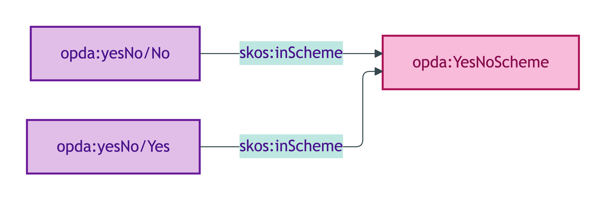
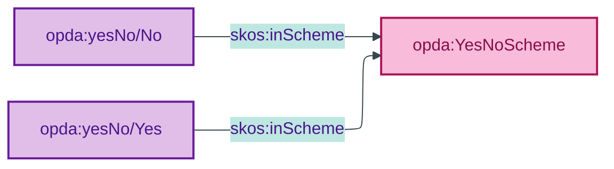

# opda:YesNoScheme

## Summary

Binary register for affirmative/negative answers to BASPI5 discriminator questions (Yes / No). Used by ~276 BASPI5 discriminator questions; emitted as a shared scheme per ODR-0011 §1a one-scheme-per-enum discipline.

## Scheme header

```turtle
opda:YesNoScheme
    rdf:type skos:ConceptScheme ;
    skos:prefLabel "Yes/No"@en ;
    skos:definition "Binary register for affirmative/negative answers to BASPI5 discriminator questions (Yes / No)."@en ;
    dct:source <https://w3id.org/opda/odr/ODR-0011#section-1a-scheme-steward> ;
    dct:title "Yes/No binary register"@en ;
    skos:scopeNote "UFO: Quale-in-Region (Guizzardi 2005 Ch. 4). DOLCE: Quality-Region (Masolo D18 §4.3). Used by ~276 BASPI5 discriminator questions; emitted as a shared scheme per ODR-0011 §1a one-scheme-per-enum discipline."@en ;
    opda:hasSteward "Allemang (property-qualities sub-module steward per S008 Q2)"@en ;
    opda:ufoCategory "Quale-in-Region" .
```

## Members

| URI | prefLabel | notation |
|---|---|---|
| `opda:yesNo/No` | "No" | No |
| `opda:yesNo/Yes` | "Yes" | Yes |

### Member Turtle

```turtle
<https://w3id.org/opda/#yesNo/No>
    rdf:type skos:Concept ;
    skos:prefLabel "No"@en ;
    skos:definition "Negative answer to a binary BASPI5 question."@en ;
    dct:source <https://w3id.org/opda/odr/ODR-0011#section-1a-scheme-steward> ;
    skos:inScheme opda:YesNoScheme ;
    skos:notation "No" .

<https://w3id.org/opda/#yesNo/Yes>
    rdf:type skos:Concept ;
    skos:prefLabel "Yes"@en ;
    skos:definition "Affirmative answer to a binary BASPI5 question."@en ;
    dct:source <https://w3id.org/opda/odr/ODR-0011#section-1a-scheme-steward> ;
    skos:inScheme opda:YesNoScheme ;
    skos:notation "Yes" .
```

## Scheme membership graph



<details>
<summary>Mermaid Source</summary>



</details>

## Referenced by

This is the most-referenced scheme. Used by every BASPI5 Yes/No discriminator question (e.g. `isInsured`, `hasBeenFlooded`, `hasSmartHomeSystems`, `hasSprayFoamInstalled`, `isSupplyMetered`, `isGroundRentPayable`, `isLocatedOverCommercialPremises`, `soldWithVacantPossession`, `sellerContributesToServiceCharge`, `areBoundariesUniform`, `hasValidGuaranteesOrWarranties`).

Property shapes referencing this scheme (via `_:bbfbbd5886345` Yes/No list):

- `opda:Baspi5_PropertyShape` (multiple bindings — flood / smart-home / spray-foam / insurance / supply-meter / vacant-possession / boundaries-uniform / guarantees / over-commercial-premises)
- `opda:Baspi5_LegalEstateShape` (ground rent / service charge / shared ownership)

## Source ODR + ADR

- [ODR-0011 §1a — one-scheme-per-enum discipline](../../../ontology/odr/ODR-0011-enumeration-vocabularies.md)
- [ADR-0010](../../../adr/ADR-0010-skos-vocabulary-emission.md)
