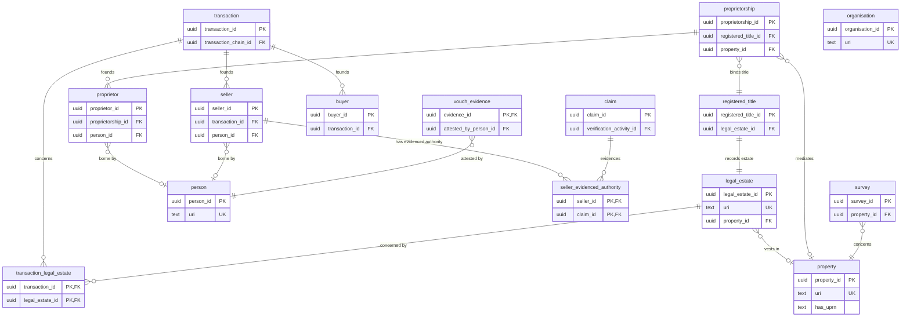

# OPDA Physical-Relational Model

This tier realises the OPDA [Logical model](../logical/) as a concrete, normalised **relational database schema** (PostgreSQL-flavoured, ~3NF). Audience: database engineers, backend developers, and data-platform teams who need to persist OPDA property-transaction data in an RDBMS rather than a triplestore. It is the relational sibling of the [Physical — deployment](../physical-database/) (triplestore) and [Physical — ontology](../physical-ontology/) (Turtle / SHACL) tiers — the same model on a different substrate.

The Logical tier's 41 entities and 23 SKOS enumeration schemes across seven modules map onto roughly 60 tables: entity tables, junction tables for many-to-many relationships and reified relators, append-only event tables for PROV-O lifecycle events, and one lookup table per enumeration scheme. Each module page shows its tables with full columns; this overview shows the cross-module foreign-key seams (key columns only).

## See also

- [Logical model](../logical/) — the platform-independent ER source this tier realises.
- [Data dictionary](/modelling/data-dictionary) — the schema-level element register in the Modelling section.

## Mapping conventions

Every rule below is applied uniformly across the seven module pages.

### Keys — surrogate plus IRI

Every entity table carries two keys:

- a **surrogate primary key** `<table>_id uuid PRIMARY KEY` — opaque, stable, foreign-key-friendly;
- a **natural key** `uri text NOT NULL UNIQUE` — the dereferenceable ontology IRI that is the row's true cross-tier identity.

The surrogate is needed because almost no OPDA entity has a single scalar natural key: identity criteria are tuples (`(LegalEstate, Persons-set)`), provenance shapes (`prov:wasGeneratedBy`), or non-relational (Property's spatial-material continuity). Those criteria are documented per table, not enforced as base-table `UNIQUE` constraints. `owl:sameAs`-style identity collapse is forbidden (ODR-0005 Rule 5): co-referent rows are linked, never merged.

### Naming

| Logical artefact | Rule | Example |
|---|---|---|
| PascalCase entity | snake_case singular table | `RegisteredTitle` → `registered_title` |
| camelCase attribute | snake_case column | `hasUPRN` → `has_uprn` |
| SKOS scheme | `<scheme>` lookup table | `TenureKindScheme` → `tenure_kind` |
| Foreign key | `<target>_id` | `legal_estate_id` |
| Many-to-many | junction `<a>_<b>` | `transaction_legal_estate` |

### Cardinality

| Logical | Relational |
|---|---|
| `0..1` | nullable column / nullable FK |
| `1..1` | `NOT NULL` column / FK |
| `0..*`, `1..*` | child table or junction table (never array columns) |
| `M:N` | junction table with composite `UNIQUE(a_id, b_id)` |

### Enumerations to lookup tables

All 23 SKOS schemes become lookup tables (not native Postgres `ENUM`s) because the schemes are closed-but-Council-amendable and each member carries `skos:notation`, `skos:prefLabel`, `skos:definition`, and a per-member IRI. Each lookup has the uniform shape `(<scheme>_id uuid PK, notation text UNIQUE, pref_label text, definition text, uri text UNIQUE)`; consuming columns are `text` foreign keys to `<scheme>.notation`. The shared `yes_no` lookup backs every Yes/No discriminator — one scheme, never per-attribute booleans.

### Lifecycle events to append-only tables

PROV-O event particulars (`NameChangeEvent`, `UPRNSuccessionEvent`, `LeaseExtensionEvent`, `Milestone`, `VerificationActivity`) become append-only tables with a foreign key to the subject endurant, a `prov:atTime` timestamp, and a self-referential `was_derived_from_id` / `was_informed_by_id` for PROV chains. The subject's identity **persists** across the event — the master row is never re-minted on a name change or UPRN re-number.

### Relators and roles

- **Relators** (`Proprietorship`, `Transaction`) are reified as their own tables, with foreign keys and junctions to their bearers; attributes belonging to the relationship live on the relator, never on a participant.
- **Roles and RoleMixins** (`Buyer`, `Seller`, `Proprietor`) become participation tables with two nullable bearer foreign keys (`person_id`, `organisation_id`) and a `CHECK` that exactly one is set, plus a `NOT NULL` foreign key to the founding relator. They carry no identity-bearing surrogate that anything else references.

### Inheritance, derived attributes, external references

- **Evidence** subtypes use class-table inheritance: an `evidence` base table (shared `digest` plus a `subtype` discriminator) with three subtype child tables keyed by `evidence_id`. The three `owl:equivalentClass` short-name aliases (`Document`, `ElectronicRecord`, `Vouch`) are **views**, not tables.
- **Derived attributes** (SHACL-AF `Info`-tier, e.g. `hasUPRNSuccessionStatus`) are computed columns or views, never authored base columns.
- **External vocabulary references** (DPV categories, `prov:Activity`, `owl:Class` targets) are stored as IRI literals — cited, not imported — with no foreign key.

## Module catalogue

| Module | Tables | Realises |
|---|---|---|
| [foundation](./foundation/) | 4 | ValidationContext, GeneratorRun, DiagnosticExemplar (meta-classes are abstract) |
| [property](./property/) | 10 + 15 lookups | Property, Address, LegalEstate, RegisteredTitle, LeaseTerm + lifecycle events |
| [agent](./agent/) | 8 + 4 lookups | Person, Organisation, Proprietorship relator, Buyer / Seller / Proprietor roles |
| [transaction](./transaction/) | 4 + 2 lookups | Transaction relator, Milestone, TransactionChain |
| [claim](./claim/) | 9 + 2 lookups | Claim, Evidence (class-table inheritance), VerificationActivity, TrustFramework |
| [governance](./governance/) | 1 | DPVMappingRecord (SpecialCategoryScheme deferred) |
| [descriptive](./descriptive/) | 6 | Survey, Valuation, EPCCertificate, Search, Comparable |

## Master entity-relationship diagram

Cross-module structural seams, showing key columns only. Full columns and lookups live on each module page.

## Cross-tier traceability

Each table traces back to a single Logical-tier entity (`../logical/<module>/<entity>.md`), which in turn maps to one `owl:Class` in the [Physical — ontology](../physical-ontology/) tier and one or more named graphs in the [Physical — deployment](../physical-database/) tier. The `uri` natural-key column is the join across all four physical realisations.

## Provenance

Hand-authored from the Logical-tier source at `docs/manual/logical/` (41 entities, 23 enumeration schemes). The relational mapping decisions follow the ODR corpus (notably ODR-0005 property identity, ODR-0007 transactions, ODR-0009 claims and evidence, ODR-0011 enumerations) and are documented per module. No entities or attributes are introduced that are absent from the logical tier.
