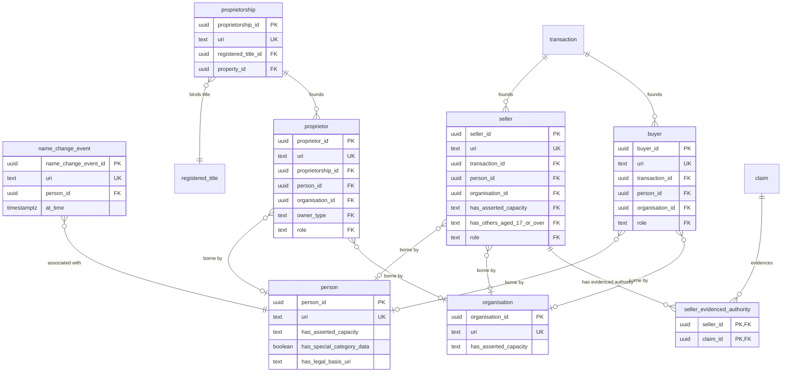

# Agent module — relational schema

`person` and `organisation` are the substance Kinds that bear roles. `proprietorship` is a reified UFO Relator binding a registered title to its proprietor set. `buyer`, `seller`, and `proprietor` are **participation tables** — their identity is parasitic on a bearer plus a founding relator, so they carry no standalone identity that anything else references.

## Tables

| Table | Realises | Kind | Bearer / founding relator |
|---|---|---|---|
| `person` | Person | entity | — |
| `organisation` | Organisation | entity | — |
| `name_change_event` | NameChangeEvent | event | FK → `person` |
| `proprietorship` | Proprietorship | relator | FK → `registered_title`, `property` |
| `proprietor` | Proprietor (Role) | role | bearer (`person` xor `organisation`); founded by `proprietorship` |
| `seller` | Seller (RoleMixin) | role | bearer (`person` xor `organisation`); founded by `transaction` |
| `buyer` | Buyer (RoleMixin) | role | bearer (`person` xor `organisation`); founded by `transaction` |
| `seller_evidenced_authority` | hasEvidencedAuthority `0..*` | junction | `seller` × `claim` |

Each role table (`proprietor`, `seller`, `buyer`) carries `CHECK (num_nonnull(person_id, organisation_id) = 1)` — borne by exactly one Person or Organisation.

## Entity-relationship diagram

## Lookup tables

| Lookup | Bound by | Members |
|---|---|---|
| `owner_type` | `proprietor.owner_type` | 2 |
| `role_scheme` | `seller.role`, `buyer.role`, `proprietor.role` | 12 |
| `sellers_capacity` | `seller.has_asserted_capacity` | 6 |
| `participant_status` | overlay profiles | 4 |

## Mapping notes

- **Roles have no identity-bearing key.** `buyer` / `seller` / `proprietor` exist only as a `(bearer, founding-relator)` pairing, with two nullable bearer foreign keys and an exactly-one `CHECK`. RoleMixins (Buyer, Seller) are cross-sortal (Person or Organisation); Proprietor (a Role) is normally a Person, with Organisations entering through a named sub-role.
- **Proprietorship is a reified Relator.** Joint-tenancy vs tenants-in-common is a property of the proprietorship, not of the individual proprietors; ownership is never flattened to a `registered_title.owner_person_id` foreign key.
- **Name changes preserve identity.** A `name_change_event` row records the change; the `person` row persists. A new Person is never minted on a name change.
- **`person.has_legal_basis_uri`** is the one column added beyond the declared logical attributes — it hosts the SHACL rule that special-category data must carry a `dpv:hasLegalBasis`. (`registered_title`, `transaction`, `claim` live in other modules.)

## Cross-tier

Logical tier: [agent module](../../logical/agent/).
