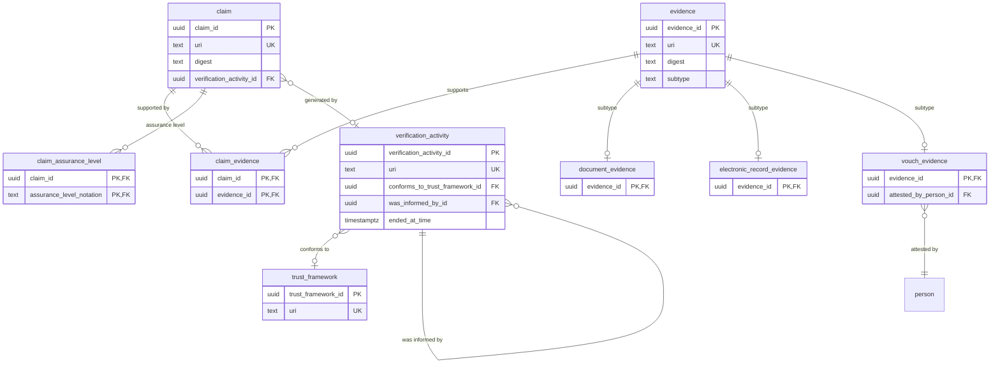

# Claim module — relational schema

Verifiable `claim`s are content-addressable (`digest`) and supported by `evidence`. Evidence uses **class-table inheritance**: a base `evidence` table with a `subtype` discriminator and three subtype child tables. `verification_activity` records the PROV-O activity that generates a claim.

## Tables

| Table | Realises | Kind | Notes |
|---|---|---|---|
| `claim` | Claim | entity | identity = `digest`; FK → `verification_activity` |
| `claim_evidence` | supportedBy / wasDerivedFrom `M:N` | junction | `claim` × `evidence` |
| `claim_assurance_level` | assuranceLevel `M:N` | junction | `claim` × `assurance_level_scheme` |
| `evidence` | Evidence | CTI base | `digest`; `subtype` CHECK (`sh:xone`) |
| `document_evidence` | DocumentEvidence | CTI child | PK = FK → `evidence` |
| `electronic_record_evidence` | ElectronicRecordEvidence | CTI child | PK = FK → `evidence` |
| `vouch_evidence` | VouchEvidence | CTI child | adds `attested_by_person_id` (`1..1`) |
| `verification_activity` | VerificationActivity | event | self-FK `was_informed_by_id`; FK → `trust_framework` |
| `trust_framework` | TrustFramework | entity | identity = framework URI |

The three `owl:equivalentClass` aliases — `Document`, `ElectronicRecord`, `Vouch` — are **views** over the corresponding `*_evidence` tables, not separate tables. `AssuranceLevel` (a Quale-in-Region) is the `assurance_level_scheme` lookup, referenced through `claim_assurance_level`, not its own entity table.

## Entity-relationship diagram

## Lookup tables

| Lookup | Bound by | Members |
|---|---|---|
| `assurance_level_scheme` | `claim_assurance_level.assurance_level_notation` | 4 |
| `evidence_method` | aligns subtypes via `skos:exactMatch` | 3 |

## Mapping notes

- **Evidence is content-addressable.** Both `claim` and `evidence` are keyed on `digest`, not an auto-increment id — identical content must not exist as two rows.
- **Class-table inheritance with `sh:xone`.** The `evidence.subtype` discriminator plus one child table per subtype realises "exactly one subtype". Only `vouch_evidence` adds a mandatory facet (`attested_by_person_id`, `1..1`).
- **Aliases are views, not tables.** `Document`, `ElectronicRecord`, and `Vouch` are the same OWL identity as the `*_evidence` long names.
- **Re-verification is a self-chain.** `verification_activity.was_informed_by_id` references the prior activity (`prov:wasInformedBy`); the claim's `verification_activity_id` realises `prov:wasGeneratedBy`. (`person` lives in the agent module.)

## Cross-tier

Logical tier: [claim module](../../logical/claim/).
