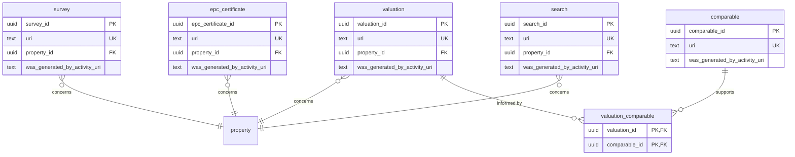

# Descriptive module — relational schema

Five class-promoted PROV-O Entities — `survey`, `valuation`, `epc_certificate`, `search`, `comparable` — each `concerns` a property and is identified by its issuing activity. They declare no module-local facets at this tier (price, surveyor, energy band, etc. live in overlay profiles), so the tables are intentionally thin: a surrogate key, the `uri`, the `concerns` foreign key, and the `prov:wasGeneratedBy` activity anchor.

## Tables

| Table | Realises | concerns | Identity anchor |
|---|---|---|---|
| `survey` | Survey | `property` | `was_generated_by_activity_uri` |
| `valuation` | Valuation | `property` | `was_generated_by_activity_uri` |
| `epc_certificate` | EPCCertificate | `property` | `was_generated_by_activity_uri` |
| `search` | Search | `property` | `was_generated_by_activity_uri` |
| `comparable` | Comparable | — | `was_generated_by_activity_uri` |
| `valuation_comparable` | wasInformedBy `M:N` | junction | `valuation` × `comparable` |

## Entity-relationship diagram

## Mapping notes

- **Identity is the issuing activity.** Each descriptive Kind's identity depends on its `prov:wasGeneratedBy` activity (surveyor + timestamp + registration, etc.), so `was_generated_by_activity_uri` is `NOT NULL`. The activity itself is stored as an IRI literal rather than promoted to an invented `activity` table.
- **No invented facets.** Survey price, valuer, EPC band and similar fields are overlay-profile concerns and are not declared at this tier, so they are not columns here.
- **`comparable` supports `valuation`** through the `valuation_comparable` junction (`prov:wasInformedBy`), a many-to-many relationship. (`property` lives in the property module.)

## Cross-tier

Logical tier: [descriptive module](../../logical/descriptive/).
