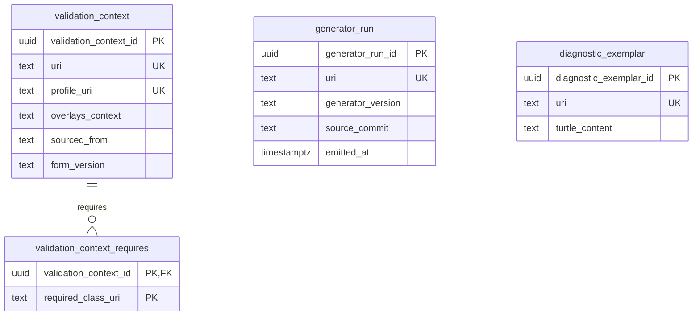

# Foundation module — relational schema

The foundation module realises the cross-cutting infrastructure classes. The three UFO meta-classes (`Role`, `RoleMixin`, `Relator`) are **abstract** — they hold no rows of their own; their concrete specialisations are realised in the agent and transaction modules (`proprietor`, `seller`, `buyer`, `proprietorship`, `transaction`). Only the three substantive foundation classes become tables: per-overlay validation context, generator-run provenance, and diagnostic exemplars.

## Tables

| Table | Realises | Identity |
|---|---|---|
| `validation_context` | ValidationContext | `profile_uri` (dereferenceable per-overlay profile context) |
| `generator_run` | GeneratorRun | `(generator_version, source_commit)` |
| `diagnostic_exemplar` | DiagnosticExemplar | exemplar name / URI fragment |

`validation_context_requires` is a child table holding the multi-valued `requires` references — cited `owl:Class` IRIs, not local foreign keys.

## Entity-relationship diagram

## Mapping notes

- **Meta-classes are not tables.** `Role`, `RoleMixin`, and `Relator` are UFO meta-classes with no instances of their own; their concrete subtypes are realised as participation and relator tables in the agent and transaction modules.
- **`generator_run` identity** is the composite `(generator_version, source_commit)`, expressed as a `UNIQUE` constraint; `emitted_at` is informational only.
- **`diagnostic_exemplar`** stores inline hard-case Turtle; it references Property / LegalEstate / Address by direct typing inside that Turtle, not via relational foreign keys.

## Cross-tier

Logical tier: [foundation module](../../logical/foundation/).
