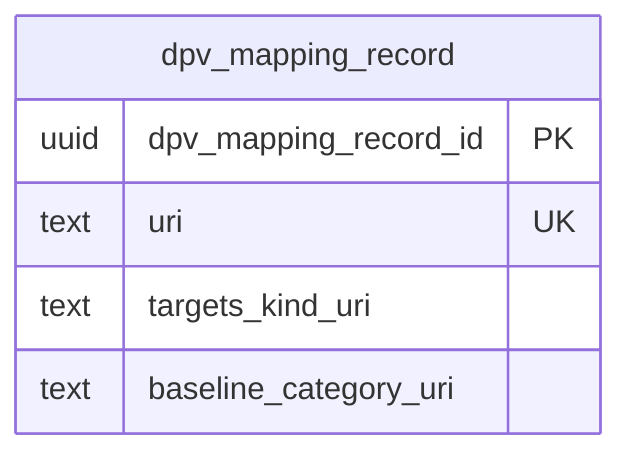

# Governance module — relational schema

A thin module. `dpv_mapping_record` maps an OPDA Kind (a class, not an instance) to a DPV personal-data category. `SpecialCategoryScheme` is a declaration-only `skos:ConceptScheme` subclass with no members yet, so it produces **no table** at this tier.

## Tables

| Table | Realises | Identity |
|---|---|---|
| `dpv_mapping_record` | DPVMappingRecord | `(targets_kind_uri, baseline_category_uri)` |

## Entity-relationship diagram

## Mapping notes

- **`targets_kind` is a class reference, not a foreign key.** It cites an `owl:Class` IRI (Person / Organisation / Claim — the Kind, not a row), stored as a `text` IRI literal. The three concrete records are `PersonDPVMapping`, `OrganisationDPVMapping`, and `ClaimDPVMapping`.
- **DPV is cited, not imported** (ODR-0012). `baseline_category_uri` holds the `dpv-pd` category IRI as a literal — no foreign key to an imported DPV table.
- **`SpecialCategoryScheme` is deliberately omitted.** It is an empty scheme declaration with no members; a `special_category` lookup appears only once members are ratified and emitted.

## Cross-tier

Logical tier: [governance module](../../logical/governance/).
