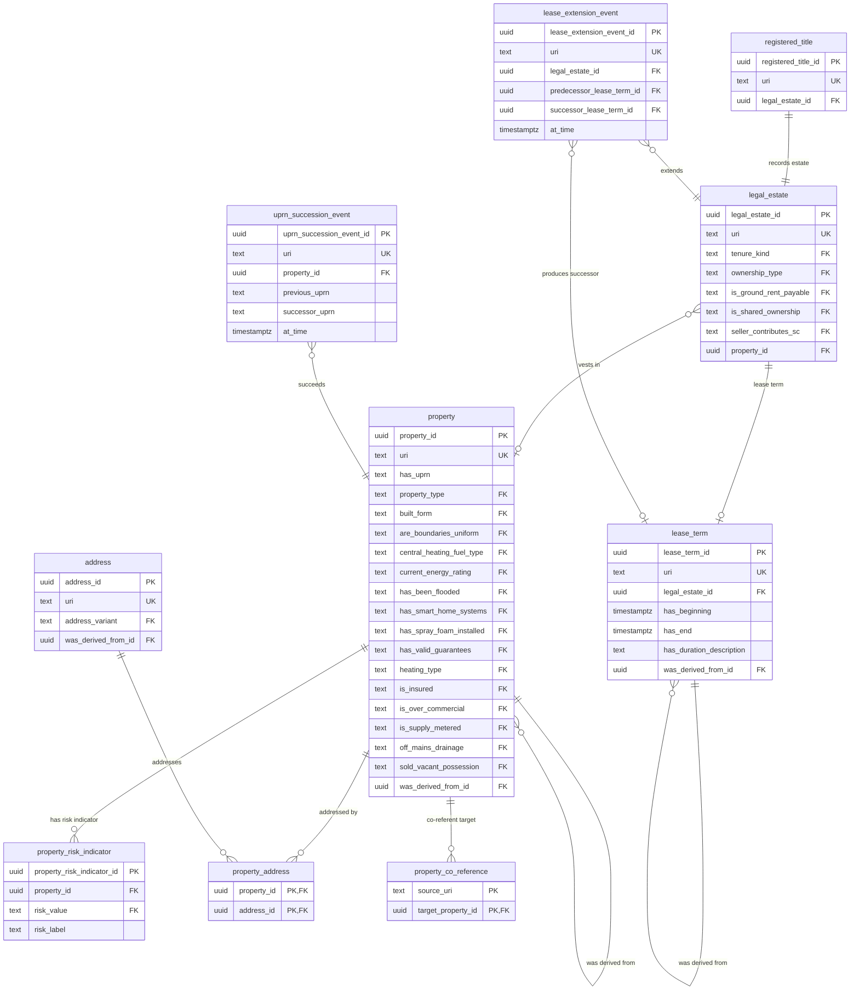

# Property module — relational schema

The structural spine of the schema: the physical `property`, its `address`(es), the legal rights-bundle (`legal_estate`), the HMLR record (`registered_title`), the `lease_term`, and the append-only lifecycle-event tables. All other modules attach here through foreign keys to `property` and `legal_estate`.

## Tables

| Table | Realises | Kind | Key relationships |
|---|---|---|---|
| `property` | Property | entity | self-FK `was_derived_from_id` (UPRN-succession PROV chain) |
| `property_risk_indicator` | Property.riskIndicator `0..*` | child | FK → `property` |
| `address` | Address | entity | self-FK `was_derived_from_id` (within-variant succession) |
| `property_address` | hasAddress `0..*` | junction | `property` × `address` |
| `property_co_reference` | identifiesSameProperty | junction | surface-IRI → `property` co-reference |
| `legal_estate` | LegalEstate | entity | FK → `property` (`vests in`) |
| `registered_title` | RegisteredTitle | entity | FK → `legal_estate` (`records estate`, `1..1`) |
| `lease_term` | LeaseTerm | entity | FK → `legal_estate`; self-FK succession |
| `lease_extension_event` | LeaseExtensionEvent | event | FK → `legal_estate`, predecessor / successor `lease_term` |
| `uprn_succession_event` | UPRNSuccessionEvent | event | FK → `property` |

## Entity-relationship diagram

## Lookup tables

Fifteen SKOS schemes reside in this module. Each is a lookup table of the uniform shape `(<scheme>_id, notation UNIQUE, pref_label, definition, uri UNIQUE)`. Yes/No-typed `FK` columns above reference the shared `yes_no` lookup.

| Lookup | Bound by | Members |
|---|---|---|
| `address_variant` | `address.address_variant` | 4 |
| `built_form` | `property.built_form` | 5 |
| `central_heating_fuel_type` | `property.central_heating_fuel_type` | 6 |
| `current_energy_rating` | `property.current_energy_rating` | 7 |
| `heating_type` | `property.heating_type` | 4 |
| `off_mains_drainage_system_type` | `property.off_mains_drainage` | 6 |
| `ownership_type` | `legal_estate.ownership_type` | 4 |
| `property_type` | `property.property_type` | 6 |
| `tenure_kind` | `legal_estate.tenure_kind` | 3 |
| `yes_no` | every Yes/No discriminator (shared) | 2 |
| `council_tax_band_ew` | overlay profiles (E&W) | 8 |
| `council_tax_band_scotland` | overlay profiles (Scotland) | 9 |
| `yes_no_not_applicable` | overlay profiles | 3 |
| `yes_no_not_known` | overlay profiles | 3 |
| `yes_no_not_required` | overlay profiles | 3 |

## Mapping notes

- **Property identity is a surrogate, never the UPRN.** `has_uprn` is nullable and non-unique — UPRN re-numbering is recorded in `uprn_succession_event` while the same `property` row persists (ODR-0005 §2a / §6a). A hard `UNIQUE NOT NULL` on `has_uprn` would break new-builds, unregistered properties, and every succession case.
- **Co-reference, not `owl:sameAs`.** `property_co_reference` links co-referent surfaces (RegisteredTitle / LegalEstate / Address / Property) to the physical property by IRI (`source_uri`), with no transitive-merge semantics (ODR-0005 Rule 5).
- **Three Substance Kinds, three tables.** Property, LegalEstate, and RegisteredTitle stay separate, joined via `recordsEstate` and `vests in`; never collapsed into one row.
- **`address_variant` is identity-bearing and mandatory.** A title-variant and an inspire-variant address that refer to one physical property are **distinct rows** (ODR-0015 Rule 6).
- **Diagram column names are abbreviated** to fit the entity boxes (e.g. `has_valid_guarantees` → `has_valid_guarantees_or_warranties`, `seller_contributes_sc` → `seller_contributes_to_service_charge`); the canonical snake_case names follow the logical attribute names verbatim.

## Cross-tier

Logical tier: [property module](../../logical/property/).
