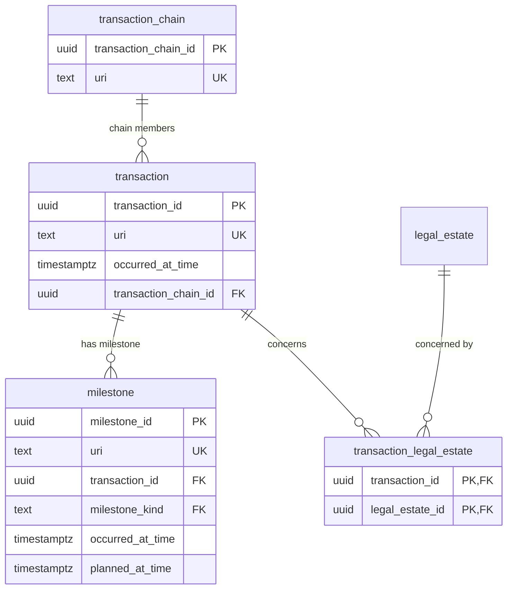

# Transaction module — relational schema

`transaction` is a reified UFO Relator — the conveyancing relationship that founds the buyer and seller roles and concerns one or more legal estates. `milestone` rows are append-only lifecycle events; `transaction_chain` aggregates linked transactions.

## Tables

| Table | Realises | Kind | Key relationships |
|---|---|---|---|
| `transaction` | Transaction | relator | founds `seller` / `buyer`; FK → `transaction_chain` (`0..1`) |
| `transaction_legal_estate` | concerns `M:N` | junction | `transaction` × `legal_estate` |
| `milestone` | Milestone | event | FK → `transaction`; `UNIQUE(transaction_id, milestone_kind)` |
| `transaction_chain` | TransactionChain | aggregate | members via `transaction.transaction_chain_id` |

## Entity-relationship diagram

## Lookup tables

| Lookup | Bound by | Members |
|---|---|---|
| `milestone_kind` | `milestone.milestone_kind` | 5 |
| `transaction_status` | overlay profiles | 5 |

## Mapping notes

- **Transaction is a reified Relator**, not a pair of foreign keys. Its identity is the 5-tuple `(LegalEstate-concerned, Sellers, Buyers, transaction-id lineage, founding event)`. Buyers and sellers attach as `seller` / `buyer` rows (agent module) whose `transaction_id` points back here; `concerns` is many-to-many via `transaction_legal_estate`.
- **`milestone` identity** is `(Transaction, MilestoneKind)` — `UNIQUE(transaction_id, milestone_kind)`. The derived `hasVarianceDays` (`occurred_at_time − planned_at_time`) is computed, not stored.
- **The `≤ 7` chain-member cap and chain-status are overlay-level SHACL rules**, documented rather than enforced as base-table constraints. Membership is the inverse foreign key `transaction.transaction_chain_id`. (`legal_estate` lives in the property module.)

## Cross-tier

Logical tier: [transaction module](../../logical/transaction/).
