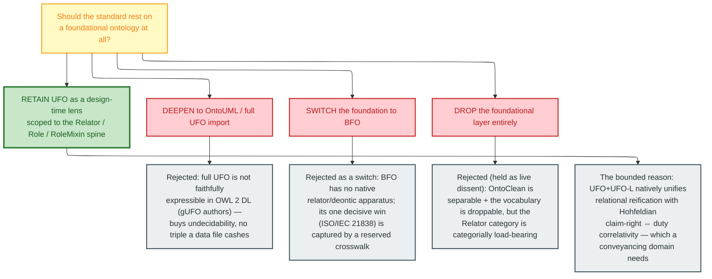
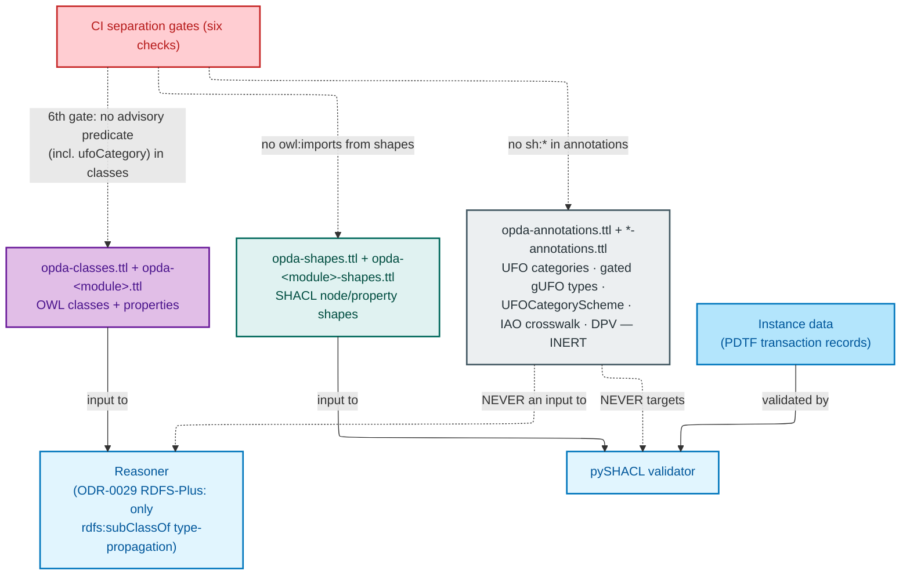
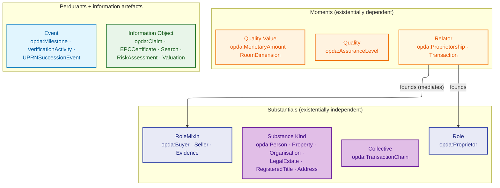
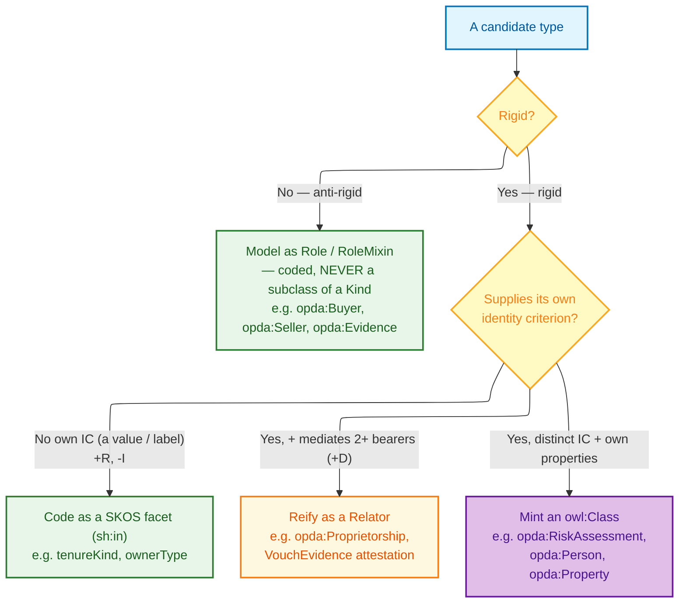
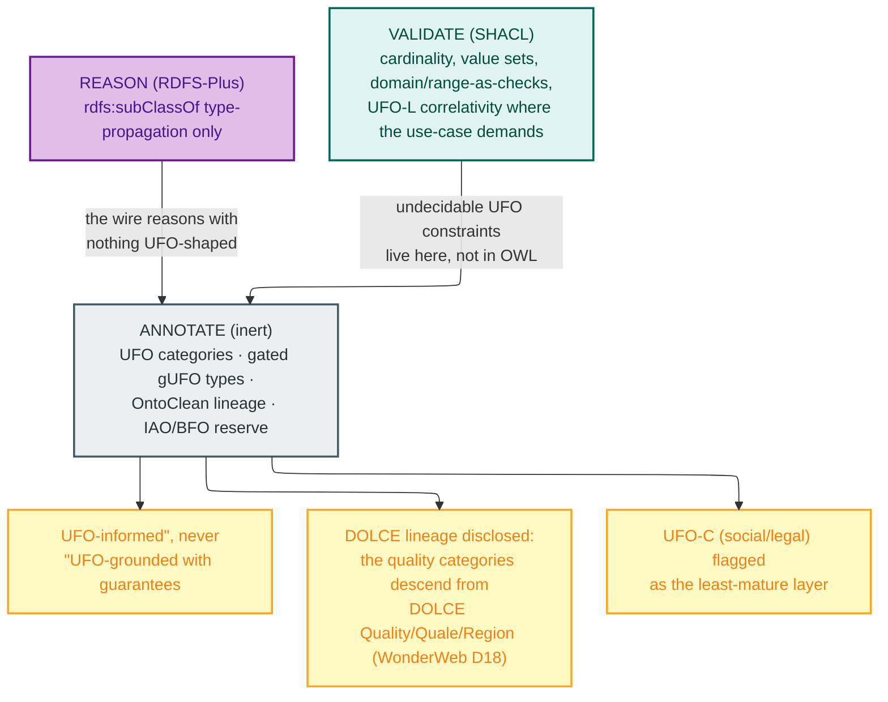

# Foundational Ontology & Modelling Frameworks in OPDA — What We Built, Why, and the Benefits

> How the OPDA PDTF ontology actually uses a foundational ontology and a conceptual-modelling framework: the decisions we took, the architecture we deployed, and what it buys us. The one-line summary: **OPDA is UFO-*informed*, never UFO-*grounded*.** We use the Unified Foundational Ontology (UFO) and OntoClean as a **design-time decision procedure**, and ship only pragmatic SHACL + SKOS + plain RDF that stands on its own — carrying the foundational commitment as an **inert, honestly-disclosed, CI-quarantined provenance record**.

This document is a reference for *our* implementation. It is grounded in the decisions recorded in [ODR-0030](ontology/odr/ODR-0030-foundational-ontology-choice.md) (the foundational-ontology choice), [ODR-0031](ontology/odr/ODR-0031-ufocategory-upper-ontology-representation.md) (how `opda:ufoCategory` is represented), [ODR-0027](ontology/odr/ODR-0027-classification-roles-inheritance-skos-doctrine.md) (classification-over-inheritance), [ODR-0029](ontology/odr/ODR-0029-inference-validation-boundary-and-entailment-regime-disposition.md) (the entailment regime), [ODR-0004](ontology/odr/ODR-0004-pdtf-ontology-foundation.md) §3a (three-graph separation), and [ADR-0034](adr/ADR-0034-gufo-property-typing-pass.md) / [ADR-0044](adr/ADR-0044-ontology-as-web-pages-dereferenceable-entity-detail-pages.md) / [ADR-0045](adr/ADR-0045-ufocategory-quarantine-restoration-gufo-scheme-sixth-gate.md) (the engineering).

---

## 1. The decision: retain UFO as a lens, scoped to the Relator spine

When we reviewed the foundational layer (council session-040 → [ODR-0030](ontology/odr/ODR-0030-foundational-ontology-choice.md)), the live question was a four-way: **retain** UFO as a lightweight lens, **deepen** it to a full OntoUML/UFO import, **switch** to BFO, or **drop** the foundational layer entirely. We chose **retain-as-lens, scoped to the Relator/Role/RoleMixin spine** — and the scoping is the whole point.

The honest account of *how* we use UFO: **our modelling process is governed by a UFO/OntoClean decision procedure; the artefact carries an inert provenance record of that governance.** UFO is load-bearing only at the relational-endurant spine — a handful of classes such as `opda:Proprietorship` and `opda:Transaction` founding the `opda:Seller`/`opda:Buyer` roles. Everywhere else it is documentary. The published claim is therefore **"UFO-informed", never "UFO-grounded with guarantees."**

**Why not deepen?** The gUFO authors' own result is decisive: full UFO is not faithfully expressible in decidable OWL 2 DL, so deepening imports non-computable commitments we would only route around. **Why not switch to BFO?** BFO must reify a claim-right as a directive information entity; its only decisive advantage (ISO/IEC 21838 standing) we hold in reserve via a referenced-not-imported crosswalk, without abandoning UFO-L's superior domain fit. **Why not drop it?** OntoClean is separable and the *vocabulary* is droppable — but the **Relator** does categorial work the alternatives cannot reconstruct, so the foundation is *optional, not harmful*, and retained behind falsifiable re-open triggers.

---

## 2. The architecture: three graphs, one of them inert

The foundational commitment is made safe by **physical separation** ([ODR-0004](ontology/odr/ODR-0004-pdtf-ontology-foundation.md) §3a). The emitter produces three kinds of graph, and the foundational/meta-level material lives entirely in the third — the **annotation graph**, which is never reasoned over and never validates instances.

**What reasons over what.** The reasoner sees only the classes graph, under the deliberately shallow **RDFS-Plus** regime ([ODR-0029](ontology/odr/ODR-0029-inference-validation-boundary-and-entailment-regime-disposition.md)): only `rdfs:subClassOf` type-propagation fires; domain/range are validated as SHACL, not inferred. The SHACL validator checks instance data against the shapes graph. The annotation graph — where every UFO/gUFO/OntoClean tag lives — is an input to **neither**. Deleting the entire foundational layer changes zero inferences, zero validation reports, and zero emitted bytes.

**The CI gates make this real, not aspirational.** Six checks enforce the separation; the **sixth** (added in [ADR-0045](adr/ADR-0045-ufocategory-quarantine-restoration-gufo-scheme-sixth-gate.md)) forbids the advisory-predicate family — including `opda:ufoCategory` — from appearing in the classes graph. It exists because a structured `ufoCategory` facet was once emitted into the reasoned graph by mistake; the gate is what guarantees that breach cannot silently re-ship.

---

## 3. The UFO categories we use — and the Relator spine that earns its keep

OPDA classifies each OWL class under one of **nine** UFO meta-categories. They are a documentary classification, not a subclass tree.

**The Relator is where UFO does irreducible work.** The strictly irreducible thing is the **relational-reification primitive**: reify a relationship as a first-class node that owns the relation's own attributes. The proof in our corpus is the placement of `opda:numberOfSellers` *on the `opda:Proprietorship` Relator* (`opda-agent.ttl`) — an aggregation attribute of the relationship itself, which OntoClean's *monadic* meta-properties structurally cannot derive (they have no mediation primitive). UFO's Relator is our chosen, apt expression of that primitive (with FIBO's *Arrangement* cited as a co-precedent on `opda:Transaction`), and UFO-L adds the Hohfeldian claim-right ⇔ duty correlativity a conveyancing domain (charges, covenants, easements) needs.

The other categories are facets: a class *is classified under* "Substance Kind" or "Event" — it is **not** an instance of a UFO type in any reasoned graph (the level distinction; see §6).

---

## 4. How `opda:ufoCategory` is represented — and the breach we fixed

The category tag went through three states. Understanding the journey is the clearest way to see *why* the final design is shaped as it is ([ODR-0031](ontology/odr/ODR-0031-ufocategory-upper-ontology-representation.md) / [ADR-0045](adr/ADR-0045-ufocategory-quarantine-restoration-gufo-scheme-sixth-gate.md)).

1. **Free-text** in `skos:scopeNote` prose ("UFO: Substance Kind") — unqueryable.
2. **Structured facet, but mis-placed** (ADR-0044 Phase 5c): promoted to a real `opda:ufoCategory` predicate — but declared `owl:DatatypeProperty` and asserted *inline in the reasoned class graphs*. This **breached** the [ODR-0030](ontology/odr/ODR-0030-foundational-ontology-choice.md) Rule 1 quarantine ("annotation-graph-only"), and the three-graph gate had no check to catch it.
3. **The fix** (ADR-0045): relocated to the annotation graph, retyped `owl:AnnotationProperty`, and given a dereferenceable concept anchor.

The deployed shape decouples the **simple tag consumers read** from the **governed concept that carries the semantics**:

```mermaid
flowchart LR
    accTitle: How opda:ufoCategory is represented after ADR-0045
    accDescr: A class carries an inert string tag for its UFO category; the string is keyed by notation to a SKOS concept in opda:UFOCategoryScheme, which carries the OntoClean definition and a closeMatch to the gUFO IRI — all in the annotation graph, never reasoned.

    classDef cls fill:#E1BEE7,stroke:#6A1B9A,stroke-width:2px,color:#4A148C
    classDef lit fill:#FFF9C4,stroke:#F57F17,stroke-width:2px,color:#E65100
    classDef concept fill:#E8F5E9,stroke:#2E7D32,stroke-width:2px,color:#1B5E20
    classDef ext fill:#ECEFF1,stroke:#455A64,stroke-width:2px,color:#263238

    P["opda:Person<br/>(owl:Class — in the classes graph)"]:::cls
    L["&quot;Substance Kind&quot;<br/>(inert xsd:string tag —<br/>owl:AnnotationProperty)"]:::lit
    K["opda:SubstanceKindCategory<br/>(skos:Concept in opda:UFOCategoryScheme)<br/>skos:definition = OntoClean signature"]:::concept
    G["gufo:Kind<br/>(external gUFO IRI)"]:::ext

    P -->|"opda:ufoCategory"| L
    L -.->|"skos:notation key"| K
    K -->|"skos:closeMatch<br/>(reference-not-import)"| G
```

Everything to the right of `opda:Person` lives in `opda-annotations.ttl`. The predicate is an `owl:AnnotationProperty` (OWL 2 §10.1 — **no model-theoretic consequence under any regime**, so inertness is intrinsic, not contingent on the shallow reasoner). The `opda:UFOCategoryScheme` concept is the dereferenceable anchor that carries the OntoClean signature as its `skos:definition` and a `skos:closeMatch` to the gUFO IRI — **reference-not-import**, so we never pull gUFO's `rdfs:subClassOf` axioms into a graph the reasoner closes over. That last point is the absolute red line: an `exactMatch`-to-gUFO edge in a reasoned graph would re-import the contested metaphysics the whole architecture exists to keep out.

We also **split off** the register-deference scheme axis: the codes that read "Quale-in-Region" etc. on the SKOS schemes were value-space shape, not UFO categorial work, so they no longer ride on `opda:ufoCategory` (ODR-0030 Rule 2).

---

## 5. OntoClean as our decision procedure — classification over inheritance

The discipline that actually moved bytes is **OntoClean** ([ODR-0027](ontology/odr/ODR-0027-classification-roles-inheritance-skos-doctrine.md)). It is separable from UFO (it predates it and works with any foundation), and it is what we run to decide, for every type, whether it becomes a **coded facet**, a **role**, a **subclass**, or a **relator**. The default is classification (a coded SKOS value); a subclass is the *exception*, admitted only when a type clears the rigidity-plus-distinct-identity bar.

Worked outcomes from the corpus that this cascade produced: `tenureKind` (+R, −I) → a coded facet, not a subclass tree; `VouchEvidence` (+D, agent-founded) → re-sorted to a Relator; `RiskAssessment` (+I, distinct identity) → retained as a class. Enforcement is **value-keyed** in SHACL (an `sh:or` material implication on the coded value), not class-keyed — so it holds without depending on entailment.

**Is the OntoClean reasoning itself recorded?** The *verdict* of every call is — in the class topology and the coded facets (the `tenureKind` comment, for instance, records "+R but −I → classification, not a subclass") — and the per-*category* signature ships in the `opda:UFOCategoryScheme` `skos:definition`s (the Relator category reads "(+R, +I, +D)"). Whether to **also** mark up the meta-properties **per type** as structured `owl:AnnotationProperty` data was a held 3–3 ([session-041](ontology/odr/council/session-041-ufocategory-upper-ontology-representation.md)) that [session-042](ontology/odr/council/session-042-ontoclean-meta-property-markup.md) resolved as **conditional adoption** ([ADR-0046](adr/ADR-0046-ontoclean-meta-property-markup.md)): do it — ±R/±I, scoped to the subsumption lattice the check ranges over, never unity — **if and only if** the canonical OntoClean check (find every anti-rigid type that nonetheless subsumes) ships atomically as a TBox-only CI gate. The principle the council converged on is the same minimum-model discipline that governs the rest of the architecture: *you mark up a methodology's worksheet only when a machine reads it* — build the gate that reads it, or keep the reasoning as prose.

---

## 6. The honesty doctrine — informed, not grounded

The one credibility risk a working data standard cannot afford is overclaiming a guarantee the architecture does not provide. We pre-empt it with explicit honesty dispositions ([ODR-0030](ontology/odr/ODR-0030-foundational-ontology-choice.md) Rule 7), and they are **machine-readable**, not just prose.

Three disclosures ride on the inert layer: we publish **"UFO-informed", not "UFO-grounded with guarantees"**; a machine-readable `skos:scopeNote` on `opda:ufoCategory` discloses that the quality categories descend from **DOLCE's** Quality/Quale/Region apparatus (WonderWeb D18, 2003), not pure UFO; and we flag **UFO-C** (the social/intentional/legal layer) as least-mature wherever the standard leans on it. The gated gUFO `rdf:type` typing pass ([ADR-0034](adr/ADR-0034-gufo-property-typing-pass.md)) and the IAO information-artefact crosswalk (ODR-0030 Rule 4, adopt-now) follow the same reference-not-import, annotation-graph, never-reasoned discipline.

---

## 7. How these decisions get made — the Linked Data Council

The foundational and modelling decisions above were not taken ad hoc. Contested choices are shaped by a **Linked Data Council** — a dialectic review by a panel of named linked-data authorities (each citing published methodology), with a Devil's Advocate who must explicitly withdraw or hold on every question, producing an auditable transcript. The verdict shapes a *proposal*; the operator ratifies *adoption*.

```mermaid
---
config:
  layout: elk
---
flowchart LR
    accTitle: OPDA's decision pipeline from council to artefact
    accDescr: A council session produces a verdict that becomes an ODR and an ADR; the ADR drives the emitter; the emitter output is enforced by CI gates.

    classDef council fill:#F3E5F5,stroke:#7B1FA2,stroke-width:2px,color:#4A148C
    classDef odr fill:#E1BEE7,stroke:#6A1B9A,stroke-width:2px,color:#4A148C
    classDef adr fill:#E1F5FE,stroke:#0277BD,stroke-width:2px,color:#01579B
    classDef build fill:#E8F5E9,stroke:#2E7D32,stroke-width:2px,color:#1B5E20
    classDef gate fill:#FFCDD2,stroke:#C62828,stroke-width:2px,color:#B71C1C

    COUNCIL["Council session<br/>(e.g. session-040, session-041)<br/>named panel + Devil's Advocate"]:::council
    ODR["ODR — ontology-modelling decision<br/>(ODR-0030, ODR-0031)"]:::odr
    ADR["ADR — engineering realisation<br/>(ADR-0044, ADR-0045)"]:::adr
    EMIT["opda-gen emitter<br/>deterministic, byte-identical"]:::build
    GATE["CI gates<br/>three-graph · byte-identity ·<br/>dup-declaration · profile · baspi5"]:::gate

    COUNCIL -->|"shapes"| ODR
    ODR -->|"realised by"| ADR
    ADR -->|"drives"| EMIT
    EMIT -->|"enforced by"| GATE
```

This is why every term carries a `dct:source` and every non-trivial choice is traceable: the *reasons* survive, not just the verdicts. When a defect is found — as with the Phase 5c quarantine breach — the same machinery records the finding (session-041), the corrected decision (ODR-0031), and the engineering fix (ADR-0045), with held dissent and its re-open trigger recorded verbatim.

---

## 8. The benefits — what this architecture buys us

| Benefit | How the architecture delivers it |
|---|---|
| **Zero runtime cost / risk** | The foundational layer is inert (annotation-graph-only, `owl:AnnotationProperty`); deleting it changes zero inferences, validations, or emitted bytes. No contested metaphysics ever reaches a consumer's reasoner. |
| **Reversibility** | Because UFO is a lens, not a dependency, the "drop the vocabulary" exit (Devil's Advocate's held position) stays cheap. The OntoClean *judgement* survives the UFO *vocabulary* if it is ever retired. |
| **Honesty / no overclaim** | "UFO-informed, not UFO-grounded", the DOLCE-lineage disclosure, and the UFO-C maturity flag are machine-readable and CI-checkable — the standard never claims a guarantee it does not perform. |
| **Auditability** | The category tag, its OntoClean definition, and its gUFO alignment are queryable structured data; the decisions behind them are citable council/ODR/ADR records. |
| **Decidability + soundness** | A small, sound RDFS-Plus core is reasoned; everything undecidable (UFO's modal/mereological constraints) is validated in SHACL — exactly what the gUFO authors' OWL-2-DL result mandates. |
| **Governable vocabularies** | Classification-over-inheritance keeps kind-axes as flat, `sh:in`-governed SKOS facets instead of brittle subclass trees; promotion to a class is a checkable OntoClean test, not taste. |
| **Interoperability on demand** | Reference-not-import crosswalks (gUFO `closeMatch`, the reserved IAO/BFO alignment) give external alignment and the ISO-21838 credential *if and when* a contract needs it, with no speculative maintenance tax. |
| **CI-enforced invariants** | Six three-graph gates + byte-identity emission mean the quarantine is enforced, not merely asserted — the one defect that did ship (Phase 5c) now cannot recur. |
| **Dereferenceable on the web** | Every term, including `/pdtf/ufoCategory` and the per-category pages, resolves to a themed page ([ADR-0044](adr/ADR-0044-ontology-as-web-pages-dereferenceable-entity-detail-pages.md)); badges read "classified-under", never "is-a", carrying the honesty verb to the reader. |

The synthesis, in one sentence: **we keep the one discipline that demonstrably improves the model (the UFO/OntoClean decision procedure and the Relator primitive) and ship only pragmatic SHACL/SKOS/RDF that stands on its own — carrying the foundational commitment as an inert, honestly-disclosed, CI-quarantined provenance record.**

---

## 9. Glossary

| Term | Meaning in OPDA |
|---|---|
| **UFO-informed, not UFO-grounded** | We use UFO as a design-time decision procedure; the wire format reasons with nothing UFO-shaped. |
| **Three-graph separation** | Classes (reasoned) ⊥ shapes (validate) ⊥ annotations (inert), with CI gates — [ODR-0004](ontology/odr/ODR-0004-pdtf-ontology-foundation.md) §3a. |
| **RDFS-Plus** | The shallow entailment regime ([ODR-0029](ontology/odr/ODR-0029-inference-validation-boundary-and-entailment-regime-disposition.md)): only `rdfs:subClassOf` type-propagation fires. |
| **Relator** | A reified relationship that owns the relation's attributes (`opda:Proprietorship`, `opda:Transaction`) — UFO's irreducible contribution to our model. |
| **OntoClean cascade** | The rigidity/identity/dependence decision procedure ([ODR-0027](ontology/odr/ODR-0027-classification-roles-inheritance-skos-doctrine.md)) for subclass-vs-facet-vs-role-vs-relator. |
| **Classification over inheritance** | Kind-axes ship as coded SKOS facets by default; a subclass is the exception, admitted only on a distinct identity criterion. |
| **Reference-not-import** | Aligning to gUFO / IAO via `skos:closeMatch`/`exactMatch`, never `owl:imports` — alignment without the foreign axioms. |
| **The quarantine** | The annotation graph, never reasoned or validated over; the sixth CI gate keeps `ufoCategory` out of the classes graph. |
| **`opda:UFOCategoryScheme`** | The SKOS scheme of nine category concepts, each carrying its OntoClean definition + a gUFO `closeMatch`, in the annotation graph. |

---

## 10. Sources

**Internal decisions:** [ODR-0030](ontology/odr/ODR-0030-foundational-ontology-choice.md) (foundational-ontology choice) · [ODR-0031](ontology/odr/ODR-0031-ufocategory-upper-ontology-representation.md) (`ufoCategory` representation) · [ODR-0027](ontology/odr/ODR-0027-classification-roles-inheritance-skos-doctrine.md) (classification doctrine) · [ODR-0029](ontology/odr/ODR-0029-inference-validation-boundary-and-entailment-regime-disposition.md) (entailment regime) · [ODR-0004](ontology/odr/ODR-0004-pdtf-ontology-foundation.md) §3a (three-graph separation) · [ODR-0011](ontology/odr/ODR-0011-enumeration-vocabularies.md) §8a (the UFO category framework) · [ADR-0034](adr/ADR-0034-gufo-property-typing-pass.md) (gated gUFO typing) · [ADR-0044](adr/ADR-0044-ontology-as-web-pages-dereferenceable-entity-detail-pages.md) (ontology as web pages) · [ADR-0045](adr/ADR-0045-ufocategory-quarantine-restoration-gufo-scheme-sixth-gate.md) (the quarantine restoration + gUFO scheme + sixth gate). Council transcripts: `docs/ontology/odr/council/session-040…` and `…session-041…`.

**External literature:** G. Guizzardi, *Ontological Foundations for Structural Conceptual Models* (2005); Almeida, Guizzardi, Sales & Fonseca, *gUFO: A Gentle Foundational Ontology for OWL* (the OWL-2-DL expressibility limit); Masolo, Borgo, Gangemi, Guarino & Oltramari, *WonderWeb Deliverable D18 — DOLCE* (2003); Guarino & Welty, "An Overview of OntoClean" (*Handbook on Ontologies*, 2009); Griffo, Almeida & Guizzardi (UFO-L legal relations); **ISO/IEC 21838-2** (BFO); W3C *OWL 2 Structural Specification* §10 (annotation properties), *SHACL*, *SKOS Reference*; Bernabé et al. (2023, no measured downstream benefit from foundational ontologies); Merrill (2010, BFO interoperability does not require its realism).

---

*This document describes OPDA's deployed implementation. The patterns are reusable, but the choices here are ours — taken for the reasons recorded above, and enforced by the CI gates that ship with the corpus.*
