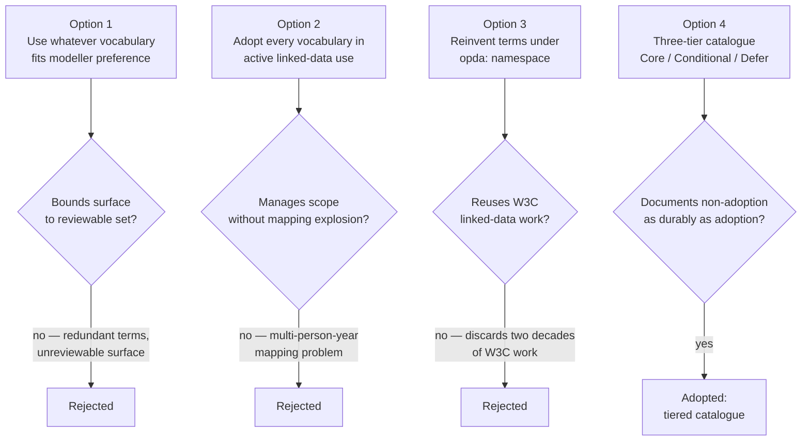
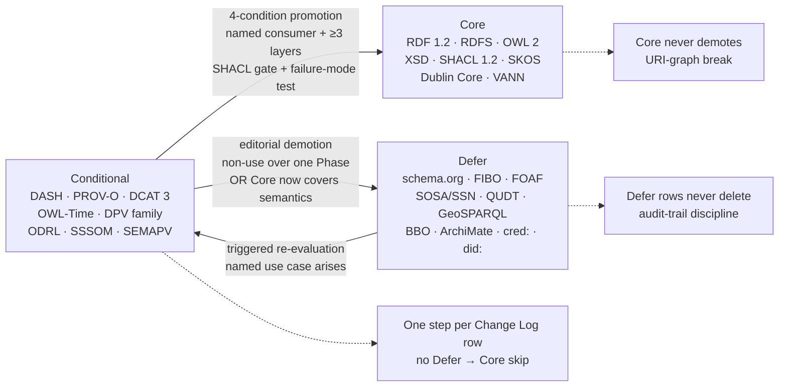
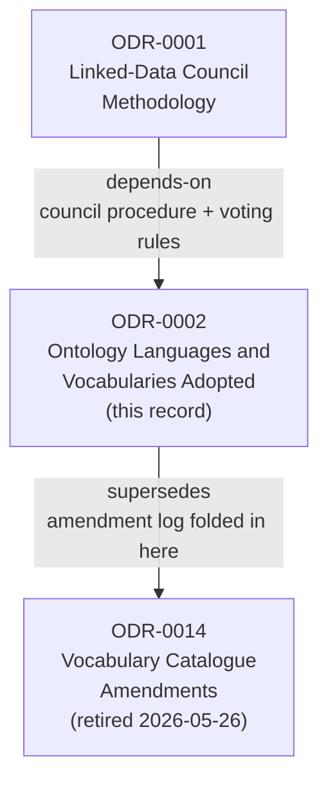

# Ontology Languages and Vocabularies Adopted

## Context and Problem Statement

OPDA's linked-data work needs a declared, bounded set of ontology languages and vocabularies. Without a published list, modellers will reach for whatever they know — producing redundant terms, unprincipled mixing of W3C Recommendations with community drafts, and an unreviewable surface area.

The H&M semantic-modelling programme has spent two years pressure-testing this question across roughly 90 ODRs and 250 Council sessions. A survey of every `@prefix` declaration in its `src/` ontology (~90 `.ttl` files) identifies 18 external standard vocabularies in active use. Every vocabulary admitted here is a W3C Recommendation, a maintained community standard, or a research-community ontology with broad linked-data uptake; the novelty is the OPDA-specific scoping — which vocabularies we adopt, with what conditions, in which layer.

The question this ODR answers: what closed, tiered catalogue should bound OPDA's vocabulary surface, and on what adoption discipline?

## Considered Options

* **Option A (chosen) — Three-tier survey-grounded catalogue (Core / Conditional / Defer).** Ports the H&M `src/` survey and rescopes for OPDA; the only option that bounds the vocabulary surface to a reviewable, authority-grounded set while documenting non-adoption as durably as adoption.
* **Option B — "Use whatever vocabulary fits the modeller's preference".** Rejected: produces redundant terms and unreviewable surface area within a year.
* **Option C — Adopt every vocabulary in active linked-data community use.** Rejected: surface area becomes a multi-person-year mapping problem with no business return.
* **Option D — Reinvent the necessary terms under an `opda:` namespace.** Rejected: discards two decades of W3C linked-data work and isolates OPDA outputs from external consumers.

## Decision Outcome

Chosen option: "Option A — three-tier survey-grounded catalogue", because it is the only option that bounds the vocabulary surface to a reviewable, authority-grounded set while documenting non-adoption as durably as adoption.

Adopt a three-tier survey-grounded catalogue — **Core / Conditional / Defer** — porting the H&M `src/` survey and rescoping for OPDA. It is the only option that bounds the vocabulary surface to a reviewable, authority-grounded set while documenting non-adoption as durably as adoption.

### Decision rationale — options evaluated

The three options considered and why only the tiered catalogue was adopted.

### Vocabulary tier structure

The three tiers and the direction of promotion/demotion that the catalogue governs.

### Consequences

* Reference the published catalogue when introducing any external vocabulary; do not debate the choice per file.
* Use canonical, dereferenceable URIs throughout — external consumers depend on them resolving.
* When a recurring "why don't we use schema.org / FOAF?" question is raised, point at the Defer column; do not relitigate without a triggering use case.
* Write SHACL gates for Conditional-tier scope as soon as the hm ADR-0147 R12 pattern is portable; until then, conditional-tier compliance is honour-system and reviewers MUST check it manually.
* Pin versions explicitly in ODRs only where currently declared (RDF 1.2, SHACL 1.2). When DPV / DCAT 3 / DASH undergo a *breaking* version change, raise a follow-up ODR.
* Keep the catalogue alive: when a vocabulary good for OPDA but absent from H&M is proposed, do not reject on "no precedent" alone — amend the catalogue.
* Treat ArchiMate and BBO as candidates for demotion to Defer at the first Council review if no process- or capability-modelling use case has materialised.

## More Information

- **Catalogue change log** lives in `## Rules` above. Sessions amending the catalogue: [session-001](./council/session-001-pdtf-schema-to-ontology.md) Q2 (multi-row amendment); [Scope-Check 1](./council/scope-check-1-programme.md) Q4 (governance-pattern: retire ODR-0014 — fold here) and Q7c (admit `cred:`, `did:`).
- **Superseded artefact**: [ODR-0014](./ODR-0014-vocabulary-catalogue-amendments.md) — formerly carried the Session 001 amendments as a partial-supersession record; retired 2026-05-26 per Scope-Check 1 Q4 (vote 7-1-1; Hendler dissent preserved). ODR-0014 retained as historical anchor for Council Session 001 provenance; its content is folded into `### Change log` above.
- **FOAF — ruled out.** Session 001 Q2 briefly reopened the Defer-tier FOAF entry (because `prov:Agent` is deliberately thin — no person/organisation distinction, no structured name), but FOAF has since been ruled out. The Kind layer uses the W3C Org ontology or a bespoke `opda:` model, with `prov:Agent` for the provenance role only. Settled in [ODR-0006](./ODR-0006-agents-and-roles.md); recorded in the change log above.
- **W3C VC / DID Compatibility Layer**: `cred:` and `did:` admitted to Defer per Scope-Check 1 Q7c; activation deferred to [ODR-0016](./ODR-0016-w3c-vc-did-compatibility.md).

### ODR relationship graph

This record's position in the ODR dependency chain, as declared in the frontmatter.

- **Provenance**: catalogue ported from a survey of the H&M `src/` ontology `@prefix` declarations. The adoption pattern (canonical URIs + local SHACL + no `owl:imports`) is inherited from H&M ONT-0071c/i/j and ONT-0086.
- **Related**: Council methodology [ODR-0001](./ODR-0001-linked-data-council-methodology.md); programme anchor [ODR-0003](./ODR-0003-pdtf-ontology-programme.md). Relates contextually to ADR-0001 (DCAM/DMBOK adoption); not a typed dependency.

## Rules

### Core — adopt unconditionally

The RDF stack and the small set of vocabularies every OPDA linked-data file is expected to use.

| Vocabulary | Prefix | Canonical URI | Role |
|---|---|---|---|
| **RDF 1.2** | `rdf` | `http://www.w3.org/1999/02/22-rdf-syntax-ns#` | Foundation — triples, types, lists; RDF 1.2 adds triple terms for statement-level annotation (native to the provenance/annotation layers, superseding reification) |
| **RDF Schema** | `rdfs` | `http://www.w3.org/2000/01/rdf-schema#` | Basic class/property hierarchy, labels, comments |
| **OWL 2** | `owl` | `http://www.w3.org/2002/07/owl#` | Formal class/property semantics, equivalence, restrictions |
| **XML Schema Datatypes** | `xsd` | `http://www.w3.org/2001/XMLSchema#` | Literal datatypes (string, date, integer, etc.) |
| **SHACL 1.2** | `sh` | `http://www.w3.org/ns/shacl#` | Validation shapes — the contract between the ontology and consuming applications; SHACL 1.2 (W3C Data Shapes WG) for expanded constraint expressivity |
| **SKOS** | `skos` | `http://www.w3.org/2004/02/skos/core#` | Concept schemes, taxonomies, controlled vocabularies (e.g. property-type lists, classification facets) |
| **Dublin Core Terms** | `dct` | `http://purl.org/dc/terms/` | Administrative metadata (`title`, `creator`, `issued`, `modified`, `identifier`). The hidden lingua franca of every other vocabulary listed below — adoption merely formalises what is already implicit |
| **VANN** | `vann` | `http://purl.org/vocab/vann/` | Vocabulary annotation — `vann:preferredNamespacePrefix`, `vann:preferredNamespaceUri` on `owl:Ontology` headers |

### Conditional — adopt where the use case is present

Admitted only in the layers/files where the corresponding modelling concern arises. Outside those layers they are not used (SHACL gates will be added to enforce this — see hm ADR-0147 R12 for the pattern).

| Vocabulary | Prefix | Canonical URI | Adopt for | Notes |
|---|---|---|---|---|
| **DASH** | `dash` | `http://datashapes.org/dash#` | UI/display hints on SHACL shapes (`dash:propertyRole`, `dash:viewer`, `dash:labelProperty`) | TopQuadrant-maintained. Required only on shapes that drive form generation |
| **PROV-O** | `prov` | `http://www.w3.org/ns/prov#` | Provenance — who, when, by what process a triple or dataset was produced | Pattern: canonical URIs + local SHACL, no `owl:imports` |
| **DCAT 3** | `dcat` | `http://www.w3.org/ns/dcat#` | Dataset catalogue records (OPDA-published datasets, PDTF reference data) | W3C Rec. Built on `dct:*`, so depends on the Dublin Core core adoption above |
| **OWL-Time** | `time` | `http://www.w3.org/2006/time#` | Temporal modelling — Instant, Interval, durations. **Actively-adopted** for proprietorship / lease-term / claim-validity intervals per Session 001 Q2 (≈6-3 over "await a concrete consumer" dissent). | W3C Rec 2020. PROV-O's `prov:atTime` (instant) without OWL-Time intervals is incoherent for the interval-bearing entities (Guizzardi/Gandon). |
| **DPV** (+ `dpv-gdpr`, `dpv-pd`, `dpv-legal`) | `dpv`, `dpv-gdpr`, `dpv-pd`, `dpv-legal` | `https://w3id.org/dpv#`, `https://w3id.org/dpv/legal/eu/gdpr#`, `https://w3id.org/dpv/pd#`, `https://w3id.org/dpv/legal#` | Data-privacy classification — personal-data flags, processing purposes, lawful basis, regulatory tagging. **Phase-1 annotation adopted** per Session 001 Q2; **lawful-basis / consent / purpose class vocabulary** is a recorded Pandit dissent — TBox-expressible debate routed to [ODR-0012](./ODR-0012-data-governance-layer.md). | Directly relevant to property data carrying buyer/seller/agent personal data. |
| **ODRL** | `odrl` | `http://www.w3.org/ns/odrl/2/` | Machine-readable consent and data-licensing policies. **Vocabulary admitted; policy-authoring deferred to Phase 2** per Session 001 Q2 (Guarino: ODRL `Policy`/`Permission` bite only on instances — TBox alone asserts nothing). | Restrict to layers concerned with access-control / data-rights expression; **not** for governance-process modelling. Trigger for policy authoring owned by [ODR-0012](./ODR-0012-data-governance-layer.md). |
| **SSSOM** | `sssom` | `https://w3id.org/sssom/` | Mapping metadata (mapping justification, confidence, mapping author) on cross-vocabulary mappings. **Deferred for internal overlay refs** per Session 001 Q2 (use `dct:source` to minted form-question IRIs instead; SSSOM earns its place mapping to *external* vocabularies — FIBO, INSPIRE, HMLR). **Cagle dissent recorded (≈5-4).** | Pair with `semapv:` for the process side when external mappings activate. |
| **SEMAPV** | `semapv` | `https://w3id.org/semapv/vocab/` | Mapping-process vocabulary (manual, lexical-match, logical-reasoning, etc.). Deferred alongside SSSOM. | Used inside SSSOM mapping records once SSSOM activates. |

### Defer — reviewed and not adopted (yet)

Listed explicitly so future modellers know the question has been asked and the answer was "not now."

| Vocabulary | Prefix | Why deferred | Revisit when |
|---|---|---|---|
| **schema.org** | `schema` | Overlaps SKOS, Dublin Core, DCAT in confusing ways; no benefit inside the ontology core. H&M Council Session 371 deferred adoption (1-3-5 vote) | A concrete open-web publication use case materialises (e.g. JSON-LD embedding for SEO of OPDA documents). Even then, scope to publication outputs, not the ontology source |
| **DCAT-AP / DCAT-AP EU** | `dcatap` | Adds EU-government catalogue profile constraints that may not match OPDA's UK-property-data scope. H&M S371 deferred (3-3-3 deadlock) | OPDA actually needs to publish to data.europa.eu or a UK government open-data portal that requires it |
| **FIBO** | `fibo` | Financial Industry Business Ontology — large surface area; not used in H&M `src/`. Property-transaction finance touches FIBO but PDTF v2 does not depend on it | A property-transaction-finance modelling task arises that would otherwise require reinventing FIBO concepts |
| **SOSA/SSN, QUDT, GeoSPARQL** | (various) | Sensor, units-of-measurement, and geospatial vocabularies. Not in H&M `src/`. Plausibly relevant to OPDA (energy-performance sensors, EPC ratings with units, property-location geometry) but no current consumer | A pipeline producing the corresponding data starts (e.g. EPC/MEES ingestion, plot-boundary linked data) |
| **FOAF** | `foaf` | Person/Agent modelling — superseded by `prov:Agent` + Dublin Core for our purposes. Not in H&M `src/`. Session 001 Q2 briefly reopened this; **ruled out** (programme decision — see References) | Not adopted (decided). The Kind-layer choice — W3C Org ontology vs bespoke `opda:`, `prov:Agent` for provenance only — is settled in [ODR-0006](./ODR-0006-agents-and-roles.md) |
| **BBO (BPMN-Based Ontology)** | `bbo` | Process modelling — no current property-transaction workflow-publishing target. **Out for this programme** per Session 001 Q2 (unanimous). | A concrete workflow-publishing use case materialises. |
| **ArchiMate 3.2 (Motivation + Strategy + Application layers)** | `archimate` | Capability/intent and service-architecture modelling — no current consumer. **Out for this programme** per Session 001 Q2 (unanimous). | A concrete capability or service-catalogue use case materialises. |
| **W3C Verifiable Credentials Data Model 2.0** | `cred` | Verifiable Credentials — `cred:VerifiableCredential`, `cred:VerifiablePresentation`, related issuer/holder/verifier roles. Catalogue-admitted by Scope-Check 1 (Q7c, 2026-05-26); activation deferred to [ODR-0016](./ODR-0016-w3c-vc-did-compatibility.md). | Session-009 Q8 surfaces real VC-side decisions, OR session-012 Phase-2 consent receipts land, OR a real wallet/DID consumer enters scope. |
| **W3C DID Core 1.0** | `did` | Decentralised Identifiers — `did:web`, `did:key`, `did:jwk` resolution; DID Documents; signature suites. Catalogue-admitted by Scope-Check 1 (Q7c); activation deferred to [ODR-0016](./ODR-0016-w3c-vc-did-compatibility.md). | Same as `cred:` — VC ecosystem and DID resolution arrive together. |

### Promotion and demotion criteria

*Added by [Session 002](./council/session-002-vocabulary-catalogue.md) Q3, drawing on the DCMI Usage Board admission test (Baker, Bechhofer, Isaac, Miles 2013), FIBO Production-tier discipline (Kendall+Davis), W3C TAG cool-URIs persistence (Hendler), and Cagle DA's operational-check demand. 9-0 vote.*

**Conditional → Core promotion.** ALL FOUR conditions must hold:

1. **Named consumer.** At least one OPDA module ODR cites the vocabulary in its `## Rules`, with the vocabulary's terms appearing in published Turtle (not just plan-stage prose).
2. **Layer count.** Used in ≥3 independent OPDA modules / layers.
3. **SHACL gate.** A SHACL gate enforcing the Conditional-layer scope has been published (per hm ADR-0147 R12 pattern referenced in `### Enforcement`).
4. **Failure-mode test.** A diagnostic exemplar (per Session 001 Q1 amendment lineage) where *removing* the vocabulary causes a specific named test to fail, demonstrating load-bearing work rather than decorative annotation.

**Demotion is asymmetric** (Allemang+Hendler joint position; Hendler's preserved Scope-Check 1 Q4 audit-trail concern):

- **Core never demotes.** URI-graph break — every downstream module dereferences Core, every published header includes its prefix. Deprecation is recorded in `## Change log` (the term is `dcterms:isReplacedBy`-style retired) but the row stays. W3C Process precedent (REC + ERRATA + REC-revision keeps the lineage visible).
- **Conditional → Defer** is editorial; requires (a) non-use across one full Phase OR (b) Core entry now provides the semantics. Named voter; Change Log row attribution mandatory.
- **Defer rows never delete.** Audit-trail discipline — reviewed-and-not-adopted is a governance act; row stays so future maintainers don't re-litigate. FOAF / BBO / ArchiMate are canonical.
- **One-step-per-Change-Log-row** (Hendler sub-rule): tier movements cross one boundary at a time (Defer → Conditional → Core; no Defer → Core skip).

**De-listing** (Defer → out of catalogue) is reserved for:

- The W3C / maintainer formally withdraws the vocabulary.
- The OPDA WG (or adopting project's governance per ODR-0001 §Adoption) rules the vocabulary out by name.

Otherwise Defer entries persist indefinitely — the recurring-question record is the value.

**Review cadence** (Davis position). Annual author-only review reads current W3C status, refreshes the `W3C status` field per entry, and proposes movements per the four-condition test; only contested rows escalate to Reduced Council. New-vocabulary admission requires Reduced Council minimum (per ODR-0001 §When to use the Council).

### Profile-pinning ownership

*Added by [Session 002](./council/session-002-vocabulary-catalogue.md) Q5. Singapore Framework's DCAP-by-consumer pattern (Nilsson, Baker, Johnston 2008) is the precedent. 9-0 vote with Cagle DA full withdrawal.*

When an admitted Conditional entry points at a *profile slice* of a large upstream vocabulary (DPV's `dpv-pd` slice; an eventual FIBO module slice; an ODRL Common Vocabulary slice; PROV-O qualified-attribution forms), the profile authoring rule chain is:

1. **Module proposes.** Profile-pin proposals originate in the consuming module's Council session (e.g. ODR-0012 proposes `dpv-pd` slice; ODR-0010 proposes DASH-for-form-driving slice; ODR-0009 proposes PROV-O qualified-attribution slice).
2. **Catalogue records.** This catalogue records the pin in the entry's `Profile pin` column with attribution to the consuming session, and adds a Change Log row.
3. **Module veto.** Module owners retain veto over pins affecting their shape graphs.
4. **Cross-module conflict default to union.** Where multiple modules consume the same vocabulary with different profile needs (e.g. DASH for ODR-0010 form-driving AND ODR-0013 identity-key validation), the catalogue records the **union** of pinned slices, not the most restrictive.
5. **WG ratifies disputes only.** The adopting project's WG ratifies only when modules cannot agree; otherwise the chain is module-proposes → catalogue-records → consumed.

The catalogue does NOT author profile shape internally.

### Reference-not-import (normative)

*Added by [Session 002](./council/session-002-vocabulary-catalogue.md) Q4. Hoists Adoption-pattern rule 3 to first-class normative status. 9-0 vote with Cagle DA full withdrawal on the three-value `adoption-mode` field qualification.*

Every Conditional-tier entry adopts by **reference, not import**, as the default MUST. Each row declares its `adoption-mode`:

| `adoption-mode` | When | Discipline |
|---|---|---|
| `reference-only` (default) | The vocabulary's terms are used as annotations, type assertions, or single-class hooks. The consumer's processor can dereference the canonical URI as needed. | Canonical URI used in OPDA ontologies; **no `owl:imports`**; local SHACL constraints written in the consuming OPDA layer. External consumers fetch the upstream vocabulary themselves. Berners-Lee 2006 LDP Principles 2–3; W3C TAG "Cool URIs Don't Change" (2008). |
| `slice-import` | The vocabulary's class hierarchy is load-bearing on OPDA SHACL shapes (e.g. DPV lawful-basis; ODRL action hierarchy if activated; FIBO when activated), OR the vocabulary contributes a controlled vocabulary consumed by `sh:in` (e.g. SSSOM/SEMAPV when activated). | A *named* profile slice is imported via `owl:imports` of the slice URI, not the whole vocabulary. Used only where the slice is small and the reasoner / SHACL processor needs the axioms. Pair with the `Profile pin` field (per `### Profile-pinning ownership`). Per-row justification in `Notes`. |
| `full-import` | The vocabulary is a spec the OPDA `## Rules` reference as authoritative (SHACL, OWL 2, RDF 1.2 — Core tier). | `owl:imports` of the whole vocabulary. Reserved for Core tier. Per-row justification in `Notes` if applied to Conditional. |

A row MUST justify any choice other than `reference-only` with a one-line rationale in the row's `Notes` column. The Council session that authored the choice attributes via `## Change log`.

Rationale: reference-only is the FIBO discipline (`fibo-fnd-utl-av` references `dct:` without `owl:imports`); the symmetric W3C TAG persistence rule applied to imports — don't import URIs you haven't committed to maintaining. Pandit's ODR-0012-side concern on `dpv-pd` bundled-import for runtime PII hierarchy validation is recorded as an ODR-0012 implementation concern (the catalogue rule is `reference-only`; ODR-0012 may author `slice-import` when the lawful-basis class vocabulary surfaces).

### Change log

This catalogue is governed in place: amendments to tiering or rationale are recorded as rows here, attributed to the Council session that authored them. The amendment-ODR pattern (formerly ODR-0014) is **retired** by Scope-Check 1 (2026-05-26, Q4 vote 7-1-1) on FIBO / DCMI / W3C-WD-discipline grounds; provenance is preserved here, not in a parallel record. Hendler's dissent on the retirement ("every governance act stays permanently") is recorded in the follow-up plan's risks (`docs/plan/council-followup-sessions.md` §9), not silenced.

| Date | Source | Row(s) affected | What changed |
|---|---|---|---|
| 2026-05-20 | [Council Session 001](./council/session-001-pdtf-schema-to-ontology.md) Q2 | OWL-Time | Promoted to actively-adopted Conditional (was Conditional-deferred; PDTF brief had excluded it). Reason: PROV-O instants without OWL-Time intervals is incoherent for proprietorship / lease / claim-validity intervals (Guizzardi/Gandon). Vote ≈6-3 over "await a concrete consumer" dissent (Allemang/Davis). |
| 2026-05-20 | Session 001 Q2 | DCAT 3 | Confirmed Conditional (Davis wanted Core; Baker held Conditional). Reason: ontology-as-published-dataset + reference data; near-zero marginal cost over `dct:`. Not Core — no catalogue-publishing task this round. |
| 2026-05-20 | Session 001 Q2 | SSSOM / SEMAPV | Deferred for internal overlay refs; use `dct:source` to form-question IRIs in the interim. SSSOM earns its place mapping to *external* vocabularies (FIBO, INSPIRE, HMLR RDF). **Cagle dissent recorded (≈5-4).** Re-open trigger (per Session 014's owner role): external mapping work activates SSSOM. |
| 2026-05-20 | Session 001 Q2 | ODRL | Vocabulary adopted; policy-authoring deferred to Phase 2. Reason: ODRL `Policy`/`Permission` bite only on instances — TBox alone asserts nothing (Guarino). Policy-activation trigger owned by [ODR-0012](./ODR-0012-data-governance-layer.md) Q4. |
| 2026-05-20 | Session 001 Q2 | DPV family | Phase-1 annotation adopted. Pandit's broader-TBox dissent (lawful-basis / consent / purpose class vocabulary) recorded as live, routed to [ODR-0012](./ODR-0012-data-governance-layer.md). |
| 2026-05-20 | Session 001 Q2 | Dublin Core | Rationale reclassified: "commons substrate" (was "administrative metadata"). No tier change. DCAT, PROV-O, SKOS, VANN all already depend transitively on `dct:` (Baker); adopting it formalises the implicit. |
| 2026-05-20 | Session 001 Q2 | BBO, ArchiMate | Moved Conditional → Defer (out for this programme). Unanimous — no process- or capability-modelling task. |
| 2026-05-20 | Session 001 Q2 | OBO RO | Question raised (Kendall: transitive part-of; Davis: biology-flavoured, use `dct:isPartOf`). No consensus; left open; routed to [ODR-0005](./ODR-0005-property-land-identity-crux.md). |
| 2026-05-20 | Session 001 Q2 | FOAF | Briefly reopened; **ruled out programme-wide**. Defer-row negative on FOAF stands. Kind-layer choice (W3C Org vs bespoke `opda:`) routed to [ODR-0006](./ODR-0006-agents-and-roles.md); `prov:Agent` for provenance role only. (Reason text tightened by Session 002 Q12 — see row below.) |
| 2026-05-26 | [Scope-Check 1 — Programme cut](./council/scope-check-1-programme.md) Q7c | `cred:`, `did:` | Admitted to Defer tier (W3C VCDM 2.0; DID Core 1.0). Activation deferred to [ODR-0016](./ODR-0016-w3c-vc-did-compatibility.md). Vote 8-1 (Davis + Pandit spawn-now; majority defer-with-named-spawn; Cagle defer-without-spawn). |
| 2026-05-26 | Scope-Check 1 Q4 | Catalogue governance pattern | ODR-0014 (Vocabulary Catalogue Amendments) retired. Amendments now live here as `## Change log` rows; no parallel amendment-record. Vote 7-1-1 (Hendler dissent on permanence preserved in plan §9). |
| 2026-05-27 | [Session 002](./council/session-002-vocabulary-catalogue.md) (umbrella) | Catalogue meta-discipline | (Q1) Three-tier cut confirmed (8-1). (Q2) `W3C status`, `Adoption mode`, `Profile pin` fields added to Conditional table (9-0). (Q3) New `### Promotion and demotion criteria` subsection: four-condition Conditional→Core promotion (named consumer + layer count + SHACL gate + failure-mode test); asymmetric demotion; one-step-per-row sub-rule; annual review cadence (9-0; Cagle DA withdrew). (Q4) New `### Reference-not-import (normative)` subsection + three-value `adoption-mode` field (9-0; Cagle DA withdrew). (Q5) New `### Profile-pinning ownership` subsection — module-owner-proposes / catalogue-records / WG-disputes-only / cross-module-conflicts-default-to-union (9-0; Cagle DA withdrew). (Q6) `W3C status` three-part field (body + status + date) on Conditional + Core tables (9-0). |
| 2026-05-27 | Session 002 Q7 | OWL-Time | Actively-adopted Conditional confirmed. Four-part demotion trigger named: (1) end-of-Phase-3 gate; (2) zero downstream consumers in published Turtle (`time:Interval`/`time:Instant` absent from build output); (3) published-Turtle audit by Queen of demotion session; (4) named voter ratifies. If demotion fires, the Allemang/Davis Session 001 dissent ("await a concrete consumer") is cited in the demotion row. |
| 2026-05-27 | Session 002 Q8 | DCAT | Conditional confirmed with four-trigger Core-promotion gate (any one fires): (1) OPDA publishes `dcat:Dataset` to named third-party catalogue (data.gov.uk, data.europa.eu, HMLR, ONS, GOV.UK Open Data, data.world); (2) OPDA publishes own catalogue endpoint; (3) consuming application reads OPDA datasets via DCAT discovery; (4) OPDA ontology itself registered as `dcat:Dataset` on external catalogue. Davis Session 001 Core-push position vindicated by gate construction. |
| 2026-05-27 | Session 002 Q9 | SSSOM / SEMAPV | Defer confirmed; named-event re-open trigger: (1) named external vocabulary mapping being authored — one of {FIBO, INSPIRE, HMLR RDF, ESCO, ISO 3166}; (2) named consumer for the mapping exists; (3) named Council session triggers re-evaluation. Activation moves Defer → Conditional with `Profile pin: mapping-records-only`. Cagle Session 001 dissent (≈5-4) preserved as live position. |
| 2026-05-27 | Session 002 Q10 | ODRL | Vocabulary admission confirmed; policy-authoring activation owned by [ODR-0012](./ODR-0012-data-governance-layer.md) Q4 with three named-event triggers (any one activates): (1) ODR-0012 authors consent-receipt instance in published Turtle; (2) ODR-0009 authors VC-tied policy instance (`cred:VerifiableCredential` + `odrl:Policy`); (3) external policy-authoring consumer (data licensor; FCA / ICO / EU regulatory technical standards / UK MEES guidance) cites OPDA in architecture documentation OR requests ODRL-typed Turtle. Cross-references Q13 — consent-receipt instance is also a `cred:`/`did:` activation trigger; coupled-trigger event records single Change Log row. |
| 2026-05-27 | Session 002 Q11 | OBO RO | **Defer** confirmed (5-2-2). Genuine formal-pair split recorded: Gandon DEFER (LDP Principle 3; biology-flavoured dereferenceability); Guizzardi ADOPT CONDITIONAL (well-founded mereology over `dct:isPartOf` editorial-strength; re-alias under `opda:` with `owl:equivalentProperty`). Kendall ADOPT-if-≥2-modules; Davis REJECT. Routing: question owned by [ODR-0005](./ODR-0005-property-land-identity-crux.md) follow-up session, where IC discipline + diagnostic exemplars over the flat→block→estate hard case (especially when flat UPRN is absent) adjudicate. Re-open trigger: an OPDA SPARQL query produces a wrong answer under `dct:isPartOf` that `ro:part-of` would correct, OR ODR-0005's IC discipline requires well-founded mereology unreachable via `dct:isPartOf` + `opda:` local predicates. Cagle DA withdrew (Defer + named re-open trigger meets withdrawal condition). |
| 2026-05-27 | Session 002 Q12 | FOAF | Rule-out reason recorded. **(1) Superseded by composition**: `prov:Agent` (PROV-O Rec 2013) + W3C Org Ontology (Reynolds 2014, W3C Rec) + `dct:` (Core tier) + `opda:Person`/`opda:Organisation` ([ODR-0006](./ODR-0006-agents-and-roles.md)) covers the FOAF surface OPDA needs with UFO category commitments + ICs FOAF does not provide (per ODR-0001 A9 discipline for `kind: pattern` records). **(2) Shape-of-the-Web era + Kind-level category mismatch**: FOAF's "Friend of a Friend" social-Web semantics (Brickley & Miller 2014, FOAF 0.99 spec) is a category mismatch for property-data trust framework (regulated conveyancers, lenders, AML-checked participants — not a social acquaintance network). FOAF's structured-name surface (`foaf:firstName` / `foaf:familyName`) is superseded by `opda:Name` (ODR-0006 — structured datatype with UFO Mode commitment and IC over name-change / marriage / transliteration / dual-citizen multi-name hard cases). Defer-row negative on FOAF stands. |
| 2026-05-27 | Session 002 Q13 | `cred:`, `did:` | Defer-tier admission confirmed (per Scope-Check 1 Q7c, 8-1). Third activation trigger operationalised: "real wallet/DID consumer enters scope" → **named wallet/DID consumer** (UK gov OneLogin; EU eIDAS 2.0 wallet provider; gov.uk Verify successor) cites OPDA in architecture documentation OR requests `cred:`/`did:`-typed Turtle from OPDA's namespace. Hendler one-step-per-Change-Log-row sub-rule (Defer → Conditional → Core; no skipping) recorded in `### Promotion and demotion criteria`. |

### Adoption pattern (applies to every Conditional entry)

1. **Canonical URI** — use the vocabulary's published namespace, not a local re-mint.
2. **Local SHACL enforcement** — write SHACL shapes in the relevant OPDA layer/file that constrain usage (cardinality, datatype, severity).
3. **No `owl:imports`** — reference by URI only; let external consumers fetch the upstream ontology themselves.
4. **`vann:` header on every `owl:Ontology`** — declare the preferred prefix so dereferencers can render snippets consistently.
5. **Recorded provenance** — when an external vocabulary appears in a new layer for the first time, the introducing commit or ODR cites the use case.

### Enforcement

- Each row above declares canonical URI, role, and constraint; modellers MUST reference the canonical URI and MUST NOT re-mint terms in `opda:` that duplicate adopted-tier semantics.
- Conditional-tier gating is honour-system until SHACL gates are written; the follow-up is tracked in `docs/governance/deferred-work`.
- The Defer tier is reviewable on a schedule (annual, or whenever a triggering use case arises). Promotion/demotion is recorded in `### Change log` above, attributed to the Council session that authored the change.
- The amendment-ODR pattern is retired: changes to this catalogue land as new rows in `### Change log`, not in a parallel record.

