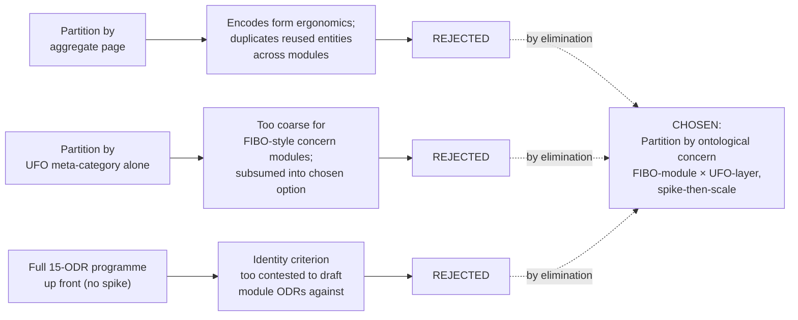
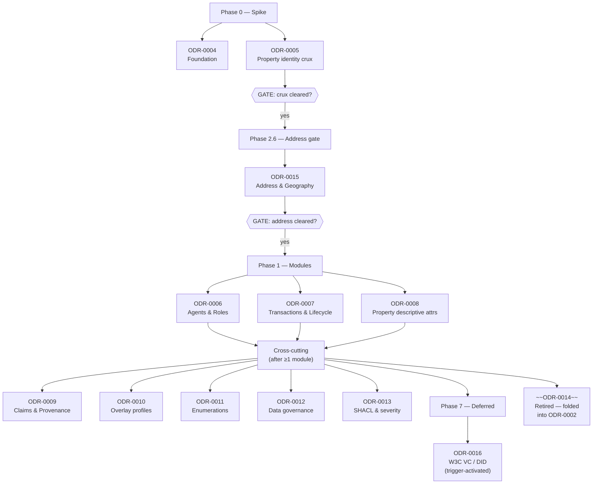
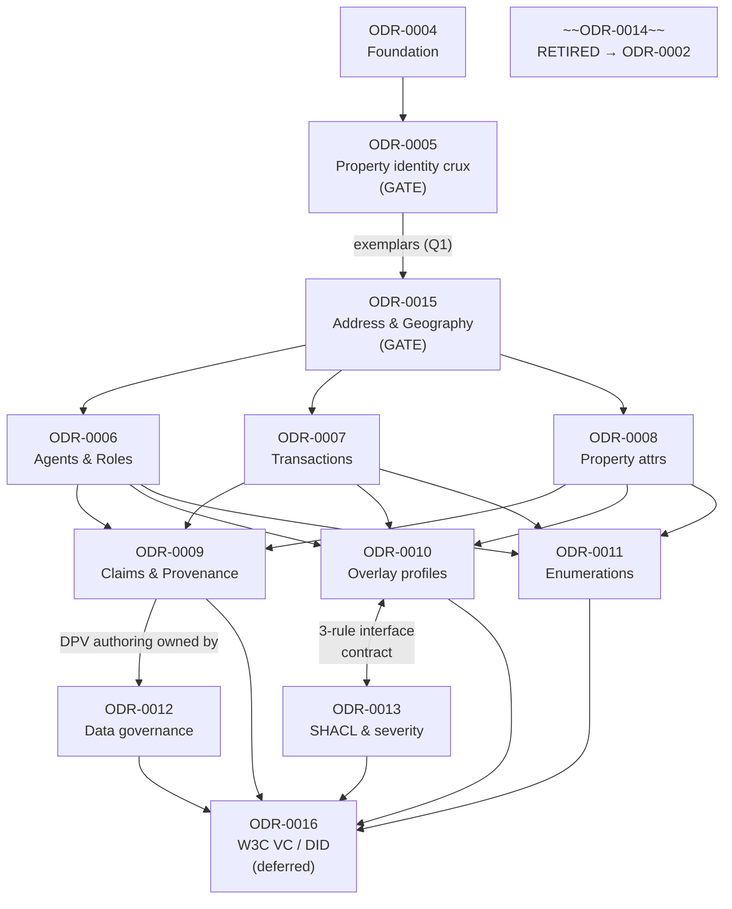

# PDTF to Ontology: Programme and Work Breakdown (Anchor)

## Context and Problem Statement

This is the anchor record for converting the Property Data Trust Framework v3 JSON Schema into a linked-data ontology. It records the programme-level decisions from Council Session 001, sequences the work, and links every work-package ODR. It is planning only — each linked ODR is a stub to be fleshed out in its own follow-up session.

The conversion problem is not a mechanical Schema-to-RDF rewrite. The web-app schema section already names the load-bearing defect (the implicit Property entity, page 37): UPRN appears in four leaf paths, address in many, an INSPIRE ID and a title-linked address besides, with zero schema-level joins between them — a missing class with no identity criterion. JSON Schema gives slot-names, not global identifiers, so the genuine modelling question is *which things get URIs*. The mechanical half (named slot → `DatatypeProperty` with `xsd:` range) is generated; Council cycles are reserved for the ambiguous moves (aggregate boundaries, cross-overlay synonymy, `oneOf`-as-subclass-vs-state).

Inputs converted: **`pdtf-transaction.json`** (37,224 lines, JSON Schema Draft-07) — base residential-property-transaction model for England & Wales plus the `verifiedClaims` OIDC4IDA/eIDAS envelope and 10+ deep-merge form overlays (BASPI, TA6/7/10, NTS, LPE1, CON29R/DW, LLC1, FME1); the web-app schema section (11 pages, 3,561 leaves walked, 15 overlays cross-referenced); the PDTF business glossary (54 trust-framework/open-banking terms merged with schema annotations and W3C VC / DID Core / ToIP inheritances) supplying authoritative definitions for `rdfs:label` / `skos:prefLabel` / `skos:definition`; the PDTF data dictionary (1,557 unique leaves across 8,458 path entries; 935 of 1,556 base leaves carry semantic annotation; per-form counts — `baspi5` 318, `rds` 196, `piq` 184, `ta6` 178, `nts2` 160, `lpe1` 136, `con29R` 125, `ntsl2` 124, `ta7` 98, `ta10` 90, `fme1` 78, `oc1` 68, `con29DW` 34, `sr24` 7, `llc1` 3) and the role-enum members that become SKOS schemes. The term-sourcing convention (how each label/definition carries `dct:source` back to its glossary row or schema leaf path) is owned by [ODR-0004](./ODR-0004-pdtf-ontology-foundation.md), not here.

Convening constraints for Session 001: data model only (TBox; no instance-data deliverable, later amended to admit diagnostic exemplars); vocabulary floor of Core + DASH + PROV-O + the data-governance family; BBO and other non-relevant Conditional vocabularies excluded; output a set of work-partitioning ODRs plus this anchor.

## Considered Options

* **Option A (chosen) — Partition by ontological concern (FIBO-module × UFO-layer), spike-then-scale.** FIBO-style modules reconciled with Guizzardi's UFO Kind/Role/Relator layering; sequence spike-then-scale with the Property identity criterion as gating crux.
* **Option B — Partition by aggregate page.** Rejected: encodes form ergonomics, not ontological cohesion; duplicates reused entities (Address, Name, Person, Organisation) across modules; treats Evidence and VerifiedClaims as siloed pages when they are cross-cutting relations.
* **Option C — Partition by UFO meta-category alone.** Rejected as a sole cut: too coarse to map onto FIBO-style concern modules; subsumed into the chosen option as its layering axis.
* **Option D — Drive the whole 15-ODR programme up front (no spike).** Rejected: the identity-criterion question is too contested to draft module ODRs against; spike-then-scale front-loads the hard constructs into one proven vertical slice.

The diagram below summarises the three rejected partition strategies and why the chosen option was preferred.



## Decision Outcome

Chosen option: "Option A — partition by ontological concern, spike-then-scale", because mirroring the JSON tree encodes form ergonomics rather than ontological cohesion, and spike-then-scale front-loads the genuinely hard constructs before the largely-mechanical overlay scale-out.

Partition the PDTF→ontology programme **by ontological concern** (FIBO-style modules reconciled with Guizzardi's UFO Kind/Role/Relator layering), not by aggregate page, because mirroring the JSON tree encodes form ergonomics rather than ontological cohesion; sequence the work **spike-then-scale** with the Property identity criterion as the gating crux, prove the pipeline end-to-end on one BASPI5 vertical slice, then scale the remaining overlays and modules. This supersedes the by-aggregate-page breakdown of the earlier placeholder stubs.

### Consequences

* Declare reused entities (Address, Name, Person, Organisation) once, not per aggregate page, and isolate open-world class semantics from closed-world shape validation.
* Promote Evidence/Claims/Enumerations/Governance/Validation to cross-cutting status; model them as the relations they are rather than forcing them into module silos.
* Keep the published namespace flat; module structure is editorial, so re-grouping concepts later does not break dereferenceable URIs.
* Front-load the genuinely hard constructs (identity criteria, `sh:xone`, capacity, DASH editors, `dct:source`) into a single proven vertical slice before the largely-mechanical overlay scale-out.
* Treat the identity crux ([ODR-0005](./ODR-0005-property-land-identity-crux.md)) as a hard single-point gate early in the programme: module ODRs (0006–0008) are not drafted in anger until it clears.
* Re-cut any work already premised on the superseded by-aggregate-page placeholder stubs to the concern partition.
* Update this anchor as ODRs progress; do not duplicate per-ODR analysis here.

## More Information

- Council methodology: [ODR-0001](./ODR-0001-linked-data-council-methodology.md).
- Vocabulary catalogue: [ODR-0002](./ODR-0002-ontology-language-adoption.md) (amendments folded inline; ODR-0014 retired per Scope-Check 1 Q4).
- Phase 0 spikes: [ODR-0004](./ODR-0004-pdtf-ontology-foundation.md), [ODR-0005](./ODR-0005-property-land-identity-crux.md).
- **Phase 2.6 gate**: [ODR-0015](./ODR-0015-address-and-geography.md) — Address & Geography (added per Scope-Check 1 Q7a).
- Phase 1 modules: [ODR-0006](./ODR-0006-agents-and-roles.md), [ODR-0007](./ODR-0007-transactions-and-lifecycle.md), [ODR-0008](./ODR-0008-property-descriptive-attributes.md).
- Cross-cutting: [ODR-0009](./ODR-0009-claims-evidence-provenance.md), [ODR-0010](./ODR-0010-overlay-profile-mechanism.md), [ODR-0011](./ODR-0011-enumeration-vocabularies.md), [ODR-0012](./ODR-0012-data-governance-layer.md), [ODR-0013](./ODR-0013-shacl-validation-and-severity.md).
- **Phase 7 deferred**: [ODR-0016](./ODR-0016-w3c-vc-did-compatibility.md) — W3C VC / DID Compatibility Layer (named per Scope-Check 1 Q7c; activation triggered).
- **Retired**: ~~[ODR-0014](./ODR-0014-vocabulary-catalogue-amendments.md)~~ — folded into ODR-0002 per Scope-Check 1 Q4.
- Deliberation provenance — Session 001: [session-001-pdtf-schema-to-ontology](./council/session-001-pdtf-schema-to-ontology.md). Full per-question positions, vote tallies, recorded dissents (including Guarino's Devil's-Advocate scorecard and DA withdrawals) live there; this anchor records sequencing and cross-links only.
- Ratification provenance — Session 003 (Author-only; 2026-05-27; Queen Kendall): [session-003-pdtf-ontology-programme](./council/session-003-pdtf-ontology-programme.md). Records phase ordering (plan §5), default-vs-fast-path option (plan §5.1), identity-crux gate check, module count, programme retirement criterion, status-discipline bidirectional-update protocol, and shared-question routing (plan §4.1) into the `## Rules` above. No fresh deliberation claimed; every item plan- or precedent-sourced.
- Programme-level scope review: [Scope-Check 1 — Programme cut](./council/scope-check-1-programme.md) (2026-05-26, Queen Kendall, DA Davis). Verdict 8-1 APPROVE the cut with nine named amendments; spawned ODR-0015, named ODR-0016, retired ODR-0014, moved DPV co-annotation authoring to 0012, added Cagle's three-rule interface contract between 0010 and 0013, recorded Guizzardi's UFO-per-scheme sub-finding for 0011, surfaced Gandon-vs-Guizzardi methodology gap (routed to ODR-0001 amendment queue).
- Methodology-tooling review: [Scope-Check 2 — Hive-mind vs Agent fan-out](./council/scope-check-2-hive-vs-swarm.md) (2026-05-26, Queen Kendall, DA Davis). Verdict 5-1 SELECTIVE; Agent fan-out stays default. Two pilot sessions named for ruflo hive-mind consensus: **S005 (Identity crux) with `consensus-mode: hive-mind/byzantine`** (tests cross-conditional voting hypothesis), and **S011 Q8 (UFO meta-category per scheme) with `consensus-mode: hive-mind/typed-output`** (tests typed downstream consumption hypothesis). Scope-Check 2 B1 (consensus-mode framework) landed in ODR-0001 via direct amendment 2026-05-27 (Author-only self-amendment); pilots unblocked. A9 (Scope-Check 1 — Gandon-Guizzardi methodology gap) still pending but not strictly blocking — recommended before S005. Pilots are an evaluation budget, not an adoption commitment — retire-or-extend decision at session close.
- Project adoption context: [OPDA Council adoption record](./council/adoption.md) — declares OPDA's project-specific instantiation of the methodology (panel weighting, pre-elected extended panel, governance handoff, track record, when-to-use additions, council directory path). Per ODR-0001's portable methodology design, project specifics live in the adoption record, not in the methodology body.
- Follow-up programme execution: [Council follow-up sessions](../../plan/council-followup-sessions.md) — operationalises the work-breakdown above by attaching one Council session to each linked stub, with dependency-ordered phasing and explicit gates at ODR-0004 (Foundation), ODR-0005 (Identity crux), and ODR-0015 (Address).
- Source inputs: `pdtf-transaction.json`; web-app schema section (`src/pages/schema/*.astro`, `source/_content/schema/*.md`); PDTF business glossary (`source/00-deliverables/semantic-models/business-glossary.md`); PDTF data dictionary (`source/00-deliverables/semantic-models/data-dictionary.md`).

## Rules

**Target versions.** RDF 1.2 and SHACL 1.2, per the Core-tier pin in [ODR-0002](./ODR-0002-ontology-language-adoption.md).

**Programme-level decisions adopted from Session 001.**

| Q | Decision | Detail |
|---|---|---|
| Q1 | Genuine modelling, generator-assisted | Mechanical slot→property translation is generated; Council time reserved for ambiguous moves. Diagnostic exemplars admitted to test identity criteria (the TBox/ABox split is a deliverable boundary, not a thinking boundary). |
| Q2 | Vocabulary set | Core + DASH + PROV-O (mandatory in claims/milestone layers) + DPV Phase-1 + OWL-Time (Conditional, newly adopted) + DCAT (Conditional). ODRL adopted but policy-authoring deferred. SSSOM deferred. BBO/ArchiMate out. → [ODR-0014](./ODR-0014-vocabulary-catalogue-amendments.md) amends [ODR-0002](./ODR-0002-ontology-language-adoption.md). |
| Q3 | Partition by ontological concern, NOT by aggregate page | FIBO-module × UFO-layer reconciliation; Evidence/Claims/Enums/Governance/Validation cross-cutting; OWL class-graph separated from SHACL shapes-graph; flat published namespace, modules editorial-only. |
| Q4 | Property defect → multi-class split; identity criterion is the gating crux | Physical Property distinct from the legal/registered thing; SHACL/DASH uniqueness as the primary checkable key; no `owl:sameAs`; Endurant commitment + ICs over hard cases deferred to [ODR-0005](./ODR-0005-property-land-identity-crux.md), exemplar-validated. |
| Q5 | Overlays → SHACL profiles | Reified as `opda:ValidationContext`; composition is a documented build-step graph-union; `dct:source` form-traceability; no overlay overrides identity. → [ODR-0010](./ODR-0010-overlay-profile-mechanism.md). |
| Q6 | verifiedClaims → PROV-O + assurance layer | PROV-O backbone (~80%); eIDAS envelope (trust framework, validation/verification split, crypto digests, assurance level) in a separate `opda:assuranceLevel` / `dct:` / local layer. → [ODR-0009](./ODR-0009-claims-evidence-provenance.md). |
| Q7 | Spike-then-scale | URI policy first; identity crux gates everything; prove one BASPI5 vertical slice end-to-end before scaling overlays. |

**Supersession scope.** This anchor supersedes the by-aggregate-page placeholder stubs that preceded it; the concern partition replaces them. Each linked ODR owns its own analysis.

**Work breakdown.**

The diagram below shows the four programme phases and the ODRs they contain, with hard gates between them.



*Phase 0 — Spike (gates the programme):*

- [ODR-0004](./ODR-0004-pdtf-ontology-foundation.md) — **Foundation.** URI/namespace strategy (single `opda:` hash namespace), ontology-header pattern, OWL-graph ⊥ SHACL-graph separation, generator-first policy, diagnostic-exemplar policy, and the term-sourcing / `dct:source` convention drawing on the business glossary and data dictionary.
- [ODR-0005](./ODR-0005-property-land-identity-crux.md) — **Property & Land identity crux.** *The gate.* Class split, DOLCE Endurant commitment, identity criteria over demolition/subdivision/merger/first-registration, UPRN key-vs-contingent-identifier resolution — validated against diagnostic exemplars. No module ODR is drafted in anger until this clears.

*Phase 2.6 — Address gate (between IC gate and Agents, per Scope-Check 1 Q7a):*

- [ODR-0015](./ODR-0015-address-and-geography.md) — **Address & Geography.** Declares `opda:Address` as a first-class endurant distinct from `opda:Property`; settles UFO category (Kind/Quale/Mode); INSPIRE Identifier and UPRN-as-geographic-identifier; GeoSPARQL deferral home. Consumed by 006, 008, 009, 012. **Gate before Sessions 006 and 008** (added per Scope-Check 1 Q7a, 8-1 mandatory spawn).

*Phase 1 — Modules (after the crux + Address clears):*

- [ODR-0006](./ODR-0006-agents-and-roles.md) — **Agents & Roles.** Person/Organisation Kinds; Seller/Buyer RoleMixins; Proprietor Role + Proprietorship Relator; capacity-vs-evidenced-authority; FOAF ruled out (Kind-layer vocabulary now W3C Org vs bespoke `opda:`). Reuses `opda:Address` from ODR-0015.
- [ODR-0007](./ODR-0007-transactions-and-lifecycle.md) — **Transactions & Lifecycle.** Transaction relator, milestones, status; OWL-Time intervals.
- [ODR-0008](./ODR-0008-property-descriptive-attributes.md) — **Property descriptive attributes.** Built form, condition, valuation, EPC/energy, utilities, local-context searches, encumbrances/completion. Reuses `opda:Address` from ODR-0015. (Sub-module split deferred per Scope-Check 1 Q2 vote 2-7; two candidate splits with named triggers recorded in plan §11.)

*Cross-cutting (drafted alongside, after ≥1 module exists):*

- [ODR-0009](./ODR-0009-claims-evidence-provenance.md) — **Claims, Evidence & Provenance.** PROV-O backbone + assurance layer. **DPV co-annotation authoring moved to ODR-0012** per Scope-Check 1 Q5 refinement; ODR-0009 carries a one-paragraph pointer.
- [ODR-0010](./ODR-0010-overlay-profile-mechanism.md) — **Overlay Profile Mechanism.** SHACL profiles, `opda:ValidationContext`, `dct:source` traceability, DASH rendering. Cross-cites ODR-0013 on three interface rules (`sh:in` semantics; `sh:Violation` floor; no-identity-override gate) per Scope-Check 1 Q6 (Cagle's three-rule contract).
- [ODR-0011](./ODR-0011-enumeration-vocabularies.md) — **Enumeration Vocabularies.** JSON enums → SKOS concept schemes. **Each scheme declares its UFO meta-category** (Quale-in-Region / Role label / Phase label / method-plan code) per Scope-Check 1 Q3 (Guizzardi sub-finding).
- [ODR-0012](./ODR-0012-data-governance-layer.md) — **Data-Governance Layer.** DPV Phase-1 annotation (+ Pandit's recorded dissent), ODRL deferred. **Owns DPV co-annotation authoring** (ODR-0009 cites).
- [ODR-0013](./ODR-0013-shacl-validation-and-severity.md) — **SHACL Validation & Severity.** Constraint mapping, severity tiering, DASH UI, annotation-graph separation. Cross-cites ODR-0010 on the three interface rules above.

*Phase 7 — Deferred (named-but-not-running):*

- [ODR-0016](./ODR-0016-w3c-vc-did-compatibility.md) — **W3C Verifiable Credentials / DID Compatibility Layer.** Named per Scope-Check 1 Q7c (vote 8-1). **Deferred** — activates on any of: session-009 Q8 surfaces real VC-side decisions; session-012 Phase-2 consent receipts land; a real wallet / DID consumer enters scope. `cred:` and `did:` prefixes admitted to ODR-0002's Defer tier immediately.

*Retired:*

- ~~[ODR-0014](./ODR-0014-vocabulary-catalogue-amendments.md)~~ — **Retired** by Scope-Check 1 Q4 (vote 7-1-1; Hendler dissent on permanence recorded). Amendment rows folded into [ODR-0002](./ODR-0002-ontology-language-adoption.md)'s `## Change log`. ODR-0014 retained as historical anchor.

**Phase ordering authority** (added per [Session 003 Item 1](./council/session-003-pdtf-ontology-programme.md#item-1--phase-ordering)).

The canonical phase sequence is the [Council follow-up sessions plan §5](../../plan/council-followup-sessions.md#5-sequencing-and-gates). The session table within the plan is not reproduced here (single source of truth). The phase order is **binding until amended**: a session cannot unilaterally re-sequence. Substantive re-cuts land as a joint amendment to both the plan and this anchor in one commit. Pre-Phase Session A9 (Gandon-Guizzardi methodology gap; Reduced Council; recommended before Session 005) and the two pilot sessions (S005 with `consensus-mode: hive-mind/byzantine` per Scope-Check 2 B2; S011 Q8 with `consensus-mode: hive-mind/typed-output` per Scope-Check 2 B3) are named in the plan.

**Module count.** Post-Scope-Check 1: **3 modules + 5 cross-cutting + 1 substrate + 1 new gate + 1 deferred = 11 active ODRs** (plus retired ODR-0014, retained as historical anchor):

- Modules (Phase 3a/3b): ODR-0006, ODR-0007, ODR-0008.
- Cross-cutting: ODR-0009, ODR-0010, ODR-0011 (promoted to substrate Phase 2.5), ODR-0012, ODR-0013.
- Substrate (Phase 0): ODR-0002 (absorbs former ODR-0014 amendments per Scope-Check 1 Q4).
- New gate (Phase 2.6): ODR-0015 (spawned by Scope-Check 1 Q7a). **Address class location is owned by Session 015, not by Session 006 (Q5).**
- Deferred (Phase 7): ODR-0016 (named per Scope-Check 1 Q7c; activates on trigger).

**Dependency graph** (updated per Scope-Check 1, 2026-05-26).

```
                    ODR-0004 Foundation
                          │
                          ▼
              ODR-0005 Property identity CRUX ◀── diagnostic exemplars (Q1)
                          │  (GATE — must clear before Phase 1)
                          ▼
              ODR-0015 Address & Geography ◀── new gate (Scope-Check 1 Q7a)
                          │  (GATE — must clear before Sessions 006 and 008)
        ┌─────────────────┼─────────────────┐
        ▼                 ▼                 ▼
   ODR-0006          ODR-0007          ODR-0008
   Agents&Roles      Transactions      Property attrs
        └─────────────────┼─────────────────┘
                          ▼
   Cross-cutting (need ≥1 module):
   ODR-0009 Claims/Provenance ──▶ ODR-0012 Governance
            (DPV co-annotation authoring owned by 0012; 0009 cites)
   ODR-0010 Overlay profiles ◀═══cross-cite═══▶ ODR-0013 SHACL/severity
            (three interface rules per Scope-Check 1 Q6 / Cagle)
   ODR-0011 Enumerations (each scheme declares UFO meta-category)

   ODR-0016 W3C VC/DID — deferred-named; activates on triggers (see above).
   ODR-0014 — RETIRED; folded into ODR-0002's ## Change log.
```

The Mermaid diagram below renders the same dependency graph with cross-cite edges shown explicitly.



**Shared-question routing** (added per [Session 003 Item 7](./council/session-003-pdtf-ontology-programme.md#item-7--shared-question-routing)).

Several questions surface in more than one session. Each shared question is **owned** by one session; downstream sessions inherit. Routing is maintained in [plan §4.1](../../plan/council-followup-sessions.md#41-shared-questions-across-sessions) as the single source of truth (full table not duplicated here). If a downstream session genuinely needs to deviate from the owning session's verdict, it records the deviation as a `## Supersession scope:` amendment on the owning ODR's `## Rules`. Routing failures (two sessions both producing a verdict on the same shared question) are a defect — the later session's verdict is invalid pending an explicit amendment cycle. Notable cross-cite: ODR-0010 ↔ ODR-0013 carry the three-rule SHACL interface contract (`sh:in` semantics; `sh:Violation` floor; no-identity-override gate) per Scope-Check 1 Q6 (Cagle).

**Minimum viable subset.** Foundation (0004) → Property identity crux (0005, exemplar-gated) → Address & Geography (0015, gate before 006/008) → Agents & Roles (0006) + Claims/Provenance (0009) → one fully-worked BASPI5 SHACL profile (0010). The intra-MVP ordering places the PROV-O claims/assurance backbone before the profile scale-out (provenance is foundational to a *trust* framework and higher integrity-risk than a form overlay). See plan §5.1 for the MVP fast-path option.

**Default sequence vs MVP fast-path** (added per [Session 003 Item 2](./council/session-003-pdtf-ontology-programme.md#item-2--default-sequence-vs-mvp-fast-path)).

Two named, first-class alternatives:

- **Default sequence** ([plan §5](../../plan/council-followup-sessions.md#5-sequencing-and-gates)) — ratify all 13 active sessions plus deferred S016 before implementation begins. Cost: ~10–14 working days; ~87 agent runs in Phase 1.
- **MVP fast-path** ([plan §5.1](../../plan/council-followup-sessions.md#51-mvp-fast-path-option)) — ratify only the minimum subset (S003 / S002 / S004 / S005 / S011-light / S015 / S006 abridged / S009 PROV-O only / S010-BASPI5) to reach the BASPI5 round-trip handoff; resume the remaining sessions in parallel with or after implementation. Cost: ~6–8 working days; ~50 agent runs to handoff. Pays in two re-open cycles (S006 Q6 + S011 full) and deferred completeness on S007/S008/S012/S013.

The OPDA Working Group chooses between these at the start of Phase 1; the choice is recorded in this anchor by an Author-only Session 003b when made. Switching after Phase 1 starts is expensive and discouraged.

**Gate conditions (enforcement).**

- The identity crux clears first. [ODR-0005](./ODR-0005-property-land-identity-crux.md) must (i) commit each property/title entity to a DOLCE category (Endurant), (ii) state an identity criterion over the hard cases (demolition / subdivision / merger / first-registration), and (iii) settle UPRN's status (checkable SHACL/DASH key vs contingent administrative identifier) — all validated against the diagnostic exemplars (registered freehold house; unregistered house pre-first-registration; flat whose UPRN was split). No module ODR (0006–0008) is drafted in anger until this clears.
- **MVP round-trip gate.** The minimum-viable subset must round-trip one BASPI5 profile: `pdtf-transaction.json` → loaded SHACL profile → rendered BASPI form (via DASH) → validated provenance (PROV-O claims slice) with full `dct:source` traceability. If that round-trips, the remaining overlays and modules scale after. **Termination signal 1 is now demonstrated** by the `ci-baspi5-roundtrip` gate (ADR-0014): loading base shapes + the BASPI5 overlay validates a conformant transaction (no violations), reports a violation on a non-conformant one (a Seller acting as Attorney with no evidenced authority, the `sh:xone` sellersCapacity branch, traceable via `dct:source` to form-question `B1.3.2`), and confirms every field carries a resolvable `dct:source` + DASH render hint. The actual DASH-UI render is the consumer-app boundary; opda-gen guarantees the round-trip *data contract* (every field → resolvable form-question + render hint), not the UI.

**Programme retirement criterion** (added per [Session 003 Item 5](./council/session-003-pdtf-ontology-programme.md#item-5--programme-retirement-criterion)).

The programme retires when **both** hold: (i) the MVP round-trip closes (termination signal 1 per plan §5 — `pdtf-transaction.json` → loaded SHACL profile → rendered BASPI form via DASH → validated transaction with `dct:source` traceability); and (ii) every linked ODR (the active 11 plus retired ODR-0014's historical anchor; ODR-0016 only if its trigger has fired) is `accepted`. Termination signals 3–6 (no duplicate constraint authoring; ≤3-ODR consumer-query traversal; ODR-0003 diff stability; PII never accretes silently) are *cumulative quality gates evaluated at session close*, not retirement conditions — their violation routes back to the ODR-0001 amendment queue.

Once retired, ODR-0003 becomes a historical anchor; subsequent linked-data modelling work in OPDA produces fresh ODRs without revisiting this programme's sequencing.

**Status discipline (bidirectional-update protocol)** (tightened per [Session 003 Item 6](./council/session-003-pdtf-ontology-programme.md#item-6--status-discipline)).

This anchor is the single place to see programme state. The queen of the session that ratifies an ODR (`proposed` → `accepted`) is responsible for **three** bidirectional updates in the same commit as the session transcript and the ODR amendment:

1. **This anchor's `## Rules` work-breakdown index** — flip the relevant Phase entry's status pointer; note cascading effects on downstream sessions if any.
2. **The OPDA [adoption record §Track Record](./council/adoption.md#track-record) table** — add the session row (date, session ID, format, Queen, DA, subject, one-line verdict).
3. **Session transcript and ODR cross-references** — verify the ODR's `## References` links the transcript; verify the transcript header links the ODR; run `odr-review` to lint frontmatter, section structure, and referential integrity; run `odr-index` to refresh AgentDB graph edges.

Pilot sessions (S005, S011 Q8) carry an additional artefact per plan §8: a one-page **retire-or-extend evaluation** in the transcript; the outcome (RETIRE / EXTEND CAUTIOUSLY / EXPAND) is recorded in the track-record row's verdict column.

Individual ODRs own their own analysis; this file owns the sequencing and the cross-links.

