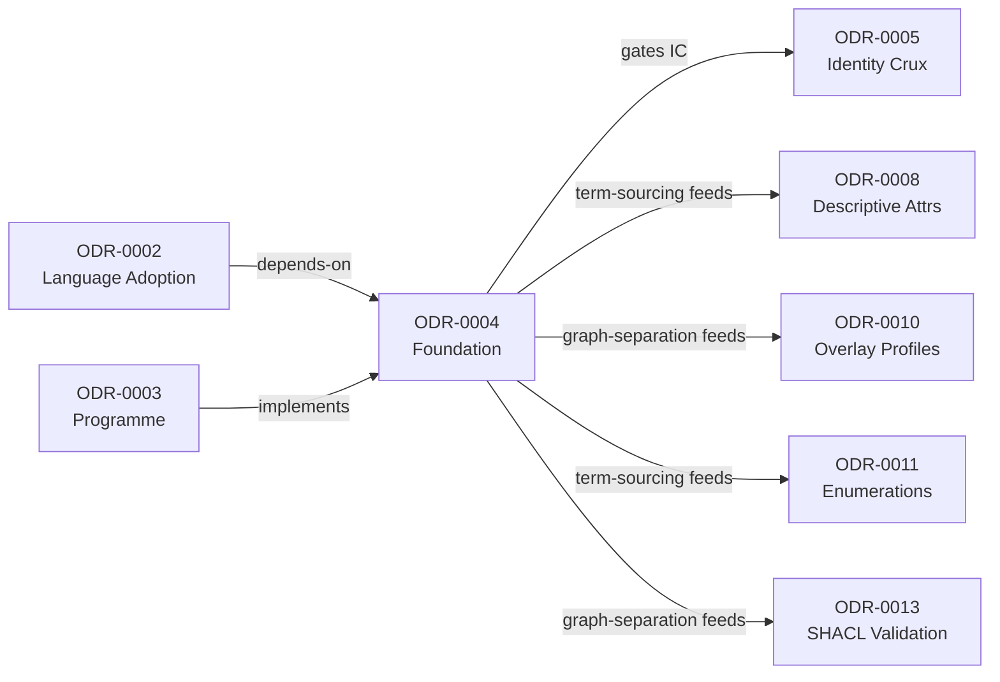
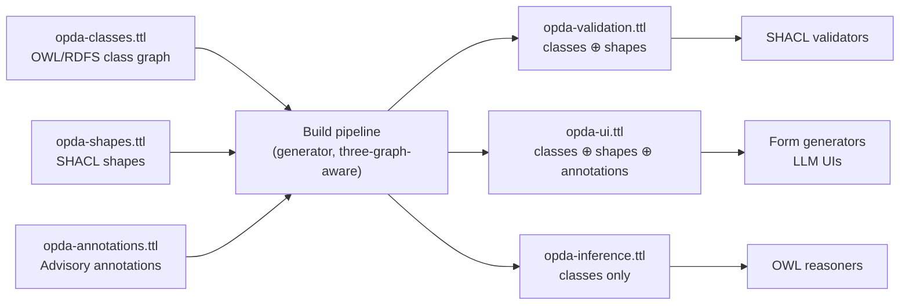
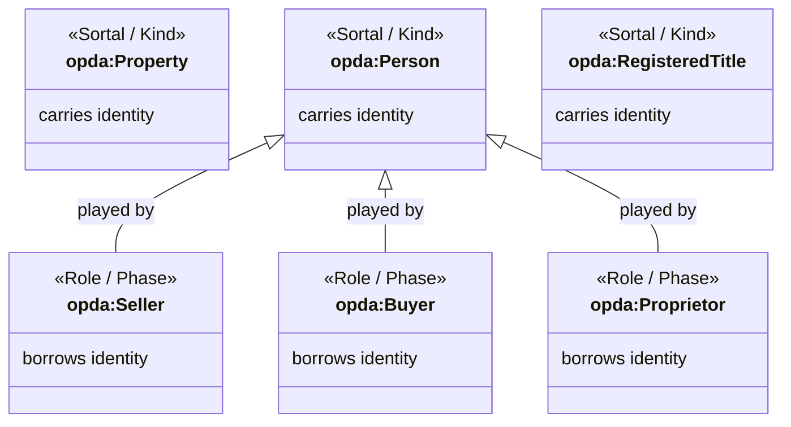
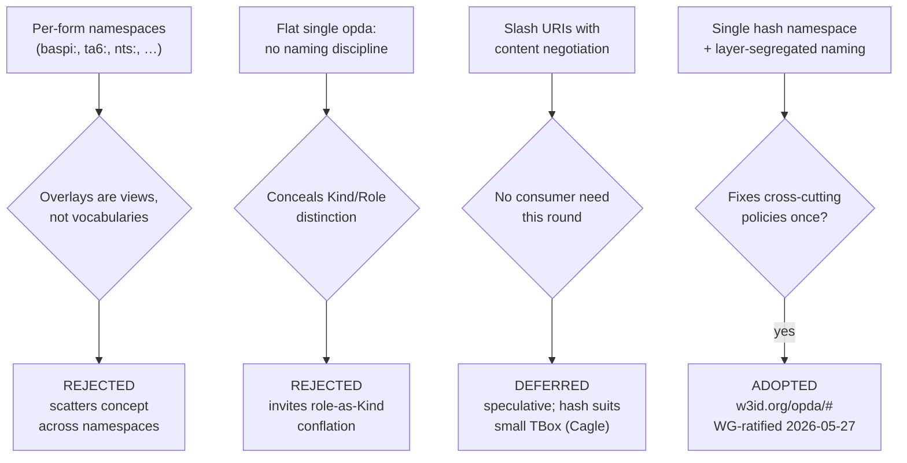

# PDTF Ontology Foundation

### ODR relationship graph

The diagram below shows how ODR-0004 relates to the ODRs it depends on, implements, and gates downstream.

## Context

The PDTF v3 base schema (`pdtf-transaction.json`, 37,224 lines; 1,556 unique base leaves, 935 annotated) plus its overlay family (BASPI5, TA6/7/10, NTS/NTS2, CON29R/DW, LLC1, LPE1, FME1, RDS, PIQ, OC1) is a requirements artefact, not a translation target. JSON Schema has slot-names scoped to their enclosing object — no global identifiers, no identity criteria, no fixed model theory for the open-world class semantics an RDF consumer needs. Before any module ODR (Agents & Roles, Property & Land, Transactions, descriptive attributes, claims) can be drafted, the conversion needs the shared substrate every record depends on: where URIs live, how the ontology header is expressed, how the open-world class graph and closed-world shapes graph are kept separate, and where the human-readable meaning of each minted term comes from.

Council Session 001 framed this as the **first deliverable**. Hendler's Q1 point — "the deliberation is about *which things get URIs*" — became a design rule: URI policy is the first deliverable. Q7 confirmed the sequence: URI/namespace policy is Round 0, the identity crux (ODR-0005) gates everything downstream, and the programme is *spike-then-scale*. This ODR is the **Foundation spike** under that sequence — a gate record fixing policies under which every domain class will be minted, so the modules are mechanically constrained rather than free to re-litigate naming, graph separation, and term-sourcing per file.

## Decision

Adopt a **single `opda:` HASH namespace with layer-segregated naming, three-graph separation (OWL classes ⊥ SHACL shapes ⊥ annotations), a `vann:`-headed ontology, generator-first plus diagnostic-exemplar policies, and a normative term-sourcing-and-provenance convention** drawing on the business glossary and data dictionary, because it is the only option that fixes the cross-cutting policies once — so module ODRs inherit a constrained substrate rather than re-deciding naming, graph separation, and term-sourcing per file.

## Rules

These rules constrain every module and cross-cutting ODR in the PDTF ontology programme until superseded.

1. **Single hash namespace.** All foundational TBox terms are minted under one `opda:` HASH namespace. No per-form / per-overlay namespaces. Overlays are SHACL profiles (ODR-0010), not vocabularies. **The literal base URI is `https://w3id.org/opda/#`** — W3C PICG-redirected to the OPDA-hosted target (`https://openpropdata.org.uk/ontology/`); engineering realisation and redirect mechanics in [ADR-0006](../../adr/ADR-0006-w3id-opda-ontology-namespace.md). WG-ratified 2026-05-27 via [Session 003b](./council/session-003b-namespace-wg-decision.md) per Knublauch S004 DA primary demand + DPV precedent. Versioning scheme (calendar vs semantic) remains a WG-owned open question.
2. **Layer-segregated naming.** The naming convention must distinguish sortal/Kind classes (carry identity) from role/phase classes (borrow it), legibly from the URI alone. Examples:

   | Layer | Examples | Identity |
   |---|---|---|
   | Sortal/Kind | `opda:Property`, `opda:Person`, `opda:RegisteredTitle` | Carries identity |
   | Role/Phase | `opda:Seller`, `opda:Proprietor`, `opda:Buyer` | Borrows identity |

3. **Three-graph separation.** Keep the OWL/RDFS class graph, the SHACL shapes graph, and the advisory annotation graph as separate artefacts. Shapes target classes via `sh:targetClass`, never `owl:imports`. No property carries an OWL cardinality restriction and a SHACL count constraint as if equivalent. Advisory annotations (e.g. the exiled `opda:aiHint`) live only in the annotation graph. *Enforcement*: no `owl:imports` from shapes to classes; no property with both `owl:` cardinality and `sh:` count as if equivalent; advisory annotations absent from the shapes graph.
4. **Ontology header.** Every ontology file's `owl:Ontology` carries `dct:title`/`dct:creator`/`dct:issued`/`dct:modified`, `vann:preferredNamespacePrefix` and `vann:preferredNamespaceUri`, `owl:versionIRI`, and an `sh:prefixes` declaration node (so SHACL-SPARQL constraints — e.g. the UPRN uniqueness check in ODR-0005 — resolve prefixes). *Enforcement*: header lint reviewable mechanically once the base URI is fixed.
5. **Don't ship URIs you don't serve.** Minted URIs must dereference (at minimum to the TBox), or the ontology is explicitly scoped to local-copy consumption. The persistence/dereferenceability commitment is recorded honestly, not assumed. An instance-URI *pattern* may be declared (e.g. `…/property/uprn/{n}`) without minting instances this round.
6. **Generator-first.** The mechanical half — a named slot with a scalar datatype becomes an `opda:` `DatatypeProperty` with the corresponding `xsd:` range, `rdfs:domain` the enclosing object's class — is *generated*, not hand-authored. Council and module-ODR cycles are reserved for genuinely ambiguous moves: aggregate boundaries, cross-overlay synonymy, `oneOf`-as-subclass-vs-state. *Enforcement*: mechanical slot→`DatatypeProperty` output produced by the generator with ranges/comments drawn from the data dictionary.
7. **Term-sourcing & provenance convention.** Every minted term draws its human-readable semantics from two inputs beyond the JSON Schema:

   | Source | Path | Supplies |
   |---|---|---|
   | Business glossary (ubiquitous-language authority) | `source/00-deliverables/semantic-models/business-glossary.{md,ttl}`, `glossary-merged.json` | `rdfs:label`, `skos:prefLabel`, `skos:definition`; resolves naming (`Participant`, `Role`, `Trust Framework`, `Scheme Operator`, `Data Provider`/`Data Recipient`, `LEI`) |
   | Data dictionary | `source/00-deliverables/semantic-models/data-dictionary.{md,json}`, `data-dictionary-canonical.json` | `rdfs:comment`, datatype ranges, cardinality (1,557-leaf inventory; 935 annotated) |

   Every minted term carries `dct:source` to its glossary row or canonical schema-leaf path. **Precedence: W3C spec > business glossary > schema text.** Where a term is governed by a W3C/external standard (e.g. `Verifiable Credential`, `Issuer`, `Verifier`; `LEI` from ISO 17442) the external definition is normative and referenced, not restated. Applied downstream by ODR-0008, ODR-0011, ODR-0013. *Enforcement*: every minted class/property carries a `dct:source` resolving to a glossary row or canonical leaf path; labels/definitions on glossary-named concepts match the glossary.
8. **Diagnostic exemplars are permitted, non-deliverable, and IC-only.** The round admits three or four worked individuals used *solely* to pressure-test identity criteria and rigidity — the canonical set: a registered freehold house, an unregistered house pre-first-registration, and a flat whose UPRN was split. TBox/ABox remains the *deliverable* boundary, not the *thinking* boundary. This ODR fixes what an exemplar is and where the harness lives; ODR-0005 is the first record to discharge its IC gate against this set.

### Three-graph separation and consumer profile composition

The diagram below shows how the three canonical source graphs are composed by the build pipeline into three derived consumer profiles, as fixed by Rule 3 and §3a.

### Foundational class naming layers

The class diagram below illustrates the two naming layers from Rule 2 — Sortal/Kind classes that carry identity versus Role/Phase classes that borrow it — using the canonical examples from the Rules table.

### Operational specifications (added by [Session 004](./council/session-004-pdtf-ontology-foundation.md))

Session 004 (Full Council; Queen Gandon; DA Knublauch — withdrew on all four primary attacks) converted Rules 3, 6, 7, 8 from authoring-discipline statements into deployment-survivable contracts. The original numbered rules above stand; the operational specifications below extend them with the build-time and CI-enforced disciplines required for runtime survival.

#### 3a. Three-graph separation — source graphs, derived consumer profiles, CI test (S004 Q3)

The build pipeline emits **three source graphs** (canonical, Council-ratified) and derives **three consumer profiles** (generated, never hand-edited):

| Source artefact (canonical) | Contents |
|---|---|
| `opda-classes.ttl` | OWL/RDFS class graph: `owl:Class`, `rdfs:subClassOf`, `owl:DatatypeProperty`/`ObjectProperty`, `rdfs:domain`/`range`, `rdfs:label`/`skos:prefLabel`/`skos:definition`. **No `sh:` triples.** |
| `opda-shapes.ttl` | SHACL shapes: `sh:NodeShape`/`sh:PropertyShape` with `sh:targetClass`, `sh:path`, `sh:datatype`, `sh:minCount`/`sh:maxCount`, etc. **No `owl:Class` or `owl:imports` triples; no advisory annotations.** |
| `opda-annotations.ttl` | Advisory graph: `opda:aiHint`, `opda:uiHint`, `opda:exampleValue`, generator notes, keyed to shape/class IRIs via `dct:relation` or `opda:appliesTo`. **No `sh:` triples; no `owl:Class` triples.** |

| Derived consumer profile (build output) | Composition | Consumed by |
|---|---|---|
| `opda-validation.ttl` | `opda-classes.ttl` ⊕ `opda-shapes.ttl` | SHACL validators |
| `opda-ui.ttl` | `opda-classes.ttl` ⊕ `opda-shapes.ttl` ⊕ `opda-annotations.ttl` | Form generators, LLM UIs |
| `opda-inference.ttl` | `opda-classes.ttl` alone | Optional classes-alone export (third-party OWL-DL tooling) — NOT opda's inference path |

> **Amendment (ODR-0025 §R6, ratified 2026-06-01).** The `opda-inference.ttl` row originally read "Consumed by: OWL reasoners" — a full OWL-DL TBox-classification projection (HermiT/Pellet/Konclude). That **DL-classification intent is superseded**: opda's inference is the load-time **OWL-RL-safe closure** materialised into `https://w3id.org/opda/graph/inferred/entailment` (ODR-0025 §R1/§R4; ADR-0035), **not** external DL classification. The `opda-inference.ttl` artefact name is retained only as an *optional* classes-alone export for third-party DL tooling; opda's own pipeline never builds or consumes it for reasoning. See ODR-0025, ODR-0026, ADR-0035.

**Shapes-graph version-pointer.** `<opda-shapes> opda:targetsClassGraph <opda-classes-version-IRI>`. A consumer loading mismatched versions gets a documented mismatch warning, not silent inconsistency.

**Five-part CI test (build fails on any).** Per [Session 004 Q3 synthesis](./council/session-004-pdtf-ontology-foundation.md):

1. `ASK { GRAPH opda:annotations { ?s ?p ?o . FILTER(STRSTARTS(STR(?p), "http://www.w3.org/ns/shacl#")) } }` MUST return `false` — no `sh:` triples in annotation graph.
2. `ASK { GRAPH opda:shapes { ?s owl:imports ?g } }` MUST return `false` — no `owl:imports` from shapes to classes.
3. `ASK { GRAPH opda:shapes { ?s opda:aiHint ?o } }` (and equivalent for the advisory-predicate whitelist) MUST return `false` — no advisory annotations in shapes graph.
4. `SELECT ?c WHERE { ?s sh:targetClass ?c . FILTER NOT EXISTS { GRAPH opda:classes { ?c a owl:Class } } }` MUST return empty — every `sh:targetClass` resolves.
5. Consumer-profile artefacts have no commits outside the build-pipeline service account.

**Session 001 Q5 carry.** The annotation graph + `opda:ValidationContext` reification (Knublauch+Gandon prevail ~7-2; Cagle dissent recorded). The reification commitment is a re-instantiable convention across profile artefacts — routed to [ODR-0010](./ODR-0010-overlay-profile-mechanism.md) and [ODR-0013](./ODR-0013-shacl-validation-and-severity.md) as a `pattern`-extraction candidate per ODR-0001 A9 §Artefact identity test.

#### 6a. Generator-first — deterministic emission + byte-identity CI (S004 Q5)

Rule 6 requires three operational disciplines:

1. **Deterministic emission ordering.** Triples emitted in canonical order — `owl:Class` declarations alphabetised; then `owl:DatatypeProperty` alphabetised; then `owl:ObjectProperty` alphabetised; then `sh:NodeShape`/`sh:PropertyShape` alphabetised. Within-term order: `rdf:type` first, `rdfs:label` second, `rdfs:comment` third, then predicate-specific triples lexicographic. Blank nodes skolemised by SHA-256 of canonical N-Triples form. Prefix declarations alphabetised. LF line endings; no trailing whitespace; no BOM; final newline.
2. **Generator version recorded** in the ontology header — `owl:versionIRI` (increments on every generator-version change OR schema-driven change), `owl:versionInfo` (human-readable), and `opda:generatorVersion` (machine-readable; e.g. `"opda-gen-1.4.2"`).
3. **CI byte-identity test.** Build pipeline: regenerate, byte-compare against committed TTL, **fail on any byte difference** (not "reviewable diff" — failure is mechanical, not editorial). Reviewable PR diff is the consequence, not the primary check.

**Four sub-tests** (Cagle's diff-explosion canary; falsifiable per regeneration):

1. `diff <(gen input) <(gen input)` returns empty — byte-identical on consecutive runs.
2. `sha256sum $(gen input) == sha256sum tests/generator/foundation-expected.ttl` — matches committed reference fixture.
3. Adding one dictionary comment produces exactly one `rdfs:comment` diff in the TTL.
4. Adding one dictionary leaf produces exactly one new `opda:DatatypeProperty` block.

**Generator is three-graph-aware.** Emits three separate output files (`opda-classes.ttl`, `opda-shapes.ttl`, `opda-annotations.ttl`) from one input source; build pipeline composes the three derived consumer profiles per §3a.

#### 7a. Term-sourcing — five-line precedence + conflict-recording protocol (S004 Q4)

Rule 7's precedence is refined to **five lines** (Knublauch DA's full demand; Pandit's four-line + OPDA TF separated from "other regulatory authorities"):

1. **W3C / external spec** (where the term originates from a W3C, OMG, ISO, IETF, or equivalent standards-body spec). Authoritative.
2. **OPDA Trust Framework** (authoritative within OPDA's scope; treated as W3C-equivalent for terms the TF defines).
3. **Other regulatory authorities** (FCA, ICO, HMLR, EU eIDAS, etc.). **Contextual, not authoritative** — recorded as `skos:scopeNote` or `skos:closeMatch`, not as the term's primary definition.
4. **OPDA business glossary** (project-internal ubiquitous language for project-internal terms; project-contextual-note via `skos:scopeNote` for W3C/regulatory-imported terms).
5. **Schema-leaf annotation** (data-dictionary canonical leaf path; supplies `rdfs:comment` and datatype constraints; lowest-trust definition layer).

**Conflict-recording protocol.** Every term-sourcing conflict produces a `## Change log` row in the consuming module ODR (per ODR-0002 §Change log discipline). Row records: conflicting sources; verbatim conflicting definitions; Council-attributed resolution; rejected definition preserved as `skos:note`/`skos:scopeNote` (Baker DCMI "loser is preserved" rule).

**`dct:source` URI discipline.** For W3C-spec terms, the URI pins the version IRI (e.g. `https://www.w3.org/TR/2020/REC-shacl-20170720/#NodeShape`); generic IRIs that redirect to "latest" are forbidden. `dct:source` resolves to authoritative source, never project-internal mirror; mirrors sit behind `dct:isReferencedBy`.

**Generator reconciliation (ADR-0005 §G1, Author-only, 2026-05-31).** [ADR-0007](../../adr/ADR-0007-ontology-generator-specification.md) §"Term-sourcing five-line precedence" formalises this rule **verbatim**: its resolver takes the primary `dct:source` from the first match of slots {1, 2, 4, 5} and collects slot 3 (other regulators) as parallel `skos:scopeNote`/`skos:closeMatch` **contextual** citations, never as the primary source — exactly as line 3 above specifies. ODR-0004 §7a and ADR-0007 are consistent (the earlier glossary-at-3 / regulator-at-5 discrepancy is resolved); no emitter branches on `tier == 3` as a primary source. This closes ADR-0005 §G1.

#### 8a. Diagnostic exemplars — CI-regression pairing + parent-repo storage (S004 Q6)

Rule 8 is operationalised with two additions:

- **Storage path explicitly in parent OPDA repo,** not the nested `source/03-standards/schemas/` git sub-repo (per the OPDA project-structure note on nested sub-repos). Path: `source/03-standards/ontology/exemplars/`.
- **Each exemplar TTL paired with `expected-report.ttl`** — a `sh:ValidationReport` recording what the exemplar should produce when validated against the shapes graph. The exemplar becomes a CI regression test, not just documentation. Pattern: DASH `dash:GraphValidationTestCase`; BioPortal SHACL-Test framework.

**Filename convention:** descriptive kebab-case (`registered-freehold-house.ttl`, `unregistered-pre-first-registration-house.ttl`, `flat-with-split-uprn.ttl`). FIBO test-case-naming discipline — the filename is the documentation. Small files (under 50 lines) per Davis's BBC test-suite discipline.

**Citation from consuming ODR.** ODR-0005's `## Rules` (and downstream `kind: pattern` ODRs per A9 §Per-kind discipline (b)) cite exemplars by path AND one-line description of the named hard case (Pandit's amendment).

### Namespace and structure alternatives evaluated

The flowchart below maps the three namespace/structure options considered to the drivers that caused rejection or deferral, and shows the chosen outcome.

## Alternatives

- **Per-form / per-overlay namespaces** (`baspi:`, `ta6:`, `nts:`) — rejected: overlays are *views*, not vocabularies; per-form prefixes re-import the documentation accident and scatter one concept across many namespaces.
- **One flat `opda:` namespace with no naming discipline** — rejected: conceals the Kind/Role distinction the ontology exists to make (Guizzardi's withdrawal condition) and invites role-as-Kind conflation.
- **Slash URIs with content negotiation now** — deferred: speculative this round (no consumer needs it); a small TBox is the textbook whole-document hash case (Cagle).

## Consequences

- Module ODRs inherit a constrained substrate: they cannot quietly produce three URI shapes, leak closed-world cardinality into the class model, or invent unsourced labels.
- The single hash namespace with layer-segregated naming satisfies dereferenceability trivially for a small TBox and keeps the Kind/Role rigidity contract legible from the URI alone.
- Every minted term gets a traceable, authoritative human-readable origin (`dct:source` to glossary row or canonical leaf path), aligned to the trust framework's ubiquitous language.
- The namespace string `https://w3id.org/opda/#` is now ratified (2026-05-27 by the directing authority / Linked Data Council — greenfield; no WG — [Session 003b](./council/session-003b-namespace-wg-decision.md); engineering realisation [ADR-0006](../../adr/ADR-0006-w3id-opda-ontology-namespace.md)). Resolution depends on the W3C PICG redirect to `https://openpropdata.org.uk/ontology/`; the OPDA web team commits to keeping the redirect target serving the canonical TTL artefacts.
- Versioning scheme (calendar vs semantic mirroring schema 3.4.0) remains a directing-authority / council decision (greenfield; no WG): `owl:versionIRI` is not frozen until that ruling — re-open when the PDTF schema's own versioning forces the choice.
- SHACL and DASH are *declared* here; their shapes are authored in ODR-0010 / ODR-0013. The Foundation graph holds the class skeleton and header, not the constraints.
- ODR-0005 must discharge its identity-criterion gate against the canonical exemplar set.

**Added by [Session 004](./council/session-004-pdtf-ontology-foundation.md) — Knublauch DA primary withdrawal demand; resolved by [Session 003b](./council/session-003b-namespace-wg-decision.md) (2026-05-27):**

- ~~**Namespace string is a blocker on `status: accepted`.**~~ **RESOLVED.** WG ratified `https://w3id.org/opda/#` on 2026-05-27 via [Session 003b](./council/session-003b-namespace-wg-decision.md). The 13 downstream ODRs in the `depends-on:[ODR-0004]` chain moved `proposed → accepted` in the same commit. Engineering realisation: [ADR-0006](../../adr/ADR-0006-w3id-opda-ontology-namespace.md). Generator output now carries the ratified prefix; `dct:status "draft"` placeholder retired. DPV precedent honoured (the costly-to-fix problem averted pre-publication).
- ~~**`https://w3id.org/opda/` is named as the operationally-strongest alternative.**~~ **ADOPTED.** Knublauch DA primary demand met; the W3C PICG persistence guarantee carried the WG decision per the DPV-precedent argument (Pandit's principal-author choice). Redirect target: `https://openpropdata.org.uk/ontology/`. PR to [`perma-id/w3id.org`](https://github.com/perma-id/w3id.org) is the engineering follow-up tracked in ADR-0006's confirmation gate.
- **Reopening trigger for hash-vs-slash.** ODR-0004's hash decision is reversible only at high cost (DPV 6-ecosystem-month precedent). The WG SHOULD record a concrete reopening trigger when the threshold becomes operationally relevant. Suggested criterion (carried from S004): any single ontology file exceeds 1,000 terms in active dereference traffic OR a named consumer requests per-term content negotiation.
- **`odr-review` lint update** flagged for the next skill release (consistent with the ODR-0001 A9 amendment's deferred Lint 4 update). Lint reads `## Rules` from every `kind: pattern` ODR, extracts (UFO category, class URI) pairs, and verifies the URI's CamelCase form vs the layer convention (Sortal/Kind = CamelCase noun; Role = `<Kind>Role` or noun-ending-in-`-er`; Phase = `<Kind>In<State>`; Relator = relator-noun like `Ownership`, `Tenancy`).
- **Open `pattern`-extraction candidates:** `opda:ValidationContext` reification (Session 001 Q5 carry; re-instantiable across SHACL profile artefacts) is a candidate `pattern` ODR for ODR-0010 / ODR-0013 to extract per ODR-0001 A9 §Artefact identity test.

## References

- **Target versions**: RDF 1.2 and SHACL 1.2, per the Core-tier pin in [ODR-0002](./ODR-0002-ontology-language-adoption.md).
- **Vocabularies**: Core only this round — RDF/RDFS/OWL/XSD, Dublin Core (per ODR-0002), VANN (header), SKOS (for glossary-sourced labels). SHACL + DASH declared; shapes authored in [ODR-0010](./ODR-0010-overlay-profile-mechanism.md) / [ODR-0013](./ODR-0013-shacl-validation-and-severity.md).
- **Glossary & data dictionary**: `source/00-deliverables/semantic-models/business-glossary.{md,ttl}` + `glossary-merged.json` (54 trust-framework terms plus schema-annotation and external-standard terms; "most authoritative wins: W3C > OPDA Glossary > PDTF schema text"); `source/00-deliverables/semantic-models/data-dictionary.{md,json}` + `data-dictionary-canonical.json` (1,557 unique leaves; 935 annotated; 16 canonical schemas).
- **Open questions (directing-authority / council-owned; greenfield, no WG)**: ~~exact base namespace URI~~ **RESOLVED** (`https://w3id.org/opda/#` per [Session 003b](./council/session-003b-namespace-wg-decision.md) + [ADR-0006](../../adr/ADR-0006-w3id-opda-ontology-namespace.md)); versioning scheme (calendar vs semantic mirroring schema 3.4.0) — still open; TTL repository location confirmed as `source/03-standards/ontology/` (peer to `schemas/`; exemplar harness already lives there per §8a).
- **Deliverables (when fleshed out)**: `foundation.ttl` skeleton + ontology-header template; namespace/URI policy note; diagnostic-exemplar harness location; generator spec for the mechanical slot→property half with its glossary/data-dictionary sourcing rules.
- **Related**: anchor [ODR-0003](./ODR-0003-pdtf-ontology-programme.md); adopts catalogue and `vann:` header pattern from [ODR-0002](./ODR-0002-ontology-language-adoption.md); identity-criterion gate first discharged by [ODR-0005](./ODR-0005-property-land-identity-crux.md); downstream consumers of the term-sourcing convention: [ODR-0008](./ODR-0008-property-descriptive-attributes.md), [ODR-0011](./ODR-0011-enumeration-vocabularies.md), [ODR-0013](./ODR-0013-shacl-validation-and-severity.md); cross-cutting graph-separation feeds [ODR-0010](./ODR-0010-overlay-profile-mechanism.md).
- **Council deliberation**: [session-001](./council/session-001-pdtf-schema-to-ontology.md) — Q1 (genuine modelling; generator-first; exemplars admitted 11-0-1, Guarino amendment), Q3 (partition by ontological concern; OWL class graph separated from SHACL shapes graph; flat published namespace), Q5 (advisory annotations exiled to a separate annotation graph keyed to shape IRIs; Knublauch/Gandon prevail, Cagle dissent ~7-2), Q7 (single `opda:` hash namespace 9-0; `sh:prefixes` for SHACL-SPARQL; spike-then-scale).
- **Ratification provenance — [session-004](./council/session-004-pdtf-ontology-foundation.md)** (2026-05-27; Queen Gandon; DA Knublauch — withdrew on all four primary attacks). 7 questions × 9-0 votes. Operational subsections 3a/6a/7a/8a added; namespace-as-blocker + `w3id.org/opda/` alternative recorded in Consequences. Phase 1 Council gate cleared.
- **WG namespace ratification — [session-003b](./council/session-003b-namespace-wg-decision.md)** (2026-05-27; Author-only; Henrik acting for OPDA WG). Records WG selection of `https://w3id.org/opda/#` per Knublauch S004 DA primary demand + DPV precedent. Triggers status sweep on the 13 ODRs in the `depends-on:[ODR-0004]` chain. Engineering realisation: [ADR-0006](../../adr/ADR-0006-w3id-opda-ontology-namespace.md).
