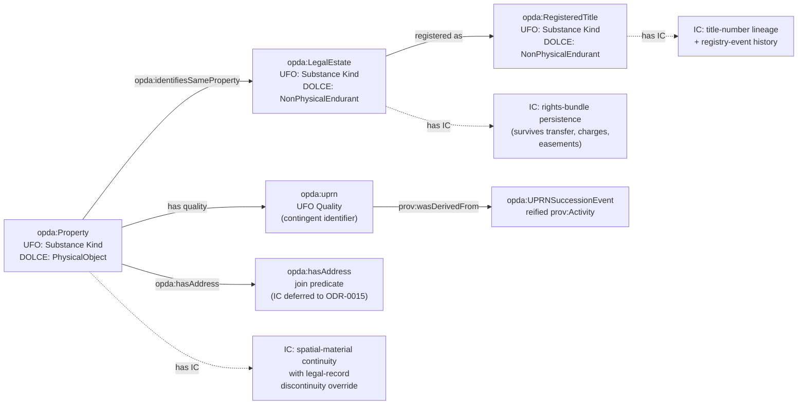
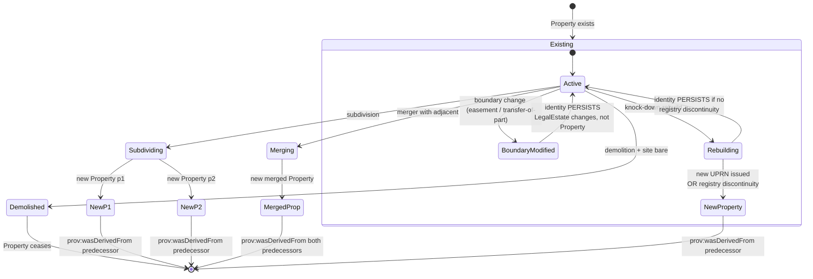
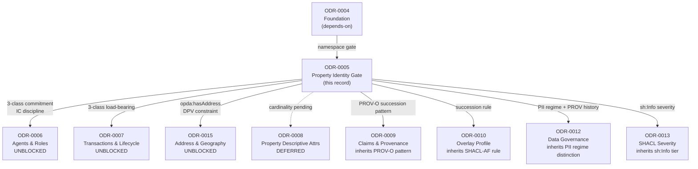

# Property & Land: The Identity Crux

## Context

PDTF v3 has no `Property` class. The thing every transaction is *about* is reconstructed at read time from scattered surfaces with zero schema-level joins: UPRN appears in four leaf paths (`propertyPack.uprn`, `energyEfficiency.certificate.uprn`, `chain.onwardPurchase[].uprn`, `valuationComparisonData.propertyDetails[].uprn`); address appears in many more; INSPIRE ID and title-linked address add further surfaces; the data dictionary defines `uprn` only as "a unique identifier for the property" and carries an `isFirstRegistration` leaf. In ontological terms this is a missing class with no identity criterion — the implicit-Property defect.

Council Session 001 (Q4) confirmed the diagnosis unanimously (12-0) and converged on a multi-class split, but explicitly **deferred the identity criterion to this ODR as the programme's gate**. An ontology whose central endurant has no identity criterion is, in Guarino's words, "not an ontology — it is a schema with RDF syntax." Until the IC is settled and validated against ODR-0004's diagnostic exemplars, ODR-0006/0007/0008 stay in planning.

## Decision

Adopt the **three-class Property pattern** ratified by [Council Session 005](./council/session-005-property-land-identity-crux.md) (Phase 2 gate; B2 pilot consensus-mode hive-mind/byzantine; Queen Guarino, DA Allemang withdrew on 8 of 8 questions): three UFO Substance Kinds committed to DOLCE Endurant — **`opda:Property`** (physical Substance Kind; IC = spatial-material continuity with legal-record discontinuity override), **`opda:LegalEstate`** (legal-institutional Substance Kind; IC = rights-bundle persistence; may be unregistered), **`opda:RegisteredTitle`** (registry-record Substance Kind; IC = title-number lineage; carries distinct published-personal-data PII regime under HMLR open-register). Keyed operationally by SHACL/DASH uniqueness on UPRN with graceful degradation; UPRN succession captured by reified `opda:UPRNSuccessionEvent` materialised into the validation report via a SHACL-AF rule at `sh:Info` severity; joined via co-reference (never `owl:sameAs`); UPRN modelled as UFO Quality / contingent scheme-scoped identifier under `prov:wasDerivedFrom` succession — chosen because it is checkable, degrades gracefully for new-builds and pre-first-registration cases, avoids irreversible cross-context inference propagation, gives the unregistered-house case a coherent answer (which the 2-class collapse cannot), and gives `RegisteredTitle` instances a class-level discriminator for ICO Subject Access processing under the HMLR open-register lawful basis.

The diagram below shows the three Substance Kinds, their identity criteria, and the relationships between them.



## Rules

**Settled rules (the cure).** These are normative for the Property module:

1. **Explicit Property class.** The four-surface, zero-join defect is restored to a class. No implicit-Property.
2. **Three-class split** (settled by [Session 005 Q5](./council/session-005-property-land-identity-crux.md#q5-—-2--vs-3-class-split); 6-2-1 FOR three-class with Davis + Cagle held-as-live dissent preserved): a physical `opda:Property`, a legal-institutional `opda:LegalEstate` (which may be unregistered at common law), and an HMLR registry-record `opda:RegisteredTitle`. Each is its own UFO Substance Kind with its own IC.
3. **Operational key is SHACL/DASH uniqueness.** `dash:uniqueValueForClass true` on `opda:uprn` is the **primary, checkable** mechanism: it fires a violation report and degrades gracefully when UPRN is absent.
4. **`owl:hasKey` is optional/secondary** — a semantic annotation valid only where UPRN is truly identifying. Never on a Role.
5. **No `owl:sameAs`** across the UPRN surfaces (unanimous — irreversible inference propagation). Join uses the key + SHACL co-reference, or a controlled `opda:identifiesSameProperty`.
6. **UPRN is a contingent identifier**, not the IC — operationally, a UFO Quality on `opda:Property`. Model retire/split/merge/re-issue via `prov:wasDerivedFrom` succession, with the chain materialised into the validation report via a SHACL-AF rule at `sh:Info` severity (§Operational specifications 6a).

**Anti-patterns (forbidden):**

- `owl:sameAs` between any two UPRN-bearing nodes.
- `owl:hasKey (opda:uprn)` as the *sole* identity mechanism (inert when UPRN is absent — Cagle's S001 Q4 challenge, conceded by Guizzardi in [S005 Q4](./council/session-005-property-land-identity-crux.md#q4-—-uprn-status)).
- A keyed Role (a Proprietor has no identity *qua* Proprietor).
- Treating UPRN or address as the identity criterion (they are administratively contingent / a mode of presentation).
- Treating `opda:RegisteredTitle` as a UFO Mode of `opda:LegalEstate` (fails the temporal-extent test — RegisteredTitle exists before LegalEstate is vested + after LegalEstate is dissolved; not existence-dependent on LegalEstate).

### Operational specifications (added by [Session 005](./council/session-005-property-land-identity-crux.md))

Session 005 (Full Council; B2 pilot consensus-mode hive-mind/byzantine; Queen Guarino; DA Allemang — withdrew on all 8 questions) discharges the gate conditions inline per ODR-0001 A9 §Per-kind discipline (b). The original numbered rules above stand; the operational specifications below state the (a) UFO/DOLCE meta-category, (b) IC over named hard cases, and (c) artefact realisation that the A9 amendment requires of every `kind: pattern` ODR.

#### 2a. UFO/DOLCE category commitment per class (S005 Q1)

Each Kind committed to DOLCE Endurant + UFO Substance Kind (Sortal, Rigid, supplies own IC), with `dct:source` resolving to the upstream definition (Baker amendment — DCMI Usage Board discipline) and `rdfs:subClassOf` triples for machine-readable binding (Cagle amendment — DBpedia 2017 lesson on LLM consumer fallback):

| Class | UFO category | DOLCE category | `dct:source` |
|---|---|---|---|
| `opda:Property` | Substance Kind | Endurant / PhysicalObject | Guizzardi 2005 Ch. 4 (UFO); Masolo et al. 2003 WonderWeb D18 §4.1 (DOLCE) |
| `opda:LegalEstate` | Substance Kind | Endurant / NonPhysicalEndurant (Searle 1995 legal-institutional object) | Guizzardi 2005 Ch. 4; Masolo et al. 2003 D18 §4.2 |
| `opda:RegisteredTitle` | Substance Kind | Endurant / NonPhysicalEndurant (HMLR record-entity) | Guizzardi 2005 Ch. 4; Masolo et al. 2003 D18 §4.2 |

Sub-kind granularity (Site / BuiltStructure / etc.) **NOT** committed in `## Rules` per Allemang DA Q1 withdrawal condition. Deferred to ODR-0015 (Address & Geography) and to future `pattern`-extraction records per ODR-0001 A9 §Artefact identity test, gated on a named consumer query.

#### 3a. IC for `opda:Property` over five named hard cases (S005 Q2)

IC = **spatial-material continuity with legal-record discontinuity override** (Kendall+Davis hybrid framing adopted; Allemang DA withdrawal condition (b) met). Authoritative source: Ordnance Survey *AddressBase Plus Technical Specification* §UPRN lifecycle (cited via `dct:source` with version pin per ODR-0004 §7a); HMLR title-register discontinuity rules as the override authority.

The diagram below shows how `opda:Property` identity behaves across the five named hard cases.



The five hard cases:

1. **Demolition.** Built structure entirely demolished + site bare → Property ceases. Replacement structure on same site → new `opda:Property` `p₂` with `prov:wasDerivedFrom` to predecessor.
2. **Subdivision.** Property subdivided into two or more units → predecessor ceases; each new unit is a new Property with `prov:wasDerivedFrom` chain.
3. **Merger.** Two adjacent Properties merged → both predecessors cease; merged unit is new Property with `prov:wasDerivedFrom` to both.
4. **Replacement (rebuild on same plot).** Default = new Property iff the legal record asserts discontinuity (HMLR title-closure + re-registration, OR new UPRN issuance with no `prov:wasDerivedFrom` chain). Routine knock-down-rebuild without registry discontinuity **preserves identity** — matches conveyancer pragmatic practice (Allemang's third hard case). Heritage exception for listed buildings via SHACL profile (ODR-0010 territory).
5. **Boundary modification.** Easement granted, transfer-of-part, or other legal-boundary change → Property persists. The IC is *physical*, not *legal*; the boundary change affects `opda:LegalEstate`, not `opda:Property`.

**Invariance under coordinate-system revision.** The IC reads spatial-extent topology, not coordinate values. OS coordinate revisions (OSGB36 → ETRS89, sub-metre) preserve topology; the IC is invariant.

**SHACL operationalisation (Cagle surrogates):** spatial-material continuity is not directly SHACL-checkable, so the IC is operationalised via three surrogate predicates: (a) `opda:hasGeometry` (deferred to GeoSPARQL — ODR-0015); (b) `opda:parcelIdentifier` (INSPIRE ID) as stable proxy; (c) UPRN succession via reified `opda:UPRNSuccessionEvent` (§6a below).

#### 3b. IC for `opda:LegalEstate` over five named hard cases (S005 Q3)

IC = **rights-bundle persistence**. Authoritative source: HM Land Registry *Practice Guide 1 — First Registrations* and *Practice Guide 16 — Cancellation of registered titles* (cited via `dct:source` with version pin).

1. **Estate transfer.** Freehold transferred A→B → same `LegalEstate` persists; proprietorship is a Role borne by different bearers across time (per ODR-0006).
2. **Estate enlargement.** Leasehold enlarged into freehold (statutory) → new `LegalEstate` (rights-bundle has changed kind); `prov:wasDerivedFrom` chains to predecessor.
3. **Estate determination.** Leasehold determined on lease expiry → ceases; freehold reverts to existing freeholder estate.
4. **Charges and easements.** Do NOT change identity; modelled as UFO Modes inhering in the estate (per ODR-0007 / ODR-0008 elaboration).
5. **First registration.** Previously-unregistered estate (existing at common law) persists as the same individual when registration completes; first registration is a registry-side event, not an estate-side change.

#### 3c. IC for `opda:RegisteredTitle` over five named hard cases (S005 Q3)

IC = **title-number lineage + registry-event history**. Authoritative source: HMLR *Practice Guide 1*, *PG 16*, *PG 40 — HM Land Registry plans* (cited via `dct:source` with version pins). Every title-lifecycle event captured as a reified `prov:Activity` with explicit `prov:wasDerivedFrom` / `prov:wasInvalidatedBy` triples (Cagle amendment — NOT as `rdfs:comment` describing what happened); SHACL-checkable.

1. **Title opening (first registration).** New `RegisteredTitle` `prov:wasGeneratedBy` a registration activity. The *third entity with its own lifecycle* Hendler named in S001 Q4.
2. **Title closure.** Closed title retains title-register identity (title number preserved in historical record); lifecycle state transitions to `closed` via reified PROV event. The LegalEstate it recorded may persist (under a new title) or cease.
3. **Title merger.** Two RegisteredTitles merged → both predecessors closed; one new title opened with `prov:wasDerivedFrom` chains to both.
4. **Transfer between registers.** Title moves between HMLR districts (rare). Title-number changes; `prov:wasDerivedFrom` chains new to old; underlying LegalEstate persists.
5. **Title reissue on corrupt-plan replacement.** Reissued under new title-number; same `prov:wasDerivedFrom` discipline; same LegalEstate.

**SHACL invariant (Cagle):** a title with `prov:wasInvalidatedBy` MUST NOT appear as the object of `opda:identifiesSameProperty` to a current Property.

#### 6a. UPRN succession — SHACL-rule materialisation (S005 Q4 — Cagle amendment)

Rule 6 is operationalised via a SHACL-AF rule that materialises the succession-chain into the validation report. Without this, the literal-pair form (`opda:previousUPRN`) is decorative against LLM consumers (Hellmann et al. DBpedia 2017 lesson on fallback to `owl:sameAs` heuristics).

The rule sits in `opda-shapes.ttl` (NOT the annotation graph — per S004 Q3 keying); produces `sh:Info` severity (succession is correct behaviour, not violation); consumed by LLM tooling and SHACL validators uniformly:

```turtle
opda:UPRNSuccessionRule a sh:NodeShape ;
    sh:targetClass opda:Property ;
    sh:sparql [
        sh:select """
            SELECT $this ?currentUPRN ?previousUPRN WHERE {
                $this opda:uprn ?currentUPRN .
                OPTIONAL { $this opda:previousUPRN ?previousUPRN }
            }
        """ ;
        sh:message "Property {$this} has UPRN succession chain: {?currentUPRN} ← {?previousUPRN}"
    ] .
```

**Canonical succession-reification.** The reified `opda:UPRNSuccessionEvent` (resource form) is canonical per Gandon's W3C-side recommendation — own URI, dereferenceable identity, audit trail. The literal `opda:previousUPRN` pair is retained as denormalised convenience for `dash:uniqueValueForClass`-style stale-reference checks. Both coexist; the reified event is authoritative.

**Three-part operational test (falsifiable per ODR-0004 §6a discipline):**

1. **Duplicate-UPRN test.** Two `opda:Property` instances with the same `opda:uprn` literal MUST produce `sh:resultSeverity sh:Violation`.
2. **Graceful-degradation test.** A `opda:Property` with no `opda:uprn` triple MUST produce NO SHACL violation from `dash:uniqueValueForClass` (unregistered-pre-first-registration exemplar discharges this).
3. **UPRN-succession-chain test.** `opda:Property` with `opda:uprn` AND `opda:previousUPRN` MUST be traversable by SPARQL returning both UPRNs as identifying the same Property (flat-with-split-uprn exemplar discharges this with the SHACL rule above firing `sh:Info`).

#### 6b. Address-as-identifier prohibition + ODR-0015 routing (S005 Q6)

`opda:Property` is identified neither by address nor by mode-of-presentation. **Address modelling is routed to ODR-0015** (Address & Geography — Reduced Council, Phase 2.6 gate spawned by Scope-Check 1 Q7a). ODR-0005 commits only to:

- **Address is not an IC** for `opda:Property` (Guarino S001 Q4 unanimous framing).
- **Address is not a key** for `opda:Property` (Anti-pattern — would produce false-positive violations on similar-but-not-identical address strings and false-negative misses on multiple address-presentations of one Property).
- **`opda:Property opda:hasAddress`** is the join predicate to whatever Address resource structure ODR-0015 ratifies (Cagle pre-commitment — `opda:hasAddress` is uniform; the Address resource's class and IC are ODR-0015's territory).

The Mode-vs-Resource question (UFO Mode of presentation, or `opda:Address` resource Kind with `opda:addressVariant`) is **NOT** decided in ODR-0005; ODR-0015 resolves with explicit DPV-pattern consideration (Baker+Pandit constraint carry — Address-as-mode means PII attaches to mode-instances; Address-as-resource means PII attaches to resource-instances).

#### 7a. Diagnostic exemplar set with per-exemplar verdict walkthrough (S005 Q7)

The three canonical exemplars (authored 2026-05-27 per ODR-0004 §8a between-session prep) pass under the three-class commitment + spatial-material continuity IC + UPRN-as-Quality-with-PROV-succession + Address-as-routed-to-ODR-0015. Each is cited per ODR-0004 §8a + Pandit's amendment (path + one-line description of named hard case):

| Exemplar | Named hard case | Verdict under adopted IC |
|---|---|---|
| [`source/03-standards/ontology/exemplars/registered-freehold-house.ttl`](../../source/03-standards/ontology/exemplars/registered-freehold-house.ttl) | Baseline — all identity surfaces present and consistent | One `opda:Property` + one `opda:LegalEstate` (freehold) + one `opda:RegisteredTitle` co-referring; no succession; RegisteredTitle carries HMLR-published-personal-data PII regime |
| [`source/03-standards/ontology/exemplars/unregistered-pre-first-registration-house.ttl`](../../source/03-standards/ontology/exemplars/unregistered-pre-first-registration-house.ttl) | First-registration-pending + UPRN absent (LegalEstate-without-RegisteredTitle cardinality test) | One `opda:Property` + one `opda:LegalEstate` (common-law freehold) + NO `opda:RegisteredTitle`; UPRN absent (graceful degradation); LegalEstate persists through eventual first registration when new RegisteredTitle minted; PII regime transitions from private to published at registration (class-level event under 3-class — Pandit's load-bearing case) |
| [`source/03-standards/ontology/exemplars/flat-with-split-uprn.ttl`](../../source/03-standards/ontology/exemplars/flat-with-split-uprn.ttl) | UPRN succession (administrative re-numbering on building subdivision); physical identity persists | One `opda:Property` (same individual across UPRN succession) + one `opda:LegalEstate` (leasehold) + one `opda:RegisteredTitle` (leasehold title); reified `opda:UPRNSuccessionEvent` materialised via SHACL-AF rule at `sh:Info`; NO `owl:sameAs` |

**Exemplar amendments scheduled** (next author-only follow-up session — non-blocking):

- Amend exemplar 1: add `opda:LegalEstate` individual explicitly (3-class completeness).
- Amend exemplar 2: add common-law `opda:LegalEstate` individual explicitly (discharges Kendall's cardinality-test requirement; LegalEstate-without-RegisteredTitle case made manifest).
- Amend exemplar 3: scope-note notes reified `opda:UPRNSuccessionEvent` is canonical succession form (Gandon W3C-side recommendation).

**`expected-report.ttl` pairing** deferred to a follow-up author-only session when the SHACL shapes graph crystallises; each exemplar becomes a CI regression test per ODR-0004 §8a discipline.

**Future exemplar growth (non-gate-critical, recorded for next session):**

- `multi-title-flat.ttl` (Hendler's extension — model both leasehold and freehold titles on one physical flat for 3-class cardinality reinforcement).
- `duplicate-uprn-data-error.ttl` (Cagle's data-error case — pressure-tests `dash:uniqueValueForClass` violation firing).
- Cardinality-test exemplar variants (e.g. unregistered Manor; pre-1990 unregistered freehold outside compulsory triggers).

#### 8a. Gate clearance status (S005 Q8)

**Council-side gate cleared.** All four original gate conditions discharged:

1. Class cardinality settled — 3 classes (§2a above; Q5 6-2-1 verdict; Davis + Cagle held-as-live dissent preserved).
2. DOLCE category commitment per class settled — all three commit to Endurant / UFO Substance Kind (§2a).
3. IC over hard cases stated — spatial-material continuity for `Property` (§3a); rights-bundle persistence for `LegalEstate` (§3b); title-number lineage for `RegisteredTitle` (§3c).
4. UPRN's precise status settled — both checkable SHACL/DASH key AND contingent administrative identifier under PROV-O succession (§6a); UPRN is a UFO Quality, not the IC (S005 Q4).

**Artefact-level `status: accepted`.** The `opda:` namespace string is ratified ([ODR-0004](./ODR-0004-pdtf-ontology-foundation.md) §Rules.1, 2026-05-27 — greenfield ratification; no WG), and ODR-0004 is `accepted`, so ODR-0005 follows: **`accepted`**. Generator output for `opda:Property`, `opda:LegalEstate`, `opda:RegisteredTitle`, and all property predicates may still carry `dct:status "draft"` in the ontology header as a *publication-grade* marker — that is independent of record ratification, which is now complete.

**Downstream consequence** (operational at deliberative level even with namespace block):

- **ODR-0006 (Agents & Roles), ODR-0007 (Transactions & Lifecycle), ODR-0015 (Address & Geography) UNBLOCKED.** May proceed to their Council sessions immediately.
- **ODR-0008 (Property Descriptive Attributes) DEFERRED** until cardinality landing crystallises (Kendall+Davis joint amendment — the 935-annotated-leaf layer's leaf-to-class mapping depends on the 3-class commitment).
- **ODR-0009 (Claims, Evidence & Provenance), ODR-0010 (Overlay Profile Mechanism), ODR-0012 (Data-Governance Layer), ODR-0013 (SHACL Validation & Severity) UNAFFECTED** (their gates are upstream-independent of ODR-0005; they inherit specific load-bearing inputs — see Consequences).

## Alternatives

- **One `opda:Property` Kind with alternative identifiers + SHACL co-reference (Kendall, FIBO-LEI pattern)** — strains when physical referent and legal interest diverge (multi-title flat, commonhold), risking re-conflation of physical and legal identity in one class.
- **Two classes: Property (physical) + LegalEstate (Allemang)** — does not give the Land Registry's *record* its own identity, which Hendler/Guizzardi argue is a third thing with its own lifecycle.
- **Three classes: + RegisteredTitle (Hendler / Guizzardi)** — adds modelling and validation surface; the 2-vs-3 boundary is exactly what the exemplars must justify rather than assume.
- **Two endurants with explicit ICs: Site/BuiltStructure + LegalEstate (Guarino)** — most demanding to author and validate; the time-indexed `realises`/`vests-in` relation introduces OWL-Time dependency (ODR-0014) the simpler splits avoid.
- **`owl:hasKey` on the rigid Kind as primary** — only *licenses inference* and is inert for a consumer whose record has no UPRN; does nothing for the new-build / first-registration case.
- **`owl:sameAs` across UPRN surfaces** — propagates every context's properties onto every other, irreversibly under inference (unanimous rejection).

## Consequences

**Added by [Session 005](./council/session-005-property-land-identity-crux.md) — Allemang DA full withdrawal (8 of 8 questions); Davis + Cagle held-as-live dissent on Q5 preserved.**

- **Namespace ratified; record `accepted`.** The `opda:` namespace string is ratified (ODR-0004 §Rules.1, 2026-05-27 — greenfield; no WG), so the inherited block is lifted and ODR-0005 is `accepted`. Generator output may still carry `dct:status "draft"` as a publication-grade marker; downstream `pattern` ODRs inherit `accepted` through their `depends-on` chains.
- **Held-as-live dissents on Q5 (3-class commitment).** Davis preserves the 2-class-with-`RegisteredTitle ⊑ LegalEstate`-upgradeable position with the named re-open trigger: if downstream sessions (S006/S007/S008) surface a case where 3-class is operationally net-negative against the BASPI5 round-trip, the dissent is the re-open trigger. Cagle preserves the 2-class-with-commonhold-spawn-rule position: if a commonhold exemplar surfaces in S006 or S007, the §6 spawn rule fires and ODR-0005a/0005b is created. Neither dissent blocks the verdict; both preserve a re-open path.
- **A9 pressure-test passes.** ODR-0005 is the first `kind: pattern` ODR to discharge under ODR-0001's A9 amendment (the per-kind discipline ratified 2026-05-27). Its `## Rules` states inline: (a) three UFO Substance Kinds + DOLCE Endurant (§2a); (b) IC over five named hard cases each (§3a/3b/3c); (c) artefact realisation via SHACL/DASH + PROV-O + `opda:identifiesSameProperty` (§6a + Rules 3-5). The methodology's first pressure-test holds; the per-kind discipline becomes the template downstream `kind: pattern` ODRs (0006, 0007, 0008, 0015) inherit.
- **B2 pilot verdict: EXTEND CAUTIOUSLY.** The `consensus-mode: hive-mind/byzantine` two-artefact discipline (narrative + structured tally) is recommended for Sessions 011 Q8 and 015 (Reduced Council). Full evaluation in the [session transcript §B2 pilot — retire-or-extend evaluation](./council/session-005-property-land-identity-crux.md#b2-pilot--retire-or-extend-evaluation-per-scope-check-2-b8). Three-pilot threshold for EXPAND (full adoption) requires S011 Q8 + S015 corroborating evidence.

The diagram below shows which downstream ODRs are unblocked, deferred, or inherit specific inputs from the ODR-0005 three-class commitment.



**Downstream ODR inheritance (deliberative level, irrespective of namespace block):**

- **ODR-0006 (Agents & Roles).** Inherits the IC discipline pattern (SHACL primary; no `owl:sameAs`; PROV-O for administrative-identifier succession) for Person/Organisation identity. The 3-class precedent applies to its own per-kind discipline (Person IC over name-change, gender-recognition, death; Organisation IC over merger, demerger, dissolution).
- **ODR-0007 (Transactions & Lifecycle).** Inherits the 3-class commitment as load-bearing: a Transaction is against a `LegalEstate`; the `RegisteredTitle` provides the registry-side record; the `Property` is the physical referent. OWL-Time intervals attach to `LegalEstate` (tenure terms) and `RegisteredTitle` (registry-event timestamps).
- **ODR-0008 (Property Descriptive Attributes).** **DEFERRED** until cardinality landing crystallises — the 935-annotated-leaf layer's leaf-to-class mapping depends on which class each descriptive attribute attaches to (encumbrances → `LegalEstate`; title-events → `RegisteredTitle`; physical condition → `Property`).
- **ODR-0009 (Claims, Evidence & Provenance).** Inherits the PROV-O succession discipline as a shared substrate; no direct gate-blocking dependency. Cross-references the reified `opda:UPRNSuccessionEvent` pattern (§6a) as a related `prov:Activity` reification pattern.
- **ODR-0010 (Overlay Profile Mechanism).** The Cagle SHACL-AF succession rule (§6a) may be included or excluded by overlay profile; the consumer chooses whether it wants the succession chain in its validation report.
- **ODR-0012 (Data-Governance Layer).** Inherits two load-bearing inputs from S005: (i) the **PII regime distinction** between `RegisteredTitle` (HMLR-published personal data; ICO public-task lawful basis) and `LegalEstate` (private until registered) — Pandit's Q3 + Q5 amendments; (ii) the **PROV-O succession trail as PII-history trail** under GDPR Art. 5(1)(d) accuracy principle — Pandit's Q2 + Q4 amendments. ODR-0012's DPV co-annotation authoring (per Scope-Check 1 Q5 refinement) consumes both.
- **ODR-0013 (SHACL Validation & Severity).** The Cagle SHACL-AF succession rule sits at `sh:Info` severity (§6a); ODR-0013 ratifies the severity tier and the rule's placement in the shapes graph (not the annotation graph per S004 Q3 keying).
- **ODR-0015 (Address & Geography).** Unblocked. Inherits the co-reference discipline (`opda:identifiesSameProperty` predicate; `opda:hasAddress` join relation pre-committed); resolves the Mode-vs-Resource question with explicit DPV-pattern consideration (Baker+Pandit Q6 constraint).

**Operational deliverables (when generator-first stack lands per ODR-0004):**

- `property.ttl` (three classes with DOLCE categories, ICs, keys per §2a/3a/3b/3c/6a).
- SHACL co-reference + uniqueness shapes (`opda:identifiesSameProperty`; `dash:uniqueValueForClass` on `opda:uprn`).
- The Cagle SHACL-AF succession rule (§6a) in `opda-shapes.ttl`.
- The three exemplars with `expected-report.ttl` pairings (per ODR-0004 §8a).
- A migration note for the four existing UPRN references in the PDTF v3 base schema.

**Re-open triggers (recorded for future sessions):**

- Davis's BASPI5-round-trip negative consequence trigger (3-class is net-negative for round-trip).
- Cagle's commonhold exemplar trigger (commonhold surfaces in S006/S007 → §6 spawn rule fires).
- Allemang DA's S001 Q4 consumer-side query non-discovery trigger: if 18 months of downstream sessions produce zero consumer queries that need the 3-class discrimination, his S005 Q5 dissent (now formally withdrawn) becomes a re-open consideration.

## References

- **Target versions**: RDF 1.2 and SHACL 1.2, per the Core-tier pin in [ODR-0002](./ODR-0002-ontology-language-adoption.md).
- **Vocabularies**: Core (OWL/RDFS/XSD); SHACL + DASH (`dash:uniqueValueForClass`) + SHACL-AF (`sh:rule` / `sh:sparql` for §6a succession-chain materialisation); PROV-O (`prov:wasDerivedFrom`, `prov:wasGeneratedBy`, `prov:wasInvalidatedBy`); OWL-Time (Conditional, [ODR-0014 retired → ODR-0002 §Change log](./ODR-0002-ontology-language-adoption.md)) if interval-valued tenure is modelled here or deferred to ODR-0007. Term semantics and `dct:source` follow the term-sourcing convention in [ODR-0004 §7a](./ODR-0004-pdtf-ontology-foundation.md#7a-term-sourcing--five-line-precedence--conflict-recording-protocol-s004-q4).
- **The four UPRN surfaces**: `propertyPack.uprn`, `energyEfficiency.certificate.uprn`, `chain.onwardPurchase[].uprn`, `valuationComparisonData.propertyDetails[].uprn`; address and INSPIRE ID add further surfaces.
- **Foundational ontology**: Guizzardi 2005, *Ontological Foundations for Conceptual Modeling with Applications*, Ch. 4 (UFO Substance Kind / Role / Phase / Relator / Mode / Quale taxonomy); Masolo, Borgo, Gangemi, Guarino, Oltramari 2003, *The WonderWeb Library of Foundational Ontologies*, D18 (DOLCE — Endurant / Perdurant / Quality / Quale); Guarino & Welty 2002, 2009, *An Overview of OntoClean* (meta-properties — Rigidity, Identity, Unity, Dependence); Searle 1995, *The Construction of Social Reality* (legal-institutional objects).
- **W3C standards**: Hayes & Patel-Schneider 2014, *RDF 1.1 Semantics* §6 (`owl:sameAs` propagation); Moreau & Missier eds. 2013, *PROV-O Recommendation* §3 (`prov:wasDerivedFrom`, `prov:wasGeneratedBy`, `prov:wasInvalidatedBy`); Knublauch & Kontokostas eds. 2017, *SHACL Recommendation* §4 (Core); SHACL-AF (`sh:rule`, `sh:sparql`); DASH (`dash:uniqueValueForClass`).
- **Authoritative external sources** (cited via `dct:source` with version pin per ODR-0004 §7a): Ordnance Survey *AddressBase Plus Technical Specification* §UPRN lifecycle (for `opda:Property` IC spatial-material continuity surrogate authority); HMLR *Practice Guide 1 — First Registrations*, *PG 16 — Cancellation of registered titles*, *PG 40 — HM Land Registry plans* (for `opda:LegalEstate` and `opda:RegisteredTitle` IC stewardship); ICO Guidance on Public Authorities Lawful Bases 2023 §HMLR open-register (for `opda:RegisteredTitle` PII regime).
- **Diagnostic exemplars** (per ODR-0004 §8a; authored 2026-05-27 between-session prep):
  - [`source/03-standards/ontology/exemplars/registered-freehold-house.ttl`](../../source/03-standards/ontology/exemplars/registered-freehold-house.ttl) — baseline (UPRN present, freehold title registered, single proprietor).
  - [`source/03-standards/ontology/exemplars/unregistered-pre-first-registration-house.ttl`](../../source/03-standards/ontology/exemplars/unregistered-pre-first-registration-house.ttl) — UPRN absent + LegalEstate-without-RegisteredTitle (Cagle graceful-degradation challenge + Guarino IC-must-work-without-legal-anchor + Pandit PII-regime-transition lifecycle event).
  - [`source/03-standards/ontology/exemplars/flat-with-split-uprn.ttl`](../../source/03-standards/ontology/exemplars/flat-with-split-uprn.ttl) — UPRN succession via `prov:wasDerivedFrom`; physical identity persists across re-numbering (§6a SHACL rule discharge).
- **Related**: programme anchor [ODR-0003](./ODR-0003-pdtf-ontology-programme.md); foundation [ODR-0004](./ODR-0004-pdtf-ontology-foundation.md); methodology [ODR-0001 §What an ODR records (per-kind discipline)](./ODR-0001-linked-data-council-methodology.md) (A9 amendment — this ODR is the first `kind: pattern` to discharge under it). Unblocked downstream modules: [ODR-0006](./ODR-0006-agents-and-roles.md) (shared Person/Organisation identity), [ODR-0007](./ODR-0007-transactions-and-lifecycle.md) (3-class commitment is load-bearing), [ODR-0015](./ODR-0015-address-and-geography.md) (Address modelling inherits `opda:hasAddress` and DPV-pattern constraint). Deferred until cardinality crystallises: [ODR-0008](./ODR-0008-property-descriptive-attributes.md). Downstream consumers of S005 amendments: [ODR-0009](./ODR-0009-claims-evidence-provenance.md) (PROV-O succession pattern), [ODR-0010](./ODR-0010-overlay-profile-mechanism.md) (succession rule inclusion in profile), [ODR-0012](./ODR-0012-data-governance-layer.md) (PII regime distinction + PII-history trail), [ODR-0013](./ODR-0013-shacl-validation-and-severity.md) (succession rule severity tier).
- **Council deliberation**:
  - [session-001](./council/session-001-pdtf-schema-to-ontology.md) Q4 (the crux diagnosis; multi-class convergence; deferral to this session).
  - **[session-005 — Property & Land: The Identity Crux](./council/session-005-property-land-identity-crux.md)** (2026-05-27; Full Council; B2 pilot consensus-mode hive-mind/byzantine; Queen Guarino; DA Allemang — 8 of 8 questions withdrawn). 8 questions: Q1 9-0 FOR Endurant + Substance Kind; Q2 9-0 FOR spatial-material with legal-record discontinuity override; Q3 9-0 FOR distinct ICs (LegalEstate rights-bundle + RegisteredTitle title-number lineage); Q4 9-0 FOR both (SHACL key + PROV-O contingent) + Cagle SHACL-AF rule; Q5 6-2-1 FOR 3-class (Davis + Cagle held-as-live); Q6 9-0 FOR deferral to ODR-0015; Q7 9-0 PASS with per-exemplar verdict walkthrough; Q8 9-0 FOR deliberative clearance with namespace block. **Held dissents preserved:** Davis (BASPI5-round-trip re-open trigger), Cagle (commonhold spawn-rule trigger). **B2 pilot verdict:** EXTEND CAUTIOUSLY (recommended for S011 Q8 + S015). Per-expert working notes under [`council/session-005-property-land-identity-crux/`](./council/session-005-property-land-identity-crux/).
- **Ratification provenance**: [session-005](./council/session-005-property-land-identity-crux.md) (2026-05-27; Queen Guarino; DA Allemang — full withdrawal). Phase 2 Council gate cleared substantively; formal `status: accepted` awaits WG namespace ratification (inherited from ODR-0004).
