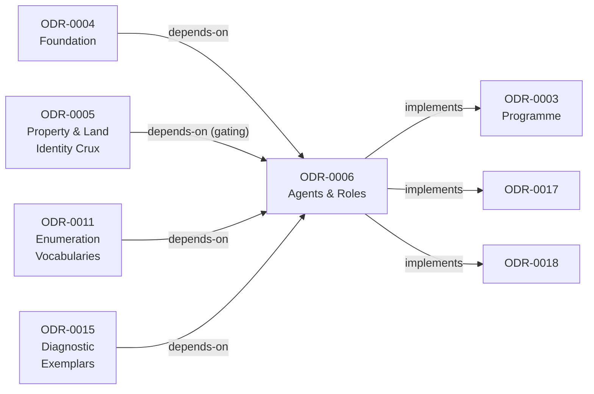
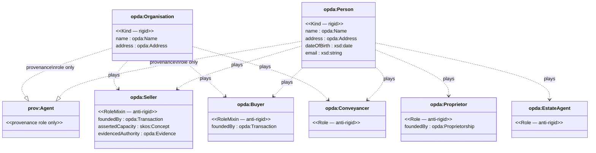
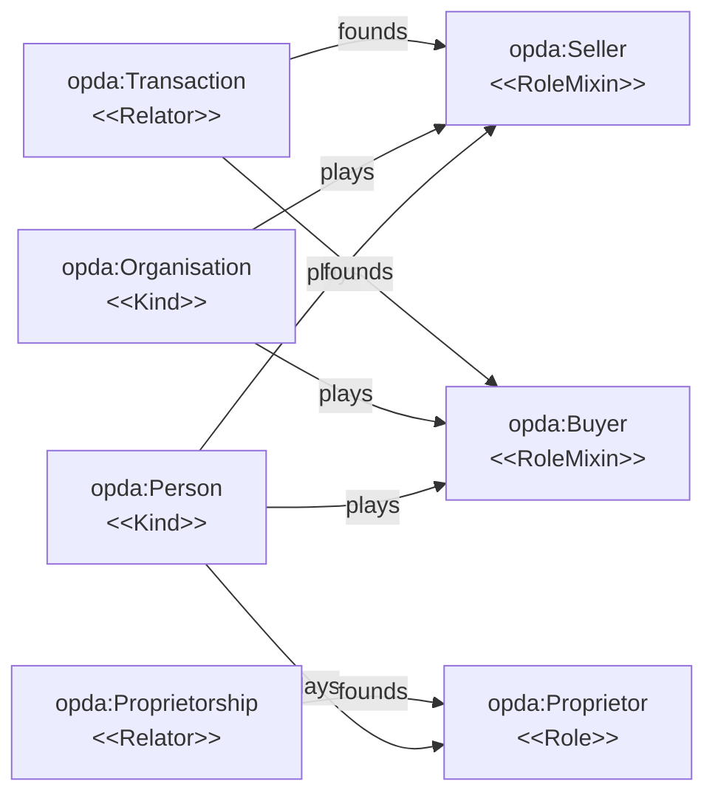
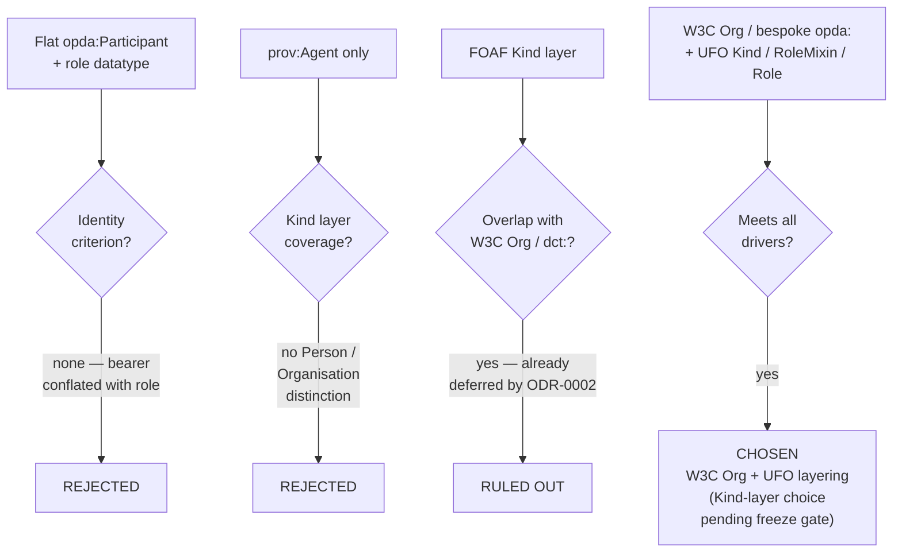

# Agents & Roles

### ODR dependency graph

The diagram below shows how this ODR relates to its declared `depends-on` and `implements` links.



## Context

PDTF v3 models everyone attached to a transaction as a flat `participants[]` array discriminated by a `role` enum, with `name`, `address`, `organisation`, `dateOfBirth` and `email` hanging off each entry, and distinguishes `privateIndividual` from `organization` only as enum values. This is the participant analogue of the implicit-Property defect (ODR-0005): identity-supplying things (a person, an organisation) are conflated with anti-rigid, externally founded things (being a *seller*, *buyer*, *conveyancer*). Capacity is a casualty — `sellersCapacity` and the gap between *asserted* capacity and *evidenced* authority (probate, power of attorney) collapse a founding legal grant into a free-text enum.

Council Session 001 (Q3) resolved to partition the ontology by **ontological concern**, reconciling Kendall's FIBO modules with Guizzardi's UFO Kind/Role/Relator layering. This ODR is the **Agents & Roles** module under that partition. It is gated by the identity crux (ODR-0005): Person/Organisation identity criteria and the `Address` class are shared with the Property work.

## Decision

Adopt a **W3C Org ontology (or bespoke `opda:`) Kind layer with UFO Kind/RoleMixin/Role layering**, ruling out FOAF, because it places identity where identity actually lives (the person/organisation) while keeping role-play anti-rigid and externally founded, and leaves a clean seam to the provenance layer via `prov:Agent`.

## Rules

### Class hierarchy: Kind, RoleMixin, Role

The diagram shows the UFO-layered class structure for agents and roles as decided in this ODR.



### Kind layer (rigid, identity-supplying)

- `opda:Person`, `opda:Organisation` — substance **Kinds**. Identity criteria coordinated with ODR-0005's category commitments.
- `opda:Name`, `opda:Address` — structured datatypes, declared **once** here and reused by ODR-0005/0008 (single Address class).
- `prov:Agent` is retained **only** as the provenance role in claim/verification activities (ODR-0009), not as the Kind-layer agent type.

### Role layer (anti-rigid, externally founded)

- `opda:Seller`, `opda:Buyer` — **RoleMixins**, played by a Person *or* Organisation. Each is specialised by a sortal role (`PersonSeller`, `OrganisationSeller`) that carries identity, and founded by the `opda:Transaction` relator (ODR-0007).
- `opda:Proprietor`, `opda:Conveyancer`, `opda:EstateAgent`, `opda:Surveyor`, `opda:Lender`, `opda:Insurer` — **Roles**, each founded by the relevant Relator (Proprietor by an `opda:Proprietorship`).

### Role-founding relator pattern

This diagram illustrates how each Role or RoleMixin is externally founded by its Relator, as required by UFO anti-rigidity rules stated in this ODR.



### Capacity split

- `opda:assertedCapacity` — SKOS-typed (→ ODR-0011).
- `opda:evidencedAuthority` — link to evidence (→ ODR-0009).
- The founding grant (probate, POA) is modelled as the missing Relator.

### Turtle stubs

```turtle
opda:Person a owl:Class ;
    rdfs:label "Person"@en ;
    ufo:isKind true .

opda:Organisation a owl:Class ;
    rdfs:label "Organisation"@en ;
    ufo:isKind true .

opda:Seller a owl:Class ;
    rdfs:label "Seller"@en ;
    ufo:isRoleMixin true ;
    ufo:foundedBy opda:Transaction .

opda:Proprietor a owl:Class ;
    rdfs:label "Proprietor"@en ;
    ufo:isRole true ;
    ufo:foundedBy opda:Proprietorship .
```

### SHACL constraints (ODR-0013)

SHACL shapes constrain `opda:Seller`/`opda:Buyer` role-play to a `opda:Person` or `opda:Organisation` bearer, and require an `opda:evidencedAuthority` link where a capacity is asserted in a regulated context:

```turtle
opda:SellerShape a sh:NodeShape ;
    sh:targetClass opda:Seller ;
    sh:property [
        sh:path opda:playedBy ;
        sh:or ( [ sh:class opda:Person ] [ sh:class opda:Organisation ] ) ;
        sh:minCount 1 ;
    ] ;
    sh:property [
        sh:path opda:assertedCapacity ;
        sh:node opda:RegulatedCapacityRequiresEvidence ;
    ] .
```

### Enforcement and gates

- Validated against the participant facets of the diagnostic exemplars (ODR-0005): private-individual seller, organisation seller, seller acting under power of attorney.
- Role and capacity SKOS concepts (ODR-0011) carry `skos:prefLabel`/`skos:definition` sourced from the business glossary and `dct:source` back to it.
- **Freeze gate**: this module's TBox is not frozen until (a) ODR-0005 clears its identity-criterion gate and (b) the remaining Kind-layer choice (W3C Org vs bespoke `opda:`) is resolved in council.

## Decision rationale

The flowchart traces the three candidate agent-layer approaches through their disqualifying defects to the chosen outcome.



## Alternatives

- **Keep the schema shape** — one `opda:Participant` class with a `role` datatype property. Reproduces the exact defect: no identity criterion, bearer conflated with role.
- **`prov:Agent`-only agent layer** — `prov:Agent` is deliberately thin and cannot carry the Kind layer (no Person/Organisation distinction, no structured Name).
- **FOAF for the Kind layer** — overlaps the W3C Org ontology and `dct:` confusingly, absent from the comparable H&M `src/` survey, already deferred by ODR-0002. **Ruled out.**

## Consequences

- Downstream modules MUST consume `opda:Address` and `opda:Name` from this module rather than redeclaring them.
- The evidence layer (ODR-0009) MUST attach to the `opda:evidencedAuthority` slot when a regulated capacity is asserted.
- The role/capacity SKOS schemes (ODR-0011) MUST source their members from the data dictionary's `role` enum and labels from the business glossary.
- The TBox remains unfrozen until the W3C-Org-vs-bespoke `opda:` Kind-layer choice is resolved in a follow-up council session.
- Schema-to-ontology mapping work for `participants[]` is blocked on this module reaching freeze.

## References

- **Target versions**: RDF 1.2 and SHACL 1.2, per the Core-tier pin in [ODR-0002](./ODR-0002-ontology-language-adoption.md).
- **Vocabularies**: Core (OWL/RDFS/XSD); SKOS for role/capacity schemes (→ ODR-0011); PROV-O for the verification cross-link (→ ODR-0009); DPV for PII annotation on Person/contact leaves (→ ODR-0012); OWL-Time if role-tenure intervals are modelled here. Candidate Kind-layer vocabularies (FOAF ruled out): W3C Org ontology or a bespoke `opda:` Kind layer.
- **Glossary & data dictionary inputs**: the role concept scheme (ODR-0011) draws enumerated members from `baspi5.json` (Buyer, Seller's Conveyancer, Prospective Buyer, Buyer's Conveyancer, Estate Agent, Buyer's Agent…) and `skos:definition`/`skos:prefLabel` from the business glossary (`Participant`, `Role`, `Scheme Operator`, `Data Provider`, `Data Recipient`, `TPP`). Each concept carries `dct:source` to its glossary row or schema leaf path. See [ODR-0004](./ODR-0004-pdtf-ontology-foundation.md) for the term-sourcing convention.
- **Deliverables**: `agents-roles.ttl`; Role/Capacity/Status SKOS schemes (→ ODR-0011); DPV PII annotations (→ ODR-0012); SHACL role-play and capacity-evidence shapes (→ ODR-0013).
- **Related ODRs**: anchor [ODR-0003](./ODR-0003-pdtf-ontology-programme.md); foundation [ODR-0004](./ODR-0004-pdtf-ontology-foundation.md); gating crux [ODR-0005](./ODR-0005-property-land-identity-crux.md); provenance [ODR-0009](./ODR-0009-claims-evidence-provenance.md); enumerations [ODR-0011](./ODR-0011-enumeration-vocabularies.md); governance [ODR-0012](./ODR-0012-data-governance-layer.md).
- **Council deliberation**: [session-001](./council/session-001-pdtf-schema-to-ontology.md) Q2 (Kind-layer agent vocabulary), Q3 (partition), Q4 (shared Address/identity).
