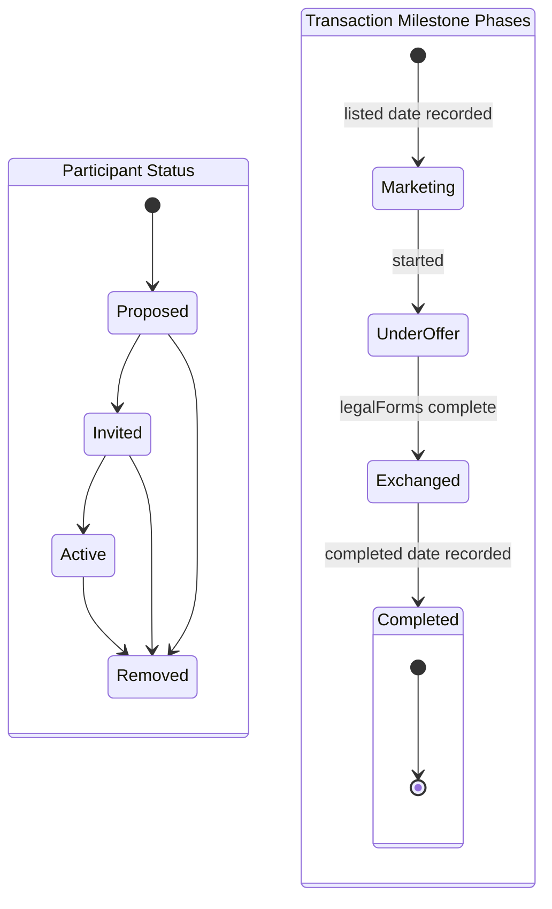
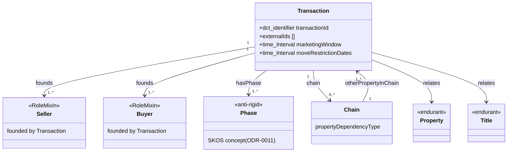
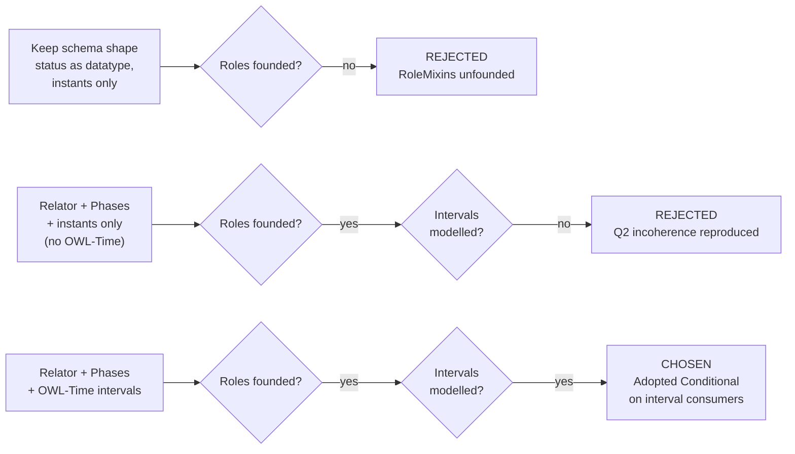
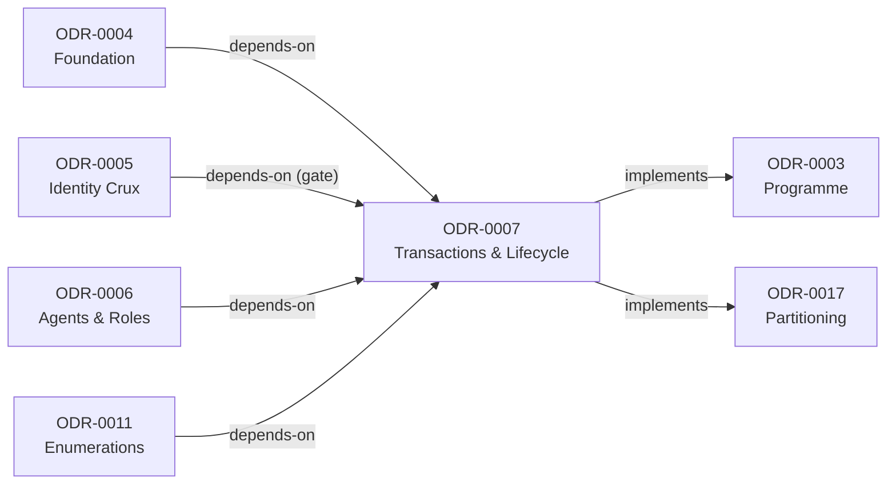

# Transactions & Lifecycle

## Context and Problem Statement

The PDTF v3 schema carries the transaction envelope as a flat bundle of leaves with no relational object: `transactionId`/`externalIds` identify it, `participants[]` lists the parties (ODR-0006), `milestones` records `listed`/`started`/`completed` and `legalForms` progress, `chain` holds chain linkage, and a scatter of date leaves (`listedDate`, `soldDate`, `expected`, `started`, `completed`, official-copy `retrievedOn`) records *when* things happened. The transaction is the verb half of the model — the thing that binds seller, buyer, property and legal estate into a homebuying episode — yet the schema gives it no class and no founding semantics.

Two defects compound. **Role-founding**: ODR-0006 models `opda:Seller`/`opda:Buyer` as RoleMixins (anti-rigid, externally founded), but a RoleMixin is incoherent without the relation that founds it — nothing in `participants[] + role` names the transaction-as-relation. **Temporal**: the schema records instants (`soldDate`, `listedDate`) but has no vocabulary for the intervals that dominate the lifecycle — marketing-to-completion windows, lease terms (`startYearOfLease`/`lengthOfLeaseInYears`), `lastDemandPeriod {from, to}`, proprietorship duration. `milestones` and `participantStatus` (`Proposed | Invited | Active | Removed`) further conflate an anti-rigid status *phase* with a plain datatype value.

This is the **Transactions & Lifecycle** module under Council Session 001's partition-by-ontological-concern resolution (Q3). It is Phase-1 and **gated by the identity crux** (ODR-0005): the Transaction relator relates Property/Title endurants whose identity criteria are settled in the crux.

## Considered Options

* **Option A (chosen) — Transaction-as-Relator + Phases + OWL-Time Conditional intervals.** `opda:Transaction` is a UFO Relator founding the ODR-0006 Seller/Buyer RoleMixins; milestones and `participantStatus` are anti-rigid Phases backed by SKOS schemes; lifecycle/tenure intervals use OWL-Time while `prov:atTime` is retained for genuine instants.
* **Option B — Keep the schema shape (one `opda:Transaction` class with `status`/`milestone` datatype properties and `prov:atTime` instants only).** Rejected: leaves the ODR-0006 RoleMixins unfounded and cannot express the interval-valued lifecycle facts the date-pair leaves clearly imply.
* **Option C — Transaction-as-Relator + Phases + instants-only (no OWL-Time).** Rejected: founds the roles correctly and treats status as anti-rigid Phases, but reproduces the Q2 incoherence the Council reversed (≈6-3) — using `prov:atTime` instants while proprietorship and lease intervals go unmodelled.

## Decision Outcome

Chosen option: "Option A — Transaction-as-Relator + Phases + OWL-Time Conditional intervals", because it is the only option that founds the participant roles in an explicit relation, models status with the correct anti-rigid category, and resolves the instant-vs-interval incoherence — while reusing standard vocabularies rather than re-minting machinery.

Model the transaction envelope as **Transaction-as-Relator + Phases + OWL-Time Conditional intervals**: `opda:Transaction` is a UFO Relator founding the ODR-0006 Seller/Buyer RoleMixins, milestones and `participantStatus` are anti-rigid Phases backed by SKOS schemes (ODR-0011), and lifecycle/tenure intervals use OWL-Time while `prov:atTime` is retained for genuine instants in the provenance layer (ODR-0009). This is the only option that founds the participant roles in an explicit relation, models status with the correct anti-rigid category, and resolves the instant-vs-interval incoherence (Q2) — while reusing standard vocabularies rather than re-minting machinery.

### Consequences

* Downstream modules must consume the founding-Relator pattern: ODR-0006 RoleMixins resolve their founding citation against `opda:Transaction` (and the sibling Relators) defined here.
* ODR-0011 must publish SKOS concept schemes for milestones, `legalForms` and `participantStatus`, with `skos:prefLabel`/`skos:definition`/`dct:source` populated per the term-sourcing convention.
* ODR-0009 must model milestone transitions as `prov:Activity` instances that reference (do not re-model) the Phase changes defined here.
* ODR-0013 must publish SHACL shapes for `time:Interval` well-formedness and lease-term derivation.
* OWL-Time is adopted **Conditional** over a recorded Allemang/Davis "defer until a concrete consumer" dissent; if lifecycle interval consumers fail to materialise, the temporal layer carries cost without a proven user.
* The status SKOS scheme(s) cannot be frozen until the single-scheme-vs-per-role question is resolved in a follow-up council session.
* Capacity cross-link: `sellersCapacity` and the asserted-vs-evidenced split remain owned by ODR-0006; the Transaction relator is the relation within which a capacity is asserted, so the ODR-0009 evidence attachment point reaches the transaction through the founded role.
* Target versions: this module targets **RDF 1.2** and **SHACL 1.2** per the Core-tier pin in ODR-0002.
* Deliverables (when fleshed out): `transactions-lifecycle.ttl`; status/milestone/legal-forms SKOS schemes (→ ODR-0011); an OWL-Time usage-pattern note covering interval construction from the schema's date-pair and lease-term leaves; SHACL interval-well-formedness shapes (→ ODR-0013).

## More Information

- Anchor: [ODR-0003](./ODR-0003-pdtf-ontology-programme.md)
- Foundation: [ODR-0004](./ODR-0004-pdtf-ontology-foundation.md)
- Gating crux: [ODR-0005](./ODR-0005-property-land-identity-crux.md)
- Agents & roles whose RoleMixins this module's Relator founds: [ODR-0006](./ODR-0006-agents-and-roles.md)
- Provenance & claims: [ODR-0009](./ODR-0009-claims-evidence-provenance.md)
- Enumerations: [ODR-0011](./ODR-0011-enumeration-vocabularies.md)
- Validation: [ODR-0013](./ODR-0013-shacl-validation-and-severity.md)
- Vocabulary catalogue: [ODR-0014](./ODR-0014-vocabulary-catalogue-amendments.md)
- Ontology-language adoption (target versions): [ODR-0002](./ODR-0002-ontology-language-adoption.md)
- Council deliberation: [session-001](./council/session-001-pdtf-schema-to-ontology.md) — Q2 (OWL-Time adopted Conditional, ≈6-3, Allemang/Davis dissent), Q3 (partition by concern)
- Schema inputs: `milestones`, `listed`, `legalForms`, `chain`, `participants`/`participantStatus`, `startYearOfLease`, `lengthOfLeaseInYears`, `lastDemandPeriod {from, to}`, `moveRestrictionDates`, `listedDate`, `soldDate`, `started`, `completed`, `expected`
- Vocabularies: OWL-Time (intervals/instants — Conditional, catalogued in ODR-0014); SKOS (→ ODR-0011); PROV-O (`prov:atTime` instants, → ODR-0009); DCAT Conditional where the transaction references published datasets (→ ODR-0014)

## Rules

- **`opda:Transaction` is a UFO Relator** — a relational endurant mediating the parties, carrying `transactionId` (`dct:identifier`, sourced from the schema `transactionId` UUID leaf) and `externalIds`. It **founds the `opda:Seller`/`opda:Buyer` RoleMixins of ODR-0006**. Role-founding is asserted in this module's prose and Turtle, not as a frontmatter `depends-on` from ODR-0006, to keep the dependency graph acyclic. Other founding Relators surfaced in ODR-0006 (`opda:Proprietorship` founding `opda:Proprietor`; conveyance/transfer relator founding transfer roles) sit at this relational layer alongside the Transaction.
- **`opda:Chain` as a relation between Transactions** — sourced from `chain`, `otherPropertyInChain` and `propertyDependencyType` (`Sale | Purchase | Remortgage`). A dependent purchase or onward sale is a related Transaction relator, not a property of a single transaction.
- **Milestones and status as anti-rigid Phases** — `milestones` (`listed`, `started`, `completed`, `legalForms`) and `participantStatus` (`Proposed | Invited | Active | Removed`) are modelled as Phases of the Transaction (or of a participant's role-play), backed by SKOS status/milestone concept schemes delegated to ODR-0011. A transaction is "in marketing", "under offer", "exchanged", "completed" the way a phase is entered and left, not the way a Kind is instantiated. `legalForms` (TA6/TA7/TA10 completion) is a sub-phase scheme under the same treatment.
- **OWL-Time intervals for interval-valued facts** — lifecycle and tenure facts use OWL-Time: the marketing-to-completion window (`listed`/`started`/`completed` as `time:Instant` bounds of a `time:Interval`); lease terms (`startYearOfLease` + `lengthOfLeaseInYears` → a `time:Interval` / `time:DurationDescription`); `lastDemandPeriod {from, to}`; `moveRestrictionDates`; proprietorship duration. Use `time:hasBeginning`/`time:hasEnd`/`time:hasDuration`. **Reserve Allen-interval relations** (`time:intervalDuring`, `time:intervalBefore`) for where temporal ordering is genuinely asserted, not as decoration.
- **`prov:atTime` retained for instants** — genuine instants in the verification/claims layer (ODR-0009) keep `prov:atTime`; OWL-Time supplies the interval vocabulary PROV-O lacks. The two are complementary.
- **SHACL well-formedness (delegated to ODR-0013)** — shapes constrain a `time:Interval` to carry a beginning and (where the schema supplies one) an end, and constrain lease-term intervals derived from `startYearOfLease`/`lengthOfLeaseInYears` to be well-formed.
- **Lifecycle/provenance seam** — a milestone *transition* is represented once as a lifecycle Phase change here and **referenced (not re-modelled)** as a `prov:Activity` in ODR-0009.
- **Term sourcing** — derived concepts carry `dct:source` to their canonical schema leaf path per ODR-0004; SKOS concepts (ODR-0011) carry `skos:prefLabel`/`skos:definition` from the business glossary and the schema's `milestones`/`legalForms`/`participantStatus` definitions.
- **Single-scheme-vs-per-role status (RESOLVED — Council [session-032](./council/session-032-status-scheme-grain.md), 2026-05-31; Q1/Q2/Q3 each 5–0–0; DA Kendall WITHDRAWN on all three).** A **single** status state-machine, **not** per-role: one `opda:ParticipantStatusScheme` + one `opda:MilestoneScheme` (ODR-0011), with role-specific views expressed as `skos:Collection` within the one scheme — **never** per-role schemes (the ODR-0011 §1a one-primary-scheme integrity constraint forbids the duplicate-concept lattice that would require). **Two distinct Phase-bearers** (refinement adopted): the *milestone*-Phase bears on `opda:Transaction` (the Relator); the *participantStatus*-Phase bears on the **participant's role-play** (qua-individual within the Relator), per ODR-0011 §8a "Kind-in-phase (Participant)" — do not flatten both onto the Transaction. Decided empirically: the PDTF corpus carries only the four envelope states `Proposed|Invited|Active|Removed` as one un-role-discriminated field, with no role-specific operational lifecycle data. **Re-open trigger (SET-test — a future-evidence watch, not a held-as-live dissent; the DA fully withdrew):** re-open the single-scheme commitment only on genuine *definitional* divergence — a role for which a status value's definition differs (absent in schema and emitted TTL today). Lesser future variation routes elsewhere, not to a scheme split: a role-specific *subset* of states → `skos:Collection` + overlay `sh:in`; role-specific *transitions* → a role-keyed SHACL-AF rule (ODR-0013/0017).
- **Transaction current-phase property (NEW — Council [session-043](./council/session-043-transaction-phase-and-ufocategory-dereferenceability.md), 2026-06-15; Q1 3–1–2, Q2 4–0–2, Q3 5–0–1; `status: proposed`, WG ratifies adoption).** Realise the milestone-Phase as a queryable facet on the Relator: mint `opda:transactionStatus` — `owl:DatatypeProperty`, `rdfs:domain opda:Transaction`, `rdfs:range xsd:string`, `sh:in`-bound to the **existing** `opda:TransactionStatusScheme` notations (`Listed/Offered/Accepted/Exchanged/Completed`). **Reuse the scheme; do NOT mint a coarse one** — the ODR-0011 §1a one-primary-scheme IC forbids the double partition, and the coarse tokens would collide with `opda:ParticipantStatusScheme` (`Proposed/Active/…`). The value is the anti-rigid Phase *standing on the Relator*, categorially distinct from the perdurant `opda:Milestone` events that effect transitions (Guizzardi 2005 Ch. 4); where a milestone event-log exists the value is a **derived projection** — `prov:wasDerivedFrom` the terminal milestone, so drift is auditable (Moreau, PROV-DM §5.7.2) — and where none exists (`chain-of-transactions`, `lease-extension`) the property is the sole carrier of an otherwise *unrepresentable* phase. **Editorial fix (adopted):** correct the `TransactionStatusScheme` / `ParticipantStatusScheme` `skos:definition` "Substance Kind" → the Relator / role-play bearer (per session-032). **Exemplar value-mapping:** `completed → Completed`; `active → Offered` (conservative, operator-confirmable — `active` is a `participantStatus` token, not a native transaction phase); chain-level `opda:chainStatus` stays on the `opda:TransactionChain`.
- **§Held dissent (Davis DA, session-043).** *Q1:* "mint nothing — reified milestones model phase; a parallel status string is denormalisation that drifts." **Re-open trigger:** a verified consumer query unanswerable by projection over reified milestones AND an exemplar where milestones exist to project from (a measured bottleneck, not anticipated). *Q3:* drop `active` for the no-milestone chain transactions rather than map it to `Offered`. **Re-open trigger:** the WG supplies PDTF source recording a transaction-level phase independently of milestone events.
- **Freeze gate — CLEARED (2026-05-31).** Both conditions are now met: (a) ODR-0005 cleared its identity-criterion gate (the Transaction relator relates Property/Title endurants); and (b) the single-scheme-vs-per-role question resolved in Council [session-032](./council/session-032-status-scheme-grain.md). The Transactions & Lifecycle TBox is unfrozen.
- **Exemplar validation** — the module is validated against the lifecycle facets of the ODR-0005 diagnostic exemplars: a property mid-marketing (open-ended interval), a completed sale (closed interval), and a leasehold whose lease term is an interval with a computed end.

### Transaction Lifecycle Phases

The participant-status and milestone phases form a directed state machine: a participant moves through `Proposed → Invited → Active → Removed` while the transaction itself progresses through marketing, under-offer, exchanged and completed milestone phases.

### Transaction Relator and Entity Model

`opda:Transaction` is a UFO Relator mediating Property/Title endurants and founding the Seller/Buyer RoleMixins; each milestone or participant status is a Phase, and chain linkage is a relation between Transaction instances.

### Alternatives Considered and Chosen Outcome

Three candidate designs were evaluated against the two key drivers — role-founding coherence and interval-vs-instant accuracy — with Transaction-as-Relator + Phases + OWL-Time the only option satisfying both.

### ODR Dependency Graph

ODR-0007 depends on the foundation, identity-crux, and agents ODRs, implements the programme and partitioning ODRs, and has no predecessors to supersede.

