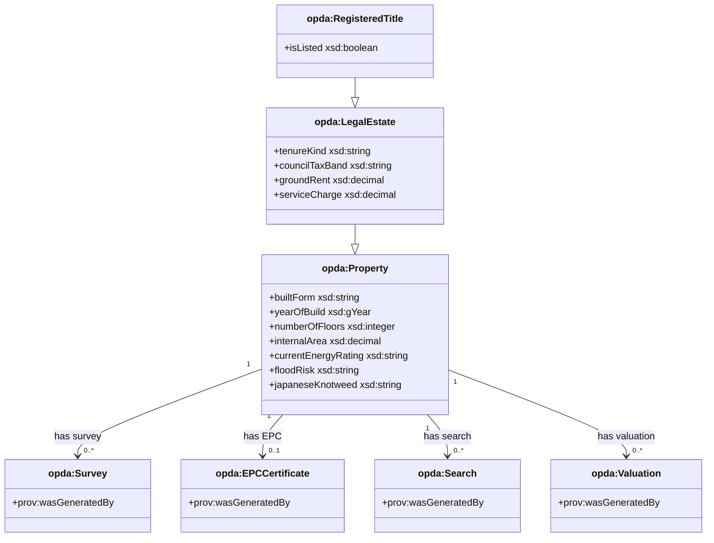
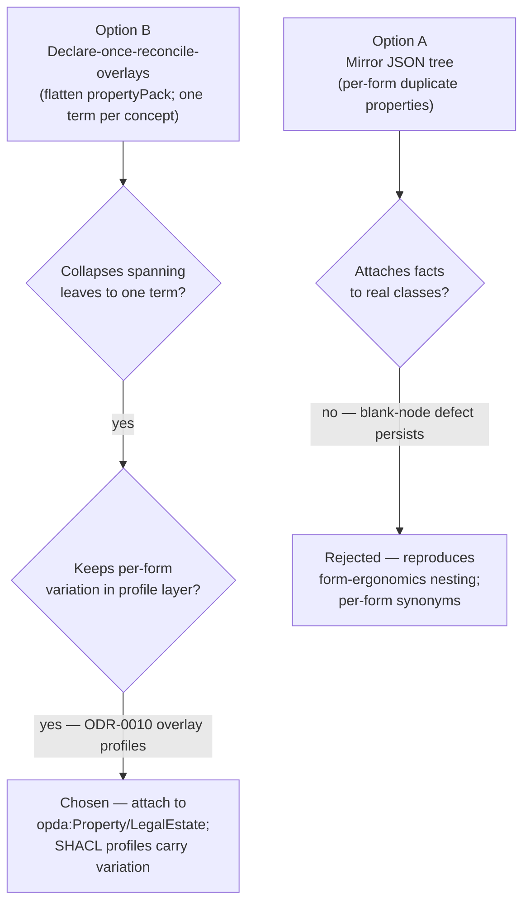
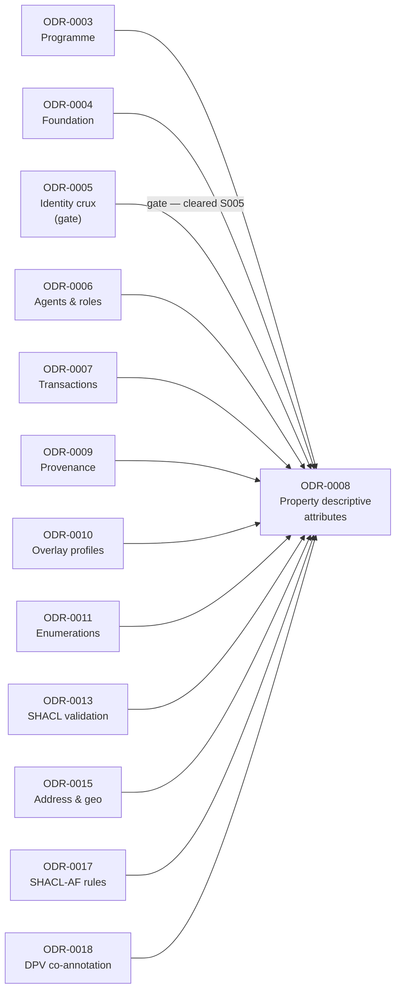

# Property Descriptive Attributes

## Context

The descriptive layer is where PDTF v3 volume lives: of 1,556 unique leaves in `pdtf-transaction.json` (935 annotated), the great majority describe a property (built form, condition, valuation, EPC/energy, utilities, searches, encumbrances, completion). All hang off a deeply nested `propertyPack` mega-tree, and the same descriptive families recur across every form overlay (baspi5 318, rds 196, piq 184, ta6 178, nts2 160, lpe1 136, …).

Two defects bite. First, **attachment**: in the schema these facts dangle off `propertyPack` with no first-class subject — the ontology has no Property class to attach them to (ODR-0005 defect; Cagle Q3: "that nesting is form ergonomics, not ontology — flatten it"). Second, **cross-context reconciliation**: spanning leaves recur across overlays — `propertyPack` ×18, `energyEfficiency`/`heating`/`typeOfConstruction`/`listingAndConservation` ×9, `mainsWater`/`drainage`/`electricity` ×9–10 — and must reconcile to one ontology property, not mint per-form synonyms.

Council Session 001 (Q3) resolved to partition by **ontological concern**. This ODR is the **Property descriptive attributes** module under that partition — a Phase-1 module gated by ODR-0005's identity crux, which MAY later split into sub-modules (built-form / energy / searches / encumbrances) once volume is understood.

## Decision

Adopt **Declare-once-reconcile-overlays**: flatten the `propertyPack` tree; declare each descriptive property **once** as an `opda:` datatype property on the Property/Title class, sourced from the canonical data-dictionary leaf with `dct:source` + `rdfs:comment`; reconcile spanning leaves so all overlay occurrences map to that single property; push per-form required/enum variation onto the SHACL overlay profiles (ODR-0010). Chosen because it is the only option that attaches descriptive facts to real classes, collapses each spanning leaf to one term, and keeps per-form variation in the profile layer where Q3 and Q5 placed it.

## Rules

**Attachment** — Descriptive properties attach to `opda:Property` and the legal-estate classes from ODR-0005 (and to intermediate built-form classes such as Building/Room where the fact is about a sub-part). Never to a `propertyPack` blank node.

**Data dictionary as the leaf inventory** — The descriptive datatype properties are enumerated from the data dictionary. Indicative families and source leaves:

- **Built form** — `buildInformation`, `typeOfConstruction`/`constructionType`, `builtForm` (`Detached | Semi-detached | Mid-terrace | End-terrace | Other`), `yearOfBuild`, `numberOfFloors`, `internalArea`/`area`/`units`, `bedrooms`/`bathrooms`/`receptions`, `residentialPropertyFeatures`, `rooms`/`roomDimensions`.
- **Condition** — `surveys`, `subsidenceOrStructuralFault`, `dampProofingTreatment`, `buildingSafety`/`buildingSafetyAct`, `dangerousCladdingOrDefects`, `japaneseKnotweed`.
- **Valuation & price** — `valuations`/`value`, `price`/`listPrice`/`priceQualifier`, `propertyPricing`/`estimatedPrice`/`rentalEstimate`/`yield`, `valuationComparisonData`.
- **Energy / EPC** — `energyEfficiency`, `currentEnergyRating` (EPC band `A`–`G`), `energy`/`energyRisk`, `solarPanels`, `greenDealLoan`.
- **Utilities & connectivity** — `heating`/`heatingType`/`centralHeatingFuelType`, `electricity`/`mainsElectricity`, `water`/`mainsWater`/`waterAndDrainage`/`drainage`, `connectivity`/`broadband`/`mobilePhone`/`typeOfConnection`, meter leaves (`mpan`/`mprn`/`electricityMeter`/`gasMeter`).
- **Local context (searches)** — `localSearches`/`localAuthoritySearches` (CON29R), `localLandCharges` (LLC1), `environmentalIssues`, `floodRisk`/`flooding`, `radon`/`radonRisk`, `coalMining`, `localAuthority`, `nearbyFacilities`/`schools`/`transport`/`healthCare`, `planning`/`planningApplication`.
- **Encumbrances** — `councilTax`/`councilTaxBand`, `groundRent`/`serviceCharge`, `buildingsInsurance`/`insurance`, `guaranteesWarrantiesAndIndemnityInsurances`, `rightsAndInformalArrangements`/`publicRightOfWay`, `occupiers`/`lettingInformation`, `listingAndConservation`/`isListed`.
- **Completion & moving** — `completionAndMoving`, `fixturesAndFittings`/`itemsToInclude`/`itemsToRemove`, `moveRestrictionDates`, `confirmationOfAccuracyByOwners`.

**Sourcing convention** — Each descriptive `opda:` datatype property is sourced from a data-dictionary leaf, carries `dct:source` to its canonical schema leaf path (the form-question IRI of Q5's mapping rule) and `rdfs:comment` from the dictionary's description text, per the convention defined in ODR-0004.

**Cross-context reconciliation** — Spanning leaves the data dictionary flags (`propertyPack` ×18, `energyEfficiency` ×9, `heating` ×9, `typeOfConstruction` ×9, `listingAndConservation` ×9, `mainsWater`/`drainage`/`electricity` ×9–10) each reconcile to **one** ontology property. The differing per-overlay `dct:source` references attach to the single property; per-form required/enum variation is expressed as SHACL property shapes in the overlay profiles (ODR-0010), not as duplicate datatype properties.

**Generated, then deliberated** — The mechanical leaf → datatype-property mapping is generated from the data dictionary (Allemang's generator-first rule, Q1). Deliberation is reserved for genuinely ambiguous reconciliations and for which `object`-typed leaves become intermediate classes (Building, Room, Survey, Search) versus structured datatypes.

**Enforcement** — SHACL shapes (ODR-0013) constrain numeric descriptive properties to plausible ranges and string-formatted ones to their patterns; the overlay profiles (ODR-0010) carry per-form `sh:minCount`/`sh:in` variation for reconciled spanning properties. Cross-context reconciliation is verified by checking that each data-dictionary spanning leaf maps to exactly one `opda:` property with all overlay occurrences resolving to it. The module is validated against the descriptive facets of the diagnostic exemplars (ODR-0005): the same property described through two different overlays must populate the *same* ontology properties.

**Gate** — ✅ **CLEARED.** ODR-0005's 3-class identity-criterion gate ratified at S005; descriptive properties attach to `opda:Property`, `opda:LegalEstate`, `opda:RegisteredTitle` (and the named sub-Kinds promoted per Operational specifications §Q4 below). Namespace block cleared via S003b + ADR-0006.

**Delegated** — Descriptive enumerations (built-form, property-type, units, EPC band, council-tax band, tenancy type) are SKOS concept schemes owned by ODR-0011, not resolved here.

### Operational specifications (added by [Session 008](./council/session-008-property-descriptive-attributes.md))

Session 008 (Full Council; Queen Allemang; DA Cagle — 6 of 7 questions WITHDRAWN/CONCEDED + 1 HELD-AS-LIVE + 1 PRIMARY VIGILANCE) operationalised the discipline through seven `## Operational specifications` subsections. Original `## Rules` above stand; subsections below add the build-time and CI-enforced disciplines.

#### Q1a — Spanning-leaf detection (no arithmetic threshold)

Mechanical-default + SHACL shape-target detection + consumer-query reconciliation trigger + reconciliation register + Pandit's PII discovery hook. Every annotated leaf emits one `opda:` datatype property; spanning leaves are detected by SHACL `?shape sh:targetClass opda:Property ; sh:path ?p` grouping (Knublauch); deliberation fires on consumer-query trigger; outcomes recorded in a per-leaf reconciliation register; new spanning-leaf candidates fire ODR-0017 SHACL-AF rule for DPV co-annotation per ODR-0018 §3a.

#### Q2a — Sub-module spawn-triggers (monolithic-with-named-triggers)

ODR-0008 stays monolithic. Spawn-rule fires on EITHER (a) **UFO meta-category crystallisation** — when ≥1 sub-module's leaf-set populates such that Quality / Mode / Substance-Kind-label distinctions are operationally load-bearing, spawn ODR-0008a/b/c by UFO axis with named stewards (Allemang on `property-qualities`; Guizzardi/Pandit on `property-modes`; Kendall on `legal-estate-attributes`); OR (b) **authority-retrieved-artefact provenance loss** — when Survey/EPC/Search/Title-Plan cannot be flat datatype bags without losing `prov:wasGeneratedBy`, spawn ODR-0008d "Authority-Retrieved Artefacts" with `implements: [ODR-0007, ODR-0017]`. Kendall's four-way alternative held-as-live (18 months or encumbrance-cardinality trigger).

#### Q3a — Citation grain (per-property + per-overlay array)

Per-property `dct:source` per ODR-0004 §7a with version-pinned URL. For spanning leaves, an array of `dct:source` triples (one per overlay leaf-path) — lossless audit in both directions. DPV co-annotations carry parallel per-property `dct:source` to regulator text per ODR-0018 §6. Round-trip equivalence SPARQL test verifies the per-property + per-overlay array recovers the data-dictionary cross-context table. Cagle's section-level opt-in HELD-AS-LIVE for 18-month review.

#### Q4a — Three-criterion class-promotion test

A leaf or leaf-cluster promotes to a Class iff ANY of: (a) authority-retrieved provenance (`prov:wasGeneratedBy` chain to regulator-issued or professional-issued activity); OR (b) distinct lifecycle (issued / superseded / re-issued / withdrawn); OR (c) distinct PII regime per ODR-0018. Definite Class promotions: `opda:Survey`, `opda:EPCCertificate`, `opda:Search`, `opda:Valuation`, `opda:Comparable` — each retrofitting `implements: [ODR-0007, ODR-0017, ODR-0018]`. Conditional Class promotions held-as-live (Davis dissent): `opda:Building`, `opda:Room` — convene on first named BASPI5 round-trip query exercising sub-Property reasoning.

#### Q5a — Datatype vs SKOS per-leaf binding table

ODR-0011 §8a-named schemes become SKOS concept schemes; non-§8a one-shot enums stay `xsd:string + sh:in`. Burden of SKOS promotion on the proposer per leaf. Initial binding table:

| ODR-0008 leaf | UFO category | SHACL modelling |
|---|---|---|
| `currentEnergyRating` (A-G); `councilTaxBand` (A-I); `builtForm`; `ownershipType`; `centralHeatingFuelType`; `heatingType` | Quale-in-Region | SKOS scheme; Quality of `opda:Property` (or `opda:LegalEstate` for ownership) |
| `tenureKind` (Freehold / Leasehold / Commonhold) | Substance Kind label | SKOS scheme; sub-Kind via `skos:exactMatch`; NEVER `owl:sameAs` |
| `priceQualifier`, `marketingTenure` | Mode / Quality Value | SKOS scheme; Quality Value of listing Relator (S007 territory) |
| `yesNoNotKnown` (and dozens of leaves carrying it as flag); `mediaType` per-leaf one-shot internal | (not §8a) | `owl:DatatypeProperty` with `sh:in ("Yes" "No" "Not known")` — no SKOS scheme |
| `emailAddress`, `postcode` etc. (lexical-only one-shot) | (not §8a) | `xsd:string + sh:pattern` |
| `description`, `summary` etc. (free text) | (not §8a) | plain `xsd:string` |

Kendall's "SKOS for all category-likes" HELD-AS-LIVE with 18-month re-open trigger on downstream consumer demand.

#### Q6a — Hierarchy admission discipline (flat-default + reasoner-independence)

Flat default — every descriptive datatype property is `owl:DatatypeProperty` with no `rdfs:subPropertyOf` in initial emission. Hierarchy admission requires (i) named consumer query asking for parent-level entailment with query text reviewable; (ii) reasoner-independence test (UNION-over-children must equal entailed-parent answer-set; if they differ, the hierarchy is decorative under entailment-off SPARQL endpoints). SKOS broader/narrower for value-spaces (per ODR-0011 §Rules) — distinguished from predicate hierarchies. Kendall's `opda:hasUtilityConnection` parent HELD-AS-LIVE — re-open at first SHACL profile forced to UNION across utility-children.

#### Q7a — Overlay-form variation: three boundary clauses + three CI tests

Three explicit boundary clauses for the handoff to ODR-0010:

1. **Base-cardinality clause**: base TBox `0..*` for every descriptive property; per-form `sh:minCount` lives in ODR-0010 profile shapes.
2. **Enum union clause**: spanning leaves with differing per-overlay enum sets — base SKOS scheme carries the union of all overlay members; per-form `sh:in` restriction in ODR-0010 (per Cagle's Scope-Check 1 Q6 three-rule interface contract; `sh:in` semantics merged at build-time).
3. **Advisory annotations clause**: form-ergonomic guidance lives in `opda-annotations.ttl` (NOT base TBox or profile shapes — re-instantiates S001 Q5 + ODR-0004 §3a).

Three SHACL CI tests (added to ODR-0004 §3a five-part CI suite):

1. `ASK { ?p a opda:DescriptiveProperty . ?p sh:minCount ?n . FILTER (?n > 0) }` returns FALSE in base `opda-shapes.ttl`.
2. For each spanning leaf, the union of per-profile `sh:in` members equals the SKOS scheme's `skos:Concept` set.
3. `ASK { GRAPH opda:annotations { ?s a sh:NodeShape } }` returns FALSE.

Three-rule interface contract cross-cite to ODR-0010 + ODR-0013 is in §References.

### Attachment model: descriptive properties on real classes

Descriptive properties attach to `opda:Property` and legal-estate classes — never to the `propertyPack` blank node — with authority-retrieved leaves promoted to first-class classes per the Q4a three-criterion test.

### Decision: declare-once-reconcile vs mirror-the-JSON-tree

The two candidate strategies were evaluated against the core drivers — eliminating blank-node attachment and collapsing spanning leaves to one term per concept.

### ODR dependency graph

ODR-0008 is gated by the identity crux (ODR-0005) and implements the foundation, enumeration, and overlay-profile ODRs; the full upstream dependency chain is shown below.

## Alternatives

- **Mirror the JSON tree (per-form duplicate properties)** — emit a separate property for each form's copy of a spanning leaf. Fatal flaw: reproduces the `propertyPack` form-ergonomics nesting as ontology and fractures spanning concepts into per-form synonyms — the exact defect Q3 rejected.

## Consequences

- Descriptive facts attach to `opda:Property`/legal-estate classes from ODR-0005; the `propertyPack`-blank-node defect is eliminated.
- Each spanning leaf collapses to a single ontology property; the ontology gets one term per concept instead of per-form synonyms.
- Every property carries `dct:source` + `rdfs:comment` from the dictionary, supporting the BASPI round-trip (loaded profile validates data *and* regenerates the form).
- The mechanical leaf-to-property mapping is generated from the dictionary; scarce deliberation is reserved for ambiguous reconciliations.
- Reconciling ~935 annotated base leaves (plus overlay-specific leaves) is high-volume work; spanning-leaf detection is now mechanical (SHACL shape-target convergence per Q1a) — adjudication fires only on consumer-query trigger, recorded in the reconciliation register.
- Module gates ✅ CLEARED — S005 3-class ratified; S003b namespace ratified; full upstream TBox (S006/S007/S009/S010/S011/S012/S013/S015) ratified.
- Per-form required/enum variation MUST be authored as SHACL profile shapes (ODR-0010) per Q7a three boundary clauses; descriptive enumerations follow Q5a binding table — §8a-named schemes as SKOS per ODR-0011; non-§8a one-shot enums as `xsd:string + sh:in`.
- The mechanical 935-leaf walk now begins as implementation work: generator (ADR-0007) emits per-leaf binding table + class promotions per Q4a + reconciliation register per Q1a.
- ODR-0008 is the seventh `kind: pattern` ODR to discharge under A9 — methodology pressure-test passes 7-of-7 clean.
- Implementation depends on ADR-0007 generator + foundation.ttl emission; subsequent BASPI5 round-trip MVP gate (per ODR-0010 §Q7) exercises ODR-0008's mapping discipline against real overlay data.

## References

- **Target versions**: RDF 1.2 and SHACL 1.2, per the Core-tier pin in [ODR-0002](./ODR-0002-ontology-language-adoption.md).
- **Vocabularies**: Core (OWL/RDFS/XSD); SHACL for numeric ranges and format patterns (→ ODR-0013); SKOS for the descriptive enumerations (→ ODR-0011); DASH for form-rendering UI (→ ODR-0013); PROV-O for authority-retrieval provenance (EPC Register, HMLR, search providers → ODR-0009).
- **Out of scope** (deferred per ODR-0002): QUDT for units (kWh, m², W·m⁻²·K⁻¹) — carry `xsd:decimal` + SKOS-typed units; GeoSPARQL geometry (title plans, search polygons, `titleExtents`/`chargeExtent` stringified GeoJSON) — deferred.
- **Data dictionary**: `source/00-deliverables/semantic-models/data-dictionary.md` — `pdtf-transaction.json` base (1,556 unique leaves, 935 annotated) plus per-form overlays (baspi5 318, rds 196, piq 184, ta6 178, nts2 160, lpe1 136, …). The cross-context table is the authority for which leaves span overlays.
- **Open questions**: whether to split into sub-module ODRs (built-form / energy / searches / encumbrances) once volume is understood — deferred to drafting; the defect/condition taxonomy (RICS classification) and EWS1 / Building Safety Act modelling — UK-specific, WG input required.
- **Deliverables**: `property-attributes.ttl` (likely multiple files under one module namespace); the descriptive SKOS schemes (→ ODR-0011); authority-provenance patterns (→ ODR-0009); the generated leaf → datatype-property mapping with `dct:source`/`rdfs:comment` from the data dictionary.
- **Related**: anchor [ODR-0003](./ODR-0003-pdtf-ontology-programme.md); foundation [ODR-0004](./ODR-0004-pdtf-ontology-foundation.md); gating crux [ODR-0005](./ODR-0005-property-land-identity-crux.md); agents & roles [ODR-0006](./ODR-0006-agents-and-roles.md); transactions & lifecycle [ODR-0007](./ODR-0007-transactions-and-lifecycle.md); provenance [ODR-0009](./ODR-0009-claims-evidence-provenance.md); overlay profiles [ODR-0010](./ODR-0010-overlay-profile-mechanism.md); enumerations [ODR-0011](./ODR-0011-enumeration-vocabularies.md); data-governance [ODR-0012](./ODR-0012-data-governance-layer.md); validation [ODR-0013](./ODR-0013-shacl-validation-and-severity.md); address & geography [ODR-0015](./ODR-0015-address-and-geography.md); SHACL-AF pattern [ODR-0017](./ODR-0017-shacl-af-quality-rules-pattern.md); DPV co-annotation pattern [ODR-0018](./ODR-0018-dpv-class-level-coannotation-pattern.md).
- **Three-rule interface contract** (Scope-Check 1 Q6 / Cagle): ODR-0008 §Operational specifications Q7a cross-cite ODR-0010 + ODR-0013 on (i) `sh:in` semantics merged at build-time applied to closed schemes; (ii) `sh:Violation` floor; (iii) no-identity-override gate.
- **Cross-corpus ADR dependency:** [ADR-0007 — Ontology generator specification](../../adr/ADR-0007-ontology-generator-specification.md) — implementation of ODR-0008 §Operational specifications depends on the generator's deterministic emission discipline.
- **Council**: [session-001](./council/session-001-pdtf-schema-to-ontology.md) Q3 (partition by concern; flatten `propertyPack`); [session-008](./council/session-008-property-descriptive-attributes.md) Full Council ratification (Allemang Queen; Cagle DA — 6 WITHDRAWN/CONCEDED + 1 HELD + 1 VIGILANCE; ten voices across five teammates). Status `proposed → accepted`. Seventh `kind: pattern` ODR to discharge under A9 — methodology 7-of-7 clean.
