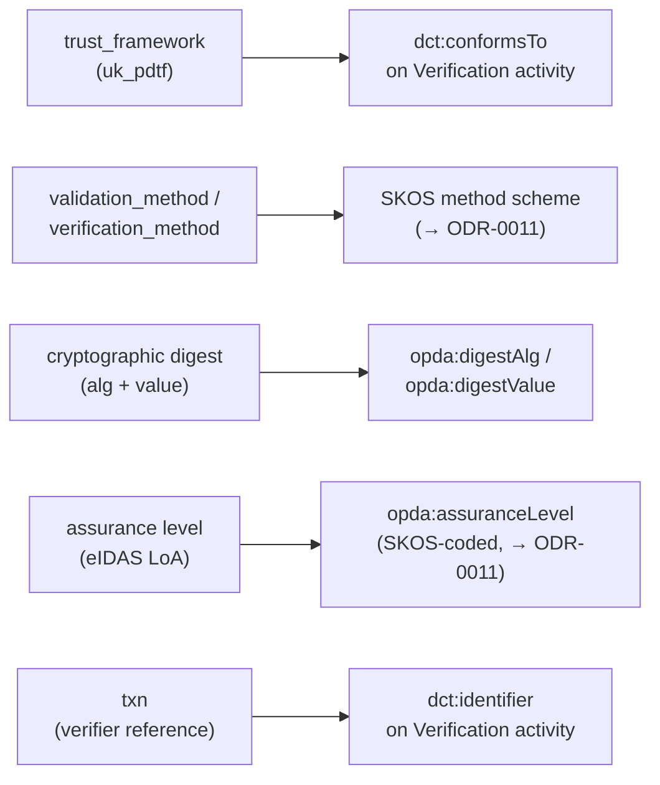
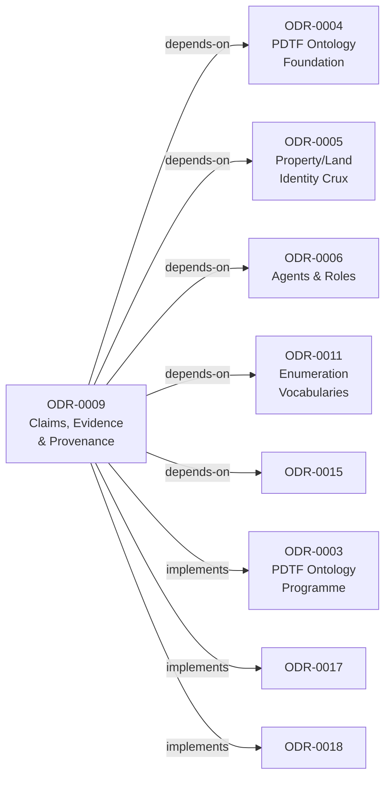

# Claims, Evidence & Provenance

## Context and Problem Statement

PDTF carries its assurance story in a separate envelope: `pdtf-verified-claims.json`, an OIDC4IDA / eIDAS-shaped structure layered over the base transaction. A `verification` block (`trust_framework: "uk_pdtf"`, a single `time`, an `evidence[]` array) sits beside a `claims` object keyed by JSON-pointer paths back into the transaction. Each evidence entry is discriminated by `evidence.type` (`document` / `electronic_record` / `vouch`) with type-specific sub-objects, plus cross-cutting envelope fields: `validation_method`, `verification_method`, cryptographic `digest`, assurance level, and a verifier `txn` reference.

This is the seam where PDTF stops being a property-data form and becomes a *Trust* Framework. It is the interface to the W3C VC / DID / ToIP ecosystem the business glossary already names (Claim, Issuer, Holder, Verifier, Trust Framework), and a `verifiedClaims` structure expressed as opaque JSON cannot participate in that ecosystem. The verifiedClaims structure is *mostly* a provenance graph — but not entirely, and the residue is exactly the part a trust framework cannot afford to lose.

## Considered Options

* **Option A (chosen) — PROV-O backbone plus a separate assurance layer.** PROV-O carries the who/what-process/from-what-evidence skeleton (≈80% of the envelope, native); the residual eIDAS envelope elements are modelled around PROV in a dedicated layer built from `dct:`, SKOS, and narrow local `opda:` terms.
* **Option B — PROV-O only.** Rejected: flattens evidential weight into a causal trace and requires inventing `prov:` extensions for signatures and assurance tiers that PROV-DM deliberately does not model.
* **Option C — Bespoke `opda:` claims model.** Rejected: discards the interoperability that is the entire point of going to linked data, isolating OPDA from the VC/wallet ecosystem it exists to join.

## Decision Outcome

Chosen option: "PROV-O backbone plus a separate assurance layer", because it is the only option that places the derivation graph on a shared, dereferenceable standard while keeping the regulated assurance judgement in vocabularies that can actually express it.

Adopt a **PROV-O backbone plus a separate assurance layer**: PROV-O carries the who/what-process/from-what-evidence skeleton (≈80% of the envelope, native), and the residual eIDAS envelope (trust framework, validation-vs-verification, cryptographic digest, assurance level, txn) is modelled *around* PROV in a dedicated layer built from `dct:`, SKOS and narrow local `opda:` terms.

### Consequences

* Publish `claims-provenance.ttl` defining the PROV-O subclasses (`opda:Claim`, `opda:Verification`, `opda:Verifier`, the three evidence subclasses) and the assurance-layer terms (`opda:assuranceLevel`, `opda:digestAlg`, `opda:digestValue`).
* Land SHACL shapes (ODR-0013) validating the PROV structure and reproducing the `evidence.type` conditional schema as `sh:xone`.
* Mint method, evidence-type and assurance-level SKOS schemes (ODR-0011) with `dct:source` back to the verifiedClaims schema leaves.
* Apply DPV co-annotations (ODR-0012) on evidence and voucher entities — special-category gates fire on AML/conviction-adjacent evidence.
* Maintain the ~80%/five-exceptions boundary as a standing review obligation: re-test the line whenever the upstream `verifiedClaims` schema changes; envelope fields must not silently regress into the wrong layer.
* Ship worked Turtle examples (document, electronic-record, vouch, chained identity → AML → source-of-funds) alongside the JSON before downstream overlays consume the layer.
* Accept that `opda:digestAlg`/`opda:digestValue` are bespoke local terms with no external counterpart — PROV-DM models no signature notion and forcing one in would violate the reuse driver.

## More Information

- **Target versions**: RDF 1.2 and SHACL 1.2, per the Core-tier pin in [ODR-0002](./ODR-0002-ontology-language-adoption.md).
- **Vocabularies**: PROV-O (mandatory in this layer); Core `dct:` (`dct:conformsTo`, `dct:identifier`, and descriptive metadata on PROV entities/agents — `title`/`issued`/`creator`/`format` on evidence documents); SKOS for method and assurance-level schemes (→ ODR-0011); SHACL to validate the PROV shape (→ ODR-0013); DPV for PII co-annotation (→ ODR-0012); OWL-Time where a claim-validity *interval* (not just `prov:endedAtTime`'s instant) is needed (→ ODR-0014).
- **Glossary & external standards**: business-glossary VC/DID/ToIP terms — **Claim** (W3C VCDM 2.0), **Subject**, **Issuer**, **Holder**, **Verifier**, **Verifiable Credential**, **Trust Framework** (ToIP). The `opda:Verifier`/`prov:Agent` and `opda:Claim`/`prov:Entity` terms align to these; SKOS method and assurance concepts carry `dct:source` to the glossary row or verifiedClaims schema leaf. See [ODR-0004](./ODR-0004-pdtf-ontology-foundation.md) for the general term-sourcing convention.
- **Source schema**: `source/03-standards/schemas/src/schemas/verifiedClaims/pdtf-verified-claims.json` (the OIDC4IDA/eIDAS envelope).
- **Related ODRs**: anchor [ODR-0003](./ODR-0003-pdtf-ontology-programme.md); foundation [ODR-0004](./ODR-0004-pdtf-ontology-foundation.md); gating crux [ODR-0005](./ODR-0005-property-land-identity-crux.md); agents and the asserted/evidenced-authority hook [ODR-0006](./ODR-0006-agents-and-roles.md); transactions and milestones [ODR-0007](./ODR-0007-transactions-and-lifecycle.md); enumerations [ODR-0011](./ODR-0011-enumeration-vocabularies.md); governance/DPV [ODR-0012](./ODR-0012-data-governance-layer.md); validation [ODR-0013](./ODR-0013-shacl-validation-and-severity.md); catalogue [ODR-0014](./ODR-0014-vocabulary-catalogue-amendments.md).
- **Council deliberation**: [session-001](./council/session-001-pdtf-schema-to-ontology.md) Q6 (owned by Moreau), with the detailed mapping in [`working/provenance-trio.md`](./council/working/provenance-trio.md).

## Rules

### PROV-O backbone (canonical mapping)

- **Claim → `prov:Entity`.** `opda:Claim rdfs:subClassOf prov:Entity`. Each asserted `claims` entry is an entity; the *verified* claim (claim plus verification bundle) is a derived entity.
- **Verification → `prov:Activity`.** `opda:Verification rdfs:subClassOf prov:Activity`. The OIDC4IDA single `time` is the completion instant → `prov:endedAtTime`, with `prov:generatedAtTime` on the resulting verified entity.
- **`prov:used` (evidence).** The Verification activity `prov:used` each evidence item it consumed.
- **Qualified attribution (verifier-as-`prov:Agent`).** `opda:Verifier rdfs:subClassOf prov:Agent`; `verifier.organization` is a `prov:Organization`, a human voucher a `prov:Person`. Use the **qualified form** — `prov:qualifiedAttribution` → `prov:Attribution` with `prov:hadRole` — so `validation_method`/`verification_method` are not discarded by the binary `prov:wasAttributedTo` / `prov:wasAssociatedWith` shortcuts.
- **Evidence subtypes as `prov:Entity` subclasses.** `opda:DocumentEvidence`, `opda:ElectronicRecordEvidence`, `opda:VouchEvidence`, each `rdfs:subClassOf prov:Entity` and carrying its type-specific facets (`document_details`; `record.source`; `attestation` + `voucher`). A vouch is `prov:wasAttributedTo` an Agent — an attestation, not a document derivation. Do not collapse the three evidence types into one pattern.
- **`prov:wasDerivedFrom` (claim ← evidence).** Load-bearing edge: the verified claim entity `prov:wasDerivedFrom` each evidence entity it rests on.
- **`prov:wasInformedBy` (chaining).** Where one verification consumes the output of an earlier one, the activities chain (`identity` → `AML` → `source-of-funds`) without flattening into one opaque step.
- **`prov:hadPlan` (standardised process).** A named procedure (UK AML / MLR 2017 CDD; a named identity-assurance profile) is a `prov:Plan`; the activity's `prov:Association` `prov:hadPlan` that plan. OIDC4IDA `validation_method`/`verification_method` objects land here — they are plan-shaped, not entity-shaped.

### The ~80% boundary — five exceptions modelled *around* PROV

| eIDAS / OIDC4IDA element | Why PROV-O can't carry it | Home in the assurance layer |
|---|---|---|
| `trust_framework` (`"uk_pdtf"`) | a governance regime, not a provenance primitive | `dct:conformsTo` on the verification activity |
| `validation_method` vs `verification_method` | a genuine OIDC4IDA bifurcation (validation = is the evidence genuine; verification = does it bind to *this* person) that PROV's single `prov:Plan` blurs | two sub-plans, or a SKOS-coded method (→ ODR-0011) |
| cryptographic `digest` (alg + value), `access_token` | PROV-O has no notion of a signature or a hash | local `opda:digestAlg` / `opda:digestValue` |
| assurance level (eIDAS LoA / OIDC trust tiering) | not a PROV concept; a quality judgement on the claim | SKOS-coded `opda:assuranceLevel` annotation on the claim (→ ODR-0011) |
| `txn` (verifier's transaction reference) | an external-system correlation key, not a PROV relation | `dct:identifier` on the activity |

Local terms minted here: `opda:assuranceLevel`, `opda:digestAlg`, `opda:digestValue`. These are the only bespoke `opda:` terms in this layer; everything else reuses PROV-O, `dct:`, SKOS, or DPV.

### SHACL over the PROV structure

The schema's conditional requirements (`allOf`/`if`/`then` on `evidence.type`; e.g. `electronic_record` requires `record.source.name`) map to `sh:xone` over per-type shapes and conditional `sh:property` constraints — provenance is *validated*, not merely described (→ ODR-0013). Enforcement notes:

- Every `opda:Claim` carries at least one `prov:wasDerivedFrom` *or* an explicit "unverified" marker — an unprovenanced claim in a trust framework is a contradiction (`sh:Violation`).
- The `if/then`-on-`evidence.type` conditionality reproduces as `sh:xone` over per-type shapes (e.g. `electronic_record` → `sh:minCount 1` on `record.source.name`).
- A governance gate (`sh:Warning` minimum) fires where a property annotated `dpv:hasPersonalDataCategory` of a special category (AML, conviction-adjacent) lacks a sensitivity marker.

### DPV co-annotation

Evidence entities are co-annotated by the governance layer: `document_number`/`personal_number` are `dpv-pd:OfficialID` / `dpv-pd:Identifying`; a `vouch` voucher (`voucher.birthdate`, `voucher.name`, `voucher.occupation`) is third-party PII about a second data subject. PROV says "this entity was used to verify"; DPV says "this entity is official-ID data about a natural person." The two co-annotate the same nodes (→ ODR-0012).

### Worked examples (required)

The mapping is validated against worked PROV-O Turtle examples rendered alongside the JSON: at minimum a document-evidence identity verification, an electronic-record check against an authoritative register, and a vouch (Agent attestation), plus a chained identity → AML → source-of-funds pipeline exercising `prov:wasInformedBy`.

### Vocabulary delegation

Method, evidence-type and assurance-level SKOS concepts (ODR-0011) carry `skos:prefLabel`/`skos:definition` and `dct:source` back to the verifiedClaims schema leaf or the business-glossary external VC/eIDAS terms. This record fixes the *structure*; the *vocabulary fill* is delegated to ODR-0011 (enumerations) and ODR-0012 (DPV).

### Diagrams

### PROV-O class model

The diagram below maps the seven PROV-O subclasses introduced by this record onto their PROV-DM supertypes and shows the load-bearing PROV relations that connect them.

```mermaid
classDiagram
    accTitle: PROV-O class model for ODR-0009
    accDescr: Shows opda subclasses of prov Entity, Activity and Agent with their PROV relations for claims, evidence and verification.

    class `prov:Entity` {
        <<PROV-O>>
    }
    class `prov:Activity` {
        <<PROV-O>>
        +endedAtTime
        +generatedAtTime
    }
    class `prov:Agent` {
        <<PROV-O>>
    }
    class `opda:Claim` {
        <<rdfs:subClassOf prov:Entity>>
        +assuranceLevel
    }
    class `opda:Verification` {
        <<rdfs:subClassOf prov:Activity>>
        +trust_framework
        +txn
    }
    class `opda:DocumentEvidence` {
        <<rdfs:subClassOf prov:Entity>>
        +document_details
        +digest
    }
    class `opda:ElectronicRecordEvidence` {
        <<rdfs:subClassOf prov:Entity>>
        +record.source
        +digest
    }
    class `opda:VouchEvidence` {
        <<rdfs:subClassOf prov:Entity>>
        +attestation
        +voucher
    }
    class `opda:Verifier` {
        <<rdfs:subClassOf prov:Agent>>
        +organization
    }

    `prov:Entity` <|-- `opda:Claim`
    `prov:Entity` <|-- `opda:DocumentEvidence`
    `prov:Entity` <|-- `opda:ElectronicRecordEvidence`
    `prov:Entity` <|-- `opda:VouchEvidence`
    `prov:Activity` <|-- `opda:Verification`
    `prov:Agent` <|-- `opda:Verifier`

    `opda:Verification` --> `opda:DocumentEvidence` : prov:used
    `opda:Verification` --> `opda:ElectronicRecordEvidence` : prov:used
    `opda:Verification` --> `opda:VouchEvidence` : prov:used
    `opda:Claim` --> `opda:DocumentEvidence` : prov:wasDerivedFrom
    `opda:Claim` --> `opda:ElectronicRecordEvidence` : prov:wasDerivedFrom
    `opda:VouchEvidence` --> `opda:Verifier` : prov:wasAttributedTo
    `opda:Verification` --> `opda:Verifier` : prov:qualifiedAttribution
```

### Assurance layer — five eIDAS/OIDC4IDA exceptions

The five envelope elements that PROV-O cannot natively carry are each routed to the vocabulary that can express them; this diagram visualises that routing as described in the decision table.



### ODR dependency graph

This record depends on and implements the ODRs listed in the frontmatter; the graph below makes those relationships explicit.



### Amendment — Council session-035 (evidence-role recast; 2026-06-01)

Council [session-035](council/session-035-evidence-alias-retirement-and-faceted-typing.md) (8–0–0) recast the evidence model. The three subtypes are **kept** (they partition by provenance *origin* — rigid sub-kinds; "do NOT collapse" upheld), but:

1. **`opda:Evidence` is recast as an anti-rigid UFO RoleMixin** (additively typed `a opda:RoleMixin` alongside `owl:Class`, the ODR-0006 Seller/Buyer punning pattern), founded by the verification — a bearer *is* evidence only qua a `VerificationActivity` using it. The fuller relational founding (the latent `opda:Verification` Relator via `prov:qualifiedAttribution`) is the target model; the additive RoleMixin typing is what is emitted now.
2. **`opda:VouchEvidence` is re-sorted to an Agent-founded attestation Relator** (additively typed `a opda:Relator`): a vouch is `prov:wasAttributedTo` an Agent, binding Agent ↔ Claim (two-relata dependence) — categorially distinct from the document/record Information-Object evidences. This is *why* "do NOT collapse the three" (above) is ontologically correct, not merely cautious.
3. **The evidence-kind discriminator is the governed `opda:evidenceType` facet** — a datatype property ranging over `opda:EvidenceMethodScheme` (repurposed from "method" to the OIDC4IDA `evidence.type` *kind* axis, `ufoCategory "Substance Kind label"`), with each `…Evidence` subclass `skos:exactMatch`-bound to its scheme concept (ODR-0011 §8a — NEVER `owl:sameAs`). This replaced the retired `owl:equivalentClass` short-name aliases (ADR-0011 amendment).
4. **The §"SHACL over the PROV structure" `sh:xone` dispatch — never emitted — is now realised** (ADR-0012 amendment) as `opda:EvidenceTypeValueShape` (value-space gate, SHACL-Core `sh:in` via `sh:targetSubjectsOf`) + `opda:VouchEvidenceShape` (per-subtype obligation: `opda:attestedBy` a `prov:Agent`). The earlier prose promising an emitted `sh:xone` was an overclaim, now corrected.

**Held-as-live dissent (DA Davis).** The `opda:evidenceType` facet is a governed kind-*label* (`skos:exactMatch`-bound to the retained subclasses), NOT a dispatch-replacing facet: SHACL subtype dispatch rides the retained subclasses / disjoint discriminating properties, never `sh:xone`-over-`evidenceType` (which would re-create the conditional soup §R5 forbids). **Re-open trigger:** a named consumer query needing all evidence through one uniform property set, OR any proposal to collapse enforcement into `sh:xone`-over-`evidenceType`.

**Deferred (gated):** completing the bearer-Kind symmetry for ElectronicRecord (a neutral `opda:ElectronicRecord` Kind mirroring `opda:AttachedDocument`/ODR-0024 §R7) is gated on a consumer query.

### Amendment — Council session-036 (classification-over-inheritance cascade; 2026-06-01)

Council [session-036](council/session-036-classification-over-inheritance.md) (8–0–0) re-examined the evidence model under the directing-authority rule *"prefer classification over inheritance where you can"* and **AFFIRMED the session-035 model** (no collapse), placing each subtype precisely in the ODR-0011 §8a load-bearing cascade and **re-keying enforcement to the value**:

- **Graduated §R5 audit:** `VouchEvidence` = cascade cell 3 (+R∧+I∧+D **Relator** — `attestedBy`; uncontested); `DocumentEvidence` = cell 4 (+R∧+I∧−D — the `⊑ opda:AttachedDocument` bearer-IC, ODR-0024 §R7); `ElectronicRecordEvidence` = cell 4 **realisation-incomplete** (+I *latent* — source-register + retrieval-activity; Δ absent today, retained documentary per the `opda:Building` ODR-0024 §R10 precedent — a latent IC is **not** inertness, so it is **not** collapsed). **Trigger = EMIT, never delete:** the unbuilt §R5 `record.source.name` obligation is a value-conditional required field — a value-keyed `sh:or(¬P ∨ Q)` material implication on `opda:evidenceType` (SHACL-Core, the `opda:EvidenceFacetShape` idiom; **not** `sh:qualifiedValueShape`, which is for disjoint-branch unions) — it materialises ER's Δ and rides the facet; a *distinct-identity* record-source bearer (ODR-0008 §Q4a(a)) is the separate, narrower trigger for the bearer Kind. "A required field is a facet-branch; a distinct identity is a class."
- **Enforcement re-keyed to the value (Knublauch + DA Guizzardi):** the §"SHACL over the PROV structure" obligation now ships as **`opda:EvidenceFacetShape`** (`sh:targetSubjectsOf opda:evidenceType` + a value-guarded `sh:or(¬P ∨ Q)` material implication: `evidenceType "Vouch"` ⇒ `opda:attestedBy` a `prov:Agent`; SHACL-Core, entailment-free) — replacing the session-035 `sh:targetClass opda:VouchEvidence` shape, which was entailment-relative and silently passed a value-recorded vouch. The **one** principled class-keyed shape is `opda:*CoherenceShape` (class ⇒ matching `opda:evidenceType` code) — enforcing in SHACL what `skos:exactMatch` only documents. "Classification for per-kind obligations; class-consultation only for inter-layer coherence."
- **Scheme-IRI rename CLOSED as no-op (withhold permanently):** the deferred `EvidenceMethodScheme` → `EvidenceKindScheme` rename is **withdrawn, not deferred** — an IRI is opaque denotation, not a label (Cool-URIs; DCMI), and renaming a dereferenceable scheme-IRI for cosmetics is the ODR-0024 §R4 namespace-landmine churn; the `prefLabel`/`scopeNote` already read "Evidence Kind." A `skos:scopeNote` records that the historical "Method" token in the IRI is by design.

No collapse; the subclasses stand as structure-bearers. Codified generally in ODR-0011 §8a (the cascade).

### Amendment — ODR-0027 R6 (directing-authority adoption of the hm approach; 2026-06-01)

**[ODR-0027](./ODR-0027-classification-roles-inheritance-skos-doctrine.md) §R6 supersedes the session-036 keep-the-subclasses disposition above.** opda's own model states "evidence is a role a document plays, not every document's Kind" — so under the adopted hm doctrine (Roles are NEVER `rdfs:subClassOf` a Kind; hm ODR-0010/0025/0026), evidence-kind is an `isMemberOf` **coded classification** (`opda:evidenceType` → `opda:EvidenceMethodScheme`), not a subclass tree:

- The three `…Evidence rdfs:subClassOf opda:Evidence` axioms are **retired**; `opda:Evidence` is the role target (a `RoleMixin`); kind-specific attributes (`opda:attestedBy` etc.) become **facets borne by the role** (re-homed `rdfs:domain opda:Evidence`, documentary), enforced **value-keyed** on `opda:evidenceType` (the session-036 `EvidenceFacetShape` already is).
- `opda:AttachedDocument` — the one genuine **Kind** (own IC: content + issuing activity, ODR-0024 §R7) — **stays** an OWL class; a document *plays* the evidence role, it is not sub-classed into it.
- The `*CoherenceShape` family (class↔value, session-036) is dropped (no `…Evidence` classes to cohere); the value-space gate (`EvidenceTypeValueShape`) + value-keyed obligation (`EvidenceFacetShape`) carry enforcement.

**Status: IMPLEMENTED (2026-06-01).** The emitter re-model landed: `claim.py` retired the three `…Evidence` subclasses (`opda:Evidence` is now `owl:Class, opda:RoleMixin` only; `opda:AttachedDocument` stays the Kind); `opda:evidenceType` is the coded classifier; `opda:attestedBy` re-homed `rdfs:domain opda:Evidence` (a role-borne facet); `shapes.py` dropped the `*CoherenceShape` family (no subclasses to cohere), enforcement value-keyed on `opda:EvidenceTypeValueShape` + `opda:EvidenceFacetShape`; `annotations.py` re-pointed the 3 DPV refinements to `opda:Evidence` + `opda:evidenceType` `variantValue`; the 3 exemplars re-typed to `a opda:Evidence`. All 7 CI gates + 337 pytest + 27 round-trip green; byte-identity re-pinned.

### Amendment — `opda:AssuranceLevel`/`opda:assuranceLevel` removed (2026-07-05, RML gap-closing session)

**§Q3's assurance-level term is REMOVED from the active ontology.** It was first found "ratified but implemented wrong" (emitted as an orphaned class, `opda:AssuranceLevel`, that no property ever referenced — it could never be populated) and corrected in-session to a property matching the 3 ratified `claim-with-*-evidence.ttl` exemplars (`opda:Claim`-domain, `xsd:string` range, values "Low"/"Substantial"/"High"). That structural fix stands as a record of a real defect, but a full-corpus RML mapping audit against every PDTF v3 schema (the transaction schema, `verifiedClaims/`, `trust-framework/`) then found zero basis for the *value* in any form: the `verification` object is `trust_framework` / `time` / `evidence` only (`additionalProperties: true` leaves room for an eIDAS LoA field, but nothing ever names one), and the nearest real signal — `participants[].verification.*.result` / `reports[].result` (pass/fail/consider) — is an OUTCOME judgement on a different axis than eIDAS LoA's RIGOR judgement; mapping one to the other would assert a compliance-consequential grade the source data does not honestly support.

Fixing the property's structure did not supply the missing data, so the term is removed rather than left as a permanently un-populatable gap. The backing `opda:AssuranceLevelScheme` SKOS scheme (eIDAS Low/Substantial/High + PDTF-Standard members) is removed alongside it. The 3 `claim-with-*-evidence.ttl` exemplars retain their `opda:assuranceLevel "..."` assertions as commented-out historical text; their remaining PROV-O/Claim/Evidence content (the exemplars' actual purpose) is unaffected.

Full reasoning: `docs/adr/ADR-0057-rml-mapping-implementation.md` Amendments (RML gap-closing session, 2026-07-05).

