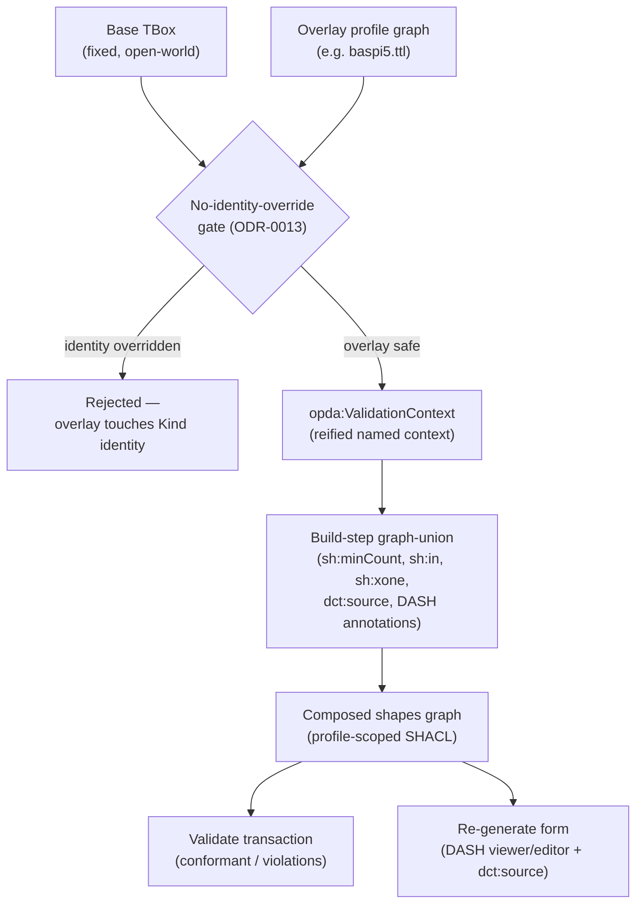
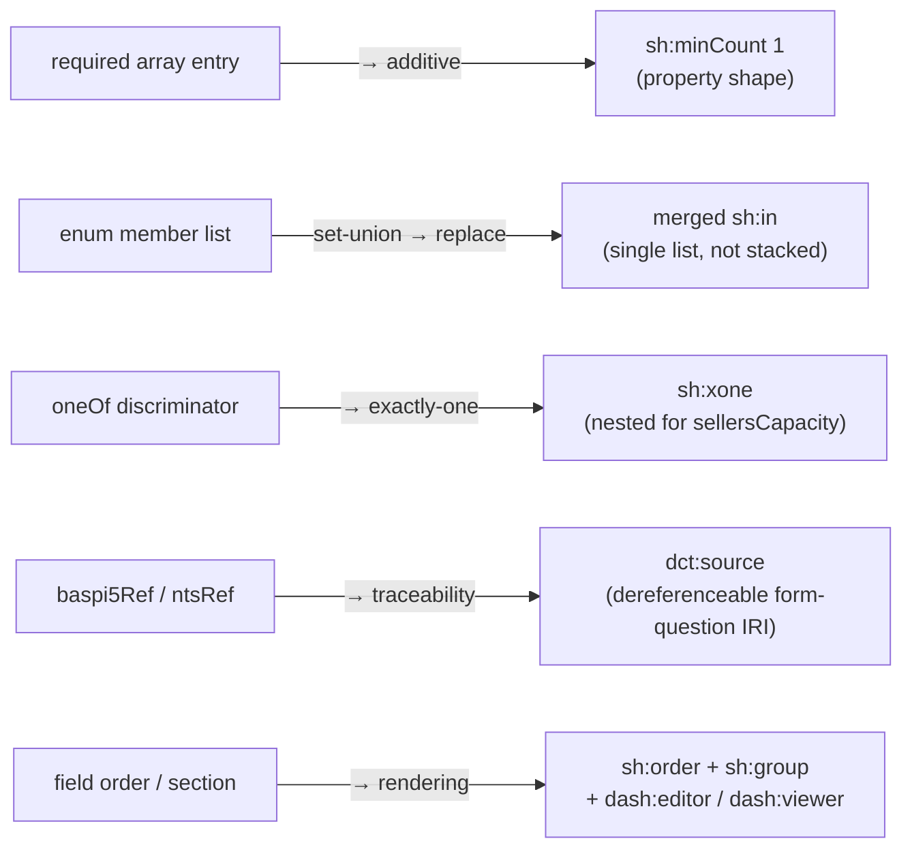
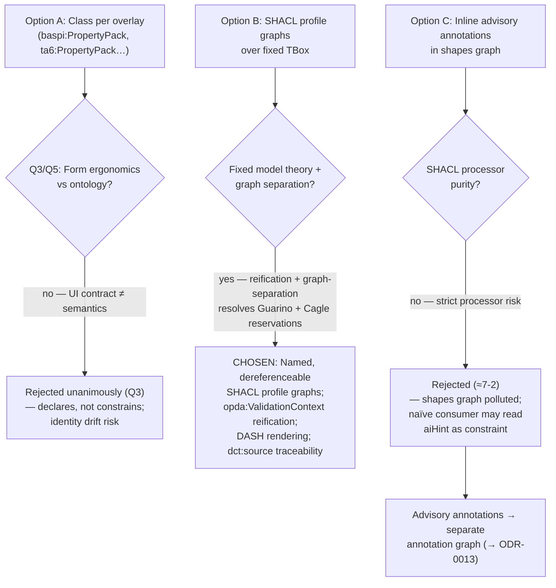
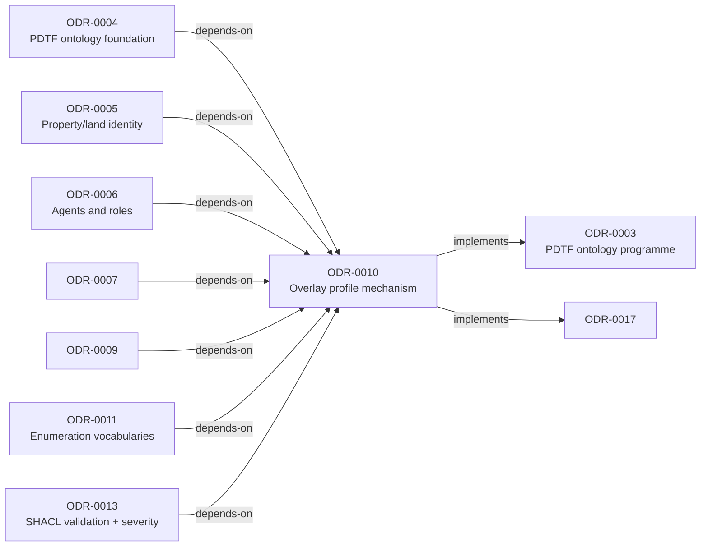

# Overlay Profile Mechanism

## Context

PDTF v3 is a base transaction plus a family of form overlays (BASPI4/5, TA6/7/10, NTS/NTS2/NTSL, CON29R/DW, LLC1, LPE1, FME1, …) composed at runtime by `getTransactionSchema`'s deep-merge. Each overlay unions `required` arrays, unions `enum` member lists, and carries per-leaf form-question references (`baspi5Ref`, `ntsRef` — e.g. BASPI `B1.3.2`). Overlays also encode `oneOf` discriminated unions — most sharply `participants.items` discriminated on `role`, with a nested `sellersCapacity` `oneOf` (Legal-Owner/Mortgagee vs Personal-Representative/Attorney, the latter requiring `sellersCapacityDetails` and `attachments`).

A class per overlay (`baspi:PropertyPack`, `ta6:PropertyPack`) was rejected unanimously in Session 001 (Q3, Q5): that nesting is form ergonomics, not ontology. Overlays are views over a fixed TBox — they constrain, they do not declare. The question (Q5, owned by Knublauch): how do we re-express overlays so loading a form's requirements activates the right constraints and can re-generate the form, without (a) misusing SHACL so a profile validates the wrong thing, (b) leaking closed-world shape semantics into the open-world class model, (c) letting an overlay touch a Kind's identity, or (d) promoting a build-config artefact to ontological status with no fixed model theory.

The BASPI5 slice is the MVP: its discriminated `oneOf`/`sellersCapacity` structure stresses every hard construct (`sh:xone`, merged `sh:in`, DASH editors, `dct:source`), so if it round-trips — JSON → profile → rendered form + validated transaction — the remaining overlays are largely mechanical.

## Decision

Overlays are named, dereferenceable **SHACL profile graphs over a fixed TBox**; composition is a documented build-step graph-union; conditional requirement is reified as a first-class `opda:ValidationContext`; DASH drives form rendering; `dct:source` carries traceability to form questions. This is the only option that keeps the class model fixed and open-world while making each form's requirements an activatable, checkable, re-generable view — and the two reservations that could have sunk it (Guarino's "no fixed model theory" and Cagle's advisory-annotation push) were resolved by reification and graph-separation.

## Rules

**Knublauch's canonical mapping** (core unanimous, 12-0):

1. **required-array union → `sh:minCount 1`.** Each `required` entry becomes a property shape with `sh:minCount 1` on the target node shape (e.g. baspi5's `required: ["uprn", "address", …]` on `propertyPack` → `sh:property [ sh:path opda:uprn ; sh:minCount 1 ]` shapes on `opda:PropertyPack`, active only when BASPI5 is loaded). On graph union this is purely additive — no conflict to resolve.
2. **enum union → a single *merged* `sh:in`.** A JSON `enum` → `sh:in ( … )`. The effective `sh:in` is the set-union of base plus every loaded profile's members. This is a **build-step replacement, not an entailment**: at build time you replace the `sh:in` node with the union list. You do **not** leave two `sh:in` constraints on one property — two `sh:in`s are conjunctive (intersection), the opposite of the union intent. *Loaded profile = active vocabulary.*
3. **`oneOf` → `sh:xone`.** `oneOf` is exactly-one, so the strictly-correct construct is `sh:xone` (reserve `sh:or` for "at least one"). baspi5's `participants.items` discriminated on `role` → a node shape `sh:xone ( [non-seller] [seller] )`, with the discriminator expressed via `sh:qualifiedValueShape` keyed on the `role`/`sellersCapacity` value. The nested `sellersCapacity` `oneOf` → a nested `sh:xone` whose Personal-Representative/Attorney branch carries the extra `sh:minCount 1` shapes for `sellersCapacityDetails` and `attachments`.
4. **per-leaf `baspi5Ref`/`ntsRef` → `dct:source`.** Each annotated shape gets `dct:source` (with `rdfs:isDefinedBy` where appropriate) pointing at a minted, dereferenceable form-question IRI — e.g. `<https://opda.uk/forms/baspi5#B1.3.2>` — forming a shape → question → form chain. SSSOM is the richer alternative, deferred per Q2 (Cagle dissent recorded).
5. **DASH for rendering.** Per property shape: `dash:propertyRole dash:KeyRole` on UPRN, `dash:LabelRole` on name leaves; `dash:viewer` (`dash:LabelViewer`/`dash:LiteralViewer` for reads, `dash:URIViewer` for `dct:source` links); `dash:editor` (`dash:EnumSelectEditor` for role/capacity enums driven by `sh:in`, `dash:TextFieldEditor` for `sellersCapacityDetails`, `dash:DetailsEditor` for nested `address`); `sh:order` + `sh:group` reproduce the form's field order and sectioning. Loading the BASPI5 profile yields a graph that both validates a transaction *and* generates the BASPI form with full `dct:source` traceability — **the canonical round-trip.**

**`opda:ValidationContext` reification** (Guarino's accepted withdrawal condition). A profile is reified as a first-class `opda:ValidationContext` node. A `sh:minCount 1` is a constraint *of a named context* — "required under the Conveyancer profile" — not a free-floating axiom whose truth is a function of which files a build call passed. This converts conditionality from "required (depending)" into "required relative to a named, dereferenceable context", giving the fixed model theory the Devil's Advocate demanded.

**No-identity-override gate** (Guizzardi). A SHACL gate rejects any overlay that declares or overrides a Kind's identity or key. A profile may add presence and vocabulary constraints; it may never restate or alter the identity criterion or key mechanism settled in ODR-0005. Identity belongs to the rigid Kind, not to a form context. (Structural check on the profile graphs themselves → ODR-0013.)

**Graph separation** (Q3). Class graph and shapes graph remain separate files. Shapes target classes via `sh:targetClass`/`sh:targetNode`/`sh:targetObjectsOf` — a shape with no target validates nothing. Shapes reference classes via targeting, never `owl:imports`. `sh:minCount 1` is not `owl:minCardinality` — open-world OWL/RDFS must not be confused with closed-world SHACL.

**Advisory annotations exiled to a separate graph** (≈7-2). Advisory LLM-consumer annotations (`opda:aiHint`) do **not** live inside the shapes graph; they live in a separate annotation graph keyed to shape IRIs (→ ODR-0013). A SHACL processor must find only interpretable constraint components plus known annotation properties (`sh:`, `dash:`, `rdfs:`, `dct:`); a constraint-adjacent invented term risks being read as a constraint.

**Enforcement (round-trip on the BASPI5 slice).** Loading the profile must (a) validate a conformant transaction, (b) report violations on a non-conformant one (e.g. a Seller acting as Attorney with no `sellersCapacityDetails`/`attachments`), and (c) re-generate the BASPI form via the DASH annotations with every field carrying a resolvable `dct:source`. A build-step test asserts the composed profile's effective `sh:in` is the set-union (not the intersection) of base and loaded members — the regression guard against stacked `sh:in`. Profile and form-question URIs MUST dereference (`…/profiles/baspi5/` returns a working shapes graph; `…/forms/baspi5#B1.3.2` resolves). **Demonstrated 2026-06-01 (ODR-0003 termination signal 1 / plan B2):** `ci-baspi5-roundtrip` exercises (a)+(b) end-to-end over conformant + non-conformant transaction exemplars (the non-conformant case is the Seller-as-Power-of-Attorney with no `opda:hasEvidencedAuthority`, whose violation traces via `sh:sourceShape` → `dct:source` → `…/forms/baspi5#B1.3.2`), and (c) as a *data-contract* check (31/31 property shapes carry a resolvable `dct:source` + DASH render hints) — the DASH-UI render itself is the consumer-app boundary. **Validator-capability note:** the `sellersCapacity` `sh:xone` (Rule 3) requires a **SHACL-AF-capable** validator (pyshacl `advanced=True`); a SHACL-Core-only processor passes the xone-of-property-shapes vacuously. A conformant-Legal-Owner exemplar guards the vacuous-pass direction.

### Overlay Profile Layering Mechanism

The flowchart below shows how a form overlay is loaded, composed with the base schema at build time, and then used to both validate a transaction and re-generate a form — the canonical round-trip described in the Decision section.

### Overlay Composition Build-Step Rules

The three union/replacement rules from the Decision section determine how each overlay's constructs are merged into the base shapes at build time.

### Options Considered and Decision Reached

The three alternatives evaluated by the council, with the reasons for acceptance or rejection as stated in the Alternatives section.

### ODR Dependency Graph

This ODR's `depends-on` and `implements` relationships from the frontmatter, showing how it sits within the broader ontology programme.

## Alternatives

- **A class per overlay** (`baspi:PropertyPack`, `ta6:PropertyPack`, …) — rejected unanimously (Q3): recreates form ergonomics as an OWL class hierarchy, conflating UI contract with semantics, and overlays would *declare* rather than *constrain*, multiplying near-duplicate classes and inviting identity drift across them (Guizzardi's gate forbids it).
- **Inline advisory annotations in the shapes graph** — rejected (≈7-2): a shapes graph polluted with `opda:aiHint` is no longer cleanly a SHACL graph; a strict processor carries triples it cannot interpret and a naïve consumer may read them as constraints. The need is real and met by a separate annotation graph keyed to shape IRIs.

## Consequences

- The TBox stays fixed and open-world; each form's requirements become an activatable, checkable view; the UI/requirement contract can evolve without touching the class model.
- Composition is a build-step graph-union that MUST be specified and maintained as code (mirroring `getTransactionSchema`'s deep-merge). "Loaded = active" is documentation-and-tooling, not entailment — a tool that gets the merge wrong (stacking `sh:in`) is silently incorrect with no reasoner to catch it.
- Deliverables to produce: `profiles/baspi5.ttl` (worked MVP slice); the `opda:ValidationContext` pattern; the no-identity-override SHACL gate; the composition build-step specification mirroring `getTransactionSchema`; the separate advisory-annotation graph keyed to shape IRIs (→ ODR-0013).
- The `dct:source` fallback is reasoner-poorer than SSSOM for per-leaf mappings (no machine-readable justification/confidence) — a known trade accepted by deferring SSSOM.
- Enum *members* are owned by ODR-0011 (SKOS); annotation-graph and severity tiering by ODR-0013. This record fixes the profile *mechanism* and delegates vocabulary fill and validation severities.

## References

- **Target versions**: RDF 1.2 and SHACL 1.2, per the Core-tier pin in [ODR-0002](./ODR-0002-ontology-language-adoption.md).
- **Vocabularies**: SHACL (profile shapes); DASH (form rendering — `dash:propertyRole`/`viewer`/`editor`, `sh:order`/`sh:group`); Core (`dct:source`/`rdfs:isDefinedBy` traceability); SKOS for enum members surfaced via `sh:in` (→ ODR-0011); local `opda:ValidationContext` reifying the profile. SSSOM deferred (Q2; Cagle dissent recorded).
- **Source schema & composition**: overlays under `source/03-standards/schemas/src/schemas/v3/overlays/` and the deep-merge in `getTransactionSchema` (web app `src/pages/implementation/schema-composition.astro`). The business glossary notes `propertyPack` appears in 18 overlays and `address`/`attachments`/`ownership` in ~10 each — the spanning leaves a profile composition must reconcile.
- **Related**: anchor [ODR-0003](./ODR-0003-pdtf-ontology-programme.md); foundation and graph separation [ODR-0004](./ODR-0004-pdtf-ontology-foundation.md); the identity crux whose keys an overlay may not touch [ODR-0005](./ODR-0005-property-land-identity-crux.md); Seller/Buyer roles and `sellersCapacity` the BASPI discriminator constrains [ODR-0006](./ODR-0006-agents-and-roles.md); enumeration members surfaced via `sh:in` [ODR-0011](./ODR-0011-enumeration-vocabularies.md); SHACL severity, no-identity-override gate, annotation-graph split [ODR-0013](./ODR-0013-shacl-validation-and-severity.md); catalogue [ODR-0014](./ODR-0014-vocabulary-catalogue-amendments.md).
- **Council deliberation**: [session-001](./council/session-001-pdtf-schema-to-ontology.md) Q5 (owned by Knublauch); rule-by-rule mapping in [`working/shacl-trio.md`](./council/working/shacl-trio.md). Ratified by **[session-010](./council/session-010-overlay-profile-mechanism.md)** (Reduced Council, 2026-05-27; Queen Knublauch; DA Guarino — 7 conceded / 1 withdrew on Q1 UFO Substance Kind §Rules amendment). Q1 5-property `opda:ValidationContext` reification + UFO Substance Kind commitment discharging S001 Q5 concession fully. **Q6 no-identity-override SHACL meta-shape at `sh:Violation` — ODR-0017 11th citing site triggered §2a amendment (landed inline at S013)**. Q7 BASPI5 round-trip as MVP gate. Q8 three-rule interface contract with ODR-0013 (cross-cite per Cagle Scope-Check 1 Q6 amendment).
- **Three-rule interface contract with [ODR-0013](./ODR-0013-shacl-validation-and-severity.md)** (operationalising Cagle Scope-Check 1 Q6 amendment; reciprocal cross-cite per S013 Q7):
  1. **`sh:in` semantics** — merged at build time per §1a Rule 2 (build-step replacement, NOT entailment).
  2. **`sh:Violation` floor** — ODR-0013 §Rules.Q1 OWNS the floor; this ODR (§Q6 no-identity-override) INHERITS and ENFORCES at the profile-layer.
  3. **No-identity-override gate** — ODR-0013 OWNS the identity-key list (from ODR-0005); this ODR (§Q6) ENFORCES via SHACL meta-shape `opda:ProfileIdentityOverrideCheckRule` at `sh:Violation` per ODR-0017 §2a amendment.
