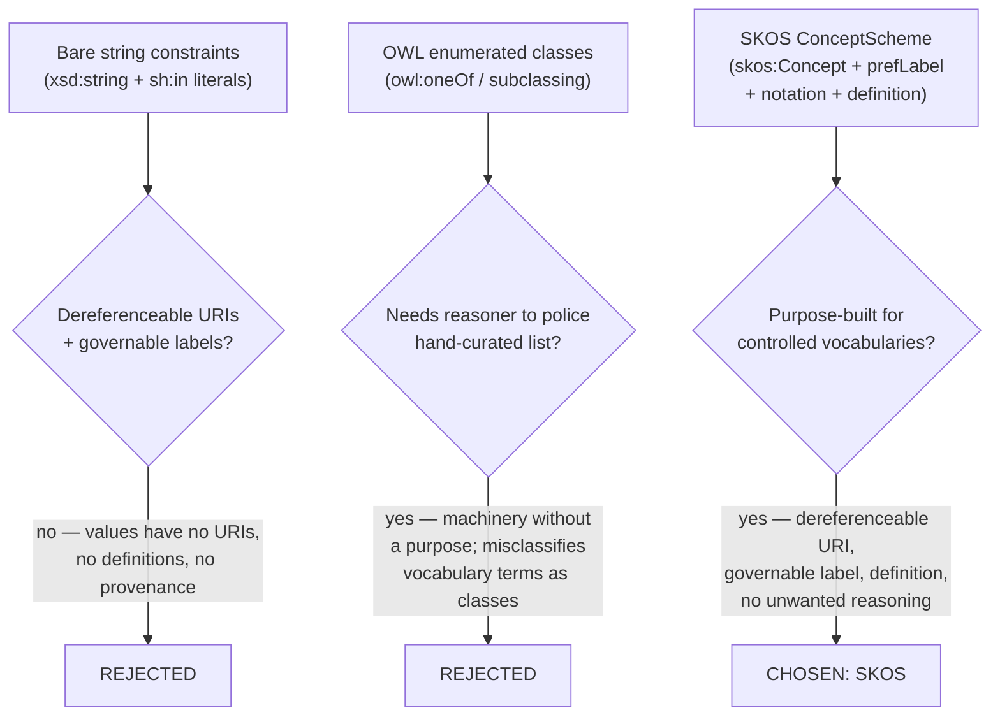
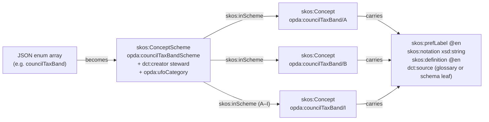
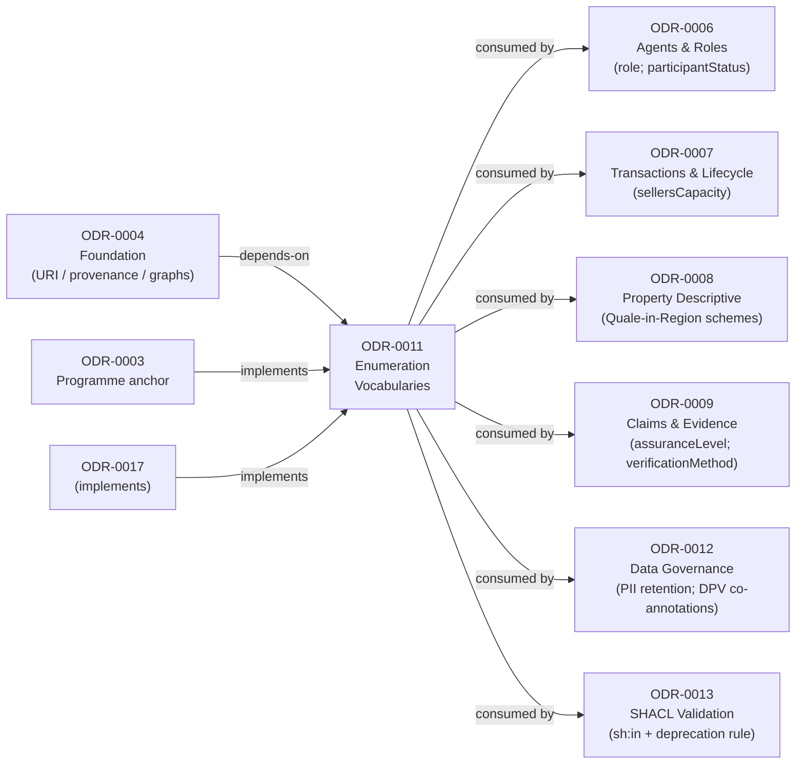
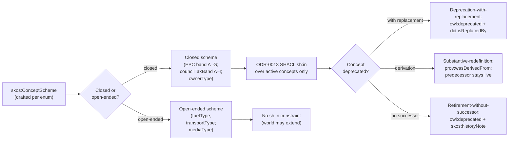

# Enumeration Vocabularies

## Context and Problem Statement

The PDTF v3 corpus carries 160 leaves whose JSON `enum` arrays act as closed value lists — `role`, `ownershipType`, `marketingTenure`, `councilTaxBand` (A–I), `currentEnergyRating` (A–G), `builtForm`, `centralHeatingFuelType`, `sellersCapacity`, `participantStatus`, and many more. Each is presently a free-floating string constraint: no global identifier, no governable label, no provenance back to the form question it serves.

A mechanical rewrite to either `owl:oneOf` bags of `owl:NamedIndividual`s or to bare `xsd:string` patterns is wrong: these enumerations are **controlled vocabularies** — registers of human-curated concepts with preferred labels, definitions, notations, and (sometimes) hierarchy — not logical extensions a reasoner should police, and not class hierarchies where `Freehold` is a subclass of anything. The register is cross-cutting: roles feed Agents & Roles (ODR-0006), tenure and restriction codes feed Property & Land (ODR-0005), built form and EPC bands feed descriptive attributes (ODR-0008), evidence and assurance codes feed Claims & Evidence (ODR-0009), and PII/purpose taxonomies feed Governance (ODR-0012).

## Considered Options

* **Option A (chosen) — SKOS concept schemes.** Each enum becomes a `skos:ConceptScheme` whose members are `skos:Concept`s carrying `skos:prefLabel`, `skos:notation`, and `skos:definition` — purpose-built for controlled vocabularies, giving each value a dereferenceable URI and a governable label without importing OWL membership-reasoning.
* **Option B — Bare string constraints.** Rejected: values have no URIs, no governable labels, no definitions, no provenance; identical literals across distinct enums carry no statement of co-reference.
* **Option C — OWL enumerated classes (`owl:oneOf` / subclassing).** Rejected: conscripts a reasoner to police membership of a hand-curated list — machinery without a purpose — and misclassifies vocabulary terms (`Detached`) as either individuals or classes (Baker/Knublauch, Q5).

## Decision Outcome

Chosen option: "SKOS concept schemes", because SKOS is purpose-built for controlled vocabularies and gives each value a dereferenceable URI, a governable label, and a definition without importing OWL membership-reasoning over a hand-curated list.

Each enum becomes a **SKOS concept scheme** whose members are `skos:Concept`s carrying `skos:prefLabel`, `skos:notation`, and `skos:definition`.

### Consequences

* Adopt SKOS as the mechanism for every enum register; do not model enums as OWL classes or bare string constraints.
* Source `skos:prefLabel`/`skos:definition` from the business glossary verbatim where the term exists; cite `dct:source` on every concept (+ verbatim-citation discipline for regulator-governed concepts per §4a above).
* Author one scheme per enum (no floor); reuse external schemes via `skos:exactMatch`/`skos:closeMatch` where a governed register exists.
* Flag each scheme as closed or open-ended during drafting; closed schemes flow into a SHACL `sh:in` per [ODR-0013](./ODR-0013-shacl-validation-and-severity.md), open-ended schemes do not.
* Reconciling cross-overlay synonymy (recurring `Freehold`/`Commonhold`; `Attached`/`To follow`/`Not applicable` across dozens of leaves) is a per-scheme drafting concern.
* Namespace ratified; record `accepted`. The inherited ODR-0004 namespace block is lifted (the `opda:` string was ratified 2026-05-27 — greenfield; no WG), so ODR-0011 is `accepted`. Generator output for `opda:<scheme>Scheme` declarations may still carry `dct:status "draft"` as a publication-grade marker, independent of record ratification.
* A9 pressure-test passes (third `kind: pattern` ODR). §Operational specifications 1a/2a/4a/5a/7a/8a discharge A9 (a) UFO/DOLCE meta-category at scheme level + (b) IC over named hard cases (closed-vs-open, three-case lifecycle, cardinality bands) + (c) artefact realisation via SHACL shapes + SHACL-AF deprecation rule + generator emission.
* B3 pilot third-site verdict: EXPAND threshold satisfied. Two-artefact discipline (narrative + structured tally) confirmed at three pilot sites (S005 Full Council + S015 Reduced Council + S011 Full Council substrate-mode). Two-artefact discipline becomes the DEFAULT across remaining sessions (S006, S007, S009, S010, S012, S013).
* `pattern`-extraction spawn-rule fires (fourth citing site reached). The SHACL-AF non-blocking-data-quality-rules pattern appears in: ODR-0005 §6a (UPRN succession `sh:Info`); ODR-0009 (PROV-O Claims/Evidence); ODR-0015 §4a (INSPIRE/AddressBase succession `sh:Info`); ODR-0011 §5a (concept deprecation chain `sh:Info`/`sh:Warning`). Per ODR-0001 A9 §Artefact identity test fourth-citing-site threshold, **spawn a shared `pattern` ODR** (suggested: `opda-shacl-af-quality-rules`). The four citing sites become `implements:` of the extracted pattern.

### Modelling options and the chosen outcome

The three candidate approaches were evaluated against the drivers; SKOS was chosen because it satisfies every driver without pulling in reasoning machinery.



### SKOS concept scheme structure

Each JSON `enum` maps to a `skos:ConceptScheme`; every value becomes a `skos:Concept` linked into it with the required properties and provenance.



## More Information

- **Target versions**: RDF 1.2 and SHACL 1.2 + SHACL-AF (`sh:rule`, `sh:sparql`), per the Core-tier pin in [ODR-0002](./ODR-0002-ontology-language-adoption.md).
- **Vocabularies**: SKOS (concept schemes, labels, notations, semantic relations) per W3C SKOS Reference 2009 (Miles & Bechhofer eds.) §§1.4, S14, S15, §3, §4, §S26-29, §S37-46; Core (`dct:source`/`dct:isReplacedBy`/`dct:modified`) per ODR-0004 §7a; PROV-O Recommendation (Moreau & Missier 2013) for derivation/lineage succession; OWL 2 (`owl:deprecated`, `owl:versionIRI`); ISO 25964-1:2011 §8 (thesaurus maintenance discipline).
- **Foundational ontology**: Guizzardi 2005 *Ontological Foundations for Conceptual Modeling*, Ch. 4 (UFO Substance Kind / Role / Phase / Relator / Mode / Quale taxonomy); Guizzardi 2015 (UFO 2007/2011/2015 lineage); Masolo et al. 2003 *WonderWeb D18* §4.3 (DOLCE Quality / Quality Region / Quale); Guizzardi & Wagner 2010 (action-modelling / method-codes).
- **Inputs**: data dictionary `enum` columns (`data-dictionary.md` / `data-dictionary-canonical.json`); business glossary (`source/00-deliverables/semantic-models/business-glossary.md`).
- **External authority sources** (cited via `dct:source` with version pin per ODR-0004 §7a): HMLR Practice Guides (PG 1 First Registration; PG 16 Cancellation; PG 40 Plans) for `restrictionTypeCode` / `classOfTitleCode` / `subRegisterCode` definitions; VOA published council-tax band definitions; UK MEES regulation for EPC bands; FCA Handbook glossary for regulated-profession `role` values; ICO published taxonomies for PII categories; ISO 3166-1:2020 for `countryCode`.
- **Related ODRs**: programme anchor [ODR-0003](./ODR-0003-pdtf-ontology-programme.md); foundation [ODR-0004](./ODR-0004-pdtf-ontology-foundation.md) (URI/term-sourcing/three-graph/exemplar inheritance); methodology [ODR-0001 §What an ODR records (per-kind discipline)](./ODR-0001-linked-data-council-methodology.md) (A9 — ODR-0011 is the **third** `kind: pattern` ODR to discharge under it). Upstream `pattern`-ODR precedents: [ODR-0005 §2a](./ODR-0005-property-land-identity-crux.md) (UFO Substance Kind discipline) + §6a (SHACL-AF rule pattern); [ODR-0015 §2a](./ODR-0015-address-and-geography.md) (UFO Quality particularising Substance Kind precedent for `addressVariant` Quality Value category). Downstream consumers: [ODR-0006](./ODR-0006-agents-and-roles.md) (role + participantStatus); [ODR-0007](./ODR-0007-transactions-and-lifecycle.md) (sellersCapacity + lifecycle phases); [ODR-0008](./ODR-0008-property-descriptive-attributes.md) (Quale-in-Region descriptive schemes); [ODR-0009](./ODR-0009-claims-evidence-provenance.md) (authors `opda:assuranceLevel` Quality Region; consumes verificationMethod); [ODR-0010](./ODR-0010-overlay-profile-mechanism.md) (overlay profiles may filter schemes by UFO category); [ODR-0012](./ODR-0012-data-governance-layer.md) (governance-sensitivity column; PII history retention; DPV class-level co-annotations); [ODR-0013](./ODR-0013-shacl-validation-and-severity.md) (SHACL severity tier for Cagle deprecation rule).
- **Council deliberation**: [session-001](./council/session-001-pdtf-schema-to-ontology.md) Q2 (vocabulary admission); [scope-check-1-programme](./council/scope-check-1-programme.md) Q3 (Guizzardi UFO-per-scheme sub-finding adopted as A5, 8-1); **[session-011 — Enumeration Vocabularies](./council/session-011-enumeration-vocabularies.md)** (2026-05-27; Full Council, substrate mode; B3 pilot `consensus-mode: hive-mind/typed-output` for Q8; two-artefact discipline session-wide; Queen Isaac/Miles extended; DA Gandon — 2 withdrawn / 5 conceded, full DA withdrawal). 7 questions (Q3 deferred to Phase-3.5 audit). Q1-Q7 4-0 votes with Gandon DA Q5 mild attack converted into three-case discipline; Q8 4-0 typed-output verdict with seven-category framework + dual `dct:source` (upstream UFO/DOLCE + ODR-0011 Council-authored SKOS-binding). **B3 pilot third site EXPAND threshold reached** — two-artefact discipline becomes default across remaining sessions. **Pattern-extraction spawn-rule fires** for SHACL-AF non-blocking-data-quality-rules (fourth citing site). Per-expert working notes under [`council/session-011-enumeration-vocabularies/`](./council/session-011-enumeration-vocabularies/).
- **Ratification provenance**: [session-011](./council/session-011-enumeration-vocabularies.md) (2026-05-27). Phase 2.5 substrate gate cleared substantively; formal `status: accepted` awaits WG namespace ratification (inherited from ODR-0004).
- **Deliverables (when fleshed out)**: one TTL per scheme (or a consolidated `vocabularies.ttl`); the closed/open-ended register; the cross-overlay concept-deduplication map; cross-links to modules and SHACL/DASH consumers.
- **Related**: anchor [ODR-0003](./ODR-0003-pdtf-ontology-programme.md); foundation [ODR-0004](./ODR-0004-pdtf-ontology-foundation.md); consumers — Agents & Roles [ODR-0006](./ODR-0006-agents-and-roles.md), Property & Land [ODR-0005](./ODR-0005-property-land-identity-crux.md), descriptive attributes [ODR-0008](./ODR-0008-property-descriptive-attributes.md), Claims & Evidence [ODR-0009](./ODR-0009-claims-evidence-provenance.md), Governance [ODR-0012](./ODR-0012-data-governance-layer.md); SHACL `sh:in`/DASH consumer [ODR-0013](./ODR-0013-shacl-validation-and-severity.md); catalogue [ODR-0002](./ODR-0002-ontology-language-adoption.md) as amended by [ODR-0014](./ODR-0014-vocabulary-catalogue-amendments.md).
- **Council deliberation**: [session-001](./council/session-001-pdtf-schema-to-ontology.md) Q5 (overlays/enums; Baker/Knublauch/Pandit). Q2 Dublin Core as commons substrate (Baker, carried) and Q2 SSSOM deferred (Cagle dissent in [ODR-0014](./ODR-0014-vocabulary-catalogue-amendments.md)) bear on this register.
- **SKOS reviewers**: Antoine Isaac and Alistair Miles (SKOS Reference editors) inform the broader/narrower and integrity-constraint conventions.

### ODR dependency and consumer graph

ODR-0011 depends on ODR-0004 and is consumed by six downstream ODRs that author or inherit scheme content.



## Rules

- **Each enum is a `skos:ConceptScheme`.** Members are linked via `skos:inScheme`; each `skos:Concept` carries `skos:prefLabel` with an `@en` language tag, `skos:notation` for the canonical machine code (e.g. HMLR `classOfTitleCode` `10/20/30/…`, `restrictionTypeCode` `0/10/20/30`), and `skos:definition`.
- **Labels and definitions are sourced from the business glossary** where the term exists there (`Role`, `Participant`, `Scheme Operator`, `Data Provider`/`Data Recipient`, `TPP`) — adopted verbatim, not paraphrased. Where no glossary term exists, `skos:definition` is taken from the canonical schema leaf's `description` (e.g. `councilTaxBand`'s "Band I relates to Wales only").
- **Every concept carries `dct:source`** to its origin — the business-glossary row where one exists, otherwise the canonical schema leaf path (e.g. `…/baspi5.json#…/role`). This applies the [ODR-0004](./ODR-0004-pdtf-ontology-foundation.md) provenance convention; it is not re-defined here.
- **Hierarchical enums use `skos:broader`/`skos:narrower`.** Genuine taxonomies — broadband `typeOfConnection` (None / ADSL copper / Cable / FTTC / FTTP, with fibre variants narrowing under a fibre concept), transport `transportType` (rail / bus / ferry / airport under modal parents) — carry the broader/narrower structure rather than flattening. Flat enums (EPC band, `yesNoNotKnown`) stay flat.
- **Closed vs open-ended is flagged per scheme.** Closed schemes (EPC band A–G; council-tax band A–I; `ownerType` {Private individual, Organisation}) are marked for a SHACL `sh:in` over their members in [ODR-0013](./ODR-0013-shacl-validation-and-severity.md). Open-ended schemes (fuel types, transport types, media types) are not `sh:in`-constrained, so the world can extend them without an ODR. The per-enum call is made during drafting against the data dictionary.
- **Per-scheme namespace convention** — `opda:` schemes are minted under the single hash namespace per [ODR-0004](./ODR-0004-pdtf-ontology-foundation.md).
- **External schemes are reused where one governs the domain.** Where an authoritative external register exists and is dereferenceable (council-tax bands as a governed concept; ISO 3166-1 alpha-3 for `countryCode`), reference or align via `skos:exactMatch`/`skos:closeMatch` rather than re-minting an `opda:` scheme. SSSOM is **not** used for internal `dct:source` references ([ODR-0014](./ODR-0014-vocabulary-catalogue-amendments.md)); it would earn its place only for *external*-vocabulary mappings.
- **Domain ownership** — the **provenance/assurance schemes** (`evidence type`, `verification-method` code, `opda:assuranceLevel`) are owned by [ODR-0009](./ODR-0009-claims-evidence-provenance.md); the **governance schemes** (DPV personal-data categories, processing-purpose taxonomy) by [ODR-0012](./ODR-0012-data-governance-layer.md). This ODR provides the SKOS mechanism and conventions; those ODRs author the domain-specific content.
- **One register, three consumers.** Each scheme must drive SHACL `sh:in` (closed only), DASH `dash:EnumSelectEditor` form controls, and human-readable rendering. Labels and notations are authored once and reused.

**Enforcement**:

- SKOS integrity constraints (W3C) hold: a concept is in exactly one primary scheme via `skos:inScheme`; `skos:prefLabel` is unique per language per concept; `skos:broader`/`skos:narrower` are acyclic.
- A closed scheme is confirmed by a corresponding SHACL `sh:in` shape in [ODR-0013](./ODR-0013-shacl-validation-and-severity.md) whose members are exactly the scheme's concepts; an open-ended scheme is confirmed by the *absence* of such a shape.
- Each concept's `skos:prefLabel`/`skos:definition` carries a `dct:source` resolving to a business-glossary row or canonical schema leaf path, per [ODR-0004](./ODR-0004-pdtf-ontology-foundation.md).
- The BASPI5 vertical slice (Q7 MVP) exercises the register: `role`, `sellersCapacity`, `councilTaxBand`, and `builtForm` schemes must drive both a valid `sh:in` and a rendered `dash:EnumSelectEditor` with glossary-sourced labels.

**Indicative schemes (non-exhaustive — enumerated during drafting)**: Roles & capacity (`role`, `sellersCapacity`, `ownerType`, `participantStatus`); Tenure & legal (`tenure`, `marketingTenure`, `ownershipType`, `restrictionTypeCode`, `classOfTitleCode`, `subRegisterCode`); Built form (`builtForm`, `constructionType`, `units`, `priceQualifier`); Energy & utilities (`currentEnergyRating` A–G, `centralHeatingFuelType`, `heatingType`, broadband `typeOfConnection`); Encumbrances (`councilTaxBand` A–I, `feeType`, `rentFrequency`); Searches (`transportType`, `ofstedRating`, `mediaType`).

### Operational specifications (added by [Session 011](./council/session-011-enumeration-vocabularies.md))

Session 011 (Full Council, substrate mode; **B3 pilot `consensus-mode: hive-mind/typed-output` for Q8**; two-artefact discipline session-wide; Queen Isaac/Miles; DA Gandon — 2 withdrawn / 5 conceded, full DA withdrawal) discharges A9 §Per-kind discipline (b) inline at the scheme level. The numbered rules above carry; the operational specifications below state the (a) UFO/DOLCE meta-category per scheme, (b) IC over named hard cases at the scheme level, and (c) artefact realisation. **Third `kind: pattern` ODR to discharge under A9.**

#### 1a. Every JSON enum becomes a `skos:ConceptScheme` + steward declaration (S011 Q1)

Per the W3C SKOS Reference §3, every controlled vocabulary needs a `skos:ConceptScheme`. No floor: cross-scheme co-reference via `skos:exactMatch`/`closeMatch` requires every enum's concepts to live in a scheme; PII-sensitive enums need the scheme-IRI to land DPV co-annotations on (Pandit's DPV evidence). Each scheme declares its **steward** via `dct:creator`/`dct:publisher` (Baker DCMI Usage Board discipline — one named expert with deputy per FIBO precedent).

**SHACL invariant** (Cagle amendment — `opda-shapes.ttl`):

```turtle
opda:ConceptInExactlyOnePrimarySchemeShape a sh:NodeShape ;
    sh:targetClass skos:Concept ;
    sh:property [
        sh:path skos:inScheme ;
        sh:minCount 1 ; sh:maxCount 1 ;
        sh:severity sh:Violation ;
        sh:message "Concept must be in exactly one primary scheme (W3C SKOS integrity constraint)."
    ] .
```

#### 2a. Cardinality per SKOS §S14/§S15 + Pandit PII-strict amendment (S011 Q2)

| Property | Cardinality (per language) | Source | Severity |
|---|---|---|---|
| `skos:prefLabel @en` | exactly 1 (MUST) | SKOS Reference §S14 | `sh:Violation` |
| `skos:notation` | 1..* with distinct datatypes (Q7 elaborates) | SKOS Reference §S15 | `sh:Violation` if 0; `sh:Info` if >1 |
| `skos:definition @en` | exactly 1 (SHOULD; **MUST for PII-bearing per Pandit amendment**) | DCMI UB + ICO compliance | `sh:Violation` (PII); `sh:Warning` (non-PII) |
| `skos:altLabel @en` | 0..* | (no shape) | (no constraint) |

Pandit's PII-strict amendment: multiple definitions per language for PII-bearing concepts creates regulatory ambiguity (ICO *Guidance on Lawful Bases for Processing* 2023 §Definition stability); `skos:definition @en` exactly 1 is `sh:Violation`-severity for PII schemes.

#### 4a. Definition source — verbatim regulator citation discipline (S011 Q4)

Inherits ODR-0004 §7a five-line precedence (W3C/external spec > OPDA Trust Framework > regulators > glossary > schema annotation). **For regulator-governed concepts** (GDPR/ICO/FCA/HMLR/VOA), `skos:definition` cites the regulator's text **verbatim** (Pandit DPV-PD §Scope discipline — paraphrase introduces audit-trail risk that downstream compliance audits cannot rely on). OPDA-context paraphrase moves to `skos:scopeNote`, never `skos:definition`. Mandatory for DPV-PD-inherited schemes; strongly recommended for all regulator-governed schemes. `dct:source` URI pins the version IRI of the regulator's published list (per ODR-0004 §7a).

#### 5a. Three-case lifecycle discipline + Cagle SHACL-AF deprecation rule (S011 Q5)

Three lifecycle cases, each with named mechanism (Gandon DA withdrawal condition):

| Lifecycle event | Mechanism | Citation |
|---|---|---|
| **Deprecation-with-replacement** | `owl:deprecated true` + `dct:isReplacedBy` to successor | DCMI; ISO 25964-1:2011 §8 |
| **Substantive-redefinition (derivation)** | `prov:wasDerivedFrom` to predecessor; predecessor stays live | PROV-O Recommendation §3 |
| **Retirement-without-successor** | `owl:deprecated true` + `skos:historyNote` recording retirement reason+date | DCMI |
| **Minor-edit (label rephrase; definition tightening; no semantic change)** | `dct:modified` timestamp only; no relation | Gandon DA condition |
| **Equivalent in external scheme** | `skos:exactMatch`/`closeMatch` | SKOS Reference §4 |
| **Scheme-level versioning** | `owl:versionIRI` + `dct:hasVersion`/`dct:isVersionOf` on `skos:ConceptScheme` | OWL 2 + DCMI |

**Pandit PII-retention amendment:** for PII-bearing schemes, deprecated concepts remain dereferenceable for the regulatory retention window (typical 12y post-completion HMLR; trust-framework-defined elsewhere). `owl:deprecated true` is a state flag, NOT a delete signal.

**Cagle SHACL-AF deprecation-chain rule** (re-instantiates ODR-0005 §6a pattern; **fourth citing site for the SHACL-AF non-blocking-data-quality-rules pattern** — `pattern`-extraction spawn-rule fires per §Consequences below):

```turtle
opda:DeprecatedConceptValueRule a sh:NodeShape ;
    sh:targetClass opda:EnumValueBearer ;
    sh:sparql [
        sh:select """
            SELECT $this ?value ?successor WHERE {
                $this ?p ?value .
                ?value owl:deprecated true .
                OPTIONAL { ?value dct:isReplacedBy ?successor }
            }
        """ ;
        sh:severity sh:Info ;
        sh:message "Node {$this} uses deprecated value {?value}; replaced by {?successor} (if substantive succession)."
    ] .
```

Rule fires `sh:Info` for historical data with substantive succession (`dct:isReplacedBy` present); `sh:Warning` (variant rule) for historical data with retirement (no `dct:isReplacedBy`). NEW data using deprecated value triggers `sh:Violation` from the scheme's `sh:in` (the `sh:in` covers ACTIVE concepts only; deprecated concepts removed at regeneration). Three-part operational test in §Enforcement.

**`sh:in` regeneration discipline.** When a scheme deprecates a concept, the `sh:in` shape MUST be regenerated to exclude the deprecated concept. The generator (per ODR-0004 §6a deterministic emission) does this mechanically; CI byte-identity test catches drift.

#### 7a. Notation typing — `xsd:string` + `sh:pattern` default (S011 Q7)

Per Cagle's SHACL operationalisation analysis: scheme-specific custom datatypes (`opda:EPCBandLiteral` etc.) are **NOT minted by default**. `xsd:string` + `sh:pattern` regex on lexical form is the operational discipline. Custom datatypes are admissible per SKOS §S15 (multi-typed notations) but only on downstream-consumer demand (e.g. regulator audit pipeline requiring `sh:datatype` dispatch).

| Scheme type | Notation typing | Validation |
|---|---|---|
| Closed lexical-form-constrained (EPC band A-G; council-tax band A-I) | `xsd:string` | `sh:pattern "^[A-G]$"` + `sh:in` on concept URI |
| Closed set-membership (`ownerType` {Private/Organisation}) | `xsd:string` | `sh:in` on concept URI |
| Closed numeric-coded (HMLR `classOfTitleCode` 10/20/30) | `xsd:string` | `sh:pattern "^[1-9][0-9]$"` + `sh:in` on active set |
| Open-ended (fuel types, transport types, media types) | `xsd:string` | no constraint |

When a downstream consumer genuinely requires `sh:datatype` dispatch, the scheme MAY carry a typed `skos:notation` alongside the `xsd:string` notation per SKOS §S15. Generator emits the typed notation conditionally.

#### 8a. UFO meta-category per scheme — seven-category framework (S011 Q8 — B3 pilot typed output)

Per A9 §Per-kind discipline (b), this ODR's `kind: pattern` commitment requires UFO/DOLCE meta-category statement at the scheme level. The **seven-category framework** below extends Scope-Check 1 Q3's four original candidates with three Council-authored extensions (each grounded in published UFO/DOLCE sources). The framework's SKOS-binding is Council-authored — `dct:source <ODR-0011>` cites the SKOS-application; upstream `dct:source` cites UFO/DOLCE for each category (Gandon DA Q8 withdrawal condition (b) — dual `dct:source`).

| UFO meta-category | Upstream `dct:source` | Definition | Example schemes |
|---|---|---|---|
| **Role label** | Guizzardi 2005 Ch. 4 (UFO Role) + ODR-0011 (SKOS-binding) | Labels for anti-rigid Roles a Person/Organisation plays in a Relator | `role` |
| **Phase label** | Guizzardi 2005 Ch. 4 (UFO Phase) + ODR-0011 | Labels for intra-Kind phases a Substance Kind passes through | `participantStatus` |
| **Quale-in-Region** | Masolo et al. 2003 D18 §4.3 (DOLCE Quality region) + ODR-0011 | Values in a metric-banded quality region of a Quality | `councilTaxBand`, `currentEnergyRating`, `builtForm`, `ownershipType` |
| **Method/plan code** | Guizzardi 2005 Ch. 4 + Guizzardi & Wagner 2010 (action modelling) + ODR-0011 | Codes for procedural methods or plans authorising an Activity | `sellersCapacity` |
| **Quality Region** (extension) | Masolo et al. 2003 D18 §4.3 + ODR-0011 | The scheme IS the region itself (an ordered range of Quality values) | `opda:assuranceLevel` |
| **Substance Kind label** (extension) | Guizzardi 2005 Ch. 4 + ODR-0011 | Labels for UFO sub-Kinds; a coded facet on the one Substance Kind with a SHACL `sh:in` gate by default, bound to an OWL sub-class via `skos:exactMatch` **only where the sub-Kind is load-bearing per the §8a cascade (below)** — NEVER `owl:sameAs` (ODR-0005 Anti-pattern §5) | `tenureKind` (Freehold/Leasehold/Commonhold) — coded-only, no subclass |
| **Quality Value** (extension) | Masolo et al. 2003 D18 §4.3 + ODR-0011 | Values of a UFO Quality particularising a Substance Kind (per S015 §2a) | `addressVariant` (title/marketing/inspire) |

**Per-scheme typed-output table** (B3 pilot artefact; consumed mechanically by `odr-review` lint + SKOS scheme generator + LLM tooling per Cagle DBpedia 2017 lesson):

| Scheme | UFO category | Governance flag (Baker+Pandit) | SHACL targeting (Cagle) |
|---|---|---|---|
| `role` | Role label | PII-trigger when regulated-profession | Role-bearing entity |
| `sellersCapacity` | Method/plan code | (no PII flag) | Activity (capacity-exercise event) |
| `participantStatus` | Phase label | DPV processing-event trigger | Kind-in-phase (Participant) |
| `ownershipType` | Quale-in-Region | (no PII flag) | LegalEstate's ownership-structure quale |
| `builtForm` | Quale-in-Region | (no PII flag) | Property's physical-form quale |
| `councilTaxBand` | Quale-in-Region | HMLR-published; low PII | Property's council-tax-band quale |
| `currentEnergyRating` | Quale-in-Region | (no PII flag) | Property's energy-rating quale |
| `opda:assuranceLevel` | Quality Region | Lawful-basis trigger | Quality space (assurance strength) |
| `tenureKind` | Substance Kind label | HMLR-published; low PII | Coded facet (`sh:in` on `LegalEstate`); +R∧−I → no subclass minted (§8a cascade) |
| `addressVariant` (S015) | Quality Value | PII-regime discriminator | Address's variant Quality value |

**Generator emission discipline** (per ODR-0004 §6a deterministic emission):

```turtle
opda:roleScheme a skos:ConceptScheme ; opda:ufoCategory "RoleLabel" ;
    dct:source <https://...guizzardi-2005-ch4> , <ODR-0011> .
opda:tenureKindScheme a skos:ConceptScheme ; opda:ufoCategory "SubstanceKindLabel" ;
    dct:source <https://...guizzardi-2005-ch4> , <ODR-0011> .
# ... etc. per the table above
```

**Cross-scheme consistency check (`SubstanceKindLabel` schemes — amended session-036):** each scheme member carries `skos:exactMatch` from the SKOS concept to a corresponding OWL sub-class **only where that sub-Kind is load-bearing per the §8a cascade (below)**; for a non-load-bearing label (+R∧−I — e.g. `tenureKind`, `ownerType`) NO subclass is minted and NO `skos:exactMatch`-to-subclass is emitted (the member is a coded value on the one Substance Kind, gated by SHACL `sh:in`). Where a subclass IS minted, the `skos:exactMatch` binds concept→sub-class, NEVER `owl:sameAs`. *(This corrects the prior blanket mandate, which dangled for `tenureKind` — the Freehold/Leasehold/Commonhold OWL sub-classes were never emitted; session-036 keystone finding.)*

**`odr-review` lint extension contract** (flagged for next skill release per ODR-0004 §Consequences): the lint reads each `kind: pattern` ODR's `skos:ConceptScheme` declarations and verifies (i) `opda:ufoCategory` triple presence; (ii) value in the seven-category vocabulary above; (iii) dual `dct:source` (upstream UFO + `<ODR-0011>` Council-authored). Blocker on `status: accepted` per A9 enforcement discipline.

**Status-scheme grain — Council [session-032](./council/session-032-status-scheme-grain.md) (2026-05-31; Q1/Q2/Q3 each 5–0–0; DA Kendall WITHDRAWN).** Resolving the [ODR-0007](./ODR-0007-transactions-and-lifecycle.md) §Rules OPEN item: status is a **single** state-machine, **not** per-role. `participantStatus` → ONE `opda:ParticipantStatusScheme` (Phase label; bearer = the **participant role-play**, per the SHACL-targeting column above — "Kind-in-phase (Participant)", **not** the Transaction). Transaction **milestones** / `legalForms` → ONE `opda:MilestoneScheme` (Phase label; bearer = `opda:Transaction`, the Relator) — the two Phase-bearers are distinct. Role-specific views, where a consumer needs them, are `skos:Collection` groupings **within** the one scheme — never per-role `skos:ConceptScheme`s, which the §1a `ConceptInExactlyOnePrimarySchemeShape` integrity constraint forbids (per-role schemes would force duplicate `Invited`/`Active` concepts across schemes, defeating co-reference). **Re-open trigger (SET-test — future-evidence watch; the DA fully withdrew, no held-as-live dissent):** the single-scheme commitment re-opens only on genuine *definitional* divergence (a role for which a status value's definition differs — absent today). A future role-specific *subset* of states → `skos:Collection` + overlay `sh:in` (never a per-role scheme — the §1a one-primary-scheme IC forbids it); role-specific *transitions* → a role-keyed SHACL-AF rule (ODR-0013/0017), since a scheme enumerates nodes, not the transition graph.

> **Doctrinal home: [ODR-0027](./ODR-0027-classification-roles-inheritance-skos-doctrine.md)** (Classification, Roles, Inheritance & SKOS — hm-aligned, 2026-06-01). The cascade below is the **`isA`-admission test** *within* that doctrine (ODR-0027 §R1): classify by `isMemberOf` (coded SKOS) by default; the cascade decides when a sub-type earns `isA`. ODR-0027 §R3 strengthens it — **Roles are anti-rigid and NEVER `rdfs:subClassOf` a Kind**; and §R6 (directing-authority adoption of the hm approach) **supersedes session-036's keep-the-`…Evidence`-subclasses disposition** (evidence is a role → coded classification).

**Classification-over-inheritance: the load-bearing cascade — Council [session-036](./council/session-036-classification-over-inheritance.md) (2026-06-01; Q1/Q2/Q3 each 8–0–0; DA Guizzardi withdrew his conjunctive-AND test for this cascade).** The directing authority's rule — *"prefer classification (a coded SKOS facet on one Kind) over inheritance (an OWL subclass) where you can"* — is adopted as opda's **default**, NOT as "always." It is already opda's de-facto practice (`tenureKind`/`ownerType`/`builtForm` are coded facets with `sh:in`, no subclass trees; the `owl:oneOf`/subclass-per-value tree is the anti-pattern ODR-0011 §Alternatives + ODR-0024 §R4 "namespace landmines" reject). A kind-distinction is promoted from a coded facet to an OWL subclass **only** through the OntoClean load-bearing cascade (Guarino & Welty 2009 §4; Guizzardi 2005 Ch. 4):

1. **−R (anti-rigid)** → **classify** — a Role / Phase / RoleMixin or coded facet; NEVER a rigid subclass (e.g. `opda:Evidence`-the-role is a RoleMixin; `participantStatus` is a Phase label).
2. **+R ∧ −I** (rigid, no distinct identity criterion) → **classify** — *the directive's largest target*: a coded facet on the one Kind + SHACL `sh:in` (`tenureKind`, `ownerType`, `builtForm`; tenure-change is a value change, not a re-typing).
3. **+R ∧ +I ∧ +D** (own IC + multi-relata dependence) → **Relator** (the categorial exit `owl:Class`-flattening misses — `opda:VouchEvidence`).
4. **+R ∧ +I ∧ −D** → **subclass, mandatory** (a facet would discard the IC — `opda:DocumentEvidence` via its `opda:AttachedDocument` bearer; `opda:ElectronicRecordEvidence` on its latent source-register IC, realisation-incomplete per the `opda:Building` ODR-0024 §R10 precedent).

**Rigidity is the gate** (necessary, not sufficient); **+I (own identity criterion — latent or emitted) is the warrant**; **Δ (an emitted disjoint property signature) is *evidence of* +I, not a substitute — thin-Δ ≠ −I.** Where a subclass IS retained, bind the coded facet *alongside* it by `skos:exactMatch` (the dual layer; never instead-of, never `owl:sameAs`).

**Enforcement is value-keyed, not class-keyed (Knublauch; the directive's enforcement half):** per-kind obligations are SHACL constraints keyed on the coded value (`sh:targetSubjectsOf` the facet property + a value-guarded `sh:or(¬P ∨ Q)` material implication, SHACL-Core — *not* `sh:qualifiedValueShape`, which is qualified-cardinality over a path's values and applies to disjoint-branch unions, not a single value-conditional field) — entailment-free, and they fire on a value-recorded instance where a `sh:targetClass` shape silently passes. Class-targeting (`sh:targetClass`) is correct in **one** place: a type↔value **coherence** shape (the class MUST carry its matching code), which enforces in SHACL what `skos:exactMatch` only documents. *(Worked exemplar: the evidence family — `opda:EvidenceTypeValueShape` value-space gate, `opda:EvidenceFacetShape` value-keyed obligation, `opda:*CoherenceShape` class↔value agreement.)* This cascade cross-references [ODR-0008](./ODR-0008-property-descriptive-attributes.md) §Q5a (datatype+`sh:in` vs SKOS-scheme binding).

**Purpose scheme — Council [session-033](./council/session-033-governance-class-vocab.md) (2026-05-31; per-question 3–2; DA Allemang HELD).** `opda:PurposeScheme` (`opda:IdentityVerification` / `opda:AntiMoneyLaundering` / `opda:ConveyancingDueDiligence` / source-of-funds) is ratified as a **Method/plan-code** SKOS scheme under §8a — the *model* is settled (data-grounded in [ODR-0009](./ODR-0009-claims-evidence-provenance.md)'s `prov:Plan` verification chain `identity→AML→source-of-funds`; §4a verbatim regulator citation — GDPR Art. 6 / UK MLR 2017; §2a `skos:definition @en` exactly-1). **Emission is gated on its first driver** (ODR-0009's worked-example authoring referencing the purposes, or a purpose-bearing field) per the generator-first discipline — do not emit an unexercised scheme before then. **Steward split (proposed):** lead = the DPV authority ([ODR-0012](./ODR-0012-data-governance-layer.md) domain ownership; GDPR/MLR definitional grounding) + a DCMI deputy (SKOS-mechanism hygiene). The purpose taxonomy's *domain* is ODR-0012's; its SKOS *mechanism* is this record's (§8a Method/plan-code, mirroring `opda:LawfulBasisScheme`).

### Closed vs open-ended scheme and concept lifecycle

The closed/open-ended flag per scheme determines downstream SHACL treatment; deprecated concepts follow a three-case mechanism without deletion.



