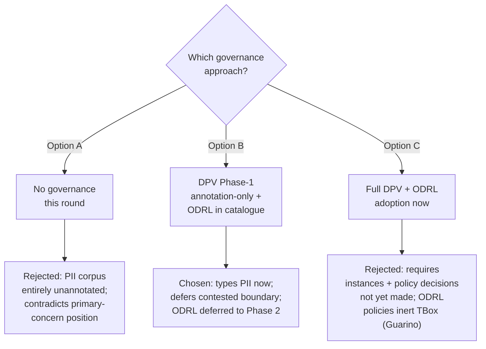
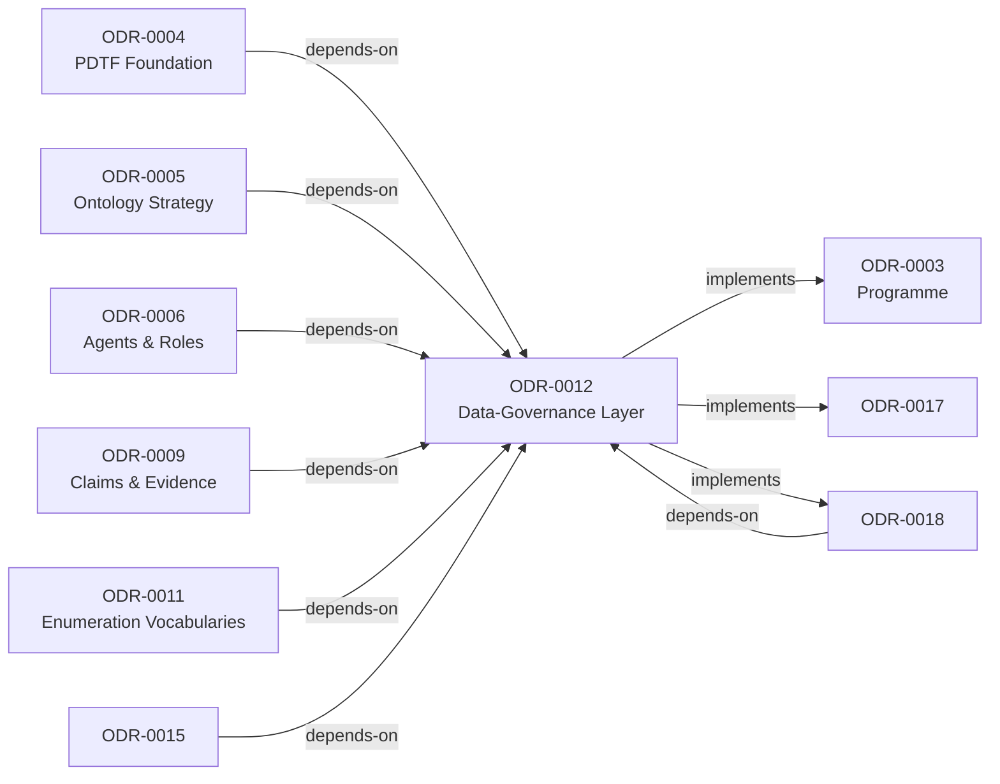
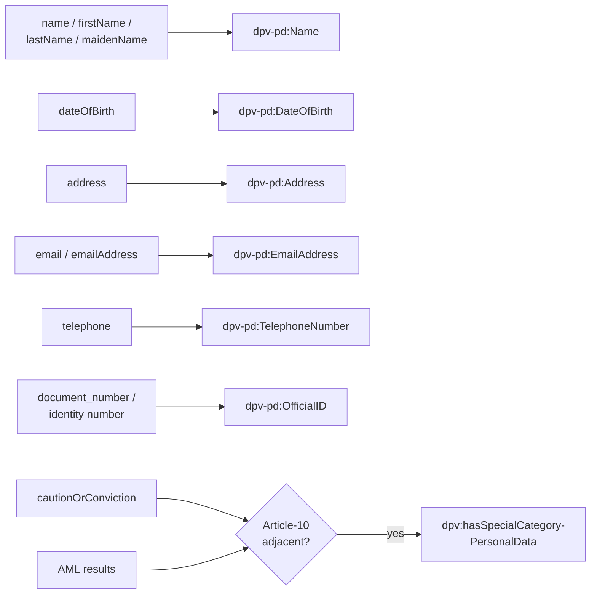
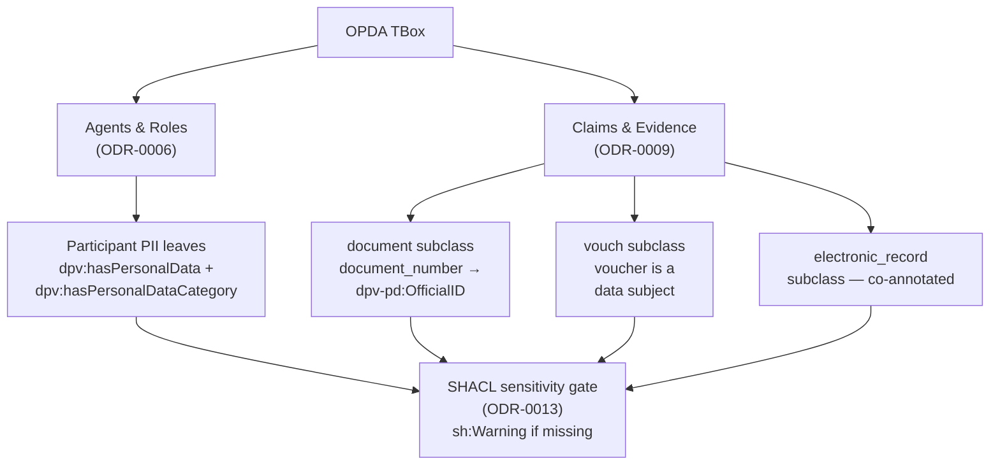

# Data-Governance Layer

## Context and Problem Statement

A PDTF transaction is dense with personal data — participant names, dates of birth, addresses, contact details, identity-document and personal numbers, AML results, occupier names (incl. `aged17OrOverNames`), and special-category-adjacent terms like `cautionOrConviction` and AML outcomes (Article-10 territory). Pandit's position (Q2, owns DPV): personal-data governance is a **primary TBox concern** — which classes/properties bear personal data, of what category, under which lawful regime, is a modelling fact about the ontology.

The PDTF brief constrains this round to **data-model-only — TBox, no instance data**. Council Session 001 (Q2) adopted **DPV Phase-1 annotation-only** as the floor (reference, not import — Kendall). Pandit dissented, arguing the lawful-basis/consent/purpose **class vocabulary** is TBox-expressible and was wrongly deferred. Guarino flagged a contradiction: ODRL `Policy`/`Permission` constructs bite only on *instances*, so an ODRL TBox alone asserts nothing in this round.

## Considered Options

* **Option A (chosen) — DPV Phase-1 annotation-only as the governance floor, ODRL adopted in catalogue with policy authoring deferred.** Secures the uncontested win (typing the dense PII corpus now) without resolving a contested boundary or writing inert policy triples.
* **Option B — No governance layer this round.** Rejected: leaves the densest PII corpus in the programme entirely unannotated and treats governance as post-hoc, contradicting Pandit's primary-concern position.
* **Option C — Full DPV + ODRL adoption now.** Rejected: most of it (lawful basis bound to operations, consent records, purpose bound to processing events, ODRL policies) requires instances or policy decisions OPDA has not made; commits instance data the brief forbids, and the ODRL policies are inert TBox (Guarino).

### Options and Chosen Outcome

The three candidate approaches weighed by the Council and the rationale for the chosen decision.

## Decision Outcome

Chosen option: "DPV Phase-1 annotation-only as the governance floor", because this secures the uncontested win (typing the dense PII corpus now) without resolving a contested boundary or writing inert policy triples.

Adopt **DPV Phase-1 annotation-only as the governance floor**, hold the lawful-basis/consent/purpose class-vocabulary question open as a live recorded dissent, and **adopt ODRL in the catalogue but defer policy authoring**.

### Consequences

* The densest PII corpus is typed now — every personal-data-bearing class/property carries its `dpv-pd:` category and jurisdiction at TBox level.
* Reference-not-import keeps DPV's large surface out of the ontology graph while preserving canonical, dereferenceable URIs.
* Adopt the ODRL vocabulary in the catalogue; write **no** `odrl:Policy`/`odrl:Permission` triples in Phase 1.
* Co-annotate ODR-0009 evidence subclasses under DPV — a voucher is modelled as a data subject; `document_number` is `dpv-pd:OfficialID`.
* The governance TBox class layer is **settled in reference-not-import form** (session-012 Q2, reconciled by Council [session-033](./council/session-033-governance-class-vocab.md)): the lawful-basis layer is adopted-and-emitted by reference; the `opda:PurposeScheme` model is ratified with emission gated on its first driver; consent/policy *instances* and any `owl:import`-backed DPV lattice are Phase-2. A held-as-live DA dissent (Allemang) defers anything beyond the emitted reference-not-import floor — see session-033 re-open triggers. (The three emitted-surface defects logged at [ADR-0005](../../adr/ADR-0005-deferred-work-register.md) §G were cleared by a generator fix on 2026-05-31: the Cat 4 shape's lawful-basis prefix binding corrected to core `dpv:`, `opda:lawfulBasis` purged of mis-slotted PD-categories, and the Phase-1 PII floor activated by emitting `opda:isPIIBearing true` on the six baseline PII Kinds.)
* Any new PII-bearing field added downstream triggers a Council session (standing cost).

## More Information

- **Target versions**: RDF 1.2 and SHACL 1.2, per the Core-tier pin in [ODR-0002](./ODR-0002-ontology-language-adoption.md).
- **Vocabularies**: DPV family (`dpv`, `dpv-pd`, `dpv-legal`, `dpv-gdpr`), referenced-not-imported; SKOS for PD-category and purpose taxonomies (→ [ODR-0011](./ODR-0011-enumeration-vocabularies.md)); ODRL adopted in catalogue, policy-authoring deferred. Catalogue status set by [ODR-0002](./ODR-0002-ontology-language-adoption.md) as amended by [ODR-0014](./ODR-0014-vocabulary-catalogue-amendments.md).
- **Glossary & data dictionary as inputs**: personal-data-bearing leaves identified from `data-dictionary.md` / `data-dictionary-canonical.json` — `name`, `firstName`, `lastName`, `maidenName`, `title`, `dateOfBirth`, `address`, `email`/`emailAddress`, `telephone`, identity/`document_number`, `aged17OrOverNames`, `cautionOrConviction`, AML results; purpose taxonomy grounded in the identity-verification / AML / source-of-funds chain implicit in the verifiedClaims envelope. `dct:source` provenance follows the [ODR-0004](./ODR-0004-pdtf-ontology-foundation.md) convention.
- **Evidence co-annotation**: [ODR-0009](./ODR-0009-claims-evidence-provenance.md) — `document_number` = `dpv-pd:OfficialID`; the `vouch` evidence type's `voucher` is a data subject. Source schema: `source/03-standards/schemas/src/schemas/verifiedClaims/pdtf-verified-claims.json`.
- **Deliverables (when fleshed out)**: `governance.ttl` (Phase-1 annotations + the lawful-basis/purpose class vocabulary *if the dissent carries*); the PII-module boundary; SHACL sensitivity gate (→ [ODR-0013](./ODR-0013-shacl-validation-and-severity.md)); standing PII-cost rule.
- **Related**: anchor [ODR-0003](./ODR-0003-pdtf-ontology-programme.md); foundation [ODR-0004](./ODR-0004-pdtf-ontology-foundation.md); co-annotates Agents & Roles [ODR-0006](./ODR-0006-agents-and-roles.md) (participant PII) and Claims & Evidence [ODR-0009](./ODR-0009-claims-evidence-provenance.md) (evidence PII); purpose/PD-category SKOS schemes [ODR-0011](./ODR-0011-enumeration-vocabularies.md); SHACL sensitivity gate [ODR-0013](./ODR-0013-shacl-validation-and-severity.md); catalogue [ODR-0002](./ODR-0002-ontology-language-adoption.md) as amended by [ODR-0014](./ODR-0014-vocabulary-catalogue-amendments.md).
- **Council deliberation**: [session-001](./council/session-001-pdtf-schema-to-ontology.md) Q2 (DPV/ODRL; owned by Pandit), Q6 (DPV evidence co-annotation).

### ODR Dependency Graph

This ODR's `depends-on` and `implements` relationships from the frontmatter, showing how ODR-0012 sits within the programme.

## Rules

**Phase 1 — adopt now (TBox annotation, no instances):**

- **`dpv:hasPersonalData`** types personal-data-bearing classes/properties — `opda:dateOfBirth`, `opda:email`, `opda:address`, participant-contact leaves.
- **`dpv:hasPersonalDataCategory`** classifies them: `dpv-pd:Name`, `dpv-pd:DateOfBirth`, `dpv-pd:Address`, `dpv-pd:EmailAddress`, `dpv-pd:TelephoneNumber`, and `dpv-pd:OfficialID` for document and personal numbers.
- **`dpv:hasSpecialCategoryPersonalData`** flags Article-10-adjacent terms — `cautionOrConviction` and AML results — at TBox level.
- **`dpv-legal:` jurisdiction tagging** annotates the governing regime (UK-GDPR + DPA 2018) on the relevant module.
- **Reference-not-import**: canonical DPV URIs (`dpv`, `dpv-pd`, `dpv-legal`, `dpv-gdpr`) cited; local SHACL enforces usage; no `owl:imports` (Kendall; [ODR-0002](./ODR-0002-ontology-language-adoption.md) pattern).

**SHACL sensitivity gate** ([ODR-0013](./ODR-0013-shacl-validation-and-severity.md)) raises a `sh:Warning` where special-category or personal-data-bearing terms lack their `dpv:hasPersonalDataCategory` / `dpv:hasSpecialCategoryPersonalData` annotation — an un-annotated PII leaf is a validation finding, not a silent omission. Phase-1 conformance is confirmed by review: every leaf the data dictionary marks as carrying name/DOB/address/contact/identity-number data resolves to a `dpv-pd:` category, and `cautionOrConviction` + AML results carry the special-category flag.

**Purpose/PD-category SKOS schemes** — the purpose taxonomy (`opda:IdentityVerification` / `opda:AntiMoneyLaundering` / `opda:ConveyancingDueDiligence`) and the PD-category enumeration are SKOS schemes delegated to [ODR-0011](./ODR-0011-enumeration-vocabularies.md) for their mechanism. Only their *adoption-now* status is contested here, not their modelling.

**Evidence co-annotation (cross-ref [ODR-0009](./ODR-0009-claims-evidence-provenance.md)):**
The verifiedClaims/evidence layer is not a PII-free zone. Governance co-annotates ODR-0009's `prov:Entity` evidence subclasses (`document`/`electronic_record`/`vouch`): a `document_number` is a `dpv-pd:OfficialID`; a **voucher is itself a data subject** (Pandit, Q6) — not merely a provenance node.

**ODRL — adopted in catalogue, policy-authoring deferred** (Guarino's contradiction resolved):
ODRL is adopted in the vocabulary catalogue ([ODR-0002](./ODR-0002-ontology-language-adoption.md) as amended by [ODR-0014](./ODR-0014-vocabulary-catalogue-amendments.md)), but authoring `odrl:Policy`/`odrl:Permission`/`odrl:Duty` is **deferred** until consent/policy instances enter scope (Phase 2). Confirmed by the **absence** of any authored policy in the Phase-1 deliverable.

**Lawful-basis / consent / purpose class vocabulary — RESOLVED** (session-012 Q2; reconciled by Council [session-033](./council/session-033-governance-class-vocab.md), 2026-05-31).
Pandit's dissent (the class vocabulary is TBox-expressible — *defining* a vocabulary is a TBox act; only *populating* it with instances is Phase-2) was **VINDICATED at session-012 Q2 (10-0) via reference-not-import** — the [ODR-0018](./ODR-0018-dpv-class-level-coannotation-pattern.md) §3a OPDA-authored mapping-table mechanism, DPV TBox external. That layer is **adopted and emitted** (the `opda:lawfulBasis → dpv:` referenced values + the `opda:DPVMappingRecord` machinery). session-033 **corrects this paragraph's earlier "kept open / must be ruled by a follow-up Council" text, which was stale against its own ratifying session.** Scope, **decomposed** (session-033, per-question 3–2; DA Allemang **HELD**): **(a)** the reference-not-import lawful-basis layer is settled in that form; **(b)** a *model-constraining* DPV lattice would require `owl:import DPV` — **out of scope** under the reference-not-import discipline (Allemang verified the lattice is absent OPDA-side: no import, no in-graph range/property declaration), a distinct future proposition; **(c)** consent-records / `dpv:hasLegalBasis`-bound-to-a-processing-event / `odrl:Policy` instances are **Phase-2** (the three §Q4 triggers — a lawful basis is irreducibly an assertion about a processing *act*); **(d)** the **purpose SKOS scheme** (`opda:PurposeScheme`) is ratified as the correct model ([ODR-0011](./ODR-0011-enumeration-vocabularies.md) §8a Method/plan-code) with **emission gated on its first driver** (ODR-0009 worked examples / a purpose-bearing field). The DA's deferral of anything beyond the emitted reference-not-import floor is **held-as-live** with the re-open triggers recorded in session-033.

**Standing cost on new PII** (Pandit, Q7) — any new personal-data-bearing field is a governance event requiring Council review; the model makes adding one expensive enough to force the review rather than letting PII accrete silently.

### DPV / Special-Category Mapping

The flowchart below shows how personal-data-bearing fields resolve to their `dpv-pd:` category and, where applicable, the `dpv:hasSpecialCategoryPersonalData` flag.

### Governance Annotation Attachment

Governance annotations attach to ontology entities across two ODR-0012 co-annotation points — participant classes and evidence subclasses.

