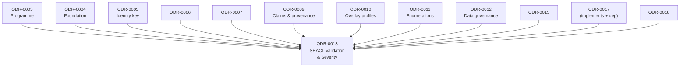
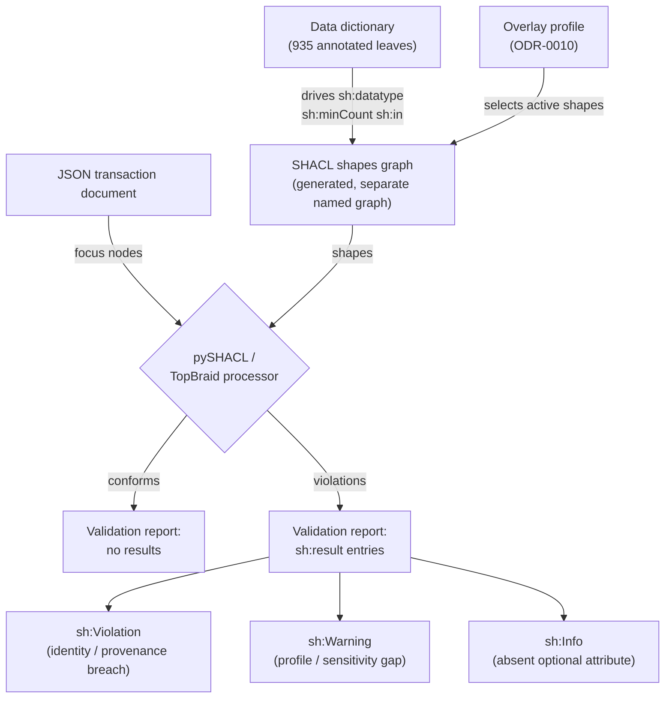
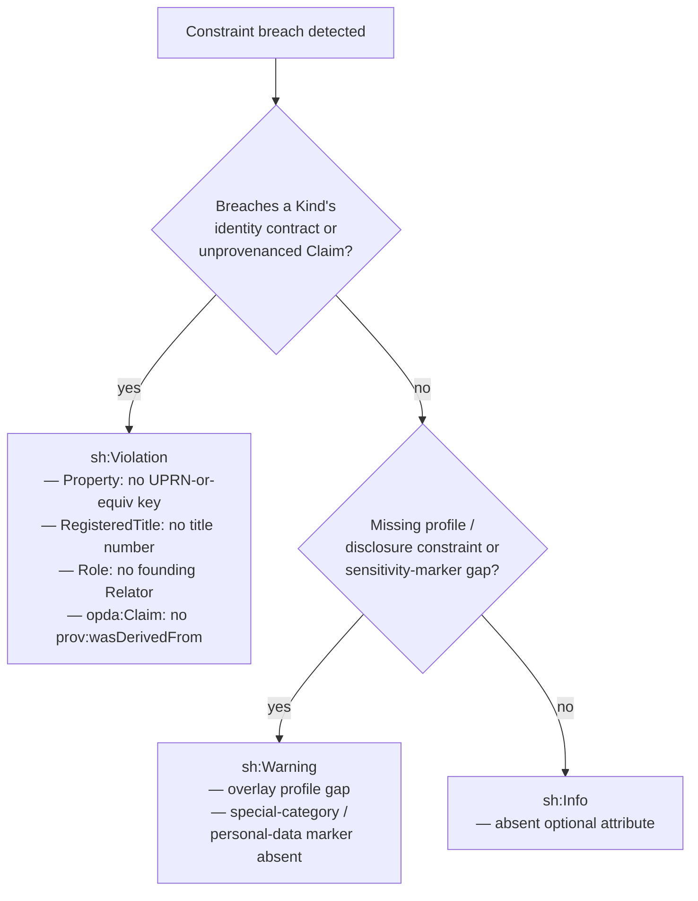
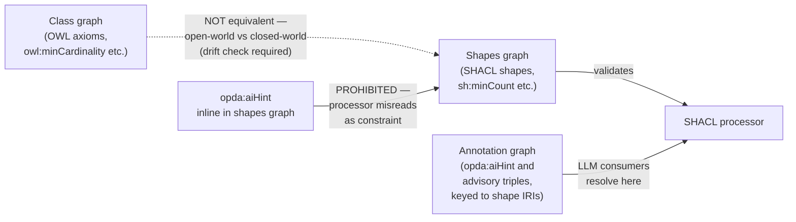

# SHACL Validation & Severity

## Context and Problem Statement

The PDTF v3 schemas are a constraint language: `required`, `enum`, `type`/`format`, `minimum`/`maximum`, and `oneOf` across 8,458 property-path entries — 935 base-schema leaves carry semantic annotation. Re-expressing the ontology as OWL alone discards this: OWL is open-world and cannot say which properties a conforming document *must* carry or what datatype a value *must* have. The closed-world contract is SHACL's job, and Council Session 001 (Q3) was emphatic that the shapes graph is kept **separate** from the OWL class graph — `owl:minCardinality` and `sh:minCount` are not the same statement.

Three further problems sit on top of the mapping. Not every violation is equal: a `Property` with no resolvable identity key is catastrophic; an absent optional attribute is routine. Flat pass/fail buries the loudest error under noise. The schemas also drive forms — the shapes that validate should generate the BASPI/TA6 form that collects (Q5). And Cagle's preference for inline `opda:aiHint` annotations clashed with Knublauch/Gandon's refusal of any invented term a strict SHACL processor might misread as a constraint — Q5 resolved this by exiling advisory annotations to a third **annotation graph** (class ⊥ shapes ⊥ annotation).

## Considered Options

* **Option A (chosen) — Severity-tiered SHACL in a separate shapes graph, with DASH rendering and a separate annotation graph.** The only option that actually validates the closed-world contract, surfaces the rarest and most damaging error loudest, and keeps form-hints and advisory annotations in their proper graphs.
* **Option B — OWL cardinality only, no SHACL.** Rejected: OWL is open-world, so a missing required property is not a contradiction and nothing is actually *validated*; also collapses the class/shapes separation Q3 mandated.
* **Option C — Flat SHACL with default severity.** Rejected: validates correctly but buries the catastrophic identity-loss error among trivial optional-gap reports, defeating the regulator's need to see the catastrophic error first.

## Decision Outcome

Chosen option: "Severity-tiered SHACL in a separate shapes graph, with DASH rendering and a separate annotation graph", because it is the only option that actually validates the closed-world contract (OWL cannot), surfaces the rarest and most damaging error loudest (flat severity cannot), and keeps form-hints and advisory annotations in their proper graphs without letting any invented term masquerade as a constraint.

Adopt **severity-tiered SHACL in a separate shapes graph, with DASH rendering and a separate annotation graph**.

### Consequences

* Generate shapes from the data dictionary's recorded types, requiredness, and bounds — do not hand-author what is derivable (Allemang's generator-first policy, [ODR-0004](./ODR-0004-pdtf-ontology-foundation.md)).
* Maintain a standing drift check between class graph and shapes graph; the open-world/closed-world guard imposes this as ongoing cost.
* Author every `sh:Violation` shape against the identity-contract or unprovenanced-claim rubric; reviewers reject `sh:Violation` on optional-attribute gaps.
* Keep advisory annotations out of the shapes graph; route `opda:aiHint`-style triples to the annotation graph keyed to shape IRIs. Cagle's inline-hint preference is recorded as dissent (≈7-2), not adopted.
* Round-trip the BASPI5 vertical slice (Q7 MVP) end-to-end as the canonical proof: JSON → profile → rendered form + validated document with full provenance.

## More Information

- **Target versions**: RDF 1.2 and SHACL 1.2, per the Core-tier pin in [ODR-0002](./ODR-0002-ontology-language-adoption.md).
- **Vocabularies**: SHACL (`sh:minCount`/`sh:maxCount`/`sh:datatype`/`sh:in`/`sh:xone`/`sh:qualifiedValueShape`/severity); DASH (`dash:propertyRole`/`viewer`/`editor`/`uniqueValueForClass`/`EnumSelectEditor`); SKOS (for `sh:in` over the [ODR-0011](./ODR-0011-enumeration-vocabularies.md) schemes).
- **Data dictionary as input**: the 935 annotated base-schema leaves in `data-dictionary.md` / `data-dictionary-canonical.json` — recorded leaf types drive `sh:datatype`/`sh:nodeKind`; requiredness drives `sh:minCount`; array bounds drive `sh:minCount`/`sh:maxCount`; `enum` columns drive `sh:in` over the corresponding [ODR-0011](./ODR-0011-enumeration-vocabularies.md) scheme.
- **Related**: anchor [ODR-0003](./ODR-0003-pdtf-ontology-programme.md); foundation [ODR-0004](./ODR-0004-pdtf-ontology-foundation.md); identity-key source [ODR-0005](./ODR-0005-property-land-identity-crux.md); `sh:in` scheme source [ODR-0011](./ODR-0011-enumeration-vocabularies.md); sensitivity-gate source [ODR-0012](./ODR-0012-data-governance-layer.md); overlay profiles + annotation-graph + ValidationContext [ODR-0010](./ODR-0010-overlay-profile-mechanism.md); unprovenanced-claim violation [ODR-0009](./ODR-0009-claims-evidence-provenance.md).
- **Council deliberation**: [session-001](./council/session-001-pdtf-schema-to-ontology.md) Q4 (identity-key mechanism), Q5 (overlays → SHACL, severity, aiHint resolution; Knublauch/Gandon/Guizzardi).

### ODR dependency graph

This record depends on a chain of foundation decisions and in turn is implemented by downstream records.

### Validation flow

Data flows from a JSON transaction document through profile-selected SHACL shapes to a structured validation report whose entries carry severity levels.

## Rules

**Constraint mapping** — JSON-Schema constructs map to SHACL with datatypes and cardinalities grounded in the data dictionary:

| JSON Schema | SHACL | Source |
|---|---|---|
| `required` | `sh:minCount 1` | data dictionary requiredness on the leaf |
| `enum` (closed) | `sh:in` over the SKOS scheme members ([ODR-0011](./ODR-0011-enumeration-vocabularies.md)) | the enum's concept scheme |
| `type` / `format` | `sh:datatype` / `sh:pattern` / `sh:nodeKind` | data dictionary recorded type (`string`, `integer`, `number`, `boolean`, `string (date)`, `string (date-time)`, `string (email)`) |
| `minimum` / `maximum` | `sh:minInclusive` / `sh:maxInclusive` | data dictionary bounds |
| `oneOf` (discriminated) | `sh:xone` + `sh:qualifiedValueShape` on the discriminator | the `oneOf` branch + its discriminator leaf |
| array cardinality | `sh:minCount` / `sh:maxCount` | data dictionary array bounds |
| canonical key | `dash:uniqueValueForClass` (primary), `owl:hasKey` (secondary) | [ODR-0005](./ODR-0005-property-land-identity-crux.md) key decision |

Recorded leaf types ground `sh:datatype` directly — `dateOfBirth` → `xsd:date`, `accountNumber` (recorded `integer`) → `xsd:integer`, `annualGroundRent` (recorded `number`) → `xsd:decimal`, `emailAddress` (recorded `string (email)`) → `xsd:string` with `sh:pattern`/`sh:nodeKind`. Each property shape carries `dct:source` to its canonical leaf path (e.g. `…/pdtf-transaction.json#…/dateOfBirth`) per [ODR-0004](./ODR-0004-pdtf-ontology-foundation.md).

**Severity tiering** (Guizzardi) — severity tracks regulatory weight, not schema nesting:

- **`sh:Violation`** — breach of a Kind's identity contract: a `Property` with no resolvable UPRN-or-equivalent key, a `RegisteredTitle` with no title number, a Role instance with no founding Relator (a `Proprietor` with no `Proprietorship`; a `Seller` with no `Transaction`); an unprovenanced `opda:Claim` with no `prov:wasDerivedFrom` and no explicit "unverified" marker (Moreau, [ODR-0009](./ODR-0009-claims-evidence-provenance.md)).
- **`sh:Warning`** — missing profile/disclosure constraints that overlays add; sensitivity-marker gaps on special-category or personal data (Pandit, [ODR-0012](./ODR-0012-data-governance-layer.md) sensitivity gate).
- **`sh:Info`** — absent optional attributes.

The principle: the rarest, most damaging error (identity loss) must be the loudest; the routine omission must be the quietest. Enforcement: every `sh:Violation` shape must guard a Kind's identity contract or an unprovenanced claim; no optional-attribute gap may carry `sh:Violation`.

### Severity tier model

Each result entry in the validation report carries exactly one severity level; the assignment rule is determined by the nature of the breach, not by schema nesting depth.

**Open-world/closed-world guard** (Gandon) — an `owl:minCardinality` in the class graph and a `sh:minCount` in the shapes graph are **not the same statement** and must not be authored on one property in the belief that they coincide. A drift check is required to catch the two falling out of step; it confirms no property carries both an `owl:` cardinality and a SHACL count authored as equivalent.

**Class ⊥ shapes ⊥ annotation graph separation** — the shapes graph is a distinct named graph from the class graph ([ODR-0004](./ODR-0004-pdtf-ontology-foundation.md)). Advisory `opda:aiHint`-style annotations for LLM consumers do **not** go inline in the shapes graph (a strict processor would carry uninterpretable triples or misread them as constraints). They live in a **separate annotation graph keyed to shape IRIs**, consistent with the overlay annotation-graph convention in [ODR-0010](./ODR-0010-overlay-profile-mechanism.md). Enforcement: the absence of any `opda:aiHint` (or other undocumented advisory term) inside the shapes graph — advisory triples resolve only in the separate annotation graph.

### Three-graph separation

The class graph, shapes graph, and annotation graph are three distinct named graphs; advisory annotations never appear inside the shapes graph.

**DASH rendering** — `dash:propertyRole`/`viewer`/`editor`, `sh:order`/`sh:group`, and `dash:EnumSelectEditor` (fed by [ODR-0011](./ODR-0011-enumeration-vocabularies.md) schemes) reproduce the form on the same shapes that validate, so a loaded profile both validates a transaction and generates the form that collects it, with full `dct:source` traceability (Q5; see [ODR-0010](./ODR-0010-overlay-profile-mechanism.md)). DASH is acceptable *because* it is a documented vocabulary; undocumented terms are not.

**Validation confirmation** — shapes are validated with a SHACL processor (pySHACL or TopBraid) against the diagnostic exemplars ([ODR-0005](./ODR-0005-property-land-identity-crux.md)): a registered freehold house, an unregistered house pre-first-registration, and a flat whose UPRN was split must each produce the expected report — including a `sh:Violation` for the identity-key breach on the unregistered/split cases. The BASPI5 vertical slice (Q7 MVP) must round-trip: its profile shapes validate a transaction *and* generate the BASPI form with `dct:source` traceability.

