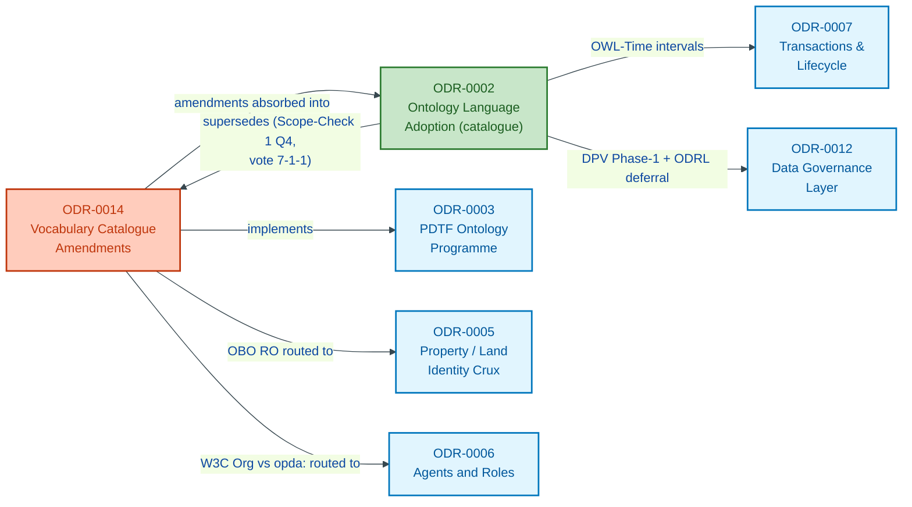
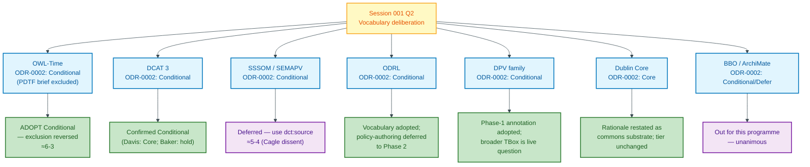
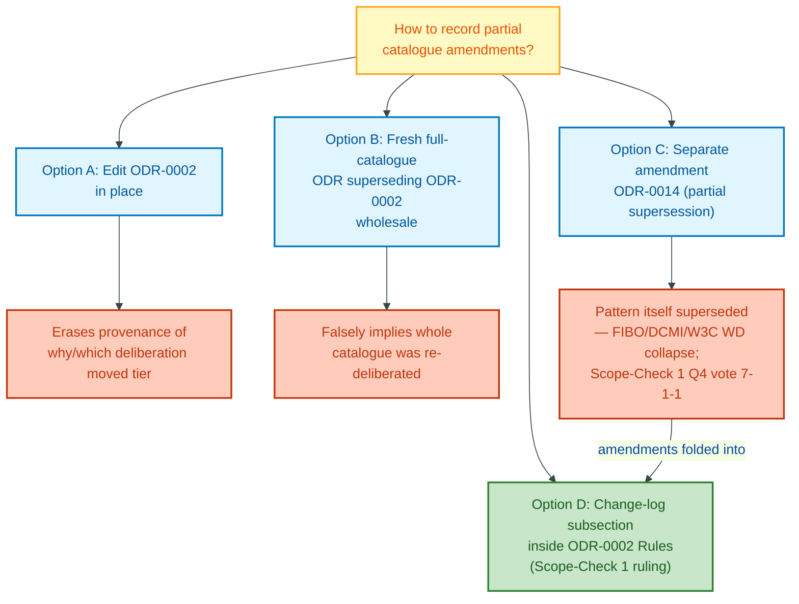

# Vocabulary Catalogue Amendments

> **SUPERSEDED 2026-05-26 by [ODR-0002](./ODR-0002-ontology-language-adoption.md) via Scope-Check 1 (Q4 vote 7-1-1 retire; Hendler dissent on permanence preserved).** This record is retained as a historical artefact and anchor for the Council Session 001 provenance below. **The amendments it records are folded into ODR-0002's `## Change log` subsection inside `## Rules`** — that is now the authoritative current state of the catalogue. Readers seeking current tiering MUST go to ODR-0002; the tables below are frozen at session-001's deliberation snapshot. Session 002 ratifies the fold.

### ODR relationship map

This diagram shows how ODR-0014 relates to the records it amends, implements, and is superseded by, as stated in the frontmatter and prose.

## Context

[ODR-0002](./ODR-0002-ontology-language-adoption.md) established OPDA's vocabulary catalogue — a closed three-tier set (Core / Conditional / Defer) with canonical URI, role, and adoption pattern per entry — surveyed from the H&M programme before any PDTF-specific modelling had been attempted. Council Session 001 (Q2) then scoped the PDTF-to-ontology work against that catalogue and, in doing so, made decisions that **change ODR-0002's tiering or rationale** for specific entries. Two pivots in particular: **OWL-Time**, which ODR-0002 placed at Conditional and which the PDTF brief had initially *excluded*, was brought into active scope on coherence grounds (PROV-O instants without OWL-Time intervals is incoherent for proprietorship, lease, and claim-validity); and the mapping/policy cluster (SSSOM, ODRL) was held back where the data-model-only round presents no target. The session also opened **OBO RO** (no consensus) and **FOAF** (subsequently ruled out programme-wide).

The original question this ODR answered — *how should the partial supersession be recorded to preserve provenance?* — was itself superseded by Scope-Check 1 (2026-05-26), which ruled the amendment-ODR pattern is not the right convention (FIBO catalogues, DCMI terms, W3C WD discipline all collapse). The amendments now live in ODR-0002's `## Change log`.

## Decision

**Superseded.** The original decision (record amendments as a partial-supersession amendment) is replaced by ODR-0002's `## Change log`-inside-`## Rules` pattern. The amendments are unchanged; only their authoritative home changes.

## Rules

### Supersession scope

This record is wholly superseded by ODR-0002 — the amendments it carried (OWL-Time Conditional adoption; DCAT Conditional; SSSOM deferral; ODRL deferred-policy; DPV Phase-1; Dublin Core rationale; BBO/ArchiMate out) now live as `## Change log` rows in ODR-0002's `## Rules`, attributed to Session 001 Q2. The two open questions originally routed here (OBO RO → ODR-0005; FOAF / W3C Org → ODR-0006) remain routed — but their pointers live in ODR-0002, not here. Hendler's recorded dissent on the retirement (Scope-Check 1 Q4: "every governance act stays permanently") is preserved in the plan's risks table (`docs/plan/council-followup-sessions.md` §9) as a live methodological position, not silenced.

### Vocabulary tier decisions at a glance

The table below is the authoritative text; this diagram visualises the same seven entries — showing the tier-or-scope change made at Session 001 Q2 and the downstream consumer where relevant.

### Amended entries (superseded in part)

These ODR-0002 catalogue entries are changed by this record:

| Vocabulary | ODR-0002 said | Session 001 decision | Rationale |
|---|---|---|---|
| **OWL-Time** | Conditional, "use only where bitemporal/interval semantics genuinely needed" — PDTF brief **excluded** it | **ADOPT (Conditional), in scope for this programme** — reverses the exclusion | PROV-O's `prov:atTime` (instant) without OWL-Time intervals for proprietorship, leases, claim-validity is incoherent (Guizzardi/Gandon). **≈6-3** over "await a concrete consumer" dissent (Allemang/Davis). |
| **DCAT 3** | Conditional | **Confirmed Conditional** (Davis wanted Core; Baker held Conditional) | Ontology-as-published-dataset + reference data; near-zero marginal cost over `dct:`. Not Core — no catalogue task this round. |
| **SSSOM / SEMAPV** | Conditional ("pair with `semapv:`") | **Deferred** for internal overlay refs; use `dct:source` to form-question IRIs now | SSSOM earns its place mapping to *external* vocabularies; for single-source internal refs it is machinery without a target (Gandon/Knublauch). **Cagle dissent recorded (≈5-4).** |
| **ODRL** | Conditional, "restrict to access-control layers" | **Vocabulary adopted; policy-authoring deferred** to Phase 2 | ODRL `Policy`/`Permission` bite only on *instances*, which this round forbids — an ODRL TBox alone asserts nothing (Guarino). See [ODR-0012](./ODR-0012-data-governance-layer.md). |
| **DPV family** | Conditional | **Phase-1 annotation adopted; broader TBox class vocab is a live question** | See [ODR-0012](./ODR-0012-data-governance-layer.md) — Pandit's recorded dissent on lawful-basis/consent/purpose class vocabulary. |
| **Dublin Core** | Core ("administrative metadata") | **Reclassified rationale: "commons substrate"** — no tier change | DCAT/PROV-O/SKOS/VANN all already depend transitively on `dct:` (Baker); adopting it formalises the implicit. Strengthened justification, same tier. |
| **BBO, ArchiMate** | Conditional/Defer | **Out for this programme** | No process- or capability-modelling task. Unanimous. |

OWL-Time moves into active scope carrying ODR-0002's adoption pattern (canonical URI + local SHACL + no `owl:imports`); consumed by Transactions & Lifecycle ([ODR-0007](./ODR-0007-transactions-and-lifecycle.md)) for proprietorship/lease/claim-validity intervals.

### Open questions raised (routed, not adopted)

- **OBO RO** — Kendall proposed for transitive part-of (flat → block → estate); Davis rejected (biology-flavoured; use `dct:isPartOf`). **No consensus — left open**, routed to [ODR-0005](./ODR-0005-property-land-identity-crux.md).
- **FOAF / W3C Org ontology** — Session 001 reopened FOAF; **since ruled out** (programme decision). ODR-0002's Defer-row negative on FOAF stands. The remaining Kind-layer choice routed to [ODR-0006](./ODR-0006-agents-and-roles.md) is **W3C Org ontology vs bespoke `opda:`**, with `prov:Agent` for the provenance role only.

### Survives unchanged

This record does **not** touch:

- The **entire Core tier** (RDF, RDFS, OWL 2, XSD, SHACL, SKOS, Dublin Core, VANN) — membership and canonical URIs stand; only Dublin Core's *rationale* is restated.
- The **adoption pattern** for every Conditional entry (canonical URI + local SHACL + no `owl:imports` + `vann:` header + recorded provenance).
- The **Defer-tier reasoning** for entries the PDTF round did not test — **schema.org**, **DCAT-AP / DCAT-AP EU**, **FIBO**, **SOSA/SSN, QUDT, GeoSPARQL** — all stand as ODR-0002 reasoned them.
- The **three-tier framing** (Core / Conditional / Defer) and the closed-set discipline (new admissions require a new ODR).

### Enforcement notes

- Each amended row above is confirmed against [session-001](./council/session-001-pdtf-schema-to-ontology.md) Q2 — tallies (OWL-Time ≈6-3; SSSOM ≈5-4 with Cagle dissent) and arguments match the transcript.
- ODR-0002's affected rows carry a "Superseded in part by ODR-0014" note pointing here; the Core tier, adoption pattern, and untouched Defer reasoning are unchanged in ODR-0002.
- OWL-Time adoption is confirmed downstream by [ODR-0007](./ODR-0007-transactions-and-lifecycle.md) (interval modelling), carrying the canonical-URI + local-SHACL + no-`owl:imports` adoption pattern.
- This is a **partial** supersession: ODR-0002 remains the standing catalogue for everything outside the amended scope above. Whether ODR-0002's frontmatter `status` flips to `superseded` is left to the validator (`odr-review`) as a soundness item rather than asserted here.

### Amendment-pattern supersession flow

This diagram traces how the amendment-ODR convention itself was evaluated and superseded — the decision captured in the `## Decision` section above.

## Alternatives

- **Edit ODR-0002 in place** — erases the provenance of *why* each tier moved and *which* deliberation moved it, collapsing two distinct authorship events into one undated table.
- **A fresh full catalogue ODR superseding ODR-0002 wholesale** — falsely implies the whole catalogue was re-deliberated when only a handful of entries were touched, and discards ODR-0002's still-valid survey reasoning for the untouched tiers.

## Consequences

- Each tiering change is recorded with its Council session, argument, and tally — the catalogue's provenance is layered, not flattened.
- The temporal tier now matches what the model needs: OWL-Time intervals alongside PROV-O instants remove the Guizzardi/Gandon incoherence.
- SSSOM and ODRL-policy deferral keeps unused machinery out of this round; both remain adoptable once a target (external mappings; consent instances) arrives.
- The OBO RO question is recorded as open and FOAF as ruled out, each routed to its owning ODR — neither silently dropped nor prematurely tiered.
- The catalogue must be read across two records (ODR-0002 baseline + this amendment) until a future consolidation; readers must hold both to see current tiering.
- Modellers consuming OWL-Time apply ODR-0002's adoption pattern (canonical URI + local SHACL + no `owl:imports` + `vann:` header) in [ODR-0007](./ODR-0007-transactions-and-lifecycle.md).
- The Kind-layer-vocabulary question (W3C Org vs bespoke `opda:`) is owned by [ODR-0006](./ODR-0006-agents-and-roles.md); the part-of question by [ODR-0005](./ODR-0005-property-land-identity-crux.md).

## References

- **Superseded by**: [ODR-0002](./ODR-0002-ontology-language-adoption.md) — current authoritative catalogue carrying the `## Change log` subsection that absorbs this record's amendments.
- **Supersession decision**: [Scope-Check 1 — Programme cut](./council/scope-check-1-programme.md) Q4 (vote 7-1-1 retire; Hendler dissent on permanence recorded). Amendment A1.
- **Anchor**: [ODR-0003](./ODR-0003-pdtf-ontology-programme.md) — the PDTF ontology programme this amendment scopes against; ODR-0003's work-breakdown table no longer lists ODR-0014 as a Phase-0 stub.
- **Downstream consumers** (now via ODR-0002): OWL-Time → [ODR-0007](./ODR-0007-transactions-and-lifecycle.md); DPV Phase-1 + ODRL deferral → [ODR-0012](./ODR-0012-data-governance-layer.md); SSSOM-vs-`dct:source` → [ODR-0011](./ODR-0011-enumeration-vocabularies.md) and overlay `dct:source` traceability in [ODR-0010](./ODR-0010-overlay-profile-mechanism.md).
- **Questions routed**: OBO RO → [ODR-0005](./ODR-0005-property-land-identity-crux.md); W3C Org vs bespoke `opda:` → [ODR-0006](./ODR-0006-agents-and-roles.md).
- **Target versions**: RDF 1.2 and SHACL 1.2, per the Core-tier pin in [ODR-0002](./ODR-0002-ontology-language-adoption.md).
- **Council deliberation**: [session-001](./council/session-001-pdtf-schema-to-ontology.md) Q2 (vocabulary set) — original deliberation, frozen here for provenance.
- **Hendler's preserved dissent** on the retirement (Scope-Check 1 Q4): "every governance act stays permanently". Recorded in plan §9 risks, not silenced.
