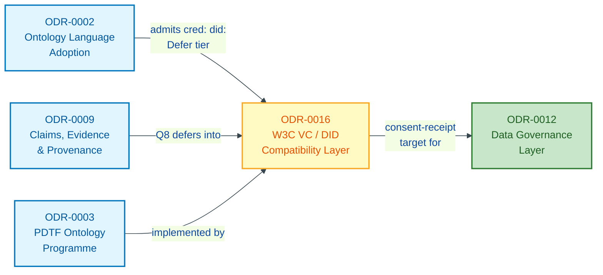
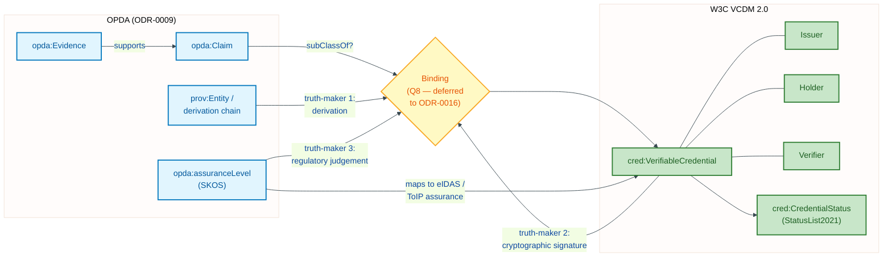
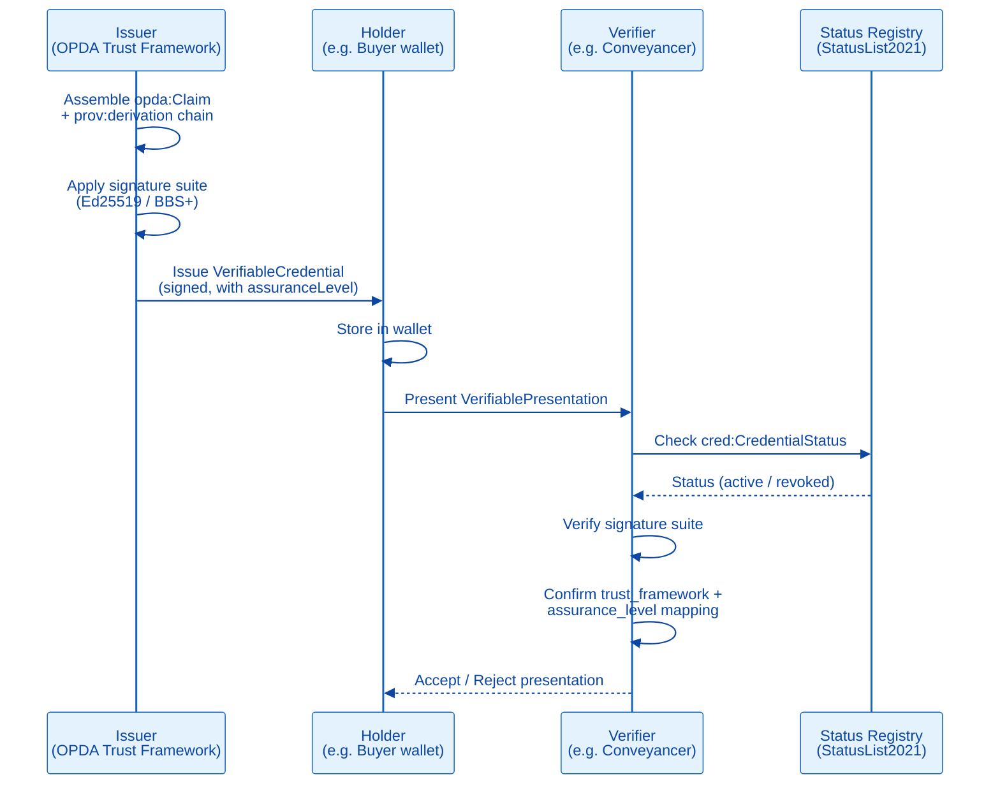
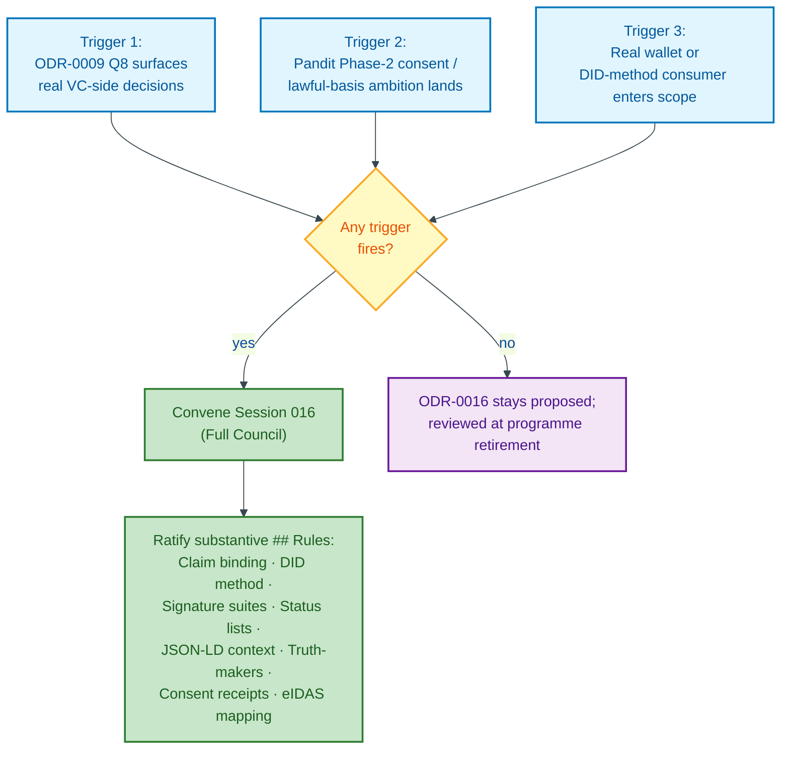

# W3C Verifiable Credentials / DID Compatibility Layer

## Context

> **Status: deferred-named.** This ODR is created as a placeholder stub per Scope-Check 1 (2026-05-26) Q7c verdict (8-1 NAME the work; 2 strong spawn-now from Davis and Pandit; others "name-but-defer"). Activation triggers are named below in `## Rules`. The session ratifying this ODR (Session 016) does **not** run in Phase 1.

PDTF carries the word *Trust* in its name and ships a `verifiedClaims` envelope shaped after OIDC4IDA / eIDAS. The PDTF business glossary names Claim, Issuer, Holder, Verifier, Trust Framework — the W3C Verifiable Credentials Data Model 2.0 and DID Core 1.0 lexicon. ODR-0009 (Claims, Evidence & Provenance) cites the W3C VC family by reference and asks (Q8) whether `opda:Claim` is `cred:VerifiableCredential`-compatible, but does not ratify a binding.

A property-data Trust Framework that publishes its claims without committing to the VC data model and DID resolution patterns produces an ontology that the actual external consumers — EU eIDAS 2.0 wallets, `gov.uk` OneLogin, W3C VCDM 2.0 implementations, ToIP-aligned issuers — cannot consume. ODR-0009 is correct to defer the binding in the schema-to-ontology round, but the deferral is not free: by the time Phase 4 closes (Claims + Governance), the cost of *not* having a VC/DID alignment record rises sharply because consent receipts (Pandit's Phase-2 ambition) are W3C VC-shaped at every level.

The scope-check Council recognised this as a real gap and named the ODR forward rather than spawn-now: Phase 1 work does not require it, but the work is too consequential to surface only in an ad-hoc late session. Naming forward fixes the URI, opens the catalogue admission of `cred:` and `did:` prefixes (per Baker's session-002 amendment), and gives ODR-0009 Q8 a record to defer into rather than an open question.

Guizzardi raised a **Truth-Maker question** that belongs in this ODR's deliberation: what *makes true* a Verifiable Credential? PROV-O names a derivation chain; the VC names a cryptographic signature; the assurance level names a regulatory judgement. Three truth-makers, one Claim. ODR-0009 collapses these into the PROV-O backbone plus the `opda:assuranceLevel` SKOS layer; ODR-0016 separates them per the VC ecosystem's own discipline.

## Decision

Name **ODR-0016 (W3C VC / DID Compatibility Layer)** as a deferred-but-named record. Activation triggers and scope are fixed; the substantive `## Rules` are placeholder until activation. The catalogue (ODR-0002) admits `cred:` (W3C VCDM 2.0) and `did:` (DID Core) prefixes immediately in the Defer tier with an activation pointer to this ODR.

## Rules

> All rules below are *placeholder* until Session 016 runs. The activation triggers and the convening shape are normative; the binding content lands at session time.

**Activation triggers (any one fires the session).**

1. **Session 009 Q8 surfaces real VC-side decisions** — ODR-0009's deliberation reveals that the `cred:VerifiableCredential` binding cannot be deferred without leaking into the PROV-O backbone.
2. **Pandit's Phase-2 ambition lands** — ODR-0012's deliberation extends DPV adoption to consent / lawful-basis / purpose class vocabulary, which is W3C VC consent-receipt-shaped.
3. **A real wallet or DID-method consumer enters scope** — `gov.uk` OneLogin integration, EU eIDAS 2.0 wallet, OPDA-issued credentials for buyer wallet, or any consumer that requires `did:web`/`did:key`/`did:jwk` resolution.

**Scope when activated.**

1. **Claim binding.** `opda:Claim rdfs:subClassOf cred:VerifiableCredential`? Or a `prov:Entity`-only `opda:Claim` with a separate `opda:VerifiableCredentialPresentation` class for the wallet-side?
2. **Issuer / Holder / Verifier role bindings.** Map ODR-0006's RoleMixin pattern onto VC's Issuer/Holder/Verifier; clarify which Roles are W3C VC roles and which are domain-specific (Conveyancer, Estate Agent, AML Verifier).
3. **DID method commitment.** `did:web` (the cheap default), `did:key`, `did:jwk`, or a custom OPDA method? Resolution endpoint specification.
4. **Data Integrity / signature suites.** Which signature suites does the assurance layer admit? (Ed25519Signature2020 default; BBS+ for selective disclosure of PII evidence; ECDSA for legacy CA chains.)
5. **Status lists.** `cred:CredentialStatus` and revocation registries (`StatusList2021`). Where does the OPDA registry live; who operates it?
6. **JSON-LD context.** `https://opda.uk/contexts/v1` or similar — the JSON-LD context the catalogue commits to.
7. **Truth-maker discipline (Guizzardi).** PROV-O derivation vs cryptographic signature vs regulatory assurance-level — what *makes true* a claim under the OPDA Trust Framework? Three truth-makers, one Claim — express the relationship.
8. **Consent receipts** — if Pandit's Phase-2 ambition (ODR-0012) lands, the consent-receipt shape (W3C VC consent-receipt draft) is the natural target. Receipt structure ratified here, not in 0012.
9. **eIDAS 2.0 / ToIP alignment.** Where the OPDA Trust Framework cites eIDAS levels (Substantial, High) and ToIP layers — the existing `opda:assuranceLevel` SKOS scheme (ODR-0009) maps onto these. Confirm the mapping.

**Convening constraints for Session 016 (when activated).**

- **Format: Full Council** (substantive linked-data decision; credible split between VC purists and Trust-Framework pragmatists).
- **Queen:** Luc Moreau (continuity with ODR-0009 — owns PROV-O ↔ VC alignment) OR a W3C VC WG voice (Manu Sporny or Drummond Reed — extended panel) if the binding deliberation needs deeper VC-ecosystem grounding. The convening block resolves.
- **DA:** Harshvardhan Pandit (the strongest credible opponent of an under-scoped binding — challenges the deferral as cover for the VC ecosystem's larger ambitions; consent-receipt completeness).
- **Extended panel:** Manu Sporny / Drummond Reed (VC WG); Nicola Guarino (Truth-Maker question carries).
- **Standing panel slice:** Allemang (working-ontologist pragmatism), Hendler (W3C web architecture), Cagle (operational SHACL on signed claims).

**MUST land before:**
- The first OPDA-issued credential is signed for a real wallet consumer.
- ODR-0012 (Governance) ratifies consent-receipt instances, if Phase-2 activates.

### ODR Dependency Graph

The diagram below shows how ODR-0016 sits in the programme graph: which records it depends on and which downstream records point back to it.

### OPDA Claims and Evidence mapped to W3C VC Structures

The diagram below traces how OPDA's existing claim and evidence concepts (from ODR-0009) correspond to the roles and structures named in the W3C Verifiable Credentials Data Model 2.0.

### VC Issuance and Verification Sequence

The diagram below illustrates the issuance and verification flow for an OPDA claim presented as a W3C Verifiable Credential, incorporating the Issuer, Holder, and Verifier roles that this ODR will bind to the RoleMixin pattern from ODR-0006.

### Activation Triggers — Decision Flowchart

The diagram below shows the three named activation triggers and how any one of them convenes Session 016 to ratify the substantive rules of this ODR.

## Alternatives

- **Defer indefinitely, refresh ODR-0009's Q8 ad hoc.** Rejected by scope-check (8-1 NAME): the URI cost of late naming + the catalogue-admission cost of `cred:`/`did:` prefixes are both better paid up front.
- **Fold into ODR-0009 (Claims, Evidence & Provenance).** Rejected: ODR-0009 deliberately scoped to the PROV-O backbone and assurance layer; binding to W3C VCDM 2.0 + DID Core + signature suites + status lists is a separate Council-cycle volume (Hendler's session-001 framing — each W3C Rec is its own URI-graph commitment).
- **Spawn now (Davis + Pandit position).** Rejected by majority (6-2 defer-with-name): Phase 1 work does not require it; spawning now adds a session without a clear MVP-blocking question.

## Consequences

- ODR-0002 admits `cred:` and `did:` prefixes in the Defer tier immediately, with activation pointers to this ODR. Session 002 ratifies the admission.
- ODR-0009 Q8 ("`opda:Claim` as `cred:VerifiableCredential`-compatible?") defers into this ODR rather than being answered inline. ODR-0009's `## References` cites this ODR explicitly.
- ODR-0012 (Governance) Phase-2 ambition (consent / lawful-basis class vocabulary) has a target ODR for receipt shapes when it activates.
- Trust Framework citation honoured — the `verifiedClaims` envelope's claim that PDTF *is* a trust framework now has a record committing the framework to interop.
- Plan §5 adds a Phase 7 (deferred) for Session 016. Cost: zero until activated; one Full Council session when activated.
- If no activation trigger fires through MVP, this ODR stays `proposed` and is reviewed at programme retirement (ODR-0003 retirement gate).

## References

- Council methodology: [ODR-0001](./ODR-0001-linked-data-council-methodology.md).
- Programme anchor: [ODR-0003](./ODR-0003-pdtf-ontology-programme.md).
- Catalogue: [ODR-0002](./ODR-0002-ontology-language-adoption.md) — admits `cred:` and `did:` prefixes in Defer tier with activation pointers here.
- Upstream: [ODR-0009](./ODR-0009-claims-evidence-provenance.md) — PROV-O backbone + assurance layer + Q8 deferred here.
- Downstream consumers: [ODR-0012](./ODR-0012-data-governance-layer.md) — Phase-2 consent receipts; Pandit's lawful-basis ambition.
- Deliberation provenance: [Scope-Check 1 — Programme cut](./council/scope-check-1-programme.md), Q7c. Named-but-deferred per 8-1 verdict.
- External standards: W3C Verifiable Credentials Data Model 2.0; W3C DID Core 1.0; W3C Data Integrity 1.0; W3C VC Status List 2021; W3C VC Consent Receipt (Community Group draft); EU eIDAS 2.0 Regulation; Trust over IP (ToIP) layers; OIDC4IDA (already referenced by ODR-0009).
- Truth-Maker discipline: Guarino (DOLCE truth-making); Guizzardi's appendix to Scope-Check 1 Q7c.
