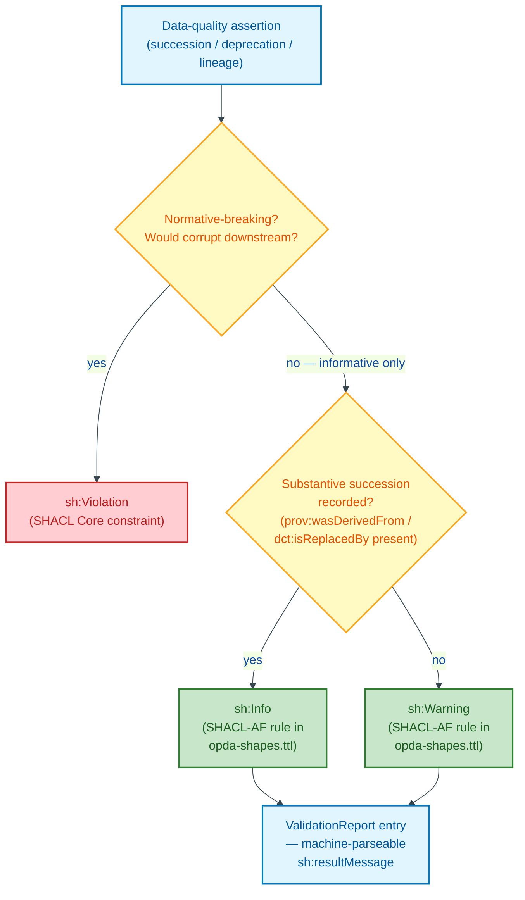
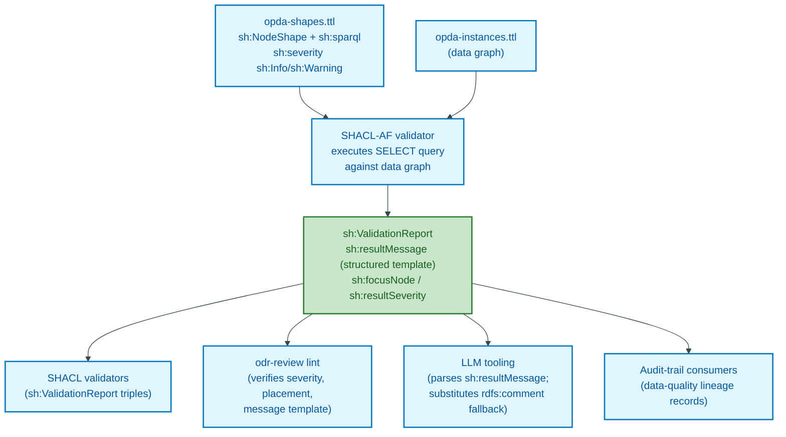
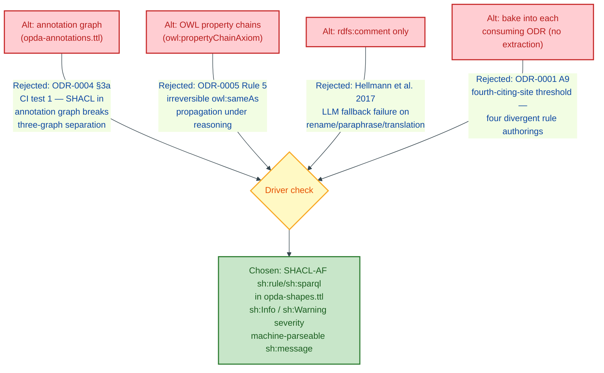
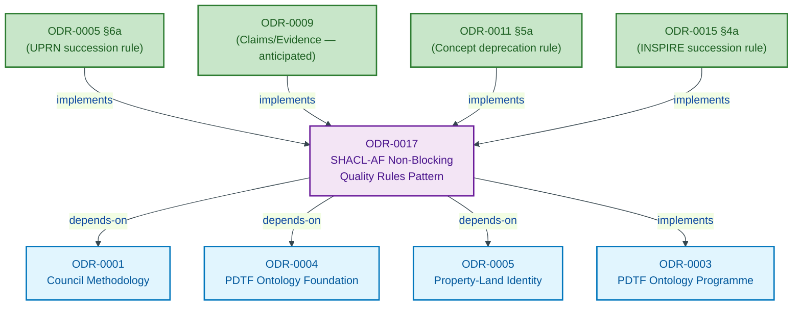

# SHACL-AF Non-Blocking Data-Quality Rules

## Context

A pattern has emerged across four `kind: pattern` ODRs ratified through 2026-05-27: each authored a SHACL-AF rule (`sh:rule` / `sh:sparql`) that materialises a non-blocking data-quality assertion — succession, deprecation, lineage — into the validation report at `sh:Info` or `sh:Warning` severity, NOT as `sh:Violation`. The data being asserted is correct under its temporal or contextual scope (UPRN succession is administrative; deprecation is a lifecycle state; INSPIRE succession is rare-but-real); the rule is *informative*, not *normative-breaking*.

The four citing sites:

1. **[ODR-0005 §6a](./ODR-0005-property-land-identity-crux.md#6a-uprn-succession--shacl-rule-materialisation-s005-q4--cagle-amendment)** — UPRN succession chain (Cagle Q4 amendment, S005). Materialises `opda:previousUPRN` → `opda:uprn` chain at `sh:Info`; rebuts Hellmann et al. (DBpedia 2017) LLM-fallback-to-`owl:sameAs` failure mode for identifier succession.
2. **ODR-0009 (Claims, Evidence & Provenance — when S009 runs).** Anticipated: PROV-O Activity reification + `prov:wasDerivedFrom` chain materialisation for evidence-collection events.
3. **[ODR-0015 §4a](./ODR-0015-address-and-geography.md#4a-external-alignment-s015-q4)** — INSPIRE Identifier / OS AddressBase succession (S015 Q4); re-instantiates the §6a pattern for the Address Kind's contingent identifier (per S005's Quality-on-Substance-Kind precedent).
4. **[ODR-0011 §5a](./ODR-0011-enumeration-vocabularies.md#5a-three-case-lifecycle-discipline--cagle-shacl-af-deprecation-rule-s011-q5)** — Concept deprecation-chain (Cagle Q5 amendment, S011). Materialises `owl:deprecated true` + `dct:isReplacedBy` chain at `sh:Info` (with-succession) or `sh:Warning` (without-succession).

Per ODR-0001 A9 §Artefact identity test — the fourth-citing-site threshold for `pattern`-extraction is satisfied. S011 §Consequences flagged the spawn-rule as fired. This ODR extracts the pattern as a reusable artefact-engineering decision; the four citing sites become `implements:` of it; future SHACL-AF rule authoring re-instantiates the pattern rather than re-deciding the discipline per ODR.

The pattern is `kind: pattern` per ODR-0001 A9 §What an ODR records (a)/(b)/(c) discipline: UFO/DOLCE meta-category (Method/plan code per ODR-0011 §8a — the rule is a *procedural plan* for materialising data-quality assertions), IC over named hard cases (rule severity; rule placement in graph; rule consumption by tooling), artefact realisation (`sh:rule` / `sh:sparql` SHACL-AF Turtle template).

## Decision

The diagram below illustrates how a SHACL-AF non-blocking rule routes a data-quality assertion to `sh:Info`/`sh:Warning` rather than `sh:Violation`, contrasting it with ordinary normative-blocking SHACL constraints.



Adopt the **SHACL-AF non-blocking data-quality rules pattern** as the canonical mechanism for materialising data-quality assertions that are *informative, not normative-breaking*: a `sh:rule` (or `sh:sparql` form) on the targeted class, returning the assertion's value via `SELECT $this ?fact …`, with `sh:severity sh:Info` (state-with-substantive-succession) or `sh:Warning` (state-without-succession), placed in the shapes graph (`opda-shapes.ttl` per ODR-0004 §3a). The rule's output is **machine-consumable data** — read by SHACL validators, LLM tooling (per Hellmann et al. DBpedia 2017 LLM-fallback rebuttal), `odr-review` lint extensions, audit-trail consumers. The rule is **never** `sh:Violation` severity (Violation is reserved for normative-breaking; the assertions this pattern materialises are correct under their temporal/contextual scope).

## Rules

These rules constrain every `implements:` of this pattern.

1. **`sh:rule` or `sh:sparql` form.** The rule is authored as either a `sh:Rule` (SHACL Advanced Features Recommendation §2) or a `sh:sparql` constraint with `sh:select` body (SHACL Core §5.2.6 SPARQL-based constraints). Both forms admissible; choice depends on whether the materialised triples need to enter the data graph (use `sh:Rule`) or only the validation report (use `sh:sparql`).
2. **Severity at `sh:Info` or `sh:Warning`, NEVER `sh:Violation`.** The data is correct; the rule is informative. `sh:Info` for assertions with substantive succession recorded (`prov:wasDerivedFrom` / `dct:isReplacedBy` chains present). `sh:Warning` for assertions without substantive succession (deprecation-without-replacement; retirement-without-successor).
3. **Placement in shapes graph (`opda-shapes.ttl`).** Per ODR-0004 §3a three-graph separation, the rule lives in the shapes graph, NOT the annotation graph (`opda-annotations.ttl`). The CI test `ASK { GRAPH opda:annotations { ?s a sh:NodeShape } }` returns false; this rule's `sh:NodeShape` declaration is in `opda:shapes`.
4. **`SELECT $this ?fact ?succession` SPARQL skeleton.** The rule's SPARQL body returns at minimum the target node (`$this`) and the materialised assertion. The `sh:message` template references the captured variables for human-readable reporting AND machine-readable downstream parsing.
5. **`sh:message` is machine-parseable.** The message template uses `{?var}` placeholders that the SHACL validator interpolates; downstream tooling (LLM consumers, lint extensions) parses the rendered message to extract the structured assertion. AVOID natural-language paragraphs in `sh:message`; PREFER structured key-value or template-literal form.
6. **No `owl:sameAs` materialisation.** A non-blocking data-quality rule MUST NOT produce `owl:sameAs` triples (inherits ODR-0005 Rule 5 anti-pattern — `owl:sameAs` propagates irreversibly under reasoning). Materialise via `prov:wasDerivedFrom`, `dct:isReplacedBy`, `skos:exactMatch`, or `opda:identifiesSameProperty` per the consuming ODR's discipline.
7. **Consuming ODR cites this pattern via `implements:`.** Each consuming ODR declares `implements: [..., ODR-0017]` in its frontmatter (alongside its other `implements:` of ODR-0003). The `## References` section cites this ODR's pattern URL for the authoring discipline.

### Operational specifications

#### 1a. Canonical template (SHACL-AF rule form)

```turtle
opda:<DomainQuality>NonBlockingRule a sh:NodeShape ;
    sh:targetClass <opda:TargetKind> ;
    sh:sparql [
        sh:select """
            SELECT $this ?currentFact ?priorFact WHERE {
                $this <opda:currentPredicate> ?currentFact .
                OPTIONAL { $this <opda:priorPredicate> ?priorFact }
            }
        """ ;
        sh:severity sh:Info ;     # sh:Warning if no substantive succession
        sh:message "{$this} <opda:domain-quality-relationship> {?currentFact} ← {?priorFact} (where defined)"
    ] .
```

Per ODR-0004 §3a three-graph separation: the rule sits in `opda-shapes.ttl`; the data graph (e.g. `opda-instances.ttl` or per-Property graphs) carries the data the rule reads; the validation report is the rule's output channel.

#### 2a. Three-tier severity decision rule

| Rule fires | Severity | Use case |
|---|---|---|
| Quality state with substantive succession (`prov:wasDerivedFrom` / `dct:isReplacedBy` chain present + dereferenceable predecessor) | `sh:Info` | UPRN succession with reified event (ODR-0005); deprecation-with-successor (ODR-0011); INSPIRE feature re-issue (ODR-0015) |
| Quality state without substantive succession (deprecation/retirement standalone; lineage absent) | `sh:Warning` | EPC band retirement without replacement (hypothetical ODR-0011 case); orphan UPRN (rare) |
| Quality state under normative-breaking (would corrupt downstream consumer) | NEVER this pattern | Use ordinary `sh:Violation` SHACL Core constraint instead — the assertion is normative, not informative |

The following flowchart traces the evaluation path of a single SHACL-AF rule instance from the shapes graph through the validator to its downstream consumers.



#### 3a. Machine-consumability requirement

Per Hellmann et al. (DBpedia 2017) LLM-fallback rebuttal (Cagle S005 §6a + S011 §5a citations): the rule's output MUST be machine-parseable by:

1. **SHACL validators** (the canonical consumer — produces `sh:ValidationReport` triples; consumer queries `sh:resultMessage` and `sh:focusNode`).
2. **`odr-review` lint extensions** — reads the rule's source from `opda-shapes.ttl`; verifies severity is in {`sh:Info`, `sh:Warning`} (rejects `sh:Violation`); verifies placement in shapes graph; verifies `sh:message` template uses placeholder form.
3. **LLM tooling** — queries the validation report for `sh:resultMessage` literals; parses the structured template form for the non-blocking-quality assertion content; substitutes the assertion for `rdfs:comment`-based natural-language fallback (which Hellmann et al. documented as failing on rename/paraphrase/translation).
4. **Audit-trail consumers** — read the `sh:Info`/`sh:Warning` entries as data-quality lineage records; correlate with the data graph's reified event resources.

#### 4a. UFO/DOLCE meta-category — Method/plan code (A9 (a) discharge)

Per ODR-0011 §8a's seven-category UFO framework, this pattern is a **Method/plan code** — the SHACL-AF rule is a *procedural plan* for materialising a data-quality assertion into the validation report. The plan is reusable across domains (UPRN succession; deprecation; INSPIRE re-issue; future Person-ID succession). The plan's executor is the SHACL-AF-aware validator (the canonical consumer); other consumers (lint, LLM, audit) read the executed plan's output.

`dct:source` on the UFO category: Guizzardi & Wagner 2010 (action-modelling / method-codes in UFO-A) + Guizzardi 2005 Ch. 4 + ODR-0011 §8a (Council-authored SKOS-binding) + ODR-0017 (this pattern's plan-code specialisation).

#### 5a. IC over named hard cases (A9 (b) discharge)

A SHACL-AF non-blocking-data-quality rule `r₁` at time `t₁` and a candidate-individual rule `r₂` at time `t₂ > t₁` are the same individual iff (i) their `sh:targetClass` is the same; (ii) their `sh:select` SPARQL body is structurally equivalent (same WHERE-clause patterns modulo variable renaming); (iii) their severity is the same. Under the following hard cases:

1. **Rule extension.** A rule's SPARQL body gains a new OPTIONAL clause without changing the existing patterns → same individual (extension preserves identity).
2. **Severity adjustment.** A rule's severity changes between `sh:Info` ↔ `sh:Warning` → same individual (severity tier is a refinement, not an identity change). Severity changing to `sh:Violation` → rule ceases to exist under this pattern; a new (non-pattern) SHACL constraint replaces it.
3. **Target-class change.** Rule's `sh:targetClass` changes → new individual; `prov:wasDerivedFrom` chains the new rule to the predecessor.
4. **Message-template refinement.** The `sh:message` template is rephrased without changing variable references → same individual.
5. **Graph relocation.** Rule moves from one shapes graph to another (e.g. extracted from one ODR's profile shapes into a shared shapes module) → same individual; the move is `dct:isReplacedBy` (in the OLD location's deprecation) + `prov:wasGeneratedBy` (in the new location's instantiation).

#### 6a. Artefact realisation (A9 (c) discharge)

The artefact realisation is the Turtle SHACL-AF rule above (§1a), placed in `opda-shapes.ttl` per ODR-0004 §3a. The rule is emitted by the generator (per ODR-0004 §6a deterministic-emission discipline) reading from a rule-source declaration; the rule's structure follows the §1a template; the generator MAY parameterise the rule via inputs (target-class, predicates, severity) so each `implements:` site supplies only the parameters, not the full Turtle.

## Alternatives

The diagram below maps each considered alternative to the decision driver that disqualified it, with the chosen pattern shown as the accepted outcome.



- **Materialise data-quality assertions in the annotation graph (`opda-annotations.ttl`).** Rejected per ODR-0004 §3a CI test 1 (`ASK { GRAPH opda:annotations { ?s ?p ?o . FILTER(STRSTARTS(STR(?p), "shacl-prefix")) } }` must return false). SHACL rules in the annotation graph break the three-graph separation; LLM consumers querying the annotation graph would receive shape-graph content as if it were advisory annotations, corrupting both layers.
- **Use OWL reasoning + `owl:propertyChainAxiom` to materialise the succession chain.** Rejected per ODR-0005 Rule 5 anti-pattern (no `owl:sameAs`-equivalent propagation across contexts). OWL property chains produce inferred triples that propagate irreversibly under reasoning; the use case is *informative* materialisation, not normative-equivalence assertion.
- **Encode the data-quality assertion in `rdfs:comment` only.** Rejected per Hellmann et al. (DBpedia 2017) LLM-fallback failure mode — natural-language `rdfs:comment` is consumed by LLM heuristics, which fail on rename/paraphrase/translation. The structured SHACL-AF rule is the mechanically-readable substitute.
- **Bake the rule into each consuming ODR without `pattern`-extraction.** Rejected by ODR-0001 A9 §Artefact identity test fourth-citing-site threshold — the pattern has crossed the threshold for shared abstraction; baking it into each ODR creates four parallel-but-divergent rule authorings, and a future maintainer cannot extract the common discipline.

## Consequences

- **Four-site `implements:` retrofitting.** ODR-0005 §6a, ODR-0009 (when S009 ratifies its PROV-O rule), ODR-0015 §4a, ODR-0011 §5a all add `ODR-0017` to their `implements:` frontmatter and cite this pattern in their `## References`. The retrofit is a follow-up author-only edit; flagged as housekeeping for the next /loop fire or Queen-convened session.
- **A9 pressure-test continues to operate.** This is the first `kind: pattern` ODR that is itself a pattern-extraction record (not a domain-modelling pattern). The (a)/(b)/(c) discipline applies; this ODR discharges all three (Method/plan code UFO category; five named hard cases for rule identity; Turtle template artefact).
- **`odr-review` lint extension.** Beyond the existing planned extensions (per ODR-0004 §Consequences), the lint should verify: any SHACL-AF rule declaring `sh:Info` or `sh:Warning` severity is `implements: ODR-0017`; conversely, any ODR `implements: ODR-0017` MUST place its SHACL-AF rule in `opda-shapes.ttl` (not annotation graph) AND MUST use the §1a template structure.
- **Future succession patterns.** ODR-0006 (Agents & Roles, Phase 3a) may produce a fifth citing site (e.g. NI-number renumbering; passport-renewal succession for Person identity). When it does, ODR-0017 is the canonical pattern to `implements:`; the new rule re-instantiates the template rather than re-deciding the discipline.
- **Namespace block carries.** ODR-0017 stays `status: proposed` per inherited ODR-0004 namespace block. Generator output for the rule's `opda:` declarations carries `dct:status "draft"` until WG ratifies the namespace string.

## References

- **Methodology**: [ODR-0001 §What an ODR records (per-kind discipline)](./ODR-0001-linked-data-council-methodology.md) — A9 amendment 2026-05-27; §Artefact identity test (the fourth-citing-site threshold this ODR satisfies); [ODR-0011 §8a](./ODR-0011-enumeration-vocabularies.md#8a-ufo-meta-category-per-scheme--seven-category-framework-s011-q8--b3-pilot-typed-output) (Method/plan code UFO category source).
- **Foundation**: [ODR-0004 §3a](./ODR-0004-pdtf-ontology-foundation.md#3a-three-graph-separation--source-graphs-derived-consumer-profiles-ci-test-s004-q3) (three-graph separation — shape lives in `opda-shapes.ttl`); §6a (generator-first deterministic-emission discipline).
- **W3C / spec**: SHACL Core Recommendation §5.2.6 (SPARQL-based constraints); SHACL Advanced Features (`sh:rule`, `sh:Rule`) — W3C Working Group Note; SHACL Core §6.5 (severity); PROV-O Recommendation (Moreau & Missier 2013); RDF 1.1 Semantics (Hayes & Patel-Schneider 2014) §6 (`owl:sameAs`).
- **Foundational ontology**: Guizzardi 2005 *Ontological Foundations* Ch. 4 (UFO Method/plan codes); Guizzardi & Wagner 2010 (action-modelling).
- **AI-RDF citation**: Hellmann et al. 2017 *DBpedia 2017 release notes* — LLM fallback to `owl:sameAs` / heuristic class-name matching when assertions are in `rdfs:comment` only.
- **Citing sites (`implements:` retrofit pending)**:
  - [ODR-0005 §6a](./ODR-0005-property-land-identity-crux.md#6a-uprn-succession--shacl-rule-materialisation-s005-q4--cagle-amendment) — UPRN succession-chain rule (Cagle S005 Q4 amendment).
  - [ODR-0009](./ODR-0009-claims-evidence-provenance.md) — PROV-O Claims/Evidence rule (anticipated when S009 ratifies).
  - [ODR-0015 §4a](./ODR-0015-address-and-geography.md#4a-external-alignment-s015-q4) — INSPIRE / OS AddressBase succession (S015 Q4).
  - [ODR-0011 §5a](./ODR-0011-enumeration-vocabularies.md#5a-three-case-lifecycle-discipline--cagle-shacl-af-deprecation-rule-s011-q5) — Concept deprecation-chain rule (Cagle S011 Q5 amendment).
- **Council deliberation provenance**: spawned by [session-011](./council/session-011-enumeration-vocabularies.md) §Synthesis + §Consequences (fourth-citing-site spawn-rule fires); authored as Author-only follow-up to S011's closure per ODR-0001 §Self-amendment process + §Artefact identity test.
- **Related ODRs**: programme anchor [ODR-0003](./ODR-0003-pdtf-ontology-programme.md); methodology [ODR-0001](./ODR-0001-linked-data-council-methodology.md) §What an ODR records (per-kind discipline for `kind: pattern`).

The graph below shows ODR-0017's dependency and implementing relationships as declared in the frontmatter.


