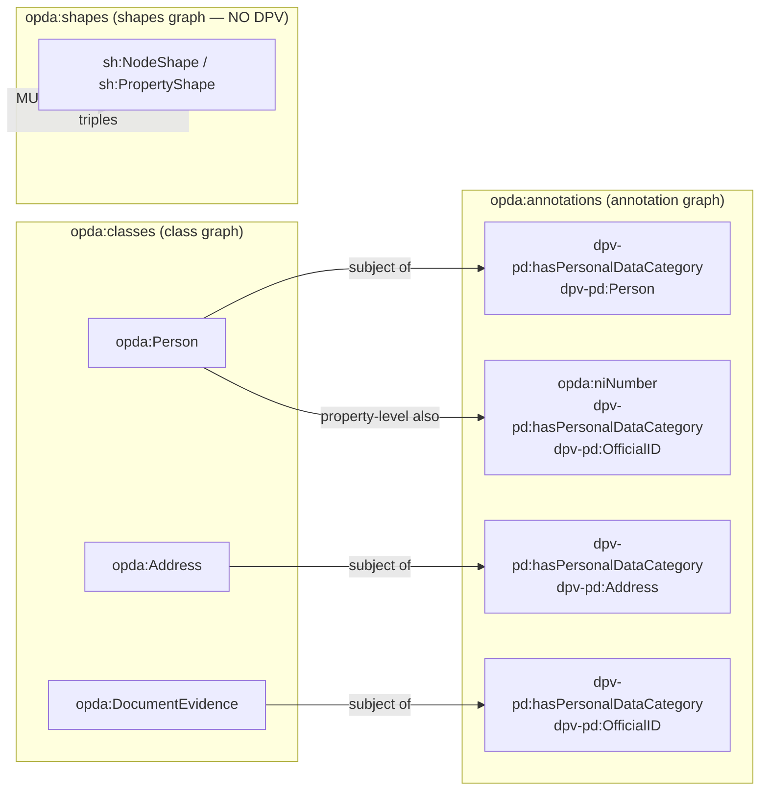
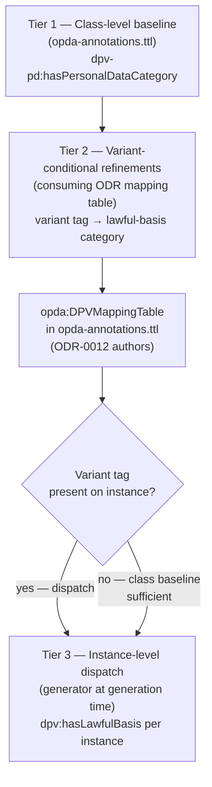
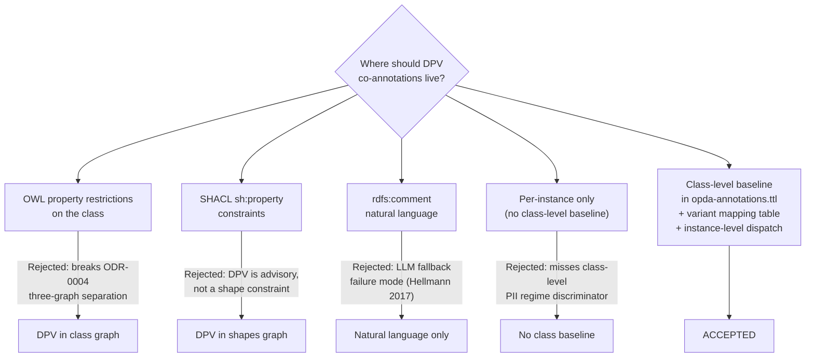
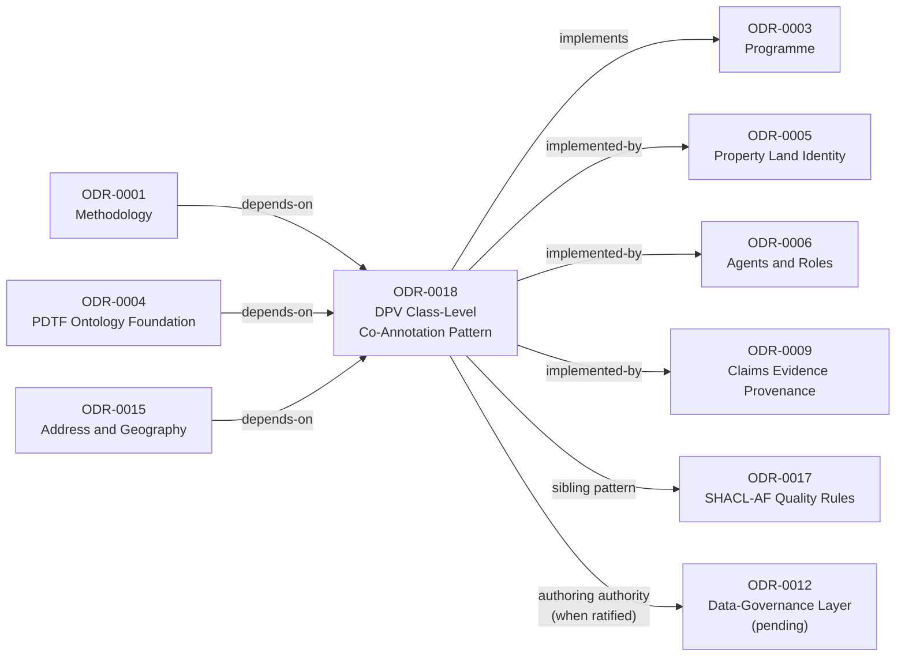

# DPV Class-Level Co-Annotation Pattern

## Context and Problem Statement

A pattern has emerged across four `kind: pattern` ODRs ratified through 2026-05-27: each established that **DPV (Data Privacy Vocabulary) co-annotations attach at the CLASS level** of OPDA Substance Kinds carrying PII, with **variant-conditional refinements at the instance level**. The pattern's contract is reusable: a `kind: pattern` ODR declares its PII-bearing Kinds + their distinguishing variants/sub-kinds; ODR-0012 (Data-Governance Layer; pending) authors the class-level baseline DPV co-annotations + variant-conditional lawful-basis refinements; instance-level lawful-basis lands at generation time.

Per ODR-0001 A9 §Artefact identity test fourth-citing-site threshold, the pattern crosses the extraction-bar. The four citing sites:

1. **[ODR-0005 §3c](./ODR-0005-property-land-identity-crux.md#3c-ic-for-opdaregisteredtitle-over-five-named-hard-cases-s005-q3)** — Pandit's Q3+Q5 amendments: `opda:RegisteredTitle` carries published-personal-data PII regime under HMLR open-register (ICO public-task lawful basis); `opda:LegalEstate` private until registration. PII regime distinction is a class-level discriminator.
2. **[ODR-0015 §7a](./ODR-0015-address-and-geography.md#7a-pii-tagging-s015-q7)** — Class-level `dpv-pd:Address` baseline on `opda:Address` Kind + three variant-conditional refinements (`title` → PublicTask HMLR; `marketing` → Consent/LegitimateInterest; `inspire` → PublicTask INSPIRE Directive).
3. **[ODR-0006 §Q1 + Q4 amendments](./ODR-0006-agents-and-roles.md)** — Pandit's amendment: Person identifier predicates carry DPV co-annotation at **property level** (each `niNumber`/`passportNumber`/`driverLicence` etc. as `dpv-pd:OfficialID`) AND at **class level** (`opda:Person` bears the aggregate baseline). Organisation: `opda:Organisation` published-PII when sole-trader/individual-director.
4. **[ODR-0009 §Q6 pointer](./ODR-0009-claims-evidence-provenance.md#q6--dpv-co-annotation-seam)** — Evidence subclasses (DocumentEvidence / ElectronicRecordEvidence / VouchEvidence) carry class-level DPV baseline; instance-level lawful-basis varies (regulated-profession → PublicTask; statutory → LegalObligation; private grant → Consent).

This ODR extracts the pattern. The four citing sites retrofit `implements: [ODR-0003, ODR-0018]`. ODR-0012 (Data-Governance Layer) when ratified will be the canonical *authoring authority* for DPV co-annotations following this pattern.

The pattern is `kind: pattern` per A9; it discharges (a)/(b)/(c) inline per A9 §Per-kind discipline.

### RDF graph: DPV annotations co-attaching at class level

The diagram below shows how class-level, variant-conditional, and property-level DPV triples all land in `opda-annotations.ttl`, separate from the class graph and the shapes graph.



## Considered Options

* **Option A (chosen) — Class-level `dpv-pd:hasPersonalDataCategory` baseline in `opda-annotations.ttl` + variant-conditional mapping table + instance-level lawful-basis dispatch.** The canonical pattern extracted as a reusable artefact from four citing sites.
* **Option B — DPV co-annotations as OWL property restrictions on the class.** Rejected: would put DPV triples in the class graph, breaking ODR-0004 §3a three-graph separation; DPV is advisory annotation, not class-graph reasoning material.
* **Option C — DPV co-annotations as SHACL `sh:property` constraints.** Rejected: would put DPV triples in the shapes graph; DPV co-annotations are NOT shape constraints (they don't validate; they advise).
* **Option D — DPV co-annotations as `rdfs:comment` natural-language.** Rejected per Hellmann et al. (DBpedia 2017) LLM-fallback failure mode. Same lesson as ODR-0005 §6a + ODR-0011 §5a: structured machine-readable annotations > natural-language commentary.
* **Option E — Per-instance-only DPV annotations (no class-level baseline).** Rejected: misses the class-level discriminator (S005 §3c PII regime distinction; S006 Q1 Person identifier aggregate). Instance-only requires LLM consumers to aggregate per-instance triples to derive class-level PII regime; class-level baseline gives the regime as data.

## Decision Outcome

Chosen option: "Class-level `dpv-pd:hasPersonalDataCategory` baseline in `opda-annotations.ttl`", because only this placement gives LLM and tooling consumers the class-level PII discriminator as structured data (ODR-0004 three-graph separation, Hellmann 2017 LLM-fallback rebuttal) and the fourth-citing-site threshold requires extraction as a shared artefact.

Adopt the **DPV class-level co-annotation pattern** as the canonical mechanism for attaching `dpv-pd:` and `dpv:` annotations to OPDA Substance Kinds carrying PII: each PII-bearing Substance Kind class carries a **class-level `dpv-pd:hasPersonalDataCategory`** triple declaring the aggregate PII regime; **variant-conditional refinements** track distinguishing sub-kinds or variants (e.g. Address-variant; Evidence-subtype; Title-vs-Estate registration state) that drive **lawful-basis-trigger differences**; instance-level `dpv:hasLawfulBasis` lands at generation time, dispatched from the variant tag. Co-annotations live in `opda-annotations.ttl` per ODR-0004 §3a (advisory annotations, NOT shape constraints — they do not belong in the shapes graph).

### Consequences

* **Four-site `implements:` retrofitting.** ODR-0005 §3c, ODR-0015 §7a, ODR-0006 §Q1+Q4, ODR-0009 §Q6 all add `ODR-0018` to their `implements:` frontmatter and cite this pattern in their `## References`. The retrofit is a follow-up housekeeping task; flagged for next /loop fire.
* **A9 pressure-test passes.** This is the second `kind: pattern` ODR that is itself a pattern-extraction record (after ODR-0017 SHACL-AF). The (a)/(b)/(c) discipline applies; this ODR discharges all three (UFO Quality category; five named hard cases for co-annotation identity; Turtle template in annotation graph).
* **ODR-0012 (Data-Governance Layer) inherits this pattern as authoring contract.** When S012 ratifies, ODR-0012 §Rules will reference ODR-0018 as the canonical mechanism + author the actual DPV triples + variant mapping tables.
* **`odr-review` lint extension.** Beyond existing planned extensions: any ODR declaring PII-bearing Kinds + variants MUST `implements: [..., ODR-0018]` if it follows the class-level co-annotation pattern; any DPV annotation MUST be in `opda-annotations.ttl` (CI test enforces).
* **Namespace ratified; record `accepted`.** The inherited ODR-0004 namespace block is lifted (the `opda:` string was ratified 2026-05-27 — greenfield; no WG), so ODR-0018 is `accepted`. Generator output may still carry `dct:status "draft"` as a publication-grade marker, independent of record ratification.

### Three-tier co-annotation pattern structure

This flowchart maps the three tiers of the pattern: a class-level baseline, variant-conditional refinements, and instance-level lawful-basis dispatch at generation time.



## More Information

- **Methodology**: [ODR-0001 §What an ODR records (per-kind discipline)](./ODR-0001-linked-data-council-methodology.md) — A9 amendment 2026-05-27; §Artefact identity test (fourth-citing-site threshold this ODR satisfies); [ODR-0011 §8a](./ODR-0011-enumeration-vocabularies.md#8a-ufo-meta-category-per-scheme--seven-category-framework-s011-q8--b3-pilot-typed-output) (UFO Quality category source).
- **Foundation**: [ODR-0004 §3a](./ODR-0004-pdtf-ontology-foundation.md#3a-three-graph-separation--source-graphs-derived-consumer-profiles-ci-test-s004-q3) (three-graph separation — annotation graph for DPV); §7a (term-sourcing five-line precedence — verbatim regulator citation).
- **W3C / spec**: DPV Specification (Pandit et al. 2024 DPV 2.0); DPV-PD (Personal Data) module; GDPR Art. 5 + Art. 6 + Art. 9; ICO *Guidance on Public Authorities Lawful Bases* (2023).
- **Foundational ontology**: Guizzardi 2005 Ch. 4 (UFO Quality); Masolo et al. 2003 D18 §4.3 (DOLCE Quality / Quale).
- **AI-RDF citation**: Hellmann et al. 2017 DBpedia 2017 — LLM fallback when annotations are in `rdfs:comment` only.
- **Citing sites (`implements:` retrofit pending)**:
  - [ODR-0005 §3c](./ODR-0005-property-land-identity-crux.md#3c-ic-for-opdaregisteredtitle-over-five-named-hard-cases-s005-q3) — RegisteredTitle published-PII regime.
  - [ODR-0015 §7a](./ODR-0015-address-and-geography.md#7a-pii-tagging-s015-q7) — Address baseline + three variant refinements.
  - [ODR-0006 §Q1+Q4](./ODR-0006-agents-and-roles.md) — Person identifier predicates (property-level + class-level); Organisation registration data.
  - [ODR-0009 §Q6](./ODR-0009-claims-evidence-provenance.md#q6--dpv-co-annotation-seam) — Evidence subclasses baseline + variant-conditional lawful basis.
- **Council deliberation provenance**: spawned by [session-009](./council/session-009-claims-evidence-provenance.md) §Synthesis (fourth-citing-site spawn-rule fires); authored as Author-only follow-up to S009's closure per ODR-0001 §Self-amendment process + §Artefact identity test.
- **Related**: programme anchor [ODR-0003](./ODR-0003-pdtf-ontology-programme.md); sibling pattern [ODR-0017](./ODR-0017-shacl-af-quality-rules-pattern.md) (SHACL-AF non-blocking-data-quality-rules — different pattern, same `kind: pattern` extraction discipline). Future authoring: [ODR-0012](./ODR-0012-data-governance-layer.md) (Data-Governance Layer — `implements: ODR-0018` when ratified; consumes mapping tables + authors DPV triples).
## Rules

These rules constrain every `implements:` of this pattern.

1. **Class-level baseline MUST be declared.** Every PII-bearing Kind class declares its baseline `dpv-pd:hasPersonalDataCategory` triple. Example: `opda:Person dpv-pd:hasPersonalDataCategory dpv-pd:Person`; `opda:Address dpv-pd:hasPersonalDataCategory dpv-pd:Address`; `opda:DocumentEvidence dpv-pd:hasPersonalDataCategory dpv-pd:OfficialID`.
2. **Variant-conditional refinements MUST be authored when the consuming ODR identifies distinguishing variants.** Each variant maps to a specific DPV lawful-basis category. The mapping table is in the consuming ODR's §Operational specifications; ODR-0012 (when ratified) consumes the tables to author the annotation triples.
3. **`dpv-pd:` and `dpv:` annotations live in `opda-annotations.ttl`.** Per ODR-0004 §3a three-graph separation. The CI test `ASK { GRAPH opda:shapes { ?s ?p ?o . FILTER(STRSTARTS(STR(?p), "https://w3id.org/dpv")) } }` MUST return false — no DPV triples in the shapes graph.
4. **Property-level + class-level co-annotations are BOTH admissible** when the consuming ODR has predicates with distinguishing PII categories (ODR-0006 Person identifier predicates). Property-level annotation: `opda:niNumber dpv-pd:hasPersonalDataCategory dpv-pd:OfficialID`; class-level: `opda:Person dpv-pd:hasPersonalDataCategory dpv-pd:Person`. Both can coexist for one Kind.
5. **PII-regime-discriminating variant tags carry their own DPV triples** — when a variant tag (e.g. `addressVariant "title"`) discriminates a PII regime, the variant assignment in the data graph triggers the corresponding lawful-basis annotation at ODR-0012's generation time.
6. **`dct:source` on every DPV co-annotation** — resolves to the regulator's published text verbatim per ODR-0011 §4a (DPV-PD §Scope discipline). Paraphrase moves to `skos:scopeNote` per Pandit S011 Q4 amendment.
7. **ODR-0012 is the authoring authority.** Consuming ODRs declare the PII-bearing Kinds + variants + mapping tables; ODR-0012 authors the actual DPV triples + lawful-basis assignments. The consuming ODR's `## Rules` carries a one-paragraph pointer to ODR-0012 per S009 Q6 precedent.

### Operational specifications

#### 1a. UFO/DOLCE meta-category — Quality (A9 (a) discharge)

Per ODR-0011 §8a's seven-category UFO framework, this pattern is operationally a **Quality** (UFO Quality particularising a Substance Kind) — DPV categories are *qualities of* the PII-bearing data; the lawful-basis assignment is a *value* the Quality takes; the variant tag is a *particularisation* of the Quality within the bearer Kind.

`dct:source` on the UFO category: Guizzardi 2005 Ch. 4 (UFO Quality) + Masolo et al. 2003 D18 §4.3 (DOLCE Quality / Quale) + ODR-0015 §2a precedent (`opda:addressVariant` as UFO Quality particularising `opda:Address`) + ODR-0018 (this Council-authored DPV-Quality binding).

#### 2a. IC over named hard cases (A9 (b) discharge)

A class-level DPV co-annotation `a₁` for Kind `K` at time `t₁` and a candidate-individual co-annotation `a₂` at time `t₂ > t₁` are the same individual iff (i) the bearing Kind `K` is the same; (ii) the `dpv-pd:hasPersonalDataCategory` value is the same OR refined under SKOS-broader (`dpv-pd:Person broader dpv-pd:DataSubject`); (iii) the variant-mapping table is preserved (refinement of variants ADMITS new mappings; removing existing mappings = new individual).

Five hard cases:

1. **DPV category broadened.** A class's baseline moves from `dpv-pd:Address` to `dpv-pd:LocationData` (broader) → same individual (broader inherits narrower).
2. **DPV category narrowed.** Moves from broader to narrower → NEW individual; `prov:wasDerivedFrom` to predecessor.
3. **Variant added.** New `addressVariant` value introduced → same individual; variant table extends; new lawful-basis row added.
4. **Variant retired.** Existing variant marked `owl:deprecated true` per ODR-0011 §5a + ODR-0017 deprecation-rule pattern → same individual; deprecated variant's lawful-basis row retained for historical-data dereferenceability.
5. **DPV vocabulary version bump.** DPV CG publishes new version with renamed category → same individual; `dct:source` updates to new version-pinned URL; old version-pinned reference moves to `dct:isReferencedBy`.

#### 3a. Artefact realisation (A9 (c) discharge)

The artefact realisation is a Turtle template placed in `opda-annotations.ttl`:

```turtle
# Class-level baseline (in opda-annotations.ttl, NOT opda-shapes.ttl)
opda:Person
    dpv-pd:hasPersonalDataCategory dpv-pd:Person ;
    dct:source <https://w3id.org/dpv/pd> .

# Variant-conditional refinement (mapping table)
opda:AddressVariantLawfulBasisMap a opda:DPVMappingTable ;
    opda:mapsKind opda:Address ;
    opda:mapsVariantPredicate opda:addressVariant ;
    opda:mappingEntry [
        opda:variantValue "title" ;
        opda:lawfulBasis dpv:PublicTask ;
        dct:source <https://www.gov.uk/government/organisations/land-registry>
    ] , [
        opda:variantValue "marketing" ;
        opda:lawfulBasis dpv:Consent ;
        dct:source <https://ico.org.uk/for-organisations/guide-to-data-protection/>
    ] , [
        opda:variantValue "inspire" ;
        opda:lawfulBasis dpv:PublicTask ;
        dct:source <https://eur-lex.europa.eu/legal-content/EN/TXT/?uri=CELEX:32007L0002>
    ] .
```

The generator (per ODR-0004 §6a deterministic-emission discipline) reads the mapping table and emits per-instance `dpv:hasLawfulBasis` triples at generation time, dispatching from the variant tag.

#### 4a. Three-graph separation (CI test)

Inherits ODR-0004 §3a discipline. The CI test additions:

1. `ASK { GRAPH opda:shapes { ?s ?p ?o . FILTER(STRSTARTS(STR(?p), "https://w3id.org/dpv")) } }` MUST return false.
2. `ASK { GRAPH opda:annotations { ?s ?p ?o . FILTER(STRSTARTS(STR(?p), "https://w3id.org/dpv")) } }` MUST return true (DPV triples present in annotation graph).
3. `ASK { GRAPH opda:classes { ?s ?p ?o . FILTER(STRSTARTS(STR(?p), "https://w3id.org/dpv")) } }` MUST return false (DPV triples NOT in the class graph either — they are advisory, not class-graph-axioms).

### Alternatives considered and the chosen outcome

This flowchart traces the four rejected options and the single accepted path, matching the `## Alternatives` section below.



### ODR dependency graph

This diagram reflects the `depends-on`, `implements`, and `supersedes` frontmatter relationships declared for this record.


