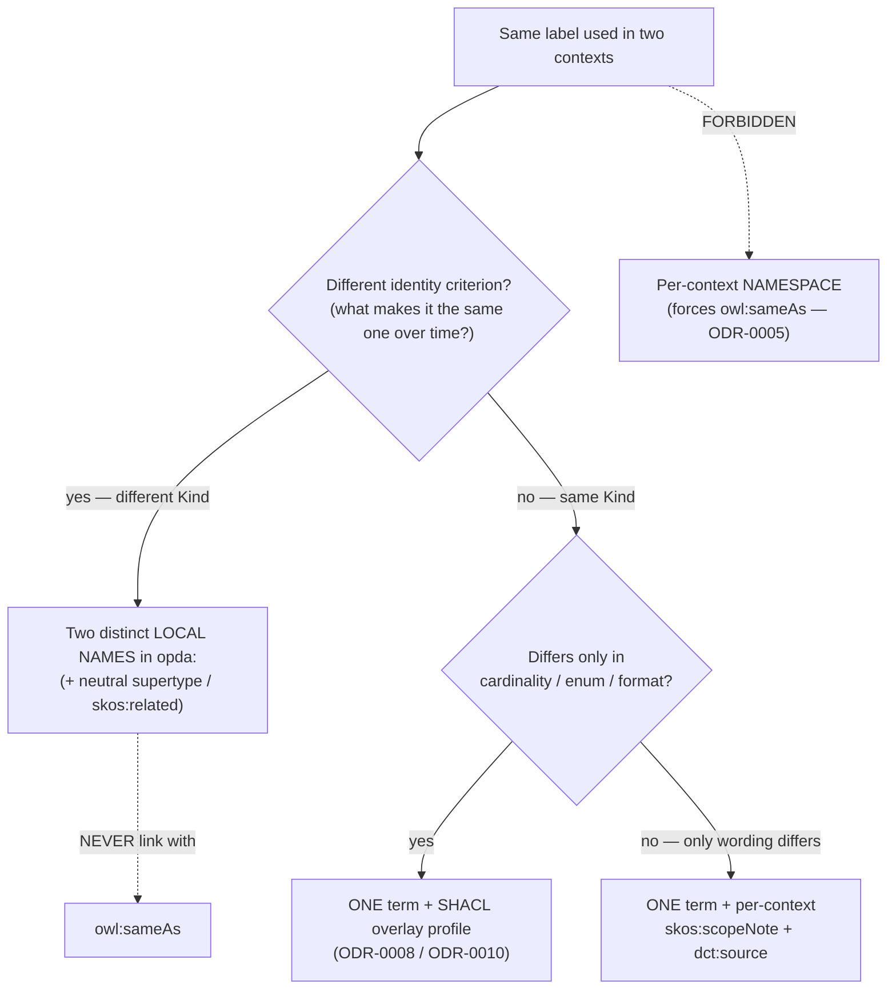
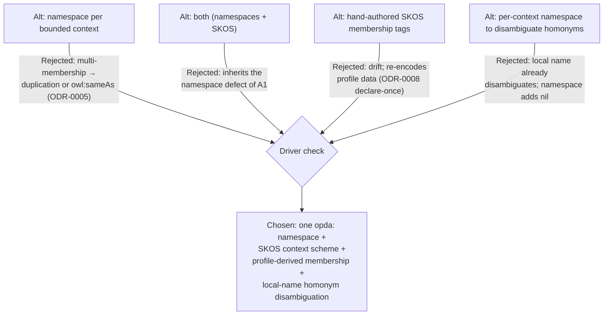

# Bounded-Context Representation

## Context

The UK property transaction is modelled as Domain-Driven Design **bounded contexts** — six primary industry contexts (Estate Agency, Conveyancing, Mortgage Lending, Surveying, Property Data Services, Property Technology), five upstream contexts (HMLR, Local Authority, MHCLG Material Information, Identity & Verification, Trust & Verifiable Claims) and two spanning concerns (Transaction lifecycle; Participants & roles). PDTF is their **Published Language** (`/modelling/bounded-contexts`). Two representation questions were open: (1) how to denote a term's bounded-context membership in the ontology — a separate namespace per context, SKOS, or both; and (2) how to disambiguate a term whose label carries **different meanings** in different contexts ("how do I say *this property as defined in Context A* vs *in Context B*?").

The answer is constrained by ratified foundations. The single `opda:` namespace was fixed 9-0 at Session 001 Q7 ([ODR-0004](./ODR-0004-pdtf-ontology-foundation.md)) — per-form/per-overlay namespaces were evaluated and rejected as "scatters one concept across many namespaces." `owl:sameAs` is forbidden for identity ([ODR-0005](./ODR-0005-property-land-identity-crux.md) Rule 5). Spanning leaves that recur across overlays collapse to **one** `opda:` term, with per-context variation pushed onto SHACL overlay profiles ([ODR-0008](./ODR-0008-property-descriptive-attributes.md) declare-once-reconcile-overlays; [ODR-0010](./ODR-0010-overlay-profile-mechanism.md)). The decisive empirical fact, surfaced during deliberation: **a single entity belongs to many bounded contexts** (`opda:Address` is used across ~10 contexts; one Participant plays role-typed parts in several). Because an IRI inhabits exactly one namespace string, per-context namespaces would force either duplicated classes or `owl:sameAs` to re-link them — both prohibited.

This ODR was deliberated as a two-round Linked Data Council ([session-019](./council/session-019-bounded-context-representation.md); Queen: Kendall (FIBO); Devil's Advocate: Davis; panel: Evans & Vernon, Gandon, Hendler, Baker, Cagle, Guizzardi). Both rounds returned **7–0**: round 1 rejected per-context namespaces and "both"; round 2 confirmed that homonyms are disambiguated by **local name, not namespace**. It is `kind: pattern` per [ODR-0001](./ODR-0001-linked-data-council-methodology.md) A9 — UFO meta-category (bounded context = a perspectival *community of practice*, a SKOS-classifiable non-rigid facet), identity criterion over named hard cases (`charge`, `valuation`), and an artefact realisation (the SKOS scheme + `opda:definedInContext` triple shape + the derivation rule).

## Decision

Adopt a **single-namespace + SKOS-context-scheme + profile-derived-membership** representation: keep the one `opda:` minting namespace; model the bounded contexts as a `skos:ConceptScheme` of `skos:Concept`s in `opda:`; derive each term's context membership from the existing SHACL overlay profiles (single source of truth) rather than hand-authoring it; and disambiguate a term that genuinely means different things in different contexts by minting **distinct local names in the one namespace** (governed by the Identity-Criterion test below), never by a distinct namespace — chosen because a bounded context is a perspective on shared terms, not a minting authority, so context-of-use is a many-to-many classification (multi-membership is the rule) while a namespace can only encode a single definition-home, and per-context namespaces would require the forbidden `owl:sameAs` to re-link the shared majority of terms.

## Rules

These rules are normative for all bounded-context representation in the OPDA ontology.

### 1. Single namespace — no per-context namespaces

All OPDA-minted terms live in the one `opda:` (`https://w3id.org/opda/#`) namespace, per [ODR-0004](./ODR-0004-pdtf-ontology-foundation.md). A bounded context MUST NOT be encoded as an IRI namespace/prefix (`estate-agency:`, `conveyancing:`, …). Rationale, load-bearing: an entity belongs to **many** contexts; a namespace encodes a single home; per-context namespaces therefore force duplication or `owl:sameAs` (forbidden, [ODR-0005](./ODR-0005-property-land-identity-crux.md) Rule 5). Modularity by *ontological concern* (the seven TTL module files sharing `opda:`) is unaffected — that is namespace-by-module-of-definition, which is sound; this rule forbids only namespace-by-context-of-use.

### 2. Bounded contexts as a SKOS scheme

Each bounded context is a `skos:Concept` (NOT an `owl:Class` — context membership is anti-rigid and perspectival; subclassing or typing would weld a perspective into rigid identity), organised by one `skos:ConceptScheme` in `opda:`. The scheme reuses the existing `opda:hasSteward` annotation property to carry steward plurality without namespace plurality.

```turtle
opda:PDTFBoundedContextScheme a skos:ConceptScheme ;
    skos:prefLabel "PDTF Bounded Contexts"@en ;
    opda:hasSteward "OPDA Architecture WG"@en .

opda:ConveyancingContext a skos:Concept ;
    skos:inScheme opda:PDTFBoundedContextScheme ;
    skos:prefLabel "Conveyancing"@en ;
    skos:definition "DDD bounded context for legal transfer of title."@en ;
    opda:hasSteward "Law Society / SRA"@en .
# … 12 more: EstateAgency, MortgageLending, Surveying, PropertyDataServices,
#   PropertyTechnology (6 industry); the 5 upstream; the 2 spanning.
```

### 3. Term→context membership is DERIVED, not hand-authored

Which terms serve which context is **derived** from the SHACL overlay profiles (the overlay a payload arrives through *is* its context: `piq`→Surveying, `fme1`→Mortgage Lending, `ta6`→Conveyancing). A generator-emitted SHACL-AF rule ([ODR-0017](./ODR-0017-shacl-af-quality-rules-pattern.md)) reads `opda:ValidationContext → opda:requires → <term>` and materialises `<term> opda:servesContext <context>` — a **generated view, never hand-edited**. The profiles are the single source of truth ([ODR-0008](./ODR-0008-property-descriptive-attributes.md) declare-once). Note: today `opda:overlaysContext` targets a profile-layer IRI (`profiles/foundation`), not an industry context; the derivation rule MUST map the profile-layer target onto the new `…Context` concepts of Rule 2. Hand-authored `dct:subject` membership is permitted **only** for a term that no profile references (a pure domain class with no overlay edge).

### 4. Homonym disambiguation — the Identity-Criterion decision rule

A shared **label** is not a shared **Universal**. Apply Guizzardi's OntoClean question — *"what makes it the same one over time?"* — and branch. **Identity lives in the local name, never the namespace.**

| # | Test outcome | Construct | Authority |
|---|---|---|---|
| (i) **Homonym** | Two readings have **different identity criteria** → two Kinds | **Two distinct LOCAL NAMES** in `opda:` (`opda:LegalCharge`, `opda:LocalLandCharge`); a neutral supertype where one IC is shared (`⊑ opda:RegisteredCharge`); `skos:related`/`skos:closeMatch` where none. **Mint two OWL classes ONLY here.** | Guizzardi IC test; Evans & Vernon homonymy rule |
| (ii) **Same Kind, divergent constraint** | One IC; contexts differ only in cardinality / enum / format | **ONE `opda:` term + a SHACL overlay profile per context.** No new term. | [ODR-0008](./ODR-0008-property-descriptive-attributes.md) + [ODR-0010](./ODR-0010-overlay-profile-mechanism.md) |
| (iii) **Same Kind, perspectival gloss** | One IC, one datatype; only emphasis/wording differs by context | **ONE `opda:` term + per-context `skos:scopeNote` + `dct:source`.** No new OWL class. | Baker concept-layer rule |

**Concept-layer firewall (Baker):** two SKOS concept-glosses do NOT compel two OWL classes. When the datatype is shared, stay at the concept layer — case (iii). Climb to two OWL classes only when a reasoner or SHACL must treat them as different Kinds — case (i). **Provenance short-circuit (Cagle):** the overlay disambiguates at validation time, so a consumer never meets a free-floating homonym on a single path; the profile binds the context-correct term before (i)–(iii) is consulted at runtime.

**UFO meta-category of the disambiguated terms** (per Guizzardi's OntoClean analysis — the literal categories that ground the IC test): a *valuation* is a **Relator/Mode** (a valuation result individuated by its generating activity and standard) → three **Substance Kind**s (`opda:MortgageValuation` / `opda:RedBookValuation` / `opda:AVMValuation`, all `⊑ opda:Valuation`) **only when** their lifecycles prove distinct identity criteria to a real consumer (today PDTF emits one `opda:Valuation`, which is correct restraint); *charge* spans a **Relator** (a legal encumbrance over the estate, `opda:LegalCharge`), a **Quality/Mode** (a monetary amount, `opda:Fee`), and a second **Relator** (the statutory `opda:LocalLandCharge`) → three Kinds. A bounded context itself is none of these — it is an anti-rigid, perspectival **Role**-like community of practice, which is exactly why it is a SKOS facet (Rule 2) and never a namespace, a subclass, or an identity-bearing term. Roles and phases are **not** new Kinds (Rule 8).

### 5. Term home & provenance — `rdfs:isDefinedBy` + `dct:source` (+ gated `dct:subject`); `opda:definedInContext` RETIRED

*Amended by [Council Session 022](./council/session-022-form-shacl-profile-convention.md) (2026-05-30; 6–0; council-ratified — greenfield, no WG) — supersedes the original `opda:definedInContext` design retained below for history.* S022 found `opda:definedInContext` **reinvents three published standards** and **retired it**, decomposing "a term's home" into three orthogonal axes, each a standard predicate:

- **(a) module-of-origin (ontological *concern*) → `rdfs:isDefinedBy`** → the owning module `owl:Ontology` IRI (RDFS §2.6). Always emitted; currently 0× in the corpus. NB OPDA's modules partition by *concern* (property/agent/claim/…), **NOT** by the six contexts — so this answers "which module defines it," not "which community owns it."
- **(b) provenance / source authority → `dct:source`** (+ `prov:wasAttributedTo`) — already emitted per term (verified: it points at ODR sections + legislation/EUR-Lex/OIDC, never a context).
- **(c) community-ownership → `dct:subject`** → a Rule 2 Context concept (DCMI aboutness) — **authored-or-absent, NEVER derived** (not from `dct:source`, not from `servesContext` degree — that would be the OntoClean level-confusion), and **gated** (Rule 8) to the non-derivable residue (genuine homonym / steward-disputed ownership), **empty today**.

No bespoke `opda:definedInContext` predicate is minted; `rdfs:isDefinedBy` cannot serve the community axis (its object is a *defining document*, not a community). Council provenance: [session-022], reversing [session-021]'s "author a generated home for every term" decision (S021 Queen Kendall retracted that chairing). `opda:servesContext` (usage) remains a derived dormant rule per [ODR-0020](./ODR-0020-bounded-context-scheme-and-mapping.md) Rule 5.

*Original S021/S020 design (RETIRED, retained for history):* `opda:definedInContext` (an `owl:AnnotationProperty`; object = a Rule 2 Context concept) records the context a term's definition originates in. Per-context definition is `rdfs:comment` + `dct:source`; per-context provenance of a payload is reinforced by `opda:profileURI` on the `ValidationContext`. "The term as defined in Context A" is answered by triples, never by parsing a prefix.

```turtle
opda:LegalCharge a owl:Class ; rdfs:subClassOf opda:RegisteredCharge ;
    rdfs:comment "Mortgage instrument securing a debt against the estate."@en ;
    opda:definedInContext opda:MortgageLendingContext ;
    dct:source <https://www.legislation.gov.uk/ukpga/2002/9> .   # LRA 2002

opda:LocalLandCharge a owl:Class ; rdfs:subClassOf opda:RegisteredCharge ;
    rdfs:comment "Encumbrance registered in the Local Land Charges Register."@en ;
    opda:definedInContext opda:ConveyancingContext ;
    dct:source <https://www.legislation.gov.uk/ukpga/1975/76> .  # LLCA 1975
```
```sparql
# "the charge AS DEFINED IN Conveyancing" — triples, not a namespace lookup
SELECT ?term ?def WHERE {
  ?term opda:definedInContext opda:ConveyancingContext ; rdfs:comment ?def .
}
```

### 6. Cross-term linking — SKOS mapping, never `owl:sameAs`

Disambiguated sibling terms relate by SKOS mapping — `skos:closeMatch` (lexical cousins, not identical), `skos:relatedMatch` (associative), `skos:broadMatch` (hierarchical) — or a neutral `rdfs:subClassOf` supertype where an IC is shared. `owl:sameAs` is forbidden ([ODR-0005](./ODR-0005-property-land-identity-crux.md) Rule 5); instance co-reference uses `opda:identifiesSameProperty`.

### 7. Naming convention

Disambiguation is carried by the **local name**, qualified by sense (`opda:registeredCharge` vs `opda:serviceCharge`; `opda:buildingRegulationsCompletion` vs `opda:completionAndMoving` — both already in PDTF). Context concepts use the `…Context` local-name suffix (`opda:ConveyancingContext`). The namespace never varies to disambiguate.

### 8. YAGNI activation gate

*Restored to its pre-S021 form and refined by [Council Session 022](./council/session-022-form-shacl-profile-convention.md) (2026-05-30; 6–0; council-ratified — greenfield, no WG). S021's "un-gate the bare `opda:definedInContext` home annotation" carve-out is **WITHDRAWN**: S022 found `definedInContext` reinvents three published standards and **retired it** (see Rule 5). There is no always-emitted home predicate to un-gate — recording a term's module-of-origin via `rdfs:isDefinedBy` is ordinary module hygiene (not gated, not polysemy machinery), and community-ownership via `dct:subject` is authored-or-absent under the gate below.*

Roles and phases stay ONE Kind ([ODR-0006](./ODR-0006-agents-and-roles.md)) — a *valuer* or a *withdrawn* valuation is a role/phase, not a new Kind. Context-scoped-definition machinery (per-context `skos:scopeNote` registries, SKOS-XL label resources, a sense register) is **ratified as a dormant pattern but MUST NOT be built** until **both**: (a) ≥3 attested same-label / contradictory-definition collisions exist that distinct local names cannot already separate; and (b) a named consumer needs a community-scoped home that the standard predicates of Rule 5 (`rdfs:isDefinedBy` + `dct:source` + a gated `dct:subject`) cannot already answer. Below that line the standing instruction is: mint two plainly-named terms, write two `rdfs:comment`s, stop. The corpus today attests **zero** genuine domain homonyms (duplicate-prefLabel: 0; the one same-label/two-definition dictionary hit is free-text boilerplate); PDTF already disambiguates at local-name grain.

### Anti-patterns

The flowchart routes a candidate "same term, two contexts" through the decision rule.



- **Never** put the bounded-context perspective in the IRI namespace (Rule 1).
- **Never** `rdfs:subClassOf` a context concept, nor type a term as a context (Rule 2 — context is a SKOS facet, not a Kind).
- **Never** `owl:sameAs` between homonym siblings or across contexts (Rule 6).
- **Never** hand-maintain term→context membership that a profile already implies (Rule 3).
- **Never** build polysemy machinery below the activation gate (Rule 8).

## Alternatives

The diagram maps each rejected option to its fatal flaw.



- **A separate namespace per bounded context.** Rejected 7–0: an entity belongs to many contexts, so per-context namespaces force duplicated terms or `owl:sameAs` (forbidden, [ODR-0005](./ODR-0005-property-land-identity-crux.md)); re-confirms the S001 Q7 / [ODR-0004](./ODR-0004-pdtf-ontology-foundation.md) namespace decision. FIBO's per-module namespaces track module-of-definition (one home), never context-of-use, so they argue *for* the by-concern TTL modules and *against* per-context prefixes.
- **Both (namespaces *and* SKOS).** Rejected 7–0: inherits A1's defect for nil benefit; the namespace half is the part that breaks.
- **Hand-authored SKOS membership tags.** Rejected as the primary mechanism: re-encodes the overlay→term facts the profiles already carry and drifts the moment an overlay moves context. Membership is **derived** (Rule 3); hand-tagging survives only as the profile-invisible exception.
- **Per-context namespace "to disambiguate" a homonym.** Rejected: an IRI is opaque (RFC 3986) and disambiguates on its whole string — a distinct **local name** gives a fully distinct identifier already; the namespace adds zero disambiguating power and re-imports the multi-membership break for the non-homonym majority.
- **Build per-context `skos:scopeNote` / SKOS-XL polysemy machinery now.** Rejected as YAGNI: ~0 genuine homonyms are attested; the pattern is ratified but gated (Rule 8).

## Consequences

- **Build now.** Emit `opda:PDTFBoundedContextScheme` and the 13 context concepts as SKOS reference data in `opda:`, reusing `opda:hasSteward` (Rule 2). Mint `opda:definedInContext` and `opda:servesContext` as `owl:AnnotationProperty` (membership, not logical typing).
- **Derive, gated.** Author the profile→context SHACL-AF derivation rule (`implements: ODR-0017`); it ships **dormant**, switched on only when Rule 8's gate clears. Re-point `opda:overlaysContext` (currently a profile-layer IRI) onto the new `…Context` concepts so derivation has a real target.
- **Homonyms.** Apply the Rule 4 decision table whenever a same-label/two-meaning candidate appears; build no polysemy scaffolding below the gate. `opda:Valuation` stays one class until a consumer proves distinct ICs.
- **Hand-off.** The exact `skos:Concept` shapes, labels, definitions and steward assignments for the 13 contexts go to [ODR-0011](./ODR-0011-enumeration-vocabularies.md)'s SKOS steward (concept-shape discipline); the derivation rule follows [ODR-0017](./ODR-0017-shacl-af-quality-rules-pattern.md).
- **`odr-review` lint extension.** Flag any `opda:` term whose IRI encodes a context prefix; flag any `rdfs:subClassOf`/`rdf:type` whose object is a context concept; flag any `owl:sameAs` between homonym siblings.
- **Namespace block.** Generator output for this ODR's `opda:` declarations may carry `dct:status "draft"` as a publication-grade marker (the namespace string is ratified — greenfield, no WG; inherited [ODR-0004](./ODR-0004-pdtf-ontology-foundation.md) block lifted); the record itself is `accepted` because the namespace question it answers is already settled by ODR-0004.

## References

- **Methodology**: [ODR-0001](./ODR-0001-linked-data-council-methodology.md) §What an ODR records (per-kind discipline; A9 `kind: pattern`).
- **Council deliberation provenance**: [session-019 — Bounded-Context Representation](./council/session-019-bounded-context-representation.md) (two rounds; Queen Kendall; DA Davis; panel Evans & Vernon, Gandon, Hendler, Baker, Cagle, Guizzardi; both rounds 7–0).
- **Implementation-planning follow-on**: [session-021 — Bounded-Context Implementation Plan](./council/session-021-bounded-context-implementation-plan.md) (2026-05-30; Queen Kendall; DA Davis) proposed splitting Rule 8 to un-gate a generated `opda:definedInContext` home. **This was reversed the same day** by **[session-022 — Form↔SHACL Profile Convention](./council/session-022-form-shacl-profile-convention.md)** (Queen Baker; DA Davis; 6–0), which found `definedInContext` reinvents `rdfs:isDefinedBy` + `dct:source` + `dct:subject` and **retired it** (Rules 5 + 8, above). S022 governs; the home is the three standard predicates, community-ownership authored-or-absent under the gate. **Amendments council-ratified — greenfield, no WG.**
- **Foundations**: [ODR-0004](./ODR-0004-pdtf-ontology-foundation.md) (single `opda:` namespace — S001 Q7 9-0; the home this pattern refuses to multiply); [ODR-0005](./ODR-0005-property-land-identity-crux.md) Rule 5 (no `owl:sameAs` — the reason per-context namespaces fail); [ODR-0008](./ODR-0008-property-descriptive-attributes.md) (declare-once-reconcile-overlays — constraint divergence is not term divergence); [ODR-0010](./ODR-0010-overlay-profile-mechanism.md) (overlay profiles — where context constraints live and the source of derived membership); [ODR-0011](./ODR-0011-enumeration-vocabularies.md) (SKOS scheme + steward discipline); [ODR-0006](./ODR-0006-agents-and-roles.md) (roles/phases stay one Kind — the boundary that keeps homonym-splitting from swallowing role-modelling); [ODR-0002](./ODR-0002-ontology-language-adoption.md) (vocabulary catalogue — the new scheme is catalogued there); [ODR-0017](./ODR-0017-shacl-af-quality-rules-pattern.md) (the derivation rule's pattern).
- **Industry context map**: `/modelling/bounded-contexts` (the 6 + 5 + 2 contexts and the overlay→context table).
- **W3C / spec**: SKOS Reference (Miles & Bechhofer 2009) — `skos:Concept`, `skos:ConceptScheme`, mapping relations; DCMI Terms — `dct:subject`, `dct:source`; RFC 3986 (IRI opacity — meaning is fixed by triples, not by the `#`/`/` split).
- **DDD**: Evans 2003 *Domain-Driven Design* (Bounded Context; Published Language; Context Map; Anti-Corruption Layer); FIBO modular methodology (namespace-by-module-of-definition; homonym co-residence — `MarketValue`/`LiquidationValue`).
- **Foundational ontology**: Guizzardi 2005 *Ontological Foundations* Ch. 4 (Kinds, Roles, anti-rigidity); OntoClean (Guarino & Welty) — identity-criterion test for counting Kinds.
- **Related ODRs**: programme anchor [ODR-0003](./ODR-0003-pdtf-ontology-programme.md).

The graph shows ODR-0019's declared dependency and implementing relationships.

```mermaid
flowchart TD
    accTitle: ODR-0019 depends-on and implements graph
    accDescr: Shows ODR-0019 depending on ODR-0001, 0002, 0004, 0005, 0006, 0008, 0010, 0011 and implementing the ODR-0003 programme.

    ODR19["ODR-0019<br/>Bounded-Context Representation"]:::user

    ODR01["ODR-0001 Methodology"]:::process
    ODR02["ODR-0002 Vocabulary Catalogue"]:::process
    ODR04["ODR-0004 Foundation / Namespace"]:::process
    ODR05["ODR-0005 Identity / no owl:sameAs"]:::process
    ODR06["ODR-0006 Agents & Roles"]:::process
    ODR08["ODR-0008 Descriptive / declare-once"]:::process
    ODR10["ODR-0010 Overlay Profiles"]:::process
    ODR11["ODR-0011 SKOS Schemes"]:::process
    ODR03["ODR-0003 Programme"]:::process

    ODR19 -->|"depends-on"| ODR01
    ODR19 -->|"depends-on"| ODR02
    ODR19 -->|"depends-on"| ODR04
    ODR19 -->|"depends-on"| ODR05
    ODR19 -->|"depends-on"| ODR06
    ODR19 -->|"depends-on"| ODR08
    ODR19 -->|"depends-on"| ODR10
    ODR19 -->|"depends-on"| ODR11
    ODR19 -->|"implements"| ODR03
```


